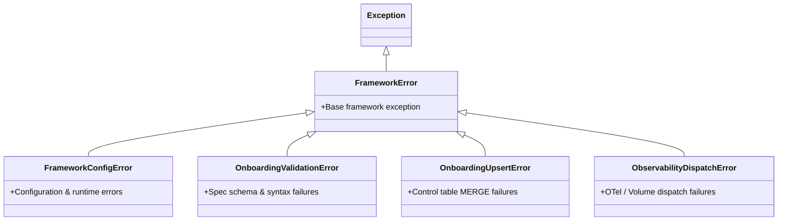

# MetaFlow Architecture Review — Pillar 3: Code Quality, Simplification & Anti-Patterns

**Evaluation Area:** Codebase Hygiene, Dead Code Identification, PySpark Idioms vs UDFs, Exception Hierarchy, and Type Safety  
**Score:** 8.0 / 10  
**Status:** High Code Quality with Specific Semantic Traps and Dead Template Baggage

---

## 1. Executive Code Quality Evaluation

The MetaFlow codebase exhibits high engineering rigor. Code modules are well-structured, comprehensively documented with detailed module-level docstrings, strictly typed with Python 3.12 annotations, and utilize native Spark expressions rather than row-by-row Python UDFs. 

However, two notable code quality risks require immediate remediation:
1. **Unintended Automatic Array Exploding / Struct Flattening** in `json_flattening.py` when `explode_columns` is omitted.
2. **Leftover Template Scaffold Boilerplate** in the package root (`main.py`, `taxis.py`) referencing NY taxi sample data.

---

## 2. Identified Anti-Patterns & Codebase Anomalies

### 🔴 Finding 3.1: Semantic Trap — Implicit Recursive JSON Flattening & Array Inflation (High Severity)
- **File & Lines:** `src/.../ingestion/json_flattening.py` (lines 87–88) and `notebooks/03_engine/03_lakeflow_declarative_pipeline.py` (line 152).
- **The Issue:**
  In `json_flattening.py`:
  ```python
  def apply_explode_columns(df: DataFrame, explode_columns: Optional[List[str]]) -> DataFrame:
      if not explode_columns:
          return _flatten_all(df)  # <--- CRITICAL SEMANTIC DEFECT!
      ...
  ```
  In `03_lakeflow_declarative_pipeline.py`:
  ```python
  staged_df = apply_explode_columns(staged_df, source_config.get("explode_columns"))
  ```
- **Architectural Risk & Impact:**
  If an onboarding spec omits `explode_columns` (which is standard when ingesting JSON/Parquet with nested objects that should remain structs, maps, or arrays), `source_config.get("explode_columns")` returns `None`. `apply_explode_columns` interprets `None` as an instruction to **flatten every struct and explode every array column up to 10 recursive levels**!
  Exploding arrays on un-configured datasets causes severe cartesian row multiplication, duplicate data ingestion, and corrupted downstream metric counts.
- **Refactoring (Before vs. After):**
  ```python
  # =========================================================================
  # BEFORE: None/Empty triggers destructive recursive explode & flatten
  # =========================================================================
  def apply_explode_columns(df: DataFrame, explode_columns: Optional[List[str]]) -> DataFrame:
      if not explode_columns:
          return _flatten_all(df)  # Destructive default!
      ...

  # =========================================================================
  # AFTER: Explicit Opt-In Required for Array Exploding & Flattening
  # =========================================================================
  def apply_explode_columns(df: DataFrame, explode_columns: Optional[List[str]], auto_flatten_all: bool = False) -> DataFrame:
      # Default: Pass through unchanged if not explicitly requested
      if not explode_columns:
          if auto_flatten_all:
              return _flatten_all(df)
          return df
      
      # When explode_columns is populated, explode only the specified columns
      result_df = df
      for column_name in explode_columns:
          ...
      return result_df
  ```

---

### 🟡 Finding 3.2: Legacy Template Scaffold Baggage (Low Severity / Code Hygiene)
- **File & Lines:** `src/NextGen_Metadata_Framework/main.py` (lines 1–25), `src/NextGen_Metadata_Framework/taxis.py` (lines 1–8), and `pyproject.toml` (line 31).
- **The Issue:**
  The project contains default Databricks bundle template files created during initial project scaffolding:
  - `taxis.py`: Contains a helper `find_all_taxis()` that queries `samples.nyctaxi.trips`.
  - `main.py`: Imports `find_all_taxis()`, creates a dummy DataFrame, and prints rows.
  - `pyproject.toml`: Registers `main = "NextGen_Metadata_Framework.main:main"` as a CLI entry point.
- **Architectural Impact:**
  These files are completely disconnected from the actual MetaFlow framework, mislead external auditors and engineers, and clutter the built wheel distribution artifact.
- **Refactoring:**
  Delete `main.py` and `taxis.py`. Update `pyproject.toml` to remove the `[project.scripts]` reference or replace it with a genuine MetaFlow CLI tool entrypoint.

---

## 3. Idiomatic PySpark & Vectorization Assessment

| Component | Implementation Pattern | Assessment & Rating |
| :--- | :--- | :--- |
| **ASN.1 Decoding** (`asn1/decoder.py`) | Distributed `mapInPandas` compiling ASN.1 schema once per partition worker. | **Exemplary (10/10):** Eliminates per-row schema compilation and Python serialization overhead. |
| **Hash Key/Value Computation** (`cdc/hashing.py`) | Native `F.sha2(F.concat_ws("||", ...), 256)` with `eqNullSafe` coalesce handling. | **Exemplary (10/10):** 100% vectorized Spark SQL Catalyst expressions; zero Python UDFs. |
| **JSON Mismatch Formatting** (`reconciliation/mismatch_logging.py`) | Native `F.to_json(F.struct(...))` and higher-order `F.filter(F.array(...))`. | **Exemplary (10/10):** Projects complex JSON diffs without driver collect. |
| **Quarantine Routing** (`dq/quarantine.py`) | Vectorized boolean flags `F.coalesce(~(rule), F.lit(True))` aggregated into bitmasks. | **Exemplary (9.5/10):** Clean single-pass expression evaluation. |
| **Dynamic SQL Parameter Substitution** (`transformation/parameters.py`) | Regex parameter substitution (`${param}`) with automatic single-quoting. | **Adequate (7.5/10):** Enforces single-quoting on strings, which can surprise SQL authors expecting raw identifier substitution. |

---

## 4. Exception Hierarchy & Typing Integrity

The framework defines a clean, strongly-typed exception hierarchy under `lakeflow_framework.exceptions`:



### Key Architectural Strengths:
- **Consistent Error Normalization:** Specialized modules catch lower-level internal exceptions (e.g., `json.JSONDecodeError`, `KeyError`, `AttributeError`) and re-wrap them into domain-specific `FrameworkConfigError` or `OnboardingValidationError` exceptions with rich contextual error descriptions.
- **Never-Mask Real Failures:** Exception blocks log structured error metadata before re-raising, ensuring automated alert monitors and downstream retry handlers receive uncorrupted error signatures.
