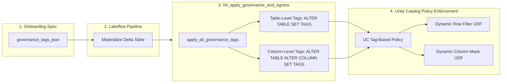

# MetaFlow Architecture Review — Pillar 4: Security, Access Control & Governance

**Evaluation Area:** Unity Catalog 3-Level Namespace, Secrets Management, Credential Protection, ABAC / RBAC Governance, and Cryptography  
**Score:** 7.5 / 10  
**Status:** Solid Unity Catalog Governance with Critical Secret Plan Exposure Risk

---

## 1. Executive Security Evaluation

MetaFlow is designed around **Unity Catalog** governance principles. It strictly enforces the 3-level namespace (`catalog.schema.table`), provides comprehensive identifier sanitization against SQL injection, implements an automated ABAC metadata tagging engine, and supports both AES column encryption and PGP asymmetric archive encryption.

However, a critical security vulnerability exists in the column encryption module: **plaintext cryptographic secret keys are embedded directly into Spark DataFrame logical plans via `F.lit()`**, making keys readable in query plan dumps, the Spark UI, and cluster event logs.

---

## 2. Deep-Dive Security & Compliance Findings

### 🔴 Finding 4.1: Plaintext Encryption Key Exposure in Spark Logical Plans (High Severity / Vulnerability)
- **File & Lines:** `src/.../crypto/column_crypto.py` (lines 107 and 172).
- **The Issue:**
  In `apply_aes_column_encryption()` and `apply_aes_column_decryption()`:
  ```python
  # crypto/column_crypto.py - LINE 107 & 172
  resolved_key = resolve_secret_value(dbutils, scope, secret_key)
  # Plaintext key embedded as a literal Spark expression!
  key_expr = F.lit(resolved_key).cast("binary")
  result_df = result_df.withColumn(col_name, F.aes_encrypt(F.col(col_name).cast("binary"), key_expr, F.lit(mode)))
  ```
- **Security Impact:**
  Calling `F.lit(resolved_key)` places the actual 256-bit AES secret key directly into the Spark DataFrame logical plan as a constant literal. Anyone with access to the Databricks Spark UI (SQL / Stages tab), cluster logs, query execution plan dumps (`df.explain()`), or unredacted DLT event logs can read the plaintext encryption key.
- **Remediation & Hardened Refactoring (Before vs. After):**
  ```python
  # =========================================================================
  # BEFORE: Plaintext secret key embedded as a Spark literal expression
  # =========================================================================
  resolved_key = resolve_secret_value(dbutils, scope, secret_key)
  key_expr = F.lit(resolved_key).cast("binary")
  result_df = result_df.withColumn(col_name, F.aes_encrypt(F.col(col_name).cast("binary"), key_expr, F.lit(mode)))

  # =========================================================================
  # AFTER: Secret Passed via Redacted Session Conf or Dynamic Secret Function
  # =========================================================================
  # Option A: Inject into session-scoped conf with secret redaction
  session_conf_key = f"spark.metaflow.secret.{scope}.{secret_key}"
  spark.conf.set(session_conf_key, resolved_key)
  
  # Reference key dynamically from session conf in Catalyst expression
  key_expr = F.expr(f"unbase64(decode(secret('{scope}', '{secret_key}'), 'utf-8'))") # On platforms supporting native secret()
  # OR using spark session config reference:
  key_expr = F.expr(f"CAST(spark_conf('{session_conf_key}') AS BINARY)")
  
  result_df = result_df.withColumn(
      col_name,
      F.aes_encrypt(F.col(col_name).cast("binary"), key_expr, F.lit(mode))
  )
  ```

---

### 🟢 Strengths in Identifier Sanitization & SQL Injection Prevention
- **File & Lines:** `src/.../crypto/secrets.py` (`assert_safe_identifier`, lines 40–60).
- **Evaluation:**
  The framework enforces strict regex identifier validation (`^[A-Za-z_][A-Za-z0-9_]*$`) before interpolating any catalog, schema, table, column, secret scope, or secret key name into SQL DDL or Spark queries. This provides robust defense-in-depth against SQL injection across dynamic `ALTER TABLE SET TAGS` DDL, schema creation, and view registration.

---

### 🟢 Unity Catalog Tag-Based ABAC Governance Model
- **File & Lines:** `src/.../governance/tags.py` and `notebooks/04_governance/04_apply_governance_and_egress.py`.
- **Evaluation:**
  - **Decoupled Post-Deployment Task:** Tags cannot be applied via `@dlt.table` decorators at pipeline compilation time because target tables may not exist yet. Running `apply_all_governance_tags` as an automated post-deployment job task (`ALTER TABLE <table_name> SET TAGS (...)`) is the correct, official Databricks architectural pattern.
  - **Natural Idempotency:** DDL `SET TAGS` overwrites or appends key-value tags idempotently without needing a custom state ledger.
  - **Reference ABAC UDFs:** Notebook `04b_provision_governance_udfs_and_entitlements.py` provides reference row-filter (`fn_crypto_abac_region_filter`) and column-mask (`fn_crypto_abac_mask_ssn`) functions that consult a central `user_entitlements` table per `current_user()`.



---

## 3. Governance & Cryptographic Feature Matrix

| Security Feature | Implementation Mechanism | Compliance / Security Status |
| :--- | :--- | :--- |
| **UC 3-Level Namespace** | Explicit `catalog.schema.table` builders with validation. | **Compliant:** Fully isolates environments across Dev/Prod catalogs. |
| **Volume Path Governance** | Strict `/Volumes/<catalog>/<schema>/<volume>/...` parsing. | **Compliant:** Ensures all file storage is Unity Catalog-managed. |
| **AES Column Encryption** | `F.aes_encrypt` / `F.aes_decrypt` supporting GCM/CBC/ECB with 128/192/256-bit keys. | **Requires Patch:** Functional but requires secret plan masking (Finding 4.1). |
| **PGP Archive Crypto** | Pure-Python `PGPy` asymmetric armored key encryption. | **Compliant:** Executes in-memory without external `gpg` binaries. |
| **Identifier Sanitization** | `assert_safe_identifier` regex check against SQL injection. | **Compliant:** Enforced across all DDL and control-plane queries. |
