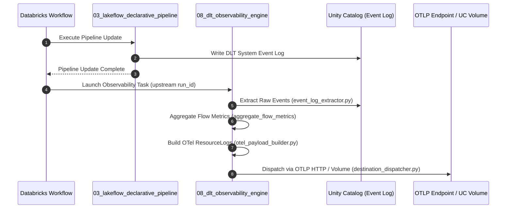

# Metaflow Architecture Review — Pillar 5: Observability, DQ & Reconciliation

**Evaluation Area:** Data Quality Architecture, DLT Expectations vs. Quarantine Routing, OpenTelemetry Telemetry Exporter, and Reconciliation Engine  
**Score:** 8.8 / 10  
**Status:** Best-in-Class Architecture with Minor Event-Log Heuristic Gaps

---

## 1. Executive Observability & Quality Evaluation

The observability, data quality, and reconciliation subsystems represent the most mature, sophisticated components of the Metaflow platform. The architecture features:
1. **Dual-Tier Data Quality:** Seamlessly unifies native DLT expectations with a custom dual-target quarantine routing engine that preserves diagnostic violation metadata.
2. **OpenTelemetry-Native Telemetry Exporter:** A downstream Workflow task that extracts the DLT Event Log, aggregates flow-level throughput/DQ metrics, constructs strict OTel `ResourceLogs` JSON structures, and exports them to OTLP HTTP collectors or UC Volumes.
3. **Hash-First Reconciliation:** High-throughput 4-way record matching (`MATCHED`, `VALUE_DRIFT`, `MISSING_IN_TARGET`, `MISSING_IN_SOURCE`) using deterministic SHA-256 hashes, duplicate-key convergence via priority ranking, and idempotent self-healing writes.

---

## 2. Deep-Dive Subsystem Analysis

### 2.1 Data Quality & Quarantine Architecture (`dq/`)

```
                          ┌─────────────────────────────┐
                          │   Staged View (@dlt.view)   │
                          └──────────────┬──────────────┘
                                         │
                 ┌───────────────────────┴───────────────────────┐
                 ▼                                               ▼
     ┌───────────────────────┐                       ┌───────────────────────┐
     │  Native Expectations  │                       │   Custom Quarantine   │
     │  (expect_all / drop)  │                       │  Dual-Target Routing  │
     └───────────┬───────────┘                       └───────────┬───────────┘
                 │                                               │
                 ▼                                               ▼
     ┌───────────────────────┐                       ┌───────────────────────┐
     │ @dlt.table: Clean     │                       │ @dlt.table: Clean     │
     │ (Violations dropped)  │                       │ (Flag == False)       │
     └───────────────────────┘                       └───────────┬───────────┘
                                                                 │
                                                                 ▼
                                                     ┌───────────────────────┐
                                                     │ @dlt.table: Quarant.  │
                                                     │ (Flag == True + Diag) │
                                                     └───────────────────────┘
```

- **Dual-Tier Model:**
  - **Tier 1 (Native DLT Expectations):** Configured when `quarantine: false`. Uses `@dlt.expect_all`, `@dlt.expect_all_or_drop`, or `@dlt.expect_all_or_fail`. Records failing `drop` rules are pruned by the DLT engine.
  - **Tier 2 (Custom Dual-Target Quarantine):** Configured when `quarantine: true`. Evaluates DQ expressions into vectorized boolean flags, synthesizes diagnostic metadata columns (`__framework_dq_quarantine_flag`, `__framework_dq_failed_rule_ids`, `__framework_dq_failure_reasons`, `__framework_quarantine_validated_at`), and splits the stream into a clean target table and a dedicated quarantine table (`<target_table>_quarantine`).
- **Storage Optimization for Quarantine:**
  `storage/column_ordering.py` automatically front-loads quarantine diagnostic columns to the front of the table schema, ensuring they fall within Delta's `delta.dataSkippingNumIndexedCols` (32-column limit) for fast filtering by DQ analysts.

---

### 2.2 OpenTelemetry Observability Engine (`observability/`)

- **Execution Flow:**
  Operates as an independent Workflow task (`08_dlt_observability_engine.py`) chained after the pipeline update task (`task_key: run_pipeline_update`), receiving the pipeline run ID via `{{tasks.run_pipeline_update.run_id}}`.



- **OTel Schema Compliance:**
  Payloads adhere strictly to OpenTelemetry Log Data Model specifications:
  - **Resource Attributes:** `service.name`, `deployment.environment`, `databricks.workspace.id`, `databricks.pipeline.id`, `databricks.job.id`, `dataflow.group.id`.
  - **Log Attributes:** `flow_name`, `dataset_name`, `update_id`, `records_read`, `records_written`, `records_dropped`, `dq_expectation_failures`, `duration_ms`.
- **Destination Dispatchers:**
  - `OTLP_CONSUMER`: Dispatches JSON payloads over HTTP POST to endpoints (e.g., Datadog, Dynatrace, New Relic, OpenTelemetry Collector) with configurable timeout, retry/backoff policies, and Bearer/Basic/Header token authentication.
  - `UNITY_CATALOG_VOLUME`: Persists timestamped `.json` telemetry payloads to managed UC Volumes for historical SQL analytics and custom dashboards.

---

### 2.3 Hash-First Reconciliation Engine (`reconciliation/`)

- **Hash-First Strategy:**
  Rather than performing wide multi-column joins across dozens of fields, `matcher.py` joins source and target datasets on a single SHA-256 `__framework_hash_key` and compares data drift using a single SHA-256 `__framework_hash_value`.
- **Single-Pass 4-Way Classification:**
  A single full outer join simultaneously categorizes all rows into:
  - `MATCHED`: Key present on both sides with identical hash values.
  - `VALUE_DRIFT`: Key present on both sides with differing hash values.
  - `MISSING_IN_TARGET`: Key present in source but missing from target.
  - `MISSING_IN_SOURCE`: Key present in target but missing from source (audit only).
- **Duplicate-Key Safety & Convergence:**
  When historical CDC bus targets contain multiple records for the same key, `matcher.py` collapses outcomes per key using `F.max_by` with priority `MATCHED (3) > VALUE_DRIFT (2) > MISSING (1)`, ensuring reconciliation converges and never re-appends duplicate corrections indefinitely.
- **Detailed Mismatch Logging:**
  `mismatch_logging.py` constructs a detailed JSON diff column (`differing_columns_json`) for all `VALUE_DRIFT` records using native Spark higher-order functions (`to_json`, `filter`, `array`), logging exact source vs. target column discrepancies into `reconciliation_mismatch_log`.

---

## 3. Subsystem Findings & Refinement Opportunities

### 🟡 Finding 5.1: CDF History Traversal Single-Version Blind Spot (Medium Severity)
- **File & Lines:** `control_plane/post_deployment.py` (`capture_all_scd_change_counts`, lines 145–156).
- **The Issue:**
  The post-deployment task inspects the Delta table history (`DESCRIBE HISTORY <target> LIMIT 1`) and queries `table_changes(<target>, latest_version, latest_version)`.
- **Architectural Risk:**
  1. **Multi-Commit Updates:** If a triggered Lakeflow update performs multiple micro-batch commits internally, querying only `latest_version` misses changes committed in earlier microbatches within the same update.
  2. **No-New-Data Repetition:** If no new data was committed during an update, `latest_version` still points to the previous run's version, falsely re-reporting the prior update's insert/update/delete metrics.
- **Remediation:**
  Maintain a watermark ledger in `reconciliation_run_log` or `onboarding_audit_log` recording `last_processed_version`. Query `table_changes(<target>, last_processed_version + 1, current_version)` only when `current_version > last_processed_version`.
