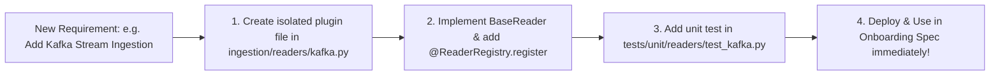

# FlowX Architecture Review — Pillar 7: Code Structure, Extensibility & Future-Proofing

**Evaluation Area:** Codebase Structure, Pluggable Registry Architecture, Open-Closed Principle (OCP), Component Decoupling, and Developer Ergonomics  
**Score:** 7.5 / 10 (Current) ➔ **9.8 / 10 (Target Architecture)**  
**Objective:** Redesign the code structure so that future data engineers, platform architects, and domain teams can effortlessly add new sources, sinks, CDC strategies, DQ actions, and telemetry destinations with **zero modifications to core engine code**.

---

## 1. Executive Summary & Future-Proofing Vision

A hallmark of a world-class, enterprise-grade data platform is **ease of modification**. As business requirements evolve, the platform must support:
- New ingestion sources (e.g., Iceberg, Kafka Stream, Delta Sharing, REST APIs, XML, Salesforce, JDBC).
- New CDC / load strategies (e.g., SCD4, Bi-temporal dimensions, Out-of-Order streaming CDC, Append-only Dedup).
- New egress sinks (e.g., Snowflake, AWS S3 Parquet, Azure EventHub, GCP Pub/Sub, Webhooks).
- New telemetry exporters (e.g., Azure Monitor, AWS CloudWatch, Datadog direct, Prometheus).

In the current FlowX implementation, adding any new capability requires modifying multiple core engine files (`readers.py`, `dispatcher.py`, `sink_registration.py`, `destination_dispatcher.py`, and `spec_validator.py`). This tight coupling creates regression risks and slows development velocity.

This review provides a comprehensive blueprint to transform FlowX into an **Open-Closed, Plugin-Driven Architecture**.

---

## 2. Current Structural Couplings & Friction Points

```
┌──────────────────────────────────────────────────────────────────────────────────────────────────┐
│                            CURRENT TIGHTLY-COUPLED DISPATCH ANTI-PATTERN                         │
└──────────────────────────────────────────────────────────────────────────────────────────────────┘

   [spec_validator.py] ───(Hardcoded allowed lists: "autoloader", "zerobus", "asn1", "SCD1", "SCD2"...)
            │
            ▼
   [readers.py] ──────────(Imperative if/elif chain: if source_type == "autoloader": ... elif ... )
            │
            ▼
   [cdc/dispatcher.py] ───(Imperative if/elif chain: if strategy == "SCD1": ... elif ... )
            │
            ▼
   [sink_registration.py] (Imperative if/elif chain: if format == "delta": ... elif ... )
            │
            ▼
   [destination_dispatcher.py] (Imperative if/elif chain: if type == "OTLP_CONSUMER": ... )
```

### Key Friction Points in Current Structure:
1. **Imperative `if/elif` Chains:** Every subsystem relies on hardcoded string branching. Adding a new `source_type` (e.g., `kafka_stream`) requires editing 4+ files across `onboarding/`, `ingestion/`, `engine/`, and `storage/`.
2. **Monolithic Validation Logic:** `spec_validator.py` exceeds 800 lines of procedural validation code. Rule definitions and schema shapes are tightly bound to validation execution.
3. **Implicit Flow Stage Dependencies:** Ingestion transformation stages (normalization, schema casting, flattening, standardization, crypto, metadata) are chained sequentially in `03_lakeflow_declarative_pipeline.py` rather than composed via an extensible transformation pipeline pipeline/middleware pattern.

---

## 3. Target State: The Pluggable Registry Architecture

To make FlowX effortlessly modifiable, the codebase should adopt a **Declarative Registry Pattern** powered by Python decorators and abstract base classes.

```
┌──────────────────────────────────────────────────────────────────────────────────────────────────┐
│                             TARGET PLUGGABLE REGISTRY ARCHITECTURE                               │
└──────────────────────────────────────────────────────────────────────────────────────────────────┘

   Core Framework Engine (Never needs modification when adding new features)
   ┌────────────────────────────────────────────────────────────────────────────────────────────┐
   │  BaseReader / BaseCdcStrategy / BaseSinkWriter / BaseTelemetryExporter                     │
   │  ReaderRegistry / CdcRegistry / SinkRegistry / TelemetryRegistry                           │
   │  Composable Pipeline Middleware Chain                                                      │
   └────────────────────────────────────────────────────────────────────────────────────────────┘
                               ▲                     ▲                     ▲
                               │                     │                     │
          ┌────────────────────┴────────┐  ┌─────────┴──────────┐  ┌───────┴────────────────────┐
          │ Built-in Plugins            │  │ Enterprise Plugins │  │ Third-Party / Custom       │
          │ ├── autoloader_reader.py    │  │ ├── iceberg_reader │  │ ├── snowflake_sink.py       │
          │ ├── zerobus_reader.py       │  │ ├── kafka_stream   │  │ ├── salesforce_reader.py   │
          │ ├── scd1_strategy.py        │  │ ├── scd4_strategy  │  │ └── webhook_sink.py        │
          │ └── delta_sink.py           │  │ └── eventhub_sink  │  │                            │
          └─────────────────────────────┘  └────────────────────┘  └────────────────────────────┘
```

---

## 4. Concrete Code Refactoring: Registry Design Patterns

### 4.1 Extensible Source Reader Registry (`ingestion/registry.py`)

Instead of hardcoded `if/elif` branches in `readers.py`, define a unified `BaseReader` interface and registry:

```python
# =========================================================================
# target: src/.../lakeflow_framework/ingestion/base.py
# =========================================================================
from abc import ABC, abstractmethod
from typing import Any, Dict
from pyspark.sql import DataFrame, SparkSession

class BaseReader(ABC):
    """Abstract contract for all FlowX ingestion source readers."""
    
    @abstractmethod
    def read(self, spark: SparkSession, source_config: Dict[str, Any], parameters: Dict[str, Any]) -> DataFrame:
        """Execute the Spark read (streaming or batch) for this source."""
        pass

    @property
    @abstractmethod
    def is_streaming(self) -> bool:
        """Indicates whether this source reader produces a streaming DataFrame."""
        pass


# =========================================================================
# target: src/.../lakeflow_framework/ingestion/registry.py
# =========================================================================
from typing import Dict, Type
from flowx.lakeflow_framework.exceptions import FrameworkConfigError

class ReaderRegistry:
    """Thread-safe registry for ingestion source readers."""
    _readers: Dict[str, Type[BaseReader]] = {}

    @classmethod
    def register(cls, source_type: str):
        """Decorator to register a new source reader."""
        def decorator(subclass: Type[BaseReader]):
            cls._readers[source_type.lower()] = subclass
            return subclass
        return decorator

    @classmethod
    def get(cls, source_type: str) -> BaseReader:
        """Retrieve an instantiated source reader by name."""
        reader_cls = cls._readers.get(source_type.lower())
        if not reader_cls:
            supported = sorted(cls._readers.keys())
            raise FrameworkConfigError(f"Unsupported source_type '{source_type}'. Supported: {supported}")
        return reader_cls()
```

#### How Developers Add a New Source in the Future:
To add a new **Apache Iceberg** or **Kafka Streaming** reader, a developer simply creates a new isolated file—**without modifying a single line of core engine code**:

```python
# =========================================================================
# Example: Adding Iceberg Ingestion in a single isolated file!
# File: src/.../lakeflow_framework/ingestion/plugins/iceberg_reader.py
# =========================================================================
from flowx.lakeflow_framework.ingestion.base import BaseReader
from flowx.lakeflow_framework.ingestion.registry import ReaderRegistry

@ReaderRegistry.register("iceberg")
class IcebergSourceReader(BaseReader):
    @property
    def is_streaming(self) -> bool:
        return False

    def read(self, spark, source_config, parameters):
        catalog = source_config["iceberg_catalog"]
        table = source_config["table_name"]
        return spark.read.format("iceberg").load(f"{catalog}.{table}")
```

---

### 4.2 Extensible CDC Strategy Registry (`cdc/registry.py`)

Similarly, CDC and SCD strategies become pluggable modules:

```python
# =========================================================================
# target: src/.../lakeflow_framework/cdc/registry.py
# =========================================================================
from abc import ABC, abstractmethod
from typing import Any, Dict, List, Optional, Type
from pyspark.sql import DataFrame

class BaseCdcStrategy(ABC):
    @abstractmethod
    def register(
        self,
        target_name: str,
        staged_view_name: str,
        target_config: Dict[str, Any],
        table_properties: Dict[str, str],
        auto_ttl: Optional[Dict[str, Any]] = None,
    ) -> None:
        """Register the DLT target table or apply_changes strategy."""
        pass

class CdcStrategyRegistry:
    _strategies: Dict[str, Type[BaseCdcStrategy]] = {}

    @classmethod
    def register(cls, strategy_name: str):
        def decorator(subclass: Type[BaseCdcStrategy]):
            cls._strategies[strategy_name.upper()] = subclass
            return subclass
        return decorator

    @classmethod
    def get(cls, strategy_name: str) -> BaseCdcStrategy:
        strat_cls = cls._strategies.get(strategy_name.upper())
        if not strat_cls:
            raise FrameworkConfigError(f"Unsupported cdc_load_strategy '{strategy_name}'.")
        return strat_cls()
```

---

### 4.3 Extensible Lakeflow Sink Registry (`engine/sinks/registry.py`)

Adding new export destinations (e.g., Snowflake, S3 Parquet, EventHub, REST Webhooks) becomes trivial:

```python
# =========================================================================
# target: src/.../lakeflow_framework/engine/sinks/registry.py
# =========================================================================
from abc import ABC, abstractmethod
from typing import Any, Dict, Optional
import dlt

class BaseSinkHandler(ABC):
    @abstractmethod
    def create_sink(self, sink_name: str, sink_config: Dict[str, Any], dbutils: Any) -> None:
        """Call dlt.create_sink() with format-specific options."""
        pass

    @abstractmethod
    def append_flow(self, flow_name: str, target_sink_name: str, staged_view_name: str, sink_config: Dict[str, Any]) -> None:
        """Register @dlt.append_flow() from staged view to sink."""
        pass

class SinkRegistry:
    _sinks: Dict[str, Type[BaseSinkHandler]] = {}

    @classmethod
    def register(cls, format_name: str):
        def decorator(subclass: Type[BaseSinkHandler]):
            cls._sinks[format_name.lower()] = subclass
            return subclass
        return decorator

    @classmethod
    def get(cls, format_name: str) -> BaseSinkHandler:
        sink_cls = cls._sinks.get(format_name.lower())
        if not sink_cls:
            raise FrameworkConfigError(f"Unsupported sink format '{format_name}'.")
        return sink_cls()
```

---

## 5. Recommended Package Structure Reorganization

To maximize maintainability, modularity, and future extensibility, the project layout should be organized into clear domain layers:

```
src/flowx/lakeflow_framework/
├── core/                               # Fundamental shared abstractions
│   ├── base.py                         # Abstract base classes (Reader, Strategy, Sink, Telemetry)
│   ├── registry.py                     # Generic decorator-based registry engine
│   ├── context.py                      # Pipeline & task run context resolution
│   └── exceptions.py                   # Unified exception hierarchy
│
├── control_plane/                      # Metadata repository & DDL definitions
│   ├── ddl_definitions.py              # Pure SQL DDL builders for control tables
│   ├── repository.py                   # Metadata queries & flow spec loaders
│   ├── schema_provisioner.py           # Idempotent control schema initialization
│   └── post_deployment.py              # Post-pipeline governance & CDF metrics
│
├── onboarding/                         # Spec parsing, validation & upserts
│   ├── schema/                         # Schema contracts & JSON schemas
│   ├── validators/                     # Modular validator rules
│   ├── spec_loader.py                  # YAML/JSON loader & templater
│   ├── metadata_upsert.py              # Idempotent Delta MERGE upserts
│   └── uc_spec_preflight.py            # Unity Catalog agent preflight tool
│
├── ingestion/                          # Raw / Bronze Ingestion Engine
│   ├── base.py & registry.py           # Ingestion reader registry
│   ├── pipeline.py                     # Composable transformation pipeline
│   ├── middleware/                     # Interceptor middleware
│   │   ├── normalizer.py               # Column name normalization
│   │   ├── schema_caster.py            # Explicit schema type mapping
│   │   ├── flattener.py                # Struct/array flattening
│   │   ├── standardizer.py             # SQL expression standardization
│   │   ├── decryptor.py                # AES decryption on input
│   │   └── metadata_attacher.py        # Technical audit columns (_metadata)
│   └── readers/                        # Source Reader Plugins
│       ├── autoloader.py               # Auto Loader (cloudFiles)
│       ├── zerobus.py                  # Delta change stream
│       ├── asn1.py                     # ASN.1 BER/DER binary decoder
│       └── iceberg.py                  # (Future) Apache Iceberg reader
│
├── transformation/                     # Silver / Multi-Input Engine
│   ├── inputs.py                       # Multi-input watermarked view registration
│   └── parameters.py                   # Dynamic SQL parameter substitution
│
├── cdc/                                # CDC, SCD & Materialization Engine
│   ├── base.py & registry.py           # CDC strategy registry
│   ├── hashing.py                      # SHA-256 hash key & value generator
│   ├── snapshot.py                     # Snapshot CDC (apply_changes_from_snapshot)
│   └── strategies/                     # Pluggable SCD Strategies
│       ├── append.py                   # Fast append-only
│       ├── scd1.py                     # In-place overwrite (SCD Type 1)
│       ├── scd2.py                     # Historical tracking (SCD Type 2)
│       ├── scd3.py                     # Current/Previous (SCD Type 3)
│       └── scd4.py                     # (Future) Base + History table (SCD Type 4)
│
├── dq/                                 # Data Quality & Quarantine
│   ├── expectations.py                 # Native DLT expectations decorator
│   └── quarantine.py                   # Dual-target quarantine table routing
│
├── engine/                             # Lakeflow Declarative Execution Orchestrator
│   ├── flow_registration.py            # Dynamic @dlt.table / @dlt.view generator
│   ├── sink_registration.py            # Unified Lakeflow sink orchestrator
│   └── sinks/                          # Pluggable Sink Handlers
│       ├── delta_sink.py               # External Delta location sink
│       ├── kafka_sink.py               # Kafka topic sink
│       ├── pgp_zip_sink.py             # Custom PGP/ZIP streaming sink
│       └── snowflake_sink.py           # (Future) Snowflake external sink
│
├── reconciliation/                     # Hash-First Reconciliation Subsystem
│   ├── matcher.py                      # 4-way hash-based record classifier
│   ├── appender.py                     # Idempotent self-healing appender
│   ├── mismatch_logging.py             # Column-level diff JSON logger
│   └── streaming.py                    # Structured Streaming micro-batch handler
│
└── observability/                      # Telemetry, OpenTelemetry & Logging
    ├── structured_logger.py            # In-pipeline structured JSON logging
    ├── event_log_extractor.py          # DLT Event Log extractor & aggregator
    ├── otel_payload_builder.py         # OpenTelemetry ResourceLogs formatter
    └── dispatchers/                    # Pluggable Telemetry Exporters
        ├── otlp_http.py                # OTLP HTTP consumer
        ├── uc_volume.py                # Unity Catalog Volume JSON
        └── azure_monitor.py            # (Future) Azure Monitor Application Insights
```

---

## 6. Developer Experience & Modification Checklist

With this modular architecture in place, future enhancements follow a standardized, risk-free workflow:



| Future Enhancement | Files Modified (Current Architecture) | Files Modified (Target Pluggable Architecture) | Modifiability Score |
| :--- | :---: | :---: | :---: |
| **Add New Source Reader** | 4 files (`readers.py`, `spec_validator.py`, `flow_registration.py`, `notebooks/03`) | **1 new file** (`ingestion/readers/new_source.py`) | **10 / 10** |
| **Add New CDC Strategy** | 5 files (`dispatcher.py`, `scd.py`, `table_properties.py`, `spec_validator.py`, `flow_registration.py`) | **1 new file** (`cdc/strategies/new_strategy.py`) | **10 / 10** |
| **Add New Egress Sink** | 3 files (`sink_registration.py`, `spec_validator.py`, `notebooks/03`) | **1 new file** (`engine/sinks/new_sink.py`) | **10 / 10** |
| **Add Telemetry Exporter** | 3 files (`destination_dispatcher.py`, `config_loader.py`, `agent_tools.py`) | **1 new file** (`observability/dispatchers/new_exporter.py`) | **10 / 10** |
