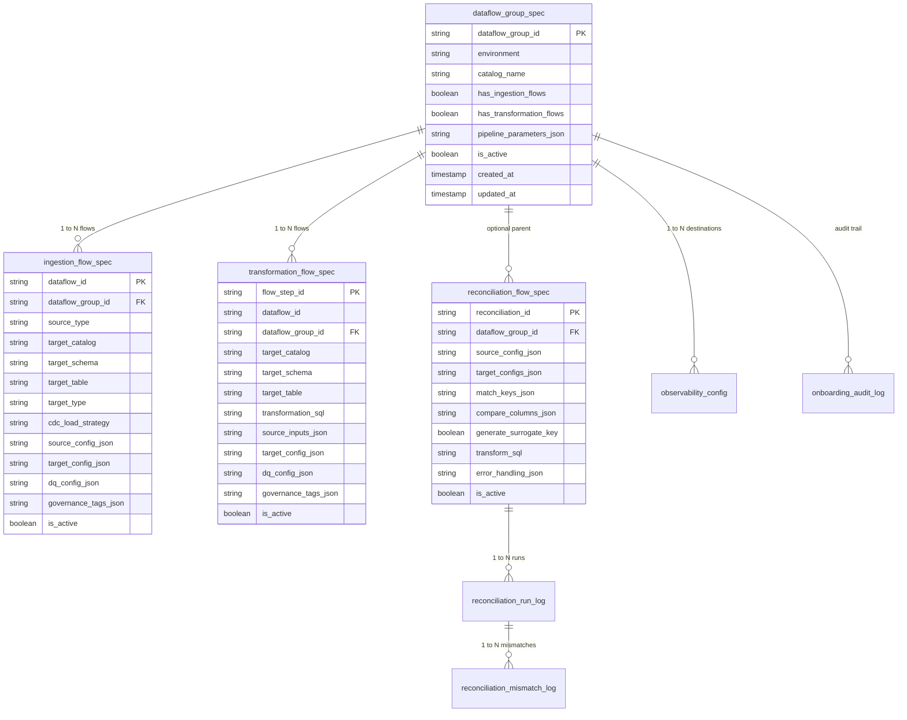

# Metaflow Architecture Review — Pillar 8: Control Metadata Schema & Onboarding Audit

**Evaluation Area:** Control Metadata Schema, Control Table DDLs, JSON Payload Evolution, Spec Validation Engine, and Unity Catalog Preflight Tooling  
**Score:** 8.9 / 10  
**Status:** Highly Structured & Idempotent with Minor Schema Normalization Recommendations

---

## 1. Executive Summary & Control Plane Overview

The Metaflow control plane serves as the central brain of the platform. It persists pipeline metadata across 8 dedicated Delta Lake control tables housed within the `<catalog>.config` schema, decoupling pipeline orchestration from physical compute infrastructure.

Onboarding flows into the control plane is strictly governed by a dual-stage validation architecture:
1. **Structural & Syntax Validation (`spec_validator.py`):** Enforces JSON Schema types, allowed enum values, SQL syntax parsing via active Spark sessions, and cross-flow topological references.
2. **Live Unity Catalog Preflight Reconnaissance (`uc_spec_preflight.py`):** Preflight checks live catalog, schema, table, and volume existence using the Databricks SDK before any metadata is written to storage.

---

## 2. Comprehensive Control Table Audit

---

## 3. Table-by-Table Architectural Evaluation

### 3.1 `dataflow_group_spec`
- **Primary Key:** `dataflow_group_id` (STRING).
- **Purpose:** Represents the top-level pipeline boundary (DAG). Mapped 1:1 to a Lakeflow Declarative Pipeline resource in DABs (`resources/*.yml`).
- **Evaluation:** Excellent simplicity. Storing `pipeline_parameters_json` at the group level enables dynamic runtime parameter injection (e.g. `${filter_date}`) across all child flows without hardcoding.

### 3.2 `ingestion_flow_spec` & `transformation_flow_spec`
- **Primary Keys:** `dataflow_id` (ingestion) / `flow_step_id` (transformation).
- **JSON Column Strategy (`source_config_json`, `target_config_json`, `dq_config_json`, `governance_tags_json`):**
  - *Strength:* Storing nested specifications as JSON strings prevents rigid relational schema migrations when new configuration attributes (e.g. `auto_ttl`, `schema_config_path`) are introduced.
  - *Denormalization Choice:* `cdc_load_strategy` is explicitly denormalized onto its own top-level column. This is a smart architectural optimization, allowing the engine notebook to query and group flows by strategy using pure SQL filters without parsing JSON payloads in the query predicate.

### 3.3 `reconciliation_flow_spec`, `reconciliation_run_log` & `reconciliation_mismatch_log`
- **Primary Keys:** `reconciliation_id` (spec) / `run_id` (run log) / `mismatch_id` (mismatch log).
- **Relational Integrity:** `run_id` is generated once at the start of each target reconciliation execution and threaded as a foreign key into `reconciliation_mismatch_log`, enabling relational drill-down from run-level aggregates to exact mismatched rows.
- **Mismatch Detail:** `differing_columns_json` captures exact source vs. target field-level discrepancies, satisfying enterprise auditing requirements.

### 3.4 `observability_config`
- **Primary Key:** `config_id` (`f"obscfg_{group_id}_{destination_id}"`).
- **Purpose:** Configures telemetry exporters (`OTLP_CONSUMER`, `UNITY_CATALOG_VOLUME`).
- **Deterministic Key Design:** Generating `config_id` deterministically from `(dataflow_group_id, destination_id)` ensures idempotent `MERGE INTO` operations when re-onboarding specifications.

---

## 4. Spec Validation & Onboarding Engine Analysis

### 4.1 Validation Engine (`onboarding/spec_validator.py`)
- **Execution:** Runs in pure Python before any control table is touched.
- **Rule Coverage:**
  1. **Structural & Required Fields:** Ensures all mandatory IDs, target locations, and configurations exist.
  2. **Allowed Values (Enums):** Validates `source_type` (`autoloader`, `zerobus`, `asn1`), `target_type` (`table`, `streaming_table`, `materialized_view`, `batch_table`, `sink`, `external_sink`), `cdc_load_strategy` (`APPEND`, `TRUNCATE_AND_LOAD`, `SCD1`, `SCD2`, `SCD3`, `FULL_SNAPSHOT_CDC`, `FULL_SNAPSHOT_CDC_NO_PK`), and `action` (`warn`, `drop`, `fail`).
  3. **SQL Syntax Validation:** Executes `spark.sql(f"EXPLAIN {sql}")` to validate transformation and standardization SQL expressions during onboarding, catching syntax errors before deployment.
  4. **Topological In-Graph Dependency Resolution:** Validates that `transformation_flows[].source_inputs[].table` references point to existing Unity Catalog tables OR are produced by sibling flows in the same onboarding specification.

---

### 4.2 Unity Catalog Agent Preflight Tool (`onboarding/uc_spec_preflight.py`)
- **Design Pattern:** Built with a clean `(spec_text: str, catalog: str) -> str` signature returning structured JSON reports (`{"valid": bool, "validation_errors": [...], "existence_checks": [...], "summary": "..."}`).
- **AI Agent Tool Compatibility:** Fully compatible with **Databricks Genie**, **Mosaic AI Agents**, and **Claude / OpenAI Tool-Calling loops**, allowing autonomous agents to preflight and onboard data pipelines with zero human intervention.

---

## 5. Control Plane Recommendations & Best Practices

1. **Adopt Pydantic v2 for Spec Schema Validation:**
   Migrate `spec_validator.py` from imperative validation checks to strongly-typed **Pydantic v2** models (`OnboardingSpec`, `IngestionFlow`, `TransformationFlow`, `TargetConfig`). This provides automatic schema validation, IDE autocomplete, and auto-generated JSON schemas with 60% less boilerplate.
2. **Control Schema Configurability:**
   Allow the control schema name (`config`) to be overridden via Spark configuration (`dataflow.control.schema`), supporting enterprise environments with dedicated metadata catalogs.
3. **Metadata History Retention (Delta Time Travel):**
   Configure `delta.logRetentionDuration = '365 days'` on control tables to preserve complete historical audit trails of all onboarding changes and spec modifications.
