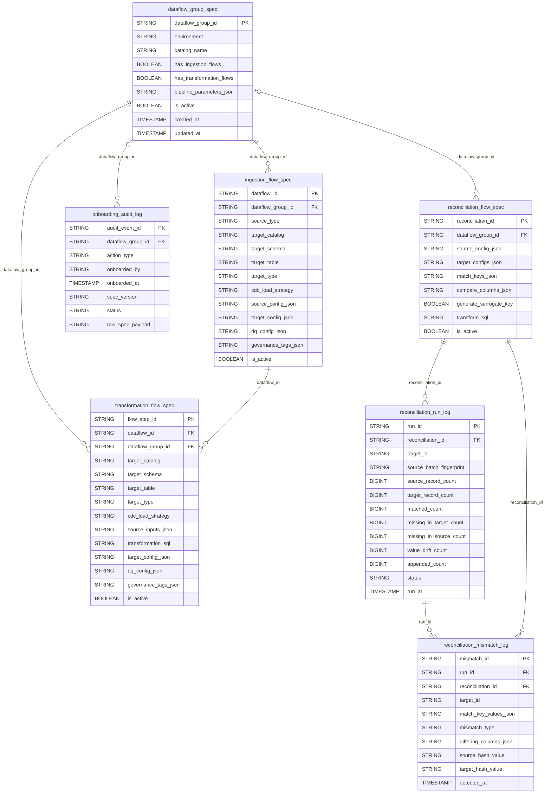

# Control Metadata Schema Reference

Every attribute below is validated at onboarding time by
`src/NextGen_Metadata_Framework/lakeflow_framework/onboarding/spec_validator.py` — see
[04_onboarding_validation.md](04_onboarding_validation.md) for the exact error-message
format when a value is missing or wrong. A machine-readable JSON Schema mirroring this same
shape lives at `onboarding_templates/onboarding_spec.schema.json`.

See also: [README.md](README.md) for how this document fits into the rest of the Metaflow
documentation set, and [17_onboarding_template_reference.md](17_onboarding_template_reference.md)
for a fully worked, field-by-field example.

## 1. The control tables

Created by `notebooks/01_setup/01_setup_control_tables.py` in `{catalog}.config`:
`dataflow_group_spec`, `ingestion_flow_spec`, `transformation_flow_spec`,
`onboarding_audit_log`, `reconciliation_flow_spec`, `reconciliation_run_log`,
`reconciliation_mismatch_log` — see [07_reconciliation.md](07_reconciliation.md) — and
`observability_config`, keyed by `dataflow_group_id` (or the `"*"` global fallback), populated
from the onboarding spec's own `observability[]` array (§2 below) — see
[25_dlt_observability_module.md](25_dlt_observability_module.md).
Governance (§6) has no dedicated control table — tag DDL
([`ALTER TABLE ... SET TAGS`](https://docs.databricks.com/aws/en/sql/language-manual/sql-ref-syntax-aux-tags))
is naturally idempotent, so no idempotency ledger is needed (see
[23_lakeflow_sinks.md](23_lakeflow_sinks.md) and `governance/tags.py`'s module docstring).

### `dataflow_group_spec`

| Column | Type | Description |
|---|---|---|
| `dataflow_group_id` | STRING (PK) | Unique identifier for the pipeline group / DAG. |
| `environment` | STRING | Target environment: `dev`, `staging`, `prod`, etc. |
| `catalog_name` | STRING | Resolved Unity Catalog catalog for this group. |
| `has_ingestion_flows` | BOOLEAN | `true` when this group defines ≥1 ingestion flow. |
| `has_transformation_flows` | BOOLEAN | `true` when this group defines ≥1 transformation flow. |
| `pipeline_parameters_json` | STRING (JSON object) | Dynamic runtime parameters, re-read from this row on every pipeline update and substituted into `${param}` placeholders — in `transformation_sql`/reconciliation SQL (quoted, via `substitute_dynamic_parameters`) and in `source_config`/`target_config` path fields (unquoted, via `substitute_path_parameters`). See §2 below. Example: `{"filter_country": "US"}`. |
| `is_active` | BOOLEAN | Soft-disable flag; inactive groups are skipped by the engine. |
| `created_at` / `updated_at` | TIMESTAMP | Audit timestamps (UTC). |

Note: there is no `depends_on_dataflow_group_ids_json` column in v2 — dependency ordering
between dataflow groups is a **Lakeflow Jobs** concern (job task `depends_on`), not tracked
by the framework. See [05_deployment_guide.md](05_deployment_guide.md).

### `ingestion_flow_spec`

| Column | Type | Description |
|---|---|---|
| `dataflow_id` | STRING (PK) | Unique identifier for this ingestion flow. |
| `dataflow_group_id` | STRING | Parent group. |
| `source_system`, `source_database`, `source_table_name`, `source_description` | STRING | Free-text metadata; `source_description` becomes the target table's Delta comment. |
| `source_type` | STRING | One of `autoloader`, `zerobus`, `asn1` — see §3. |
| `target_catalog`, `target_schema`, `target_table` | STRING | Target Delta table coordinates. |
| `target_type` | STRING | `streaming_table`, `materialized_view`, `batch_table`, `external_sink`, `sink` — see §4. |
| `cdc_load_strategy` | STRING | Denormalized copy of `target_config.cdc_load_strategy` for fast SQL filtering/dispatch — see [02_cdc_load_strategies.md](02_cdc_load_strategies.md). Ingestion supports every strategy **except** `SCD3`. |
| `source_config_json` | STRING (JSON object) | See §3. |
| `target_config_json` | STRING (JSON object) | See §4 — **includes every CDC-related field** (`cdc_load_strategy`, `primary_keys`, etc.); there is no separate `cdc_config`. |
| `dq_config_json` | STRING (JSON object) | See §5. |
| `governance_tags_json` | STRING (JSON object) | See §6. |
| `is_active`, `created_at`, `updated_at` | — | Same as above. |

### `transformation_flow_spec`

Same shape as `ingestion_flow_spec`, plus:

| Column | Type | Description |
|---|---|---|
| `flow_step_id` | STRING (PK) | Unique identifier for this transformation step. |
| `source_inputs_json` | STRING (JSON array) | Multiple streaming/batch inputs, each with an optional watermark and optional `decrypted_columns` — see §7. |
| `transformation_sql` | STRING | Native Spark SQL; may reference `${param}` placeholders resolved from `pipeline_parameters_json`, and supports `UNION`/`UNION ALL`. |
| `cdc_load_strategy` | STRING (inside `target_config_json`) | Same allowed set as ingestion **plus** `SCD3`. |

### Entity-relationship diagram



Notes on relationships not enforced as physical foreign keys (Delta has no cross-table FK
constraints — these are logical joins your own queries would use):
- `ingestion_flow_spec.dataflow_id` is the join key `transformation_flow_spec.dataflow_id`
  uses to find the ingestion flow it builds on (a transformation flow's *own* primary key is
  `flow_step_id`, not `dataflow_id` — many transformation steps can share one `dataflow_id`).
- `reconciliation_run_log`/`reconciliation_mismatch_log` both carry `target_id`, matching one
  entry in the parent `reconciliation_flow_spec.target_configs_json` array — a single
  reconciliation flow can compare against multiple targets, so both log tables carry one row
  per `(run, target)` pair, not one row per run.
- `onboarding_audit_log.dataflow_group_id` and `reconciliation_flow_spec.dataflow_group_id`
  are both nullable — a spec doesn't strictly need to belong to a group, and an audit event
  can, in principle, record an action that failed before a group id was even known.

### `onboarding_audit_log`

| Column | Type | Description |
|---|---|---|
| `audit_event_id` | STRING (PK) | UUID. |
| `dataflow_group_id`, `action_type` (`CREATE`/`UPDATE`/`VALIDATE_ONLY`), `environment` | STRING | What was onboarded. |
| `onboarded_by` | STRING | `current_user()` at onboarding time. |
| `onboarded_at` | TIMESTAMP | UTC. |
| `spec_version` | STRING | SHA-256 (first 16 hex chars) of the templated spec text — changes whenever the spec content changes. |
| `client_context_json` | STRING (JSON object) | Perception metadata: `user_principal`, `client_ip`, `build_hostname`, `browser_user_agent`, `cli_sdk_version`, `git_commit_sha`, `execution_timestamp_utc`. |
| `status` | STRING | `SUCCESS` / `FAILED`. |
| `error_message` | STRING | Populated when `status = FAILED`. |
| `raw_spec_payload` | STRING | The full templated JSON, for reproducibility/audit. |

---

## 2. Onboarding spec top level

The file passed to `02_onboarding_engine.py` -- JSON or YAML, see
[09_onboarding_yaml_json.md](09_onboarding_yaml_json.md) -- (see `test_specs/*.json`/`*.yaml`):

| Attribute | Type | Required | Example |
|---|---|---|---|
| `dataflow_group_id` | string | **yes** | `"dfg_finance_txn_ingest"` |
| `pipeline_parameters` | object | no | `{"filter_country": "US"}` |
| `ingestion_flows` | array of objects | one of `ingestion_flows`/`transformation_flows`/`reconciliation_flows` must be non-empty; any combination is valid | see §3 |
| `transformation_flows` | array of objects | — | see §7 |
| `reconciliation_flows` | array of objects | — | see [07_reconciliation.md](07_reconciliation.md) |
| `observability` | array of objects | no (does **not** count toward the "at least one non-empty" requirement above) | telemetry destinations for the standalone DLT observability engine, validated + upserted alongside every flow in this same spec — see [25_dlt_observability_module.md](25_dlt_observability_module.md) / [27_dlt_observability_onboarding_reference.md](27_dlt_observability_onboarding_reference.md) for the full attribute reference |

`{{catalog}}` and `{{env}}` anywhere in the file (including inside nested strings) are
substituted with the `catalog`/`env` widget values before parsing — see
[docs.databricks.com: Unity Catalog volumes](https://docs.databricks.com/en/connect/unity-catalog/volumes.html)
for the `/Volumes/<catalog>/<schema>/<volume>/...` path shape used throughout the examples
below.

Two distinct placeholder mechanisms exist, resolved at two different times — don't confuse
them:
- `{{catalog}}`/`{{env}}`: resolved **once, at onboarding time** (`onboarding/spec_loader.py`),
  from the `catalog`/`env` values passed to the onboarding job. Works in *any* string anywhere
  in the spec. Fixed forever once onboarded — changing it requires re-onboarding.
- `${param}`: resolved **fresh on every pipeline update**, from this spec's own
  `pipeline_parameters` (below), against the *already-onboarded* control-table row. Works in
  `transformation_sql`/reconciliation `transform_sql`/`filter_condition` (SQL text — string
  values get single-quoted) **and** in `source_config`/`target_config` path fields —
  `sink_config.path`, `source_config.path`/`schema_location`, reconciliation
  `source_config`/`target_configs[]` `path` — (plain text — values are never quoted, so they're
  safe inside a path/URI). Not wired into `dq_config` or
  `observability_config.destination_config.volume_path` (see
  `transformation/parameters.py`'s module docstring for why).

---

## 3. `source_config` (ingestion flows only)

### Common to every `source_type`

| Attribute | Type | Required | Allowed values | Example |
|---|---|---|---|---|
| `capture_technical_metadata` | boolean | no (default `true`) | `true`, `false` | `true` |
| `landing_retention_policy.clean_source` | string | no (default `"off"`) | `"archive"`, `"delete"`, `"off"` | `"archive"` |
| `landing_retention_policy.archive_path` | string | **yes if** `clean_source = "archive"` | any Volume path | `"/Volumes/poc/landing/_archive/transactions/"` |
| `landing_retention_policy.retention_days` | integer ≥ 0 | no | — | `7` |
| `schema_evolution_mode` | string | no | `"addNewColumns"`, `"addNewColumnsWithTypeWidening"`, `"rescue"`, `"failOnNewColumns"`, `"none"` | `"rescue"` |
| `file_pattern` | string | no | any glob/regex Auto Loader `fileNamePattern` accepts | `"orc_*"` |
| `reader_options` | object (string→string passthrough to the underlying Spark reader — delimiter, header, quote, etc.) | no | — | `{"header": "true", "delimiter": "\|"}` |
| `data_standardization_sql` | array\<string\> (column-expression-only allowlist — see below) | no | — | `["trim(customer_name) AS customer_name", "upper(country_code) AS country_code"]` |
| `normalize_column_names` | boolean | no (default `false`) | `true`, `false` | `true` |
| `schema_config_path` | string | no | any file or directory path (directory resolves to its most-recently-modified file) | `"/Volumes/poc/landing/_schema_configs/customer/"` |

`normalize_column_names`/`schema_config_path` are full field references in
[28_ingestion_schema_config.md](28_ingestion_schema_config.md) — including the exact ordering
against every other column-touching field below, and how `schema_config_path` resolves a
directory to its "latest" file.

`clean_source`/`schema_evolution_mode`/`file_pattern`/`reader_options` map directly onto
Auto Loader's `cloudFiles.*` options — see
[Auto Loader options reference](https://docs.databricks.com/en/ingestion/cloud-object-storage/auto-loader/options.html).

`data_standardization_sql` applies simple per-column standardization/replacement
**before** the row is otherwise processed — each entry must be a single column expression
(e.g. `trim(col)`, `substring(col, 1, 10)`, a bare `col`) and is validated to reject
`SELECT`/`FROM`/`JOIN`/`UNION`/`WHERE`/any DDL/DML keyword or a `;` — never a full
statement. See `ingestion/standardization_sql.py`.

### `source_type = "autoloader"` (renamed from `gcs_autoloader` in v1)

Streaming Auto Loader (`cloudFiles`) ingestion. Reference:
[Auto Loader](https://docs.databricks.com/en/ingestion/cloud-object-storage/auto-loader/index.html).

| Attribute | Type | Required | Example |
|---|---|---|---|
| `path` | string | **yes** | `"/Volumes/poc/landing/finance_raw_zone/transactions/"` |
| `format` | string | **yes** | `"csv"` (also `parquet`, `json`, `avro`, `text`) |
| `schema_location` | string | no (auto-derived) | `"/Volumes/poc/landing/_schemas/raw_txn/"` |
| `explode_columns` | array\<string\> | no (`format: "json"` only) | `[]` = flatten every nested value; `["event_payload"]` = explode/flatten only the named struct/array columns |
| `source_zip_handling.*` | — | no | Same shape as the `asn1` reader's, below — now also valid for `autoloader` (was `asn1`-only in v1). Extracts a (optionally PGP-decrypted) ZIP into `path` before Auto Loader reads it, within the same pipeline update. |

`schema_location` (`autoloader` and `asn1` both): when omitted, defaults to
`/Volumes/<target_catalog>/landing/_schemas/<target_table>/` -- the same convention every
worked example in this repo already uses. Auto Loader's `cloudFiles.schemaLocation` option
has no default of its own; the framework derives one from the flow's own
`target_catalog`/`target_table` instead so spec authors don't have to spell out a value
that's already implied. An explicit value always wins if supplied.

`explode_columns` validates that every named column exists and resolves to a
`StructType`/`ArrayType` on the source's inferred schema before attempting to explode it --
see `ingestion/json_flattening.py`.

### `source_type = "zerobus"`

Streaming read of an existing Delta table (e.g. landed by
[Zerobus](https://docs.databricks.com/en/ingestion/zerobus/index.html) direct-write ingest).

| Attribute | Type | Required | Example |
|---|---|---|---|
| `source_catalog`, `source_schema`, `source_table` | string | **yes** | `"poc"`, `"raw"`, `"events"` |
| `starting_version` | integer | no | `0` |
| `max_bytes_per_trigger` | string | no | `"1g"` |

### `source_type = "asn1"`

Binary telecom CDR ingestion — see the worked example in `test_specs/spec_02_*.json` and
`sample_data/asn1_schema/telecom_cdr.{asn,json}`. File discovery (Auto Loader `cloudFiles`)
and ASN.1 decoding (a `mapInPandas` transform compiling the schema once per partition) are
both fully distributed across executors -- no driver-side collection at any point; see
`asn1/decoder.py`'s module docstring.

| Attribute | Type | Required | Example |
|---|---|---|---|
| `path` | string | **yes** | `"/Volumes/poc/landing/telecom_cdr_zone/extracted/"` |
| `schema_location` | string | no (auto-derived, same as `autoloader` above) | `"/Volumes/poc/landing/_schemas/raw_cdr/"` |
| `asn1_schema_path` | string -- a real `.asn` ASN.1 module file, not a JSON wrapper | **yes** | `"/Volumes/poc/landing/_asn1_schemas/telecom_cdr.asn"` |
| `asn1_codec` | string, one of `ber`/`der` | **yes** | `"ber"` |
| `asn1_pdu_name` | string -- the top-level `SEQUENCE` type in `asn1_schema_path` to decode each record as | **yes** | `"CallDetailRecord"` |
| `source_zip_handling.enabled` | boolean | no | `true` |
| `source_zip_handling.source_zip_path` | string -- a **directory**, never a single file | **yes if enabled** | `"/Volumes/poc/landing/telecom_cdr_zone/incoming/"` |
| `source_zip_handling.zip_file_pattern` | string (glob, same matching convention as `file_pattern`) | **yes if enabled** | `"cdr_batch.zip"` or `"cdr_*.zip"` |
| `source_zip_handling.target_volume_path` | string | **yes if enabled** | `"/Volumes/poc/landing/telecom_cdr_zone/extracted/"` |
| `source_zip_handling.pre_extraction_decryption` | object | no | Fully optional, absent or `{}` = plain, unencrypted ZIP. Decrypts the file **before** it's treated as a ZIP -- see below |
| `source_zip_handling.pre_extraction_decryption.secret_passphrase` | object (`{secret_catalog, secret_schema, secret_key}`) | no (omit for a plain, unencrypted ZIP) | AES password on the ZIP itself, independent of `pre_extraction_decryption.type` |
| `source_zip_handling.delete_source_after_extract` | boolean | no (default `true`) | `true` |

`pre_extraction_decryption` handles the common "PGP-encrypt, then ZIP" (or the reverse)
real-world shape: the whole file is decrypted to a temp path first, then handed to the
normal AES-ZIP-aware extraction unchanged. `type` is optional within the block -- omit it
when there's no outer decryption layer at all (`secret_passphrase` alone still applies). When
present, it's a **type-dispatched registry** so a future algorithm is a new registered
handler, never a schema change:

```json
"pre_extraction_decryption": {
  "type": "pgp",
  "private_key_secret": {"secret_catalog": "poc", "secret_schema": "security", "secret_key": "cdr_pgp_private_key"}
}
```

`type: "pgp"` is the only currently-supported value. PGP encrypt/decrypt/sign uses `PGPy`
(pure Python, no external `gpg` binary — safe on serverless) — see `crypto/pgp.py`.

`asn1_schema_path` points directly at a real ASN.1 module definition file -- not a
hand-authored JSON field list. The Spark output schema (one column per member of
`asn1_pdu_name`) is **derived automatically** from that file via
`asn1/decoder.py::derive_asn1_field_defs`, which introspects it with
[`asn1tools.parse_files`](https://pypi.org/project/asn1tools/) -- there is exactly one
source of truth for the record shape, the `.asn` file itself:

```
TelecomCDR DEFINITIONS ::= BEGIN

CallDetailRecord ::= SEQUENCE {
    imsi                    IA5String,
    msisdn                  IA5String,
    regionCode              IA5String,
    callDurationSeconds     INTEGER,
    cellId                  IA5String
}

END
```

Per [X.680](https://www.itu.int/rec/T-REC-X.680), ASN.1 identifiers allow letters, digits,
and hyphens but **not underscores**, so schema fields are camelCase
(`callDurationSeconds`), not snake_case.

**ASN.1 -> Spark type mapping** (see `asn1/decoder.py::_asn1_node_to_spark_type` for the
authoritative implementation):

| ASN.1 type | Spark type |
|---|---|
| `BOOLEAN` | `BooleanType` |
| `INTEGER` | `LongType` |
| `REAL` | `DoubleType` |
| `OCTET STRING` | `BinaryType` |
| `UTF8String`/`IA5String`/`NumericString`/`PrintableString`/`VisibleString`/other string types | `StringType` |
| `GeneralizedTime`/`UTCTime` | `TimestampType` -- asn1tools decodes both to a Python `datetime.datetime` |
| `OBJECT IDENTIFIER` | `StringType` -- the dotted-notation string (e.g. `"1.2.840.113549"`) |
| `NULL` | `StringType`, always `NULL`-valued |
| `ENUMERATED` | `StringType` -- the symbolic member name (e.g. `"administrator"`), not its integer tag |
| `BIT STRING` | `StructType` with two fields, `bytes` (`BinaryType`) and `bit_length` (`LongType`) -- asn1tools decodes this to a bare `(bytes, bit_length)` tuple, reshaped to this named struct at decode time (see `asn1/decoder.py::_normalize_decoded_value`); works at any nesting depth (inside a `SEQUENCE`/`SET`/`SEQUENCE OF`/`SET OF`) |
| `SEQUENCE`/`SET` (nested, e.g. a member typed `Address ::= SEQUENCE {...}`) | `StructType`, resolved recursively from that type's own members -- `SET`'s "unordered" semantics affect wire encoding only, not the decoded shape |
| `SEQUENCE OF <T>`/`SET OF <T>` | `ArrayType` of `<T>` resolved the same way |
| `OPTIONAL` / `DEFAULT` | Does not change the Spark type -- every output column is nullable regardless; an absent `OPTIONAL` field decodes to `NULL`, an absent `DEFAULT` field decodes to its declared default value |
| `CHOICE` | **Not yet supported** -- schema derivation raises `Asn1DecodeError` naming the field, rather than silently mismapping it |

A nested `SEQUENCE`/`SEQUENCE OF` is **not** flattened automatically -- it becomes a
`struct`/`array` column exactly as ASN.1 declares it. Flatten it downstream the same way a
JSON source would, via `explode_columns` (§3 above).

`asn1_codec` is `"ber"` or `"der"`. Since `asn1_schema_path` is a plain `source_config`
field (unlike the old external-JSON-file design), any `{{catalog}}`/`{{env}}` placeholder it
contains is substituted by `onboarding/spec_loader.py` before the pipeline ever runs, the
same way `path`/`schema_location` are -- no separate catalog-inference step is needed.

---

## 4. `target_config` (ingestion and transformation flows)

**Every CDC-related field lives directly inside `target_config`** — there is no separate
`cdc_config`. `target_type` supports **five** values:

| `target_type` | Meaning |
|---|---|
| `streaming_table` | Standard Lakeflow streaming table. |
| `materialized_view` | Standard Lakeflow materialized view (batch recompute). |
| `batch_table` | Standard Lakeflow batch table. The **only** `target_type` where `storage_format: "iceberg"` is valid. |
| `external_sink` | A real, governed, DQ-quarantined table is materialized **and** additionally exported via a Lakeflow sink node. |
| `sink` | **No table is materialized at all** — a genuine Lakeflow sink (`dlt.create_sink` + `@dlt.append_flow`) writes the flow's output straight to a volume/Delta/Kafka/PGP-ZIP destination. Requires a streaming source (Databricks platform constraint — sinks only support `append_flow`). See [23_lakeflow_sinks.md](23_lakeflow_sinks.md). |

| Attribute | Type | Required | Allowed values | Example | Databricks reference |
|---|---|---|---|---|---|
| `cdc_load_strategy` | string | **yes** | see [02_cdc_load_strategies.md](02_cdc_load_strategies.md) | `"SCD2"` | [`apply_changes`](https://docs.databricks.com/en/delta-live-tables/cdc.html) |
| `storage_format` | string | no (default `"delta"`) | `"delta"`, `"iceberg"` (iceberg only valid when `target_type == "batch_table"`) | `"delta"` | — |
| `partition_columns` | array\<string\> | no | — | `["region"]` | — |
| `liquid_clustering_columns` | array\<string\> | no | — | `["txn_id"]` | [Liquid Clustering](https://docs.databricks.com/en/delta/clustering.html) |
| `table_properties.log_retention_duration` | string | no | `"interval N days"` | `"interval 30 days"` | [Delta table properties](https://docs.databricks.com/en/delta/table-properties.html) |
| `table_properties.deleted_file_retention_duration` | string | no | `"interval N days"` | `"interval 30 days"` | same |
| `table_properties.enable_iceberg_read_uniformity` | boolean | no | `true`, `false` | `true` | [Delta UniForm](https://docs.databricks.com/en/delta/uniform.html) — Iceberg read-compat on a Delta table, for **any** `target_type` (unlike native `storage_format: "iceberg"`, which is `batch_table`-only) |
| `auto_ttl.timestamp_column` | string | no | `DATE`/`TIMESTAMP`/`TIMESTAMP_NTZ` column present on the target | `"updated_at"` | [Auto TTL](https://docs.databricks.com/aws/en/tables/operations/auto-ttl) |
| `auto_ttl.expire_in_days` | integer > 0 | no | — | `90` | same |
| `encrypted_columns[]` | array of objects | no; per-entry `column_name`/`secret` **yes** | — | see below | [`aes_encrypt`](https://docs.databricks.com/en/sql/language-manual/functions/aes_encrypt.html) — **output columns only**, see note below |
| `primary_keys` | array\<string\> | **yes for** `SCD1`/`SCD2`/`SCD3`/`FULL_SNAPSHOT_CDC` | — | `["txn_id"]` | [`apply_changes`](https://docs.databricks.com/en/delta-live-tables/cdc.html) |
| `sequence_by_column` | string | no (optional for `SCD1`/`SCD2`/`SCD3` — falls back to `__framework_ingestion_timestamp_utc`) | — | `"txn_ts"` | same |
| `columns_to_check` | array\<string\> | no (comparison-only; empty/absent = compare **all** applicable columns) | — | `["amount", "account_name"]` | same |
| `columns_to_exclude` | array\<string\> | no (`SCD1`/`SCD2`/`SCD3` only; **comparison-only** — never drops the column from the target table) | — | `["batch_load_ts", "etl_run_id", "checksum_hash"]` | see [18_test_pipeline_scd1_wide_table_column_exclusion.md](18_test_pipeline_scd1_wide_table_column_exclusion.md) |
| `cdc_operation_column`, `cdc_operation_mapping.delete_values` | string, array\<string\> | no (optional regardless of `primary_keys` — a source can have a real PK with no explicit delete marker) | — | `"op"`, `["D", "X"]` | [`apply_changes`](https://docs.databricks.com/en/delta-live-tables/cdc.html) / [`apply_changes_from_snapshot`](https://docs.databricks.com/en/delta-live-tables/cdc-snapshot.html) |
| `generate_hash_columns` | boolean | no (default `true` for any CDC-dispatched strategy) | `true`, `false` | `true` | Adds `__framework_hash_key`/`__framework_hash_value` — see §4a |
| `generate_surrogate_key` | boolean | no (default `true` for `FULL_SNAPSHOT_CDC_NO_PK`, `false` otherwise) | `true`, `false` | `true` | Adds `__framework_surrogate_key` |
| `sink_config.*` | object | **yes for** `target_type` in `{"sink", "external_sink"}` | — | see [23_lakeflow_sinks.md](23_lakeflow_sinks.md) | — |

`auto_ttl` is opt-in and individually forgiving: supplying only one of
`timestamp_column`/`expire_in_days` (or neither) is **not** a validation error -- it simply
means Auto TTL is not applied for that flow (`storage/table_properties.py::build_auto_ttl_kwarg`
logs a warning and skips it). A *present-but-invalid* value (e.g. `expire_in_days: 0`) is
still a hard error, since that's a real mistake rather than an intentional omission.

### §4a. Hash key/value — a framework design principle

**Every CDC-dispatched flow gets `__framework_hash_key` (SHA-256 of ordered `primary_keys`)
and `__framework_hash_value` (SHA-256 of the resolved comparison-column set — the same set
`columns_to_check`/`columns_to_exclude` resolve to) added to the target table**, gated by
`generate_hash_columns` (default `true`). The target is liquid-clustered on
`__framework_hash_key` so reconciliation's hash-based join stays fast at scale. `APPEND`/
`TRUNCATE_AND_LOAD` targets never get these columns (there's no CDC to hash-compare).
Reconciliation reuses these columns directly (`hash_precomputed: true`) instead of
recomputing them — see [07_reconciliation.md](07_reconciliation.md).

`encrypted_columns[]` entry shape:

```json
{
  "column_name": "ssn_raw",
  "output_column": "ssn_encrypted",
  "mode": "GCM",
  "secret": {"secret_catalog": "poc", "secret_schema": "security", "secret_key": "pii_encryption_key"}
}
```

`mode` is one of `"GCM"` (default, recommended), `"CBC"`, `"ECB"`. `column_name`/`secret`
have no default and remain required on every entry: guessing which column to encrypt, or
which key to use, is a security decision this framework will not make silently.
**`target_config.encrypted_columns` only ever encrypts SQL *output* columns** — decrypting
a source column is `source_inputs[].decrypted_columns`' job (§7), never `target_config`'s.
The framework captures each encrypted column's pre-encryption Spark type and applies it as
a Unity Catalog `original_data_type` column tag once the target table is materialized, so a
downstream `decrypted_columns[].cast_to_type` can be validated against it — a mismatch
raises `CryptoError` naming table, column, expected type, actual type, and the fix.

Keys are resolved via `dbutils.secrets.get(catalog=, schema=, key=)` against a **Unity
Catalog secret** (the three-level `catalog.schema.secret_name` namespace — see
[the Unity Catalog secrets model](https://docs.databricks.com/aws/en/security/secrets/unity-catalog-secrets)),
**not** the SQL `secret()` function (which only resolves classic workspace scopes and
cannot address a UC secret at all — and separately, a real bug was found where Databricks'
credential-redaction machinery corrupts any query whose text contains a literal
`secret(...)` call when materialized through Lakeflow's pipeline observability; see
`crypto/secrets.py`'s module docstring). Every secret reference in this framework —
encryption/decryption keys, PGP keys, ZIP passwords, sink credentials — uses this same
`{secret_catalog, secret_schema, secret_key}` shape.

---

## 5. `dq_config` (ingestion and transformation flows)

```json
{
  "rules": [
    {"rule_id": "dq_amount_non_negative", "expression": "amount >= 0", "action": "quarantine"}
  ],
  "quarantine_table": "raw_txn_quarantine",
  "record_id_column": "customer_id"
}
```

| Attribute | Type | Required | Allowed values | Example |
|---|---|---|---|---|
| `rules[].rule_id` | string | **yes** | — | `"dq_amount_non_negative"` |
| `rules[].expression` | string | **yes** | any boolean Spark SQL expression | `"amount >= 0"` |
| `rules[].action` | string | **yes** | `"warn"`, `"drop"`, `"fail"`, `"quarantine"` | `"quarantine"` |
| `quarantine_table` | string | no (default `"<target_table>_quarantine"`) | — | `"raw_txn_quarantine"` |
| `record_id_column` | string | no | — | `"customer_id"`, surfaced as `__framework_record_id` on quarantined rows |

`warn`/`drop`/`fail` map directly onto Lakeflow's native expectations — see
[Manage data quality with pipeline expectations](https://docs.databricks.com/en/delta-live-tables/expectations.html).
`quarantine` is this framework's own extension (no native Lakeflow equivalent): failing
rows are routed to a sibling `_quarantine` table with `__framework_dq_failed_rule_ids` and
`__framework_quarantine_validated_at` columns attached, while passing rows proceed downstream. **The
quarantine table is only ever created when at least one rule has `action: "quarantine"`** —
a `quarantine_table` name with no quarantine-action rule produces no table at all (see
`dq/quarantine.py::register_main_and_quarantine_tables`).

`quarantine_table`/`record_id_column` moved here from `target_config` in v2 — they're a DQ
concern, not a table-storage concern.

---

## 6. `governance_tags` (ingestion and transformation flows)

**Tags-only model.** The framework applies key-value tags to columns and tables — it does
**not** create or administer the Unity Catalog masking/row-filter policy that gives a tag
its actual enforcement behavior; that's a workspace admin's tag-policy configuration,
external to this repo.

```json
{
  "column_tags": [
    {"column": "ssn", "tags": {"mask": "PII", "classification": "restricted"}}
  ],
  "table_tags": {"row_filter": "region_restricted", "domain": "finance"}
}
```

| Attribute | Type | Required |
|---|---|---|
| `column_tags[].column` | string | **yes** |
| `column_tags[].tags` | object (string→string, any number of tags) | **yes** |
| `table_tags` | object (string→string, any number of tags) | no |

Both `column_tags[].tags` and `table_tags` support **multiple tags per column and per
table** — Unity Catalog's `SET TAGS` clause accepts any number of key/value pairs in one
statement. Applied via `ALTER TABLE ... SET TAGS (...)` / `ALTER TABLE ... ALTER COLUMN ...
SET TAGS (...)`, both naturally idempotent (re-applying an identical value is a no-op), so
there is no idempotency ledger in v2 — see `governance/tags.py`. Reference:
[Apply tags to Unity Catalog securable objects](https://docs.databricks.com/aws/en/database-objects/tags).
Applied post-deployment — see [03_engine_execution_flow.md](03_engine_execution_flow.md) §6.

---

## 7. `source_inputs` (transformation flows only)

Array of:

| Attribute | Type | Required | Example |
|---|---|---|---|
| `input_name` | string | **yes** | `"raw_transactions"` — referenced directly in `transformation_sql`'s `FROM`/`JOIN` |
| `table` | string | **yes** | `"poc.bronze_finance.raw_txn"` |
| `is_streaming` | boolean | no (default `false`) | `true` |
| `watermark.event_time_column` | string | **yes if streaming and joined with another stream** | `"txn_ts"` |
| `watermark.delay_threshold` | string | **yes if streaming and joined with another stream** | `"10 minutes"` |
| `decrypted_columns[]` | array of objects | no | see below |

Watermarks map onto `DataFrame.withWatermark(...)` — see
[Optimize stream processing with watermarking](https://docs.databricks.com/en/structured-streaming/watermarks.html)
and [stream-stream joins](https://docs.databricks.com/en/structured-streaming/stream-stream-joins.html)
for the native range-join pattern (`BETWEEN ... - INTERVAL ... AND ... + INTERVAL ...`)
used in `test_specs/spec_04_*.json`'s `transformation_sql`. `transformation_sql` also
supports `UNION`/`UNION ALL` across any combination of streaming and batch inputs.

`decrypted_columns[]` is the **only** valid place to decrypt a source column — never
`target_config`. Decryption happens per source input, before `transformation_sql` ever
runs:

```json
{
  "column_name": "ssn_encrypted",
  "output_column": "ssn",
  "cast_to_type": "string",
  "secret": {"secret_catalog": "poc", "secret_schema": "security", "secret_key": "pii_encryption_key"}
}
```

`cast_to_type` is **required** — decryption may change the physical type, and the
framework validates it against the source column's tagged `original_data_type` (see §4)
before the pipeline update proceeds.

---

## 8. `reconciliation_flows`

Full field reference, matching/key strategy, hash-based comparison, and assumptions:
[07_reconciliation.md](07_reconciliation.md). Summary: `reconciliation_id`, `source_config`
(`type`: `"table"`/`"file"`/`"sink"`, plus `read_mode`/`filter_condition`/
`data_standardization_sql`/`hash_precomputed`), `target_configs[]` (a **list** — one flow
can compare its source against multiple targets, each with its own `target_id`,
`comparison_direction` (`"source_to_target"`/`"target_to_source"`/`"both"`), and
`append_target_table`), `match_keys` (required), `compare_columns` (optional),
`generate_surrogate_key`, `transform_sql` (reshapes missing records before append when
schemas differ), `error_handling.on_failure` (`"fail"`/`"warn"`).

See also [16_encryption_and_secrets.md](16_encryption_and_secrets.md) (UC secrets),
[02_cdc_load_strategies.md](02_cdc_load_strategies.md) (hash columns, optional sequence),
[23_lakeflow_sinks.md](23_lakeflow_sinks.md) (sink model), and
[07_reconciliation.md](07_reconciliation.md) (multi-target reconciliation) for the full
detail behind each config area above.

---

## Migration Notes

**Every framework-generated technical/DQ metadata column now uses the `__framework_` prefix**
(namespace isolation from source/business columns — a source column can never collide with a
framework-internal one). This is a breaking rename of columns that were previously
single-underscore-prefixed:

| Old name | New name |
|---|---|
| `_dq_failed_rule_ids` | `__framework_dq_failed_rule_ids` |
| `_dq_failure_reasons` | `__framework_dq_failure_reasons` |
| `_dq_quarantine_flag` | `__framework_dq_quarantine_flag` |
| `_pipeline_run_id` | `__framework_pipeline_run_id` |
| `_quarantine_validated_at` | `__framework_quarantine_validated_at` |
| `_record_id` | `__framework_record_id` |
| `_source_file_metadata_headers` | `__framework_source_file_metadata_headers` |
| `_source_file_modification_time` | `__framework_source_file_modification_time` |
| `_source_file_name` | `__framework_source_file_name` |
| `_source_file_size` | `__framework_source_file_size` |

`_rescued_data` is **not** renamed — it's a native Auto Loader column, hardcoded by Databricks
itself, not something this framework names.

**Already-deployed tables are not migrated automatically.** Any quarantine table or ingestion
target materialized by a pipeline run *before* this change still physically has the old
single-underscore column names; new code writing to it after this change will add the new
`__framework_*`-named columns alongside them (Delta schema evolution / `mergeSchema`) rather
than renaming in place, leaving both old and new columns present. To fully migrate an
already-deployed table, either `ALTER TABLE ... RENAME COLUMN` each one explicitly, or drop and
let the next pipeline update recreate it from scratch with only the new names.
