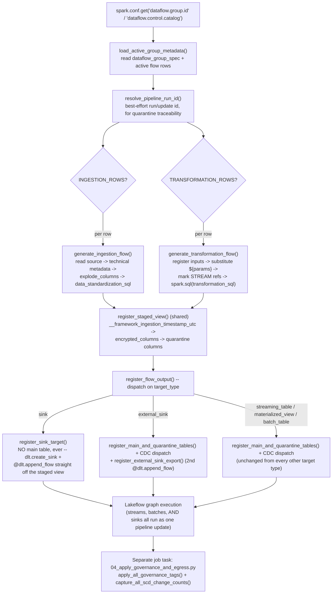

# Engine Execution Flow

See also: [README.md](README.md) for the full Metaflow documentation index.

`notebooks/03_engine/03_lakeflow_declarative_pipeline.py` runs in two conceptually
distinct phases, which is the single most important thing to understand about how this
engine works:

* **Graph-definition phase** — the notebook's Python executes top-to-bottom *once* per
  pipeline update, and every `@dlt.table`/`@dlt.view`/`dlt.create_sink`/`@dlt.append_flow`
  call *registers* a node in the DAG. This is where all of our metadata-driven logic
  lives — reading control-table rows, branching on `source_type`/`cdc_load_strategy`/
  `target_type`, etc.
* **Graph execution phase** — after graph definition finishes, the [Lakeflow Declarative
  Pipelines](https://docs.databricks.com/aws/en/dlt/) runtime (not our code) resolves
  dependencies and actually streams/batches data through each registered node, in the
  order the DAG requires.

**Everything in §1–§7 below happens during graph definition — including every
`external_sink`/`sink` export.** A sink export is a genuine `dlt.create_sink` +
`@dlt.append_flow` pair, registered by `register_flow_output` itself (§4) and executed as
part of the same pipeline update (see §4's callout below for the bug this design avoids).
§8 (governance tags + CDC change-count capture — **not** egress) is the only part of this
flow that still runs in a *separate* job task, after Lakeflow's graph execution has
finished.



## 1. Resolve the active group

```python
GROUP_ID = spark.conf.get("dataflow.group.id")
CONTROL_CATALOG = spark.conf.get("dataflow.control.catalog")
GROUP_ROW, INGESTION_ROWS, TRANSFORMATION_ROWS = load_active_group_metadata(spark, CONTROL_CATALOG, GROUP_ID)
PIPELINE_PARAMETERS = json.loads(GROUP_ROW.pipeline_parameters_json) if GROUP_ROW.pipeline_parameters_json else {}
PIPELINE_RUN_ID = resolve_pipeline_run_id(spark, GROUP_ID)
```

`load_active_group_metadata` (`control_plane/repository.py`) raises `FrameworkConfigError`
if no active `dataflow_group_spec` row exists, or if both flow lists come back empty —
fail fast, at graph-definition time, rather than deploying an empty pipeline silently.

`resolve_pipeline_run_id` (`engine/run_context.py`) is a best-effort lookup across a short
list of Spark conf keys Lakeflow is known to sometimes set for the current update
(`pipelines.id`, `pipeline.id`, `spark.databricks.job.runId`) — none is documented as
stable across every runtime version, so it falls back to `GROUP_ID` itself rather than
raising. `PIPELINE_RUN_ID` only ever feeds `__framework_pipeline_run_id` on quarantined rows (see §5);
it is not load-bearing for anything else.

## 2. Ingestion flow registration (`generate_ingestion_flow`, per row)

```python
def _build_ingestion_dataframe():
    staged_df = read_ingestion_source(spark, flow_row.source_type, source_config)
    staged_df = attach_technical_metadata(staged_df, source_config)
    staged_df = apply_explode_columns(
        staged_df, source_config.get("explode_columns"), source_config.get("auto_flatten_all", False)
    )
    staged_df = apply_data_standardization_sql(staged_df, source_config.get("data_standardization_sql"))
    return staged_df
```

1. Parse `source_config_json` / `target_config_json` / `dq_config_json` (note: **not**
   `dq_rules_json` — DQ rules now live inside `dq_config.rules`, see §5).
2. Build the staged DataFrame, in this fixed order:
   - `read_ingestion_source(spark, source_type, source_config)` (`ingestion/readers.py`)
     dispatches on `source_type` to `read_autoloader_source` / `read_zerobus_source` /
     `read_asn1_source` — [Auto Loader](https://docs.databricks.com/aws/en/ingestion/cloud-object-storage/auto-loader/)
     is configured entirely through `source_config`; there is no separate top-level
     `source_format` field.
   - `attach_technical_metadata(df, source_config)` — adds `__framework_source_file_name`,
     `__framework_source_file_size`, `__framework_source_file_modification_time`,
     `__framework_source_file_metadata_headers` (each independently try/except-wrapped, so a
     connector that doesn't populate one field degrades to `NULL` rather than failing the
     read).
   - `apply_explode_columns(df, source_config.get("explode_columns"), source_config.get("auto_flatten_all", False))`
     (`ingestion/json_flattening.py`) — an empty/absent list is a schema-preserving
     pass-through by default (`df` is returned unchanged); a populated list scopes
     struct-flatten/array-explode treatment to exactly the named top-level columns (an
     `array<struct<...>>` column is exploded, then its resulting struct is immediately
     flattened too, so one name fully de-nests it in one step). Setting
     `source_config.auto_flatten_all: true` opts into the old behavior instead — recursively
     flattening every struct column and exploding every array column found anywhere in the
     schema — for an empty/absent list; it's ignored once the list is populated. Raises
     `FrameworkConfigError` if a named column doesn't exist or resolves to neither a struct
     nor an array — this check can only run here, at actual DataFrame-read time, since the
     onboarding validator (see [04_onboarding_validation.md](04_onboarding_validation.md))
     has no access to the source's real runtime schema.
   - `apply_data_standardization_sql(df, source_config.get("data_standardization_sql"))`
     (`ingestion/standardization_sql.py`) — applies each already-validated single
     column-expression string (must end `AS <column_name>`) via one `withColumn` per entry,
     in list order, overwriting an existing column of that name or adding a new one. This
     is the runtime counterpart to `onboarding/spec_validator.py`'s restricted grammar
     check (see [04_onboarding_validation.md](04_onboarding_validation.md) §3), which
     rejects anything containing `SELECT`/`FROM`/`JOIN`/`UNION`/any DDL/DML keyword or a
     `;` at onboarding time — this function trusts that gate and only re-raises
     `FrameworkConfigError` if an expression's alias can't be parsed or `F.expr` itself
     fails.

   Both `explode_columns` and `data_standardization_sql` are **ingestion-only** — a
   transformation flow reshapes its inputs via `transformation_sql` instead (§3), which has
   no restricted grammar and can do arbitrarily more (joins, aggregation, `UNION`).

3. Hand the whole thing to `register_staged_view` (§4 — shared with transformation flows).
4. Hand the staged view's name to `register_flow_output` (§4), passing
   `dq_config.get("quarantine_table")` as `quarantine_table_override` — `quarantine_table`
   and `record_id_column` both live under `dq_config` (a DQ concern, not a table-storage
   concern); `record_id_column` is threaded through `register_staged_view` instead (it
   drives `__framework_record_id` on quarantined rows, §5).

## 3. Transformation flow registration (`generate_transformation_flow`, per row)

1. Parse `source_inputs_json` / `target_config_json` / `dq_config_json`.
2. `register_transformation_inputs(spark, source_inputs)` (`transformation/inputs.py`) —
   one `@dlt.view` per input: `spark.readStream.table(...)` (with `.withWatermark(...)`,
   only if a watermark is configured, after casting the event-time column to `timestamp` —
   a JSON/CSV-sourced event-time field routinely arrives as `STRING`, which previously
   raised `EVENT_TIME_IS_NOT_ON_TIMESTAMP_TYPE`) for streaming inputs, or
   `spark.read.table(...)` for batch inputs. If the input carries `decrypted_columns`,
   `apply_aes_column_decryption` runs right here, before the view is ever handed to
   `transformation_sql` — **`source_inputs[].decrypted_columns` is the only valid place to
   decrypt**; `target_config` never decrypts (see §7).
3. `substitute_dynamic_parameters(transformation_sql, PIPELINE_PARAMETERS)`
   (`transformation/parameters.py`) — replaces every `${param}` with its resolved value as
   a SQL literal (raises `FrameworkConfigError` if the SQL references a parameter not
   present in `pipeline_parameters_json`).
4. `mark_streaming_references(resolved_sql, source_inputs)`
   (`transformation/inputs.py`) — rewrites every `FROM`/`JOIN <streaming input's name>` to
   `FROM`/`JOIN STREAM <name>` (word-boundary matched, so an `input_name` that's merely a
   substring of another identifier is never touched). Required because `transformation_sql`
   executes as one `spark.sql(...)` call, which treats a bare `FROM` reference as batch
   regardless of what the referenced view actually is — a streaming input's view otherwise
   raises `AnalysisException: View '...' is a streaming view and must be referenced using
   readStream` the moment it's actually queried. `transformation_sql` also supports
   `UNION`/`UNION ALL` across any mix of streaming and batch inputs — both parse and
   validate through the same `EXPLAIN`-based syntax check as any other construct (see
   [04_onboarding_validation.md](04_onboarding_validation.md)).
5. Compute `is_streaming` as `target_type == "streaming_table" OR any(input.get("is_streaming")
   for input in source_inputs)` — **not** `target_type` alone. Spark propagates
   streaming-ness through a whole query plan once any one input is streaming, so a windowed
   streaming aggregation feeding a `batch_table`/`materialized_view`/`external_sink` target
   is still a streaming view under the hood; missing this raised the same
   `AnalysisException` above the moment `register_main_and_quarantine_tables` tried to read
   such a staged view via a plain, non-streaming `dlt.read(...)`.
6. Hand `lambda: spark.sql(resolved_sql)` to `register_staged_view` (§4).
7. Hand the staged view's name to `register_flow_output` (§4) — same dispatch, same
   `quarantine_table_override` wiring as ingestion. Transformation additionally allows
   `cdc_load_strategy: "SCD3"` (ingestion-only flows reject it at onboarding time — SCD3
   pivots current/previous state via an internal history table, which only makes sense
   downstream of a raw ingestion flow).

## 4. Shared tail: `register_staged_view` + `register_flow_output` (`engine/flow_registration.py`)

Both engines converge here — this is the point the module's own docstring calls out
explicitly: a fix or enhancement written once, used by both.

**`register_staged_view`** registers `_<target_table>_staged` as a `@dlt.view`, decorated
with `apply_dq_expectations(dq_rules)` (native `dlt.expect_all`/`expect_all_or_drop`/
`expect_all_or_fail` for `warn`/`drop`/`fail` rules — **not** `quarantine` rules, which have
no native equivalent). Inside the view function, in this order:

1. `build_dataframe()` — the one thing that genuinely differs per engine (§2/§3 above);
   optionally timed and wrapped in `observability.structured_logger.logged_operation` when
   a `flow_id` was supplied (see §9), emitting one `"ingestion_read"`/
   `"transformation_execute"` structured JSON log event.
2. `attach_framework_ingestion_timestamp(df, capture_technical_metadata)`
   (`ingestion/technical_metadata.py`) — idempotently adds
   `__framework_ingestion_timestamp_utc` to **every** target, ingestion and transformation
   alike, gated by `capture_technical_metadata` (default `true`; read from
   `source_config.capture_technical_metadata` for ingestion, `target_config.capture_technical_metadata`
   for transformation, since transformation flows have no `source_config`).
3. `apply_aes_column_encryption(df, target_config["encrypted_columns"])`, if configured —
   **output-column encryption only**; see §7.
4. `add_quarantine_columns(df, dq_rules, pipeline_run_id, record_id_column)` — see §5.

**`register_flow_output`** dispatches on `target_type` — five possible values
(`streaming_table`, `materialized_view`, `batch_table`, `external_sink`, `sink`):

* **`"sink"`**: delegates entirely to `sink_registration.register_sink_target`. **No
  materialized table is ever registered** — the staged view feeds a genuine
  [`dlt.create_sink`](https://docs.databricks.com/aws/en/dlt/dlt-sinks.html) + `@dlt.append_flow` pair directly. Neither
  `register_main_and_quarantine_tables` nor CDC dispatch ever runs for this target type.
* **`"external_sink"`**: registered exactly like the three types below — real, qualified
  main table + CDC dispatch, unchanged — **plus** a second, separate `@dlt.append_flow`
  exporting that now-materialized table, via `sink_registration.register_external_sink_export`.
* **`"streaming_table"` / `"materialized_view"` / `"batch_table"`**: completely unchanged —
  real, qualified main table (or internal clean view + CDC-dispatched target) via
  `register_main_and_quarantine_tables`/`register_cdc_strategy`.

The whole function body is wrapped in `logged_operation("flow_registration", flow_label, ...)`
(§9), emitting one structured `SUCCESS`/`FAILED` JSON event on exit either way — the
original exception, if any, is always re-raised unchanged.

### Why `sink`/`external_sink` moved *into* the graph — the bug this fixes

Before this redesign, every `target_type` — `sink` included — unconditionally registered a
real, materialized `@dlt.table`, and `external_sink` egress ran as a **separate,
post-deployment** plain-Spark write: `control_plane/post_deployment.py::run_external_sink_exports`
did `spark.read.table(...).write.format(...).save(...)`, racing whatever the pipeline had
most recently materialized, from a downstream job task — never actually inside the
pipeline's own DAG. That directly contradicted the project's own requirement ("all external
outputs must use genuine Lakeflow/DLT sink functionality... not ordinary DAG table
writes"), and a separately-discovered bug made it strictly worse for `"sink"`-shaped
exports: that step tried to read the flow's ephemeral staged `@dlt.view` by name, and a
`@dlt.view` is never a durable, queryable object outside the pipeline's own graph execution
(confirmed empirically — it never appears in `SHOW TABLES` once the update finishes). Both
problems are structural, not implementation bugs — the fix was moving egress into
graph-definition, as a genuine Lakeflow construct executed by the same graph execution that
materializes (for `external_sink`) the table it reads from. `run_external_sink_exports` has
been deleted entirely rather than left as a no-op stub; see `engine/sink_registration.py`'s
module docstring and [23_lakeflow_sinks.md](23_lakeflow_sinks.md) for the full mechanics of
both target types (Lakeflow's own streaming-only sink constraint, the `sink_config.format`
options, the `pgp_zip` custom Data Source, and the eager-secret-resolution fix a live
deployment failure forced inside it).

## 5. Data Quality and quarantine (both engines, same mechanism)

`dq/expectations.py::apply_dq_expectations` and `dq/quarantine.py::add_quarantine_columns`
run identically whether the DQ rules came from an `ingestion_flow_spec` or
`transformation_flow_spec` row — DQ rules live under `dq_config.rules`, alongside
`dq_config.quarantine_table` and `dq_config.record_id_column` (both live in `dq_config`,
not `target_config`). `add_quarantine_columns`
adds `__framework_dq_failed_rule_ids`, `__framework_dq_failure_reasons`, `__framework_dq_quarantine_flag` (drives the
main/quarantine split below), plus `__framework_pipeline_run_id` (from `PIPELINE_RUN_ID`, §1) and
`__framework_record_id` (from `dq_config.record_id_column`, when present on the DataFrame) — always
added, `NULL` when not applicable, so quarantine-table shape is stable across every flow.

`dq/quarantine.py::register_main_and_quarantine_tables` then reads the *same* staged view
and splits it:

* The quarantine table (`<target_table>_quarantine`, or `dq_config.quarantine_table` if
  set) is registered **only when at least one `dq_config.rules[]` entry has
  `action: "quarantine"`** — a resource-waste fix, not just the field's relocation: a
  `quarantine_table` name with no quarantine-action rule produces no table at all.
* The clean (non-quarantined) side becomes the flow's actual published dataset for
  `APPEND`/`TRUNCATE_AND_LOAD` (registered directly as `@dlt.table(name=target_table)`), or
  an internal `@dlt.view` (`_<target_table>_clean`) for every CDC-dispatched strategy —
  registering `target_table` a second time here, on top of what `register_cdc_strategy`
  publishes, would collide (`Cannot redefine dataset`); reading the *raw* staged view for
  CDC would silently let quarantined rows flow into `apply_changes` regardless of any
  configured quarantine rule. Both were real bugs, caught via a live deployment failure on
  the first SCD1/SCD2 pipeline actually run end to end.

## 6. Hash keys, surrogate keys, and CDC dispatch

**This step runs directly upstream of CDC dispatch.** Inside
`register_main_and_quarantine_tables`'s `_clean_upstream()`, when `needs_cdc_dispatch` is
`True` (i.e. `cdc_load_strategy` is anything other than `APPEND`/`TRUNCATE_AND_LOAD`), the
quarantine-filtered clean DataFrame is passed through
`dq/quarantine.py::_apply_hash_and_surrogate_key_columns` **before** it is ever handed to
`register_cdc_strategy`:

```python
def _apply_hash_and_surrogate_key_columns(df, target_config):
    generate_surrogate_key = target_config.get(
        "generate_surrogate_key", cdc_load_strategy == "FULL_SNAPSHOT_CDC_NO_PK"
    )
    if generate_surrogate_key:
        df = generate_surrogate_key_hash(df)          # __framework_surrogate_key

    if target_config.get("generate_hash_columns", True):
        primary_keys = target_config.get("primary_keys") or (
            [SURROGATE_KEY_COLUMN] if generate_surrogate_key else []
        )
        if primary_keys:
            comparison_columns = resolve_comparison_columns(...)
            df = compute_hash_columns(df, primary_keys, comparison_columns)
        # else: logs a warning and adds neither hash column
    return df
```

* `__framework_surrogate_key` (`crypto/hashing.py::generate_surrogate_key_hash`) is a
  SHA-256 over every non-technical column (sorted, coalesced, cast-to-string, so column
  order/nulls never perturb it) — general-purpose, gated by
  `target_config.generate_surrogate_key`, defaulting `true` only for
  `FULL_SNAPSHOT_CDC_NO_PK` (its original use case: a hash of the payload stands in for a
  missing natural key) and `false` for every other strategy. Available on **any**
  ingestion/transformation/reconciliation flow, not just that one strategy.
* `__framework_hash_key`/`__framework_hash_value` (`cdc/hashing.py::compute_hash_columns`)
  are SHA-256 hashes of the ordered `primary_keys` and of the resolved comparison-column
  set respectively (`cdc/comparison_columns.py::resolve_comparison_columns`, the same
  `columns_to_check`/`columns_to_exclude` resolution CDC dispatch itself uses — see
  [02_cdc_load_strategies.md](02_cdc_load_strategies.md)), gated by
  `target_config.generate_hash_columns` (default `true` for every CDC-dispatched
  strategy). If a surrogate key was generated and no `primary_keys` are configured, the
  surrogate key column itself becomes what's hashed into `__framework_hash_key`.

Because this runs **before** `register_cdc_strategy` (`cdc/dispatcher.py`) is ever
consulted, `cdc/scd.py` and `cdc/snapshot.py` just consume `__framework_hash_key`/
`__framework_hash_value`/`__framework_surrogate_key` as already-present columns on their
input — neither module computes a hash itself. This is also what makes
`hash_precomputed: true` on a reconciliation dataset config correct and cheap: those exact
columns already exist on the CDC-dispatched target table, so reconciliation's matcher can
join on them directly instead of recomputing (see [07_reconciliation.md](07_reconciliation.md)).
Every CDC-dispatched target additionally gets `delta.enableChangeDataFeed=true`
(`storage/table_properties.py`), which is what lets §8's change-count capture query
`table_changes(...)` for exact insert/update/delete counts per pipeline update.

`register_cdc_strategy` itself (`cdc/dispatcher.py`) is a single dispatch table:
`APPEND`/`TRUNCATE_AND_LOAD` are no-ops here (the caller already published `target_table`
directly); `SCD1`/`SCD2`/`SCD3` route to `cdc/scd.py`; `FULL_SNAPSHOT_CDC`/
`FULL_SNAPSHOT_CDC_NO_PK` route to `cdc/snapshot.py::register_full_snapshot_cdc`. Full
per-strategy mechanics (including the optional `sequence_by_column` fallback to
`__framework_ingestion_timestamp_utc`, and `columns_to_exclude`'s comparison-only
semantics) are in [02_cdc_load_strategies.md](02_cdc_load_strategies.md).

## 7. Encryption (both engines, same mechanism)

`crypto/column_crypto.py` wraps PySpark's native `functions.aes_encrypt`/`aes_decrypt`
column functions (`F.aes_encrypt(F.col(...).cast("string"), F.lit(resolved_key), F.lit(mode))`)
— **not** the SQL `secret(scope, key)` function embedded as query text. That's a deliberate
fix, not a style choice: Databricks' credential-redaction machinery
(`spark.redaction.regex`) corrupts the *result* of any query whose text contains a literal
`secret(...)` call once it passes through Lakeflow's own per-dataset observability layer —
confirmed live (100% of encrypted values came back byte-inflated and full of `U+FFFD`
replacement characters). The fix resolves the secret's plaintext once, driver-side, via
`crypto/secrets.py::resolve_secret_ref` (`dbutils.secrets.get(catalog=, schema=, key=)`
against a [Unity Catalog three-level secret](https://docs.databricks.com/aws/en/security/secrets/)
— **never** a classic workspace scope) and
passes it through as a literal `Column` (`F.lit(...)`), so no `secret(` substring ever
appears in the expression driving the write. See
[16_encryption_and_secrets.md](16_encryption_and_secrets.md) for the full writeup.

`apply_aes_column_encryption` returns `(df, {output_column: original_spark_type})` — the
pre-encryption Spark type of each encrypted column, captured so it can eventually become a
Unity Catalog `original_data_type` column tag on the materialized target. As of this pass
that tuple's second element is read and then intentionally dropped at the one call site
(`register_staged_view`, §4) — the closure only runs at graph-*execution* time, while
tagging the target table can only happen once it's materialized, a later step this
framework hasn't wired up yet (tracked as follow-up work, not a bug); see that call site's
own code comment and [16_encryption_and_secrets.md](16_encryption_and_secrets.md)'s
"current implementation status" section.

Ingestion only ever *encrypts* — `target_config.encrypted_columns` on an output column.
Transformation may additionally *decrypt* an upstream ciphertext column via
`source_inputs[].decrypted_columns` (§3, step 2 — the **only** valid place to decrypt;
`target_config` never does), transform it, and *re-encrypt* the result via its own
`target_config.encrypted_columns` before writing to Silver/Gold — both calls are
independently configurable on every transformation flow. `decrypted_columns[].cast_to_type`
is required (decryption may change the physical type) and is cross-validated against any
supplied tagged `original_type_tags`, raising `CryptoError` naming table/column/expected/
actual/fix on a mismatch.

## 8. Post-deployment: governance tags and CDC change-count capture (separate job task)

`control_plane/post_deployment.py`'s `apply_all_governance_tags` and
`capture_all_scd_change_counts` are **not** called from inside the pipeline notebook — they
run from `notebooks/04_governance/04_apply_governance_and_egress.py`, wired as a job task
that `depends_on` the pipeline-update task. **Egress is deliberately not among this task's
responsibilities any more** — see §4's "why this moved" callout; the notebook's own
markdown cell says so explicitly, and a `run_egress_exports` job parameter from an older
resource definition is now silently ignored rather than acted on.

* `apply_all_governance_tags` loops every active flow (ingestion + transformation) in the
  group, and for each with a non-empty `governance_tags_json`, calls
  `governance/tags.py::apply_governance_tags` — `ALTER TABLE ... SET TAGS (...)` /
  `ALTER TABLE ... ALTER COLUMN ... SET TAGS (...)`, both naturally idempotent, so there's
  no idempotency ledger to maintain. This must run after the pipeline update because it's
  DDL against an already-materialized table. See
  [06_governance_integration.md](06_governance_integration.md) and
  `docs/01_control_metadata_schema.md` §6 for the tags-only model itself (`abac_config`
  with UC function-bound row filters/column masks is not part of this design — policy
  creation/administration is explicitly out of framework scope).

  *Note on naming:* the notebook's widget controlling this step is still called
  `apply_abac` (a `true`/`false` dropdown) even though it gates governance **tag**
  application, not ABAC row-filter/column-mask policy application — a holdover name that
  was never updated to match the behavior. Functionally harmless, just a label a future
  reader might otherwise puzzle over.

* `capture_all_scd_change_counts` computes exact insert/update/delete
  counts for every CDC-dispatched flow in the group via
  `cdc/change_metrics.py::capture_scd_change_counts`, which queries Delta's
  `table_changes(...)` over a commit-version range — enabled by §6's
  `delta.enableChangeDataFeed=true`. It has to run post-deployment for the same structural
  reason governance tags do: a table's own post-update commit version isn't knowable from
  *inside* that same update's graph-definition code (every CDC-materializing `@dlt.table`
  closure only ever builds a lazy plan; Lakeflow executes and commits it after
  graph-definition finishes). With no persisted "version before this update started"
  ledger, it approximates by reading each target's single most recent commit
  (`DESCRIBE HISTORY ... LIMIT 1`) and querying `table_changes` for that commit against
  itself — correct for the common case (one triggered update, one commit per target), and
  honestly documented as imprecise for two edge cases (a single update producing more than
  one commit to the same target; a target with no new commit at all this update) in that
  module's own docstring. Never raises — a failure for one flow is logged as a `FAILED`
  structured event (§9) and skipped, so a metrics-capture bug can't fail the governance job
  it rides alongside.

## 9. Structured logging (both engines, same mechanism)

`observability/structured_logger.py` emits one JSON line per business-level event via
Python's standard `logging` module — landing in driver/cluster logs, queryable through the
Databricks Jobs UI's per-task Logs tab and the cluster log viewer. **This is not a row in
Lakeflow's own event log**: Lakeflow Declarative Pipelines' event log has a fixed, closed
set of `event_type` values (`flow_progress`, `dataset_definition`, `sink_definition`,
etc.) with no documented API to inject a custom application event — claiming otherwise
would overclaim a capability that doesn't exist. What this module gives you instead
*complements* that native event log rather than duplicating it: Lakeflow's own
`flow_progress`/`dataset_definition` events already carry generic per-flow row counts and
native-expectation pass/fail counts for free; what they have no concept of is this
framework's own business semantics — which `flow_id` a table belongs to, quarantine counts
broken down by *rule*, CDC insert/update/delete counts per strategy, sink egress
format/target, reconciliation match/mismatch counts per target.

`log_flow_event`/`logged_operation` (a context manager wrapping a block, timing it, and
emitting exactly one `SUCCESS`/`FAILED` event on exit) are the two entry points, wired at
these points in the engine flow:

| Call site | `operation` | What it captures |
|---|---|---|
| `register_staged_view` (§4) | `"ingestion_read"` / `"transformation_execute"` | Read/SQL-execution duration and outcome, when a `flow_id` is supplied |
| `register_flow_output` (§4) | `"flow_registration"` | Whole-function outcome: target table, catalog/schema, `target_type`, `cdc_load_strategy` |
| `sink_registration.py` (§4) | `"sink_registration"` | Sink format, target type (`sink`/`external_sink`), success/failure |
| `dq/quarantine.py`'s quarantine-table closure (§5) | `"dq_staging"` | Real `records_read`/`records_rejected`/`records_quarantined` counts — **only for a non-streaming target**; a streaming target emits a registration-only event with no counts, since eagerly aggregating a streaming DataFrame outside `writeStream.start()` is illegal, and there's no framework-owned hook into "this micro-batch just finished" from inside a plain `@dlt.table` closure |
| `control_plane/post_deployment.py` (§8) | `"cdc_change_capture"` | Exact insert/update/delete counts per CDC-dispatched flow |

Every call is guaranteed never to raise or mask the real processing error it might be
logging alongside: `log_flow_event`'s own body is wrapped in a blanket `try/except` with a
best-effort fallback `logger.error` (itself also guarded), and `logged_operation` always
re-raises the original exception unchanged after logging its failure — a logging bug can
never crash a pipeline update in place of, or hide, the real error the caller was about to
raise.
