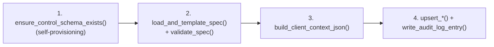

# Onboarding & Validation

See also: [README.md](README.md) for the full Metaflow documentation index.

`notebooks/02_onboarding/02_onboarding_engine.py` turns a `test_specs/*.json`- (or `.yaml`-)
shaped file into rows in the four control tables. Four steps, each backed by a library
module under `src/NextGen_Metadata_Framework/lakeflow_framework/onboarding/`:



This doc covers the *validation surface* — what `onboarding/spec_validator.py::validate_spec`
actually checks, field by field, and what its errors look like. For the full schema
reference (every field, its type, and its default), see
[01_control_metadata_schema.md](01_control_metadata_schema.md) — this doc cross-references
it rather than re-deriving it.

## 1. Self-provisioning: tables are created if missing

Before anything else, the onboarding notebook calls
`control_plane/schema_provisioner.py::ensure_control_schema_exists(spark, catalog)` — this
runs the exact same `CREATE SCHEMA IF NOT EXISTS` / `CREATE TABLE IF NOT EXISTS` statements
as `01_setup_control_tables.py` (same source-of-truth DDL text in
`control_plane/ddl_definitions.py`, so there's nothing to keep in sync by hand). This means
onboarding works against a **brand-new catalog that nobody has run setup against yet** —
you do not have to run `01_setup` first, though it's still there as the dedicated,
verbose-logging "provision this catalog" experience.

## 2. Load, template, validate

`onboarding/spec_loader.py::load_and_template_spec`:
1. Reads the raw file (`open()`, falling back to `dbutils.fs.head` for paths not FUSE-mounted).
2. Replaces every `{{catalog}}` / `{{env}}` with the widget values, throughout the raw text.
3. Parses the templated text — **JSON or YAML**, chosen purely by file extension
   (`.yaml`/`.yml` → `yaml.safe_load`, anything else → `json.loads`); both funnel into the
   identical in-memory dict shape, so everything downstream (the validator, the upsert
   functions) never needs to know or care which format a given spec was authored in. A
   parse failure (either format) becomes an `OnboardingValidationError` naming the file and
   the underlying parse error. See [09_onboarding_yaml_json.md](09_onboarding_yaml_json.md).
4. Computes `spec_version` as the first 16 hex chars of `sha256(templated_text)`.

`onboarding/spec_validator.py::validate_spec` then checks **every** field against its
expected type/allowed-values/required-ness, collecting every problem before returning —
so one run tells you everything wrong with the spec, not just the first thing. Per its own
module docstring, `validate_spec` never raises on a validation finding itself; it returns
`(ingestion_flows, transformation_flows, reconciliation_flows, errors)` and the caller (the
onboarding notebook) is the one that raises `OnboardingValidationError` on a non-empty
`errors` list.

One compatibility note straight from the module docstring:
**`depends_on_dataflow_group_ids` is not a valid field, but a spec that still carries
it is silently ignored, not rejected** — dependency ordering between dataflow groups is a
Lakeflow Jobs concern (job task `depends_on`), not the framework's, so a spec with this
obsolete field doesn't hard-fail on something that's simply irrelevant.

### Error message format

Every error is `"<fully-qualified path>: <what's wrong, in plain English>"`. A few
representative examples, straight from the checker functions in `spec_validator.py`:

| What you wrote | Error message |
|---|---|
| `"is_streaming": "abc"` | `transformation_flow[ts_x].source_inputs[0].is_streaming: expected a boolean (true/false in JSON), got 'abc' (str). Use the JSON literals `true`/`false`, not a quoted string.` |
| `"source_type": "gcs_autoloadr"` (misspelled) | `ingestion_flow[df_x].source_type: has invalid value 'gcs_autoloadr' -- allowed values are ['asn1', 'autoloader', 'zerobus']` |
| `"target_type": "kafka_sink"` (not a real value) | `ingestion_flow[df_x].target_type: has invalid value 'kafka_sink' -- allowed values are ['batch_table', 'external_sink', 'materialized_view', 'sink', 'streaming_table']` |
| `"cdc_load_strategy": "SCD3"` inside an **ingestion** flow's `target_config` | `ingestion_flow[df_x].target_config.cdc_load_strategy: 'SCD3' is only valid for transformation_flows, not ingestion_flows (SCD3 pivots current/previous state via an internal history table, which only makes sense downstream of a raw ingestion flow)` |
| `cdc_load_strategy: "SCD2"` with no `primary_keys` | `transformation_flow[ts_x].target_config.primary_keys: is required but was missing` |
| `columns_to_exclude` set under `FULL_SNAPSHOT_CDC` | `transformation_flow[ts_x].target_config.columns_to_exclude: only meaningful for cdc_load_strategy in ['SCD1', 'SCD2', 'SCD3'] (comparison-column exclusion), but this flow uses 'FULL_SNAPSHOT_CDC'` |
| `"retention_days": "seven"` | `ingestion_flow[df_x].source_config.landing_retention_policy.retention_days: expected an integer, got 'seven' (str)` |
| Missing `"rule_id"` in a DQ rule | `ingestion_flow[df_x].dq_config.rules[0].rule_id: is required but was missing or empty` |
| `"mode": "AES128"` on an encrypted column | `ingestion_flow[df_x].target_config.encrypted_columns[0].mode: has invalid value 'AES128' -- allowed values are ['CBC', 'ECB', 'GCM']` |
| `target_type: "sink"` with no `sink_config` | `transformation_flow[ts_x].target_config.sink_config: is required but was missing` |
| Two reconciliation targets sharing a `target_id` | `reconciliation_flow[recon_x].target_configs[1].target_id: 'primary' is already used by reconciliation_flow[recon_x].target_configs[0] -- target_id must be unique within a reconciliation flow` |

### Worked example

Given this (deliberately broken) fragment:

```json
{
  "dataflow_id": "df_bad_example",
  "source_type": "gcs_autoloadr",
  "target_catalog": "poc",
  "target_schema": "bronze_example",
  "target_table": "bad_example",
  "target_type": "streaming_table",
  "source_config": {
    "capture_technical_metadata": "yes",
    "landing_retention_policy": {"clean_source": "archive", "retention_days": "seven"}
  },
  "target_config": {"cdc_load_strategy": "APPEND"}
}
```

`validate_spec` collects four problems, and the onboarding notebook wraps them as:

```
Onboarding spec validation failed with 4 issue(s):
  - ingestion_flow[df_bad_example].source_type: has invalid value 'gcs_autoloadr' -- allowed values are ['asn1', 'autoloader', 'zerobus']
  - ingestion_flow[df_bad_example].source_config.capture_technical_metadata: expected a boolean (true/false in JSON), got 'yes' (str). Use the JSON literals `true`/`false`, not a quoted string.
  - ingestion_flow[df_bad_example].source_config.landing_retention_policy.archive_path: is required but was missing or empty
  - ingestion_flow[df_bad_example].source_config.landing_retention_policy.retention_days: expected an integer, got 'seven' (str)
```

Note the `archive_path` error: `clean_source: "archive"` conditionally *requires*
`archive_path`, and the validator checks that conditional requirement too — see
`_validate_landing_retention_policy` in `spec_validator.py`. `target_config.cdc_load_strategy`
was deliberately supplied and valid (`"APPEND"`) here, so it contributes no fifth error —
it's a required field on every flow's `target_config`, checked independently of everything
above.

### What gets checked, generically

Every check funnels through one of six reusable primitives (also in `spec_validator.py`,
usable directly if you extend the schema). Each takes a `required: bool = False` kwarg;
note that the "missing" wording is not uniform across them — `check_string`'s treats an
empty string the same as absent (worth knowing since it's the one most often called with
`required=True`), the rest only fire on `None`:

| Helper | Catches | `required=True` "missing" wording |
|---|---|---|
| `check_bool` | anything that isn't a real JSON `true`/`false` (a quoted `"true"` is **not** accepted — it's still a string) | `is required but was missing` |
| `check_string(..., allowed_values=...)` | wrong type, or a value outside an allowed set | `is required but was missing or empty` |
| `check_int(..., minimum=...)` | wrong type (booleans are explicitly rejected even though Python's `bool` is a subclass of `int`), or below a minimum | `is required but was missing` |
| `check_list_of_str` | not a JSON array, or containing non-string elements | `is required but was missing` |
| `check_dict` / `check_dict_of_str` | not a JSON object, or (for the latter) not all string→string | `is required but was missing` |

`check_secret_ref` is a seventh, composite helper built on top of `check_dict`/`check_string`:
every `{secret_catalog, secret_schema, secret_key}` reference anywhere in the spec — an
encrypted/decrypted column's key, a ZIP password, a PGP key, a Kafka sink credential — goes
through this one function, so the three-level [Unity Catalog secret](https://docs.databricks.com/aws/en/security/secrets/)
shape is validated identically everywhere it appears.

SQL syntax is validated separately, via `EXPLAIN <sql>` (`_validate_sql_syntax`), for **two**
fields: `transformation_flow[].transformation_sql` and `reconciliation_flow[].transform_sql`.
Both are validated against the *post-substitution* text (every `${param}` resolved first —
a `${param}` referencing a key absent from `pipeline_parameters` fails here too, before SQL
parsing is even attempted). A `ParseException` is a real error; an `AnalysisException` (e.g.
an input view that only exists once the pipeline is deployed) is logged as a warning and
tolerated — it proves the SQL parsed correctly even though it can't be resolved yet. `UNION`/
`UNION ALL` need no special-casing: they parse and validate through this exact same path,
same as any other SQL construct. `transform_sql` and `transformation_sql` share the grammar
(genuinely full SQL — `SELECT`/`FROM`/`JOIN`/`UNION` all legitimate) but not the *purpose*:
`transformation_sql` builds a flow's whole output; `transform_sql` reshapes reconciliation's
miss-set to match a target's schema before appending (see
[07_reconciliation.md](07_reconciliation.md)) — contrast both with
`data_standardization_sql`'s **deliberately different**, much narrower grammar, next.

## 3. `data_standardization_sql`: a restricted grammar, checked without `EXPLAIN`

`_validate_data_standardization_sql` (used for `source_config.data_standardization_sql` on
ingestion flows, and for either side's `data_standardization_sql` on a reconciliation
dataset config) does **not** use the `EXPLAIN`-based check above — it's a keyword-allowlist
regex, deliberately conservative:

```python
_FORBIDDEN_STANDARDIZATION_KEYWORDS = re.compile(
    r"\b(SELECT|FROM|JOIN|UNION|WHERE|INSERT|UPDATE|DELETE|MERGE|DROP|ALTER|CREATE|GRANT|REVOKE)\b",
    re.IGNORECASE,
)
```

Any bare occurrence of one of those keywords, or a `;`, is rejected outright — better to
reject a legitimate edge case than silently accept a disguised full statement. This is
checked at onboarding time only for shape; the runtime counterpart
(`ingestion/standardization_sql.py::apply_data_standardization_sql`, see
[03_engine_execution_flow.md](03_engine_execution_flow.md) §2) additionally requires each
expression to end in a resolvable `AS <column_name>` clause — not checked here, since the
validator only confirms the expression is *free of* forbidden constructs, not that it
parses as a valid standalone Spark expression (that would need its own `EXPLAIN`-style
call per expression, which this function doesn't attempt).

## 4. `target_type` and sink-config validation (`_validate_target_config` / `_validate_sink_config`)

`_validate_target_config` is the single largest sub-validator — it owns everything that
lives inside `target_config`, including every CDC-related field (there's no separate
`cdc_config`; see [01_control_metadata_schema.md](01_control_metadata_schema.md) §4).
Worth calling out explicitly, since it's easy to miss reading the code linearly:

* `storage_format: "iceberg"` is rejected unless `target_type == "batch_table"` — the one
  cross-field check tying `target_config` back to the flow's own `target_type`.
* `primary_keys` is required only for `{SCD1, SCD2, SCD3, FULL_SNAPSHOT_CDC}`;
  `sequence_by_column`/`columns_to_check` are never required (optional everywhere);
  `columns_to_exclude` is accepted only for `{SCD1, SCD2, SCD3}` (comparison-only — see
  [01_control_metadata_schema.md](01_control_metadata_schema.md) §9);
  `cdc_operation_column`/`cdc_operation_mapping` stay optional regardless of `primary_keys`
  for `{SCD1, SCD2, FULL_SNAPSHOT_CDC, FULL_SNAPSHOT_CDC_NO_PK}`, but if you supply *either*
  half, the *other* becomes required (`cdc_operation_mapping.delete_values` specifically).
* **`target_type in {"sink", "external_sink"}` requires `target_config.sink_config`** —
  this is where the sink rebuild (see
  [03_engine_execution_flow.md](03_engine_execution_flow.md) §4) shows up in the validation
  surface. `_validate_sink_config` dispatches on `sink_config.format`:

  | `format` | Required fields | Notes |
  |---|---|---|
  | `"delta"` | `path` | Plain Delta sink. |
  | `"kafka"` | `kafka_options["kafka.bootstrap.servers"]`, `kafka_options["topic"]` | No `path` at all — Kafka has no filesystem location. `kafka_secret_options` (optional) is this framework's own addition: a `{option_key: secret_ref}` map for the rare connector option (e.g. `kafka.sasl.jaas.config`) with no Unity Catalog service-credential alternative. |
  | `"pgp_zip"` | `path` (raw-row staging dir) **and** `post_export_archive.output_zip_path` | `post_export_archive` itself is **required** for `pgp_zip` (and its `enabled` must be `true` — archiving *is* the point of this format), optional otherwise. `post_export_archive.secret` (optional AES ZIP password) and `.pgp_encryption` (optional; if `.enabled`, `recipient_public_key_secret` required, `sign_with_private_key_secret` optional) are independently combinable. |

  A `target_config.sink_config` example (from `test_specs/spec_24_new_27_08_test_flagship.json`-style
  usage, matching the template's `ts_template_external_sink_example`):

  ```json
  "target_config": {
    "cdc_load_strategy": "APPEND",
    "sink_config": {
      "format": "pgp_zip",
      "path": "/Volumes/{{catalog}}/egress/example_export/{{env}}/_staging/",
      "post_export_archive": {
        "enabled": true,
        "output_zip_path": "/Volumes/{{catalog}}/egress/zips/example_export/{{env}}/",
        "secret": {"secret_catalog": "{{catalog}}", "secret_schema": "security", "secret_key": "egress_zip_password"},
        "pgp_encryption": {
          "enabled": true,
          "recipient_public_key_secret": {"secret_catalog": "{{catalog}}", "secret_schema": "security", "secret_key": "egress_recipient_public_key"},
          "sign_with_private_key_secret": {"secret_catalog": "{{catalog}}", "secret_schema": "security", "secret_key": "egress_sender_private_key"}
        }
      }
    }
  }
  ```

  These checks are structural only — they can't confirm the flow is actually streaming
  (Lakeflow's `dlt.create_sink`/`@dlt.append_flow` is streaming-only). That's a runtime
  check `engine/sink_registration.py` makes instead, since only the actual DataFrame lineage
  (not the spec) can prove it — see
  [03_engine_execution_flow.md](03_engine_execution_flow.md) §4 and
  [23_lakeflow_sinks.md](23_lakeflow_sinks.md).

## 5. `dq_config` and `governance_tags` validation

Both live in their own top-level containers, separate from `target_config` (see
[01_control_metadata_schema.md](01_control_metadata_schema.md) §9). Validation is
comparatively shallow for both — they're mostly key-value shape checks — but
each has one conditional-requirement wrinkle worth knowing:

* `_validate_dq_config`: `rules[].rule_id`/`.expression`/`.action` are required per entry
  (`action` restricted to `{"warn", "drop", "fail", "quarantine"}`); `quarantine_table`/
  `record_id_column` are plain optional strings. Naming a `quarantine_table` with **no**
  `action: "quarantine"` rule anywhere in `rules` is accepted, not an error — see that
  function's own docstring: it's a legitimate "about to add one" spec shape, and the engine
  simply produces no quarantine table for it (a resource-waste fix documented in
  [01_control_metadata_schema.md](01_control_metadata_schema.md) §5).
* `_validate_governance_tags`: `column_tags[].column`/`.tags` are required per entry
  (`tags` a string→string object, any number of key/value pairs); `table_tags` is an
  optional string→string object. Nothing here validates *what a tag does* (e.g. whether
  `mask: "PII"` is a value some workspace tag policy actually enforces) — that's
  deliberately out of scope; see [06_governance_integration.md](06_governance_integration.md).

  A real, live-enforced example from this workspace: a Unity Catalog tag policy restricts
  the `mask` tag key to values `[PII, cost]` only. The spec validator has no knowledge of
  that policy at all (`governance_tags.column_tags[].tags` accepts any string→string pair);
  a value the policy rejects fails later, as a UC DDL error when
  `apply_all_governance_tags` actually runs `ALTER TABLE ... SET TAGS`, not at onboarding
  time. That's a genuine gap between what this validator can catch and what Unity Catalog
  itself enforces — worth knowing rather than assuming onboarding-time validation is the
  last word on tag correctness.

  ```json
  "dq_config": {
    "rules": [
      {"rule_id": "dq_example_id_not_null", "expression": "example_id IS NOT NULL", "action": "drop"},
      {"rule_id": "dq_amount_non_negative", "expression": "amount >= 0", "action": "quarantine"}
    ],
    "quarantine_table": "example_raw_quarantine",
    "record_id_column": "example_id"
  },
  "governance_tags": {
    "column_tags": [{"column": "pii_column", "tags": {"mask": "PII", "classification": "restricted"}}],
    "table_tags": {"row_filter": "region_restricted", "domain": "example"}
  }
  ```

## 6. `reconciliation_flows` validation — the `target_configs[]` array

`_validate_reconciliation_flows` centers on `target_configs` (plural, **required and
non-empty** — `_validate_reconciliation_target_configs` rejects an empty or missing list
outright, since a reconciliation flow with nothing to compare against is meaningless). Each
entry is validated independently via `_validate_reconciliation_dataset_config` (the same
sub-validator `source_config` uses — both sides share a shape: `type`
(`"table"`/`"file"`/`"sink"`), `read_mode`, `filter_condition`, `data_standardization_sql`,
`hash_precomputed`), plus target-specific fields:

* `target_id` — required, and **must be unique within the flow** (checked across all
  entries in the same `target_configs[]` list, not globally); a duplicate produces the
  "already used by" error shown in §2's table above.
* `hash_precomputed: true` is only accepted when `type == "table"` — only a
  framework-managed table can carry precomputed `__framework_hash_key`/
  `__framework_hash_value` columns (see
  [03_engine_execution_flow.md](03_engine_execution_flow.md) §6); a `"file"`/`"sink"`
  dataset setting this flag is a hard error.
* `comparison_direction` (`"source_to_target"`/`"target_to_source"`/`"both"`, default
  `"both"` when omitted) gates whether `append_target_table` is required: it's required
  whenever the direction includes `source_to_target` (i.e. `"source_to_target"` or
  `"both"`) — a `"target_to_source"`-only target is audit-only by design (see
  [07_reconciliation.md](07_reconciliation.md)) and legitimately has nothing to append to.

At the flow level (not per-target): `reconciliation_id` and `match_keys` are required;
`compare_columns`/`generate_surrogate_key` are optional; `transform_sql`, if present, goes
through the same `EXPLAIN`-based syntax check as `transformation_sql` (§2 above — full SQL,
not the restricted `data_standardization_sql` grammar, since it reshapes a miss-set with
real `SELECT`/`FROM`); `error_handling.on_failure` is restricted to `{"fail", "warn"}`.

A full worked example (from `onboarding_templates/pipeline_onboarding_template.json`):

```json
{
  "reconciliation_id": "recon_template_example",
  "source_config": {
    "type": "table",
    "table": "{{catalog}}.bronze_example.example_volume_baseline",
    "read_mode": "batch",
    "filter_condition": "load_date = '${run_date}'",
    "data_standardization_sql": ["trim(status) AS status"],
    "hash_precomputed": false
  },
  "target_configs": [
    {
      "target_id": "primary_product_table",
      "type": "table",
      "table": "{{catalog}}.bronze_example.example_raw_final",
      "read_mode": "batch",
      "hash_precomputed": true,
      "comparison_direction": "both",
      "append_target_table": "{{catalog}}.bronze_example.example_raw_cdc"
    }
  ],
  "match_keys": ["example_id"],
  "compare_columns": ["amount", "status"],
  "generate_surrogate_key": false,
  "transform_sql": "SELECT example_id, amount, status FROM missing_records",
  "error_handling": {"on_failure": "fail"}
}
```

## 7. Cross-flow checks that need the *whole* spec

Two checks can't be done per-flow, because the thing being validated is a relationship
between flows in the same spec:

* `_validate_no_duplicate_input_names` (transformation flows): every transformation flow's
  `source_inputs[].input_name` registers a `@dlt.view` in the *same* pipeline graph — all
  flows sharing one `dataflow_group_id` share one graph, and
  `register_transformation_inputs` (see
  [03_engine_execution_flow.md](03_engine_execution_flow.md) §3) has no per-flow
  namespacing. Reusing an `input_name` across two different transformation flows in the
  same spec is flagged: `transformation_flow[ts_y].source_inputs.input_name: 'raw_events'
  is already used by transformation_flow[ts_x] -- ... input_name must be unique across all
  transformation_flows in this spec, not just within one flow`.
* `target_configs[].target_id` uniqueness (§6) is scoped *within* one reconciliation flow,
  not across the whole spec — two different `reconciliation_flows[]` entries are free to
  each use a `target_id` of `"primary"`.

## 8. Client-context / perception capture

`onboarding/client_context.py::build_client_context_json` records `user_principal`
(`current_user()`), `build_hostname`, `client_ip`/`browser_user_agent`/`cluster_id` (from
the notebook context tags, when running as an actual job — these are `"unknown"` in a
plain interactive run), `git_commit_sha` (from the notebook context's Git integration, or
the `GIT_COMMIT_SHA` env var), `cli_sdk_version` (from the `DATABRICKS_CLI_VERSION` env
var), and `spark_runtime_version`. Every field degrades to `"unknown"` independently rather
than failing the whole onboarding action.

## 9. Upsert + audit

`onboarding/metadata_upsert.py` performs a `MERGE INTO` per control table (insert-or-update
on primary key) via the Delta `DeltaTable.merge()` API, against an **explicit** Spark
schema per table (`_INGESTION_FLOW_SPEC_SCHEMA` etc., mirroring
`control_plane/ddl_definitions.py`) rather than letting `spark.createDataFrame` infer one —
inference fails outright (`CANNOT_DETERMINE_TYPE`) the moment every row in a batch shares
`None` for the same optional field, which is routine for a control table with many nullable
columns.

One wrinkle worth flagging: **`cdc_load_strategy` is denormalized from
`target_config.cdc_load_strategy` onto its own top-level column** on both
`ingestion_flow_spec` and `transformation_flow_spec` — `flow.get("target_config", {})["cdc_load_strategy"]`,
a plain dict-key lookup that raises `KeyError` (not `.get(...)`) if `target_config` is
missing it. `upsert_ingestion_flow_spec`/`upsert_transformation_flow_spec` catch that
`KeyError` and re-raise it as `OnboardingUpsertError` with an explicit hint: *"note:
cdc_load_strategy now lives under target_config"* — this can only actually be reached by a
spec that got past `validate_spec` first (which independently requires
`target_config.cdc_load_strategy`, §4 above), so in practice it's a defense-in-depth
message for a control-table row written some other way (hand-edited, or onboarded by an
older code path), not something a normal onboarding run should ever trigger.

`upsert_reconciliation_flow_spec` upserts `target_configs_json` (plural, matching §6's
schema).

`onboarding/audit_logger.py` appends one row to `onboarding_audit_log` — on **both** the
success path and the failure path (the notebook's outer `try/except` writes a
`status="FAILED"` row with the collected error message before re-raising), so every
onboarding attempt leaves a trace.

`action_type = "VALIDATE_ONLY"` runs the notebook's first three steps from the diagram at
the top of this doc — self-provisioning (§1), load+validate (§2), client-context capture
(§8) — but skips step 4's upsert (§9): useful for a CI check that a spec is well-formed
without actually registering it. The audit log still gets a row either way, with
`action_type = "VALIDATE_ONLY"` recorded on it.
