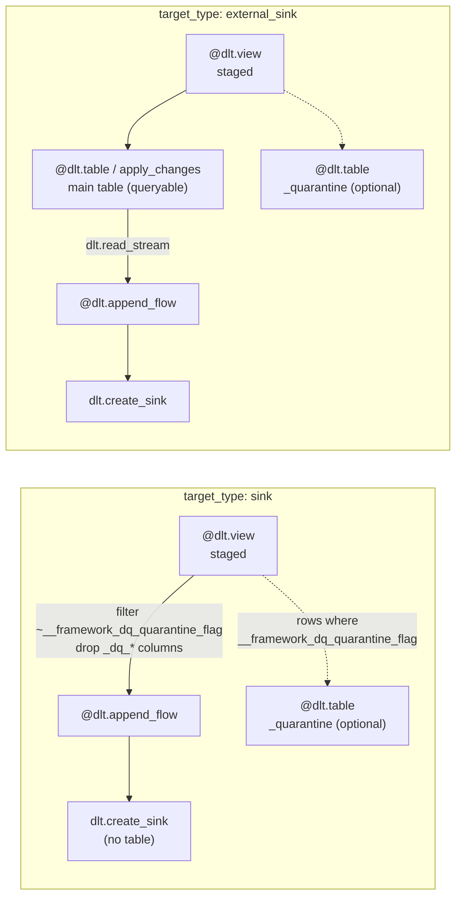

# Lakeflow Sinks: `target_type: "sink"` and `"external_sink"`

> See also: [README.md](README.md) — the full Metaflow documentation set.

## Purpose

Metaflow's requirement for external egress is explicit: *all external outputs must
use genuine
[Lakeflow Declarative Pipelines](https://docs.databricks.com/aws/en/dlt/)/DLT sink
functionality (`dlt.create_sink` + `@dlt.append_flow`), not ordinary DAG table writes;
sink nodes must not appear as persisted datasets; support direct
streaming-transform-to-volume without materializing an intermediate table.*

Before this rebuild, every `target_type` — `sink` included — unconditionally registered a
real, materialized `@dlt.table`, and `external_sink` egress ran as a *separate,
post-deployment* plain-Spark write (the now-deleted
`control_plane/post_deployment.py::run_external_sink_exports`): a
`spark.read.table(...).write.format(...).save(...)` invoked from a later job task, racing
against whatever the pipeline had most recently materialized, and never actually part of
the pipeline's own DAG. `engine/sink_registration.py` is the fix. `dlt.create_sink` +
`@dlt.append_flow` are genuine Lakeflow graph constructs, declared at graph-definition
time exactly like every `@dlt.table`/`@dlt.view` elsewhere in this framework, and executed
as part of the same pipeline update — no race, no separate job task, no re-reading a
table by guessing its name.

## Responsibilities

| Module | Responsibility |
|---|---|
| `engine/sink_registration.py::register_sink_target` | `target_type: "sink"` — staged view straight into `dlt.create_sink` + `@dlt.append_flow`. No main/clean table, ever. |
| `engine/sink_registration.py::register_external_sink_export` | The export half of `target_type: "external_sink"` — a *second*, independent `@dlt.append_flow` reading from the already-materialized main table into `dlt.create_sink`. |
| `engine/flow_registration.py::register_flow_output` | Dispatches on `target_type`; the one call site that decides which of the two functions above runs, and in what order relative to the normal main/quarantine/CDC registration path. |
| `archive/pgp_zip_sink.py::PgpZipDataSource` | A genuine PySpark `DataSource` (Data Source Sink API) registered as `dlt.create_sink(format="pgp_zip", ...)` — writes each micro-batch to a ZIP, optionally AES-password-protected and/or PGP-encrypted. |
| `onboarding/spec_validator.py::_validate_sink_config` | Validates `target_config.sink_config` at onboarding time — the first line of defense; `_build_sink_options` in `sink_registration.py` re-checks the required fields for its own `sink_format` as defense-in-depth for a control-table row written some other way. |

## `"sink"` vs `"external_sink"` — when to use each

Both live under the same five-way `target_type` enum documented in
[01_control_metadata_schema.md §4](01_control_metadata_schema.md#4-target_config-ingestion-and-transformation-flows).
The distinction is whether a real, queryable Delta table exists in the lakehouse *in
addition to* the external export:

| | `target_type: "sink"` | `target_type: "external_sink"` |
|---|---|---|
| Materialized main table | **Never.** No `@dlt.table` is registered for the clean/main side at all. | **Yes** — a real, governed, DQ-quarantined table, via the unchanged `register_main_and_quarantine_tables` + CDC-dispatch path (identical to `streaming_table`/`materialized_view`/`batch_table`). |
| What feeds the sink | The flow's staged `@dlt.view` directly (`dlt.read_stream(staged_view_name)`), filtered to drop quarantined rows. | The now-materialized qualified main table (`dlt.read_stream(qualified_main_table)`). |
| `cdc_load_strategy` | Present in the schema (still required by `_validate_target_config`) but **functionally inert** — `register_flow_output`'s `"sink"` branch returns before `cdc_load_strategy` is ever consulted for dispatch (it's only threaded through as a label on the `flow_registration` structured log event). Both live examples set it to `"APPEND"` as a placeholder. | **Fully live** — drives the real main table's CDC strategy exactly like any other CDC-dispatched target type, including SCD1/SCD2/SCD3/snapshot CDC. |
| Hash columns (`__framework_hash_key`/`_value`), `primary_keys`, `columns_to_check`, etc. | Not applicable — there's no CDC-dispatched table for them to apply to. | Fully applicable, same as any other target type. |
| Quarantine table | Still registered independently when a `dq_config.rules[]` entry has `action: "quarantine"` — see below. | Same, via the unchanged `register_main_and_quarantine_tables` path. |
| Lakeflow sink node name | `_<target_table>_sink` / append flow `<target_table>_sink_flow` | `_<target_table>_export_sink` / append flow `<target_table>_export_flow` |

**Use `"sink"`** when nothing downstream inside the lakehouse needs to query this flow's
output as a table — a pure export (a partner ZIP drop, a Kafka topic, a Volume landing
zone for an external consumer) where materializing an intermediate Delta table would be
pure storage/compute cost with no reader. This is also the only way to satisfy "support
direct streaming-transform-to-volume without materializing an intermediate table" — there
is structurally no table to skip.

**Use `"external_sink"`** when the same data needs to be both queryable inside the
lakehouse (BI, another flow's `source_inputs`, ad-hoc SQL) *and* exported externally, or
when you need a real CDC-dispatched strategy (SCD1/SCD2/SCD3/snapshot CDC) applied before
export — `"sink"` has no CDC concept at all, since there's no table for `apply_changes` to
target.

Both `test_specs/spec_06_unified_dual_engine_egress_zip.json` and
`test_specs/spec_24_new_27_08_test_flagship.json` exercise one of each, side by side, in
the same dataflow group.



## The streaming-only constraint

Per Lakeflow's own sink documentation — *"Only streaming queries are supported. Batch
queries are not supported."*
([learn.microsoft.com/.../ldp/concepts/sinks#limitations](https://learn.microsoft.com/en-us/azure/databricks/ldp/concepts/sinks#limitations))
— `dlt.create_sink`/`@dlt.append_flow` cannot be fed by a batch query at all. Both entry
points in `sink_registration.py` check this up front and raise `FrameworkConfigError`
naming the flow and citing the exact constraint, rather than letting Lakeflow itself fail
deep inside graph resolution with a much less actionable error.

**For `target_type: "sink"`** (`register_sink_target`), the check is on the flow's own
staged view:

> `target_type 'sink' requires a genuinely streaming source. ... this flow's staged view
> is NOT streaming (its ingestion source_type is batch-only, or -- for a transformation
> flow -- none of its source_inputs is marked 'is_streaming: true'). Fix: either change
> target_type to 'batch_table' (and export it some other way, outside this framework's
> sink support), or make the underlying source streaming (source_type:
> autoloader/asn1/zerobus for an ingestion flow, or source_inputs[].is_streaming: true for
> a transformation flow).`

**For `target_type: "external_sink"`** (`register_external_sink_export`), the check is on
the already-materialized *main table*, not the staged view — the export's append flow
reads `dlt.read_stream(qualified_main_table)`, so it's the main table's own
streaming-or-batch nature that matters:

> `target_type 'external_sink' requires its main target table to be a genuine Lakeflow
> Streaming Table so the export append_flow can dlt.read_stream() it ... This flow's main
> table is NOT a streaming table (for example: cdc_load_strategy 'SCD3' publishes its
> public target as a derived *batch* @dlt.table pivot over an internal streaming history
> table -- see cdc/scd.py::register_scd3 -- which cannot be read via dlt.read_stream; or
> cdc_load_strategy is APPEND/TRUNCATE_AND_LOAD with a non-streaming/batch source). Fix:
> use a cdc_load_strategy whose target is genuinely streaming (SCD1/SCD2/
> FULL_SNAPSHOT_CDC/FULL_SNAPSHOT_CDC_NO_PK), or make the underlying source streaming, or
> export this table some other way outside this framework's sink support.`

The SCD3 case is the one genuinely surprising trap: every other CDC-dispatched strategy
publishes its target via `apply_changes`/`apply_changes_from_snapshot` as a real Lakeflow
Streaming Table, unconditionally — but SCD3's *public* target is a window-function pivot
(`@dlt.table` reading a plain `dlt.read` over an internal `_..._scd2_history` streaming
table), which is a batch dataset. `SCD3` + `external_sink` will always fail this check;
there is no configuration fix short of choosing a different CDC strategy.

`register_flow_output` computes `main_table_is_streaming` for the `external_sink` check
as `cdc_load_strategy != "SCD3"` when CDC dispatch ran at all, and falls back to the
flow's own `is_streaming` (whatever the ingestion/transformation engine already resolved
it to) for `APPEND`/`TRUNCATE_AND_LOAD`.

## Quarantine routing without a persisted clean table

`register_staged_view` attaches `__framework_dq_quarantine_flag`/`__framework_dq_failed_rule_ids` to *every*
flow's staged view, `target_type` notwithstanding — reading that view unfiltered into a
`"sink"` flow's append flow would leak quarantined rows and internal `_dq_*` process
columns straight out to an external system. `register_sink_target` therefore applies the
same filter dq/quarantine.py's `_clean_upstream()` applies before publishing a main table:

```python
upstream.filter(~F.col("__framework_dq_quarantine_flag")).drop(*_QUARANTINE_PROCESS_COLUMNS)
```

This is duplicated locally in `sink_registration.py` (not imported from `dq/quarantine.py`,
which is out of this module's ownership) because `register_main_and_quarantine_tables` has
no way to produce *just* the quarantine table without also unconditionally registering a
main/clean table — which a `"sink"` flow must never have.

**`"external_sink"`'s export flow needs none of this.** It reads
`dlt.read_stream(qualified_main_table)` — the real main table, which
`register_main_and_quarantine_tables` already filtered to clean rows only before it was
ever materialized. The filtering happens exactly once, upstream, for `external_sink`; for
`"sink"`, the filtering has to happen again, locally, inside the sink registration itself,
because there's no main table to have done it already.

**The quarantine table itself is unaffected either way.** `<target_table>_quarantine` is
registered whenever any `dq_config.rules[]` entry has `action: "quarantine"` — for a
`"sink"` flow via `_register_sink_quarantine_table_if_configured` (reading the staged view
directly, keeping only flagged rows), for `"external_sink"` via the same
`register_main_and_quarantine_tables` path every other target type uses. Quarantine
routing never depended on the clean side being a persisted table.

## `sink_config` — shared shape, format-specific fields

`target_config.sink_config` is required whenever `target_type` is `"sink"` or
`"external_sink"` (`_validate_sink_config`, enforced identically for ingestion and
transformation flows — nothing restricts sinks to transformation flows specifically,
though every worked example in this repo happens to be one).

| Attribute | Type | Required | Notes |
|---|---|---|---|
| `format` | string | **yes** | One of `"delta"`, `"kafka"`, `"pgp_zip"` (`ALLOWED_SINK_FORMATS`). |
| `path` | string | **yes for `delta`/`pgp_zip`** | Delta: the sink's target directory/table path. `pgp_zip`: the per-micro-batch **staging** directory for raw row files — *not* the finished archive location. Not used for `kafka`. |
| `kafka_options` | object (string→string) | **yes for `kafka`** | Same options a Spark Structured Streaming Kafka writer accepts; at minimum `kafka.bootstrap.servers` and `topic`. |
| `kafka_secret_options` | object (string → `{secret_catalog, secret_schema, secret_key}`) | no | See below. |
| `post_export_archive.enabled` | boolean | **yes if `post_export_archive` present**; `post_export_archive` itself required for `pgp_zip` | Must be `true` for `pgp_zip` — archiving is the entire point of that format. Structurally accepted (but unused by the engine) for `delta`/`kafka` if a spec author supplies it anyway. |
| `post_export_archive.output_zip_path` | string | **yes when `enabled`** | Destination directory for one finished archive file per micro-batch. |
| `post_export_archive.secret` | object (`{secret_catalog, secret_schema, secret_key}`) | no | AES-256 password protecting the ZIP itself; omit for a plain, unencrypted ZIP. |
| `post_export_archive.pgp_encryption.enabled` | boolean | **yes if `pgp_encryption` present** | |
| `post_export_archive.pgp_encryption.recipient_public_key_secret` | object (secret ref) | **yes when `pgp_encryption.enabled`** | ASCII-armored PGP public key. |
| `post_export_archive.pgp_encryption.sign_with_private_key_secret` | object (secret ref) | no | Sender's ASCII-armored PGP private key — signs before encrypting when present. |
| `post_export_archive.pgp_encryption.sign_passphrase_secret` | object (secret ref) | no, **only valid alongside `sign_with_private_key_secret`** | The signing key's passphrase, if it's passphrase-protected. A real sender key routinely is (this project's own throwaway test keypairs deliberately aren't). |
| `post_export_archive.export_file_name_format` | string | no (default `"batch_{batch_id}"`) | A `str.format()`-style template for the exported archive's own file name (never the full path -- `output_zip_path` already names the destination directory). Supported placeholders: `{batch_id}`, `{timestamp}` (UTC, resolved at commit time, `YYYYMMDDTHHMMSSZ`). The `.zip`/`.zip.pgp` suffix is always appended by the sink itself. |

Every secret reference uses the same three-level Unity Catalog shape as everywhere else in
this framework — see [01_control_metadata_schema.md §4](01_control_metadata_schema.md) and
`crypto/secrets.py`.

## Format 1: `delta`

The plainest case — Lakeflow's own native Delta sink. `_build_sink_options` returns just
`{"path": path}`.

Worked example (`test_specs/spec_06_unified_dual_engine_egress_zip.json`,
`ts_iot_raw_events_direct_sink` — a pure `"sink"`, no materialized table):

```json
{
  "flow_step_id": "ts_iot_raw_events_direct_sink",
  "dataflow_id": "df_silver_iot_raw_direct_sink",
  "target_catalog": "{{catalog}}",
  "target_schema": "silver_iot",
  "target_table": "raw_events_direct_sink",
  "target_type": "sink",
  "source_inputs": [
    {
      "input_name": "bronze_telemetry_for_direct_sink",
      "table": "{{catalog}}.bronze_iot.raw_telemetry",
      "is_streaming": true
    }
  ],
  "transformation_sql": "SELECT device_id, country, event_ts, usage_bytes FROM bronze_telemetry_for_direct_sink",
  "target_config": {
    "cdc_load_strategy": "APPEND",
    "sink_config": {
      "format": "delta",
      "path": "/Volumes/{{catalog}}/egress/zips/iot_raw_direct_sink/{{env}}/"
    }
  },
  "dq_config": {},
  "governance_tags": {}
}
```

**A stale field to know about.** `onboarding_templates/pipeline_onboarding_template.json`'s
`delta`-format example additionally sets `"write_mode": "append"` inside `sink_config`.
That field passes validation (`check_dict`/`check_dict_of_str` in `spec_validator.py` don't
reject unrecognized keys) but is never read by `_build_sink_options`'s `"delta"` branch —
it's a harmless leftover from an earlier `target_config.sink_write_mode` field name, now
dead weight. There is nothing to configure here in practice: `@dlt.append_flow` is
always an append-only streaming write — Lakeflow's sink API has no "overwrite the sink"
concept at all (the same point `PgpZipDataSource.streamWriter`'s own `overwrite` parameter
makes explicit — it's accepted for interface compliance and then ignored). Omit
`write_mode`; it does nothing.

## Format 2: `kafka`

No filesystem `path` at all — `kafka` options live under `kafka_options`, the same flat
options a Spark Structured Streaming Kafka writer takes
([learn.microsoft.com/.../ldp/ldp-sinks](https://learn.microsoft.com/en-us/azure/databricks/ldp/ldp-sinks):
*"these are the same options a Spark Structured Streaming Kafka sink supports"*).
`_validate_sink_config` requires at minimum `kafka.bootstrap.servers` and `topic`; every
other Kafka connector option (security/auth, Azure Event Hubs' own options, etc.) is a
free-form passthrough this framework does not attempt to enumerate.

`kafka_secret_options` is this framework's own addition — a `str -> {secret_catalog,
secret_schema, secret_key}` map, resolved eagerly (driver-side, at graph-definition time,
exactly like `post_export_archive`'s secrets — see below) and merged into the same options
dict `dlt.create_sink` receives. **Prefer
`kafka_options["databricks.serviceCredential"]`** (a Unity Catalog service credential
*reference* injected transparently by Databricks) wherever your Kafka/Event Hubs setup
supports it; reserve `kafka_secret_options` for connector options that have no
injected-credential alternative and genuinely require a literal secret value embedded in a
config string (e.g. `kafka.sasl.jaas.config`). No prior Kafka-sink convention exists
anywhere else in this repo to match — this split is `sink_registration.py`'s own design
choice, made explicit in its module docstring.

No `test_specs/*.json` file in this repository currently exercises a `kafka`-format sink
live — the example below is assembled directly from `_validate_sink_config`'s required-field
checks and `_build_sink_options`'s `kafka` branch, not copied from a live-verified run:

```json
{
  "target_config": {
    "cdc_load_strategy": "APPEND",
    "sink_config": {
      "format": "kafka",
      "kafka_options": {
        "kafka.bootstrap.servers": "b-1.example-cluster.kafka.us-east-1.amazonaws.com:9096",
        "topic": "flagship_customer_events",
        "databricks.serviceCredential": "kafka_write_credential"
      },
      "kafka_secret_options": {
        "kafka.sasl.jaas.config": {
          "secret_catalog": "{{catalog}}",
          "secret_schema": "security",
          "secret_key": "kafka_sasl_jaas_config"
        }
      }
    }
  }
}
```

Like `kafka_secret_options`' resolved values (see `_resolve_secret_into_options`'s
docstring, quoted below), this becomes part of the pipeline's own graph
definition/settings — a deliberate, accepted trade-off, not an oversight.

## Format 3: `pgp_zip`

This framework's own custom Lakeflow sink — a genuine `pyspark.sql.datasource.DataSource`
(`archive/pgp_zip_sink.py::PgpZipDataSource`), registered once per process via
`spark.dataSource.register(PgpZipDataSource)` before any `pgp_zip`-format
`dlt.create_sink` call references it. `post_export_archive` is *required* for this format
(`archive_required = sink_format == "pgp_zip"` in `_validate_sink_config`) — archiving
(optionally PGP-encrypting) every micro-batch is the entire point.

Worked example — `test_specs/spec_24_new_27_08_test_flagship.json`,
`ts_flagship_customer_scd1_egress` (`external_sink`: a real SCD1 table is materialized
*and* exported PGP-encrypted):

```json
{
  "flow_step_id": "ts_flagship_customer_scd1_egress",
  "target_catalog": "{{catalog}}",
  "target_schema": "silver_flagship",
  "target_table": "customer_scd1_egress",
  "target_type": "external_sink",
  "source_inputs": [
    {
      "input_name": "customer_raw_stream_for_egress",
      "table": "{{catalog}}.bronze_flagship.customer_raw",
      "is_streaming": true
    }
  ],
  "transformation_sql": "SELECT customer_id, customer_name, country, tier, __framework_ingestion_timestamp_utc FROM customer_raw_stream_for_egress",
  "target_config": {
    "cdc_load_strategy": "SCD1",
    "primary_keys": ["customer_id"],
    "generate_hash_columns": true,
    "sink_config": {
      "path": "/Volumes/{{catalog}}/egress/zips/flagship_customer_egress/{{env}}/_staging/",
      "format": "pgp_zip",
      "post_export_archive": {
        "enabled": true,
        "output_zip_path": "/Volumes/{{catalog}}/egress/zips/flagship_customer_egress_export/",
        "secret": {"secret_catalog": "{{catalog}}", "secret_schema": "security", "secret_key": "egress_zip_password"},
        "pgp_encryption": {
          "enabled": true,
          "recipient_public_key_secret": {"secret_catalog": "{{catalog}}", "secret_schema": "security", "secret_key": "egress_pgp_recipient_public_key"}
        }
      }
    }
  },
  "dq_config": {"rules": []},
  "governance_tags": {}
}
```

`test_specs/spec_06_unified_dual_engine_egress_zip.json`'s `ts_iot_heavy_usage_egress`
(also `external_sink`) is the same shape with a `sign_with_private_key_secret` **omitted**
(sign-and-encrypt is optional, encrypt-only is the default once `pgp_encryption.enabled`
is `true`), reading from a windowed streaming aggregation instead of a raw pass-through.
`onboarding_templates/pipeline_onboarding_template.json`'s
`ts_template_external_sink_example` shows the fully-populated shape including
`sign_with_private_key_secret`.

## Inside `archive/pgp_zip_sink.py`: a genuine custom Data Source Sink

`PgpZipDataSource` implements only `streamWriter` — per the PySpark `DataSource` contract,
`reader`/`writer`(batch)/`streamReader`/`schema` are only required for read or batch-write
paths this sink never uses (Lakeflow sinks are streaming-only; `@dlt.append_flow` is the
only flow type that can target one).

### The write/commit/abort split

Per the Python Data Source Sink contract
(`pyspark.sql.datasource` / `pyspark/sql/worker/write_into_data_source.py`):

* `DataSource.streamWriter(schema, overwrite)` builds one writer instance **per
  micro-batch**, which is pickled and shipped to every executor for that micro-batch's
  `write(iterator)` calls — one call per partition.
* `commit(messages, batchId)` / `abort(messages, batchId)` run back on the **driver**
  afterward, on a *separately re-constructed* writer instance (a fresh `streamWriter()`
  call, in a different worker process — see below). This instance does **not** share
  Python object state with the write-side instances that ran on the executors.

Two consequences fall directly out of this:

1. A driver-constructed attribute holding a live `SparkSession` would break if stored on
   `self` — `SparkSession` holds a JVM gateway/socket that isn't picklable. `_PgpZipStreamWriter`
   never stores one.
2. Because commit-side and write-side instances are independently constructed, there is no
   shared in-memory state to correlate "which files did *this* micro-batch's partitions
   write." The only channel guaranteed to survive the driver/executor round trip is the
   `WriterCommitMessage` itself. So `write()` stages each partition's rows into its own
   **uuid4-suffixed** file — `part-{partition_id}-{uuid4}.json` — never a batch-id-derived
   name (the two sides can't agree on one), and returns that exact path in its commit
   message (`PgpZipCommitMessage.staged_file_path`). `commit()` reads the path list *only*
   from the messages it was actually handed, never by re-deriving or globbing a directory —
   guaranteeing it archives exactly this micro-batch's own output, never stale files left
   behind by a prior aborted batch or a concurrently-running different sink.

Concretely:

* **`write(iterator)`** (executor side) — writes each row as one JSON line
  (`row.asDict(recursive=True)`, `json.dumps(..., default=str)` so an awkward column type —
  date, decimal, binary — gets stringified rather than crashing the micro-batch) to a
  uniquely-named staged file under `sink_config.path`. A partition that received zero rows
  removes its own would-be-empty file and returns `staged_file_path=None` rather than
  leaving a zero-row file for `commit()` to special-case.
* **`commit(messages, batchId)`** (driver side) — collects every non-`None`
  `staged_file_path` across all partitions' commit messages, moves each into a fresh
  `_commit_{batchId}_{uuid}` subdirectory (moving, not copying, so the archive contains
  *exactly* this batch's files even if another micro-batch's `write()` calls are
  concurrently staging into the same shared directory), then calls
  `archive/zip_utils.py::compress_and_encrypt_sink` to produce `batch_{batchId}.zip` under
  `output_zip_path` (optionally AES-password-protected, if `zip_secret_value` is set). If
  `pgp_enabled`, the finished ZIP's bytes are then wrapped with `crypto/pgp.py::pgp_encrypt`
  (optionally signed first, if a signing key was supplied) and written as
  `batch_{batchId}.zip.pgp`; the unencrypted intermediate `.zip` is deleted immediately
  afterward — its whole purpose was to end up encrypted at rest. The batch-scoped staging
  subdirectory is removed in a `finally` block regardless of outcome. An empty micro-batch
  (no staged files at all) logs and returns without producing any archive.
* **`abort(messages, batchId)`** — deletes every partition's staged file that made it into
  the commit messages, logging how many were discarded. Failure Databricks/Spark itself
  triggers this path on (e.g. a downstream write failure elsewhere in the same
  micro-batch) — leftover staged files are cleaned up rather than accumulating forever in
  the staging directory.

### Why secrets are resolved *before* this module ever runs

This is a real, live-confirmed platform constraint, not a stylistic choice. An earlier
version resolved the AES ZIP passphrase and PGP keys lazily, inside `commit()` — which
looked correct on paper (`commit()` is documented as running "on the driver", and every
*other* secret use in this framework resolves lazily, right where the value is needed). It
failed every time, live, with:

```
Unable to resolve Unity Catalog secret '...': [Errno 13] Permission denied:
'/databricks/spark/./bin/spark-submit'
```

The root cause: `commit()`/`abort()` for a Python Streaming Data Source Sink actually run
in a **separate, dedicated "python streaming data source runtime" worker process**
(`pyspark/sql/worker/python_streaming_sink_runner.py`) — not the main pipeline driver
notebook process that owns a working `dbutils` gateway. `DBUtils(spark)` tries and fails
to spawn a gateway subprocess in that restricted runtime. This is the same class of
restriction Databricks documents for calling `dbutils` from inside a UDF, and the fix
applied here is the one Databricks itself recommends for that class of problem: resolve
secrets on the driver, in the *normal* graph-definition code path (where `dbutils` genuinely
works), and pass the already-resolved plaintext values through as plain string arguments.

Concretely, `engine/sink_registration.py::_resolve_secret_into_options` resolves every
configured secret — the ZIP password, the PGP recipient public key, the PGP signing
private key, `kafka_secret_options`' values — **eagerly, at graph-definition time**, and
embeds the plaintext directly into `dlt.create_sink`'s `options` dict under a
`<prefix>_secret_value` key. `archive/pgp_zip_sink.py` never calls
`resolve_secret_ref`/`dbutils` itself, in either `write()` or `commit()` — every secret it
touches arrives already resolved, as a plain string on `self`.

The option key naming (`<prefix>_secret_value`, not `<prefix>_value`) is deliberate: Spark's
own credential-redaction machinery (`spark.redaction.regex`) matches on the keyword
`secret`, so these values still get redacted in query-plan/event-log diagnostics even
though they're now plain strings living in pipeline graph-definition state rather than
UC secret coordinates. This is an accepted trade-off — the resolved plaintext value
becomes part of the pipeline's own configuration/options for the lifetime of that graph
definition, potentially visible in pipeline configuration/event UI to anyone with access
to inspect it, in exchange for the sink actually working at all.

### Options contract (`str -> str`, per the `DataSource` options contract)

| Option key | Required | Meaning |
|---|---|---|
| `path` | yes | Staging directory for per-partition raw-row files — *not* the final archive location. |
| `output_zip_path` | yes | Destination directory for one finished archive file per micro-batch. |
| `zip_secret_value` | no | Already-resolved AES-256 password for the ZIP itself. |
| `pgp_enabled` | no (default `"false"`) | `"true"`/`"false"` string. |
| `pgp_recipient_secret_value` | **yes when `pgp_enabled`** | Already-resolved, ASCII-armored recipient PGP public key. |
| `pgp_sign_secret_value` | no | Already-resolved, ASCII-armored sender PGP private key — signs before encrypting when present. |
| `pgp_sign_passphrase_secret_value` | no, only read when `pgp_sign_secret_value` is also set | Already-resolved plaintext passphrase for the signing key, if it's passphrase-protected. |

### Registration guard

`_register_pgp_zip_datasource_once` guards `spark.dataSource.register(PgpZipDataSource)`
behind a module-level boolean so a pipeline graph with several `pgp_zip`-format sinks
calls it exactly once per process — `spark.dataSource.register` is itself cheap and
idempotent to call repeatedly, this guard just avoids redundant calls/log noise.

## Validation summary (`onboarding/spec_validator.py::_validate_sink_config`)

`sink_config` validation runs whenever `target_type in ("sink", "external_sink")`, for
both ingestion and transformation flows identically:

1. `sink_config` itself must be a non-null object.
2. `format` is required, and must be one of `{"delta", "kafka", "pgp_zip"}`.
3. If `format == "kafka"`: `kafka_options` must be an object of string→string, and must
   include non-empty `kafka.bootstrap.servers` and `topic`. `kafka_secret_options`, if
   present, must be an object whose every value validates as a well-formed secret
   reference (`check_secret_ref`, required per-entry).
4. Otherwise (`delta`/`pgp_zip`): `path` is required.
5. `post_export_archive` is required (and, if present, `enabled` must be `true`) when
   `format == "pgp_zip"`; optional otherwise. When `enabled` is `true`:
   `output_zip_path` is required; `secret` (if present) must be a well-formed secret
   reference; `pgp_encryption` (if present) is an object whose `enabled` is required, and
   whose `recipient_public_key_secret` is required (and `sign_with_private_key_secret`
   optional) when `pgp_encryption.enabled` is `true`. `sign_passphrase_secret`, if present,
   must be a well-formed secret reference and is rejected as an error when
   `sign_with_private_key_secret` is absent (a passphrase with no signing key to unlock is
   always a config mistake, never a legitimate no-op).

`_build_sink_options` in `sink_registration.py` re-checks the format-specific required
fields at graph-definition time as a second, defense-in-depth line — for a flow whose
control-table row was written some other way (hand-edited, or onboarded by an older
validator version) rather than through the current onboarding path.

## Error handling

| Condition | Exception | Raised from |
|---|---|---|
| `sink_config` missing entirely for `"sink"`/`"external_sink"` | `FrameworkConfigError` | `register_sink_target` / `register_external_sink_export` |
| `sink_config.format` missing, or not one of `delta`/`kafka`/`pgp_zip` | `FrameworkConfigError` | `_create_sink` / `_build_sink_options` |
| `delta`/`pgp_zip` missing `path` | `FrameworkConfigError` | `_build_sink_options` |
| `kafka` missing `kafka.bootstrap.servers`/`topic` | `FrameworkConfigError` | `_build_sink_options` |
| `pgp_zip` missing `post_export_archive.output_zip_path` | `FrameworkConfigError` | `_build_sink_options` |
| A `"sink"` flow's staged view isn't streaming | `FrameworkConfigError` | `register_sink_target` |
| An `"external_sink"` flow's main table isn't streaming (e.g. SCD3) | `FrameworkConfigError` | `register_external_sink_export` |
| `pgp_zip` writer constructed with a missing `path`/`output_zip_path`, or `pgp_enabled` with no recipient key | `ArchiveError` | `_PgpZipStreamWriter.__init__` — a third, deepest defense-in-depth layer, since this constructor runs fresh per micro-batch |
| No active `SparkSession` when registering the `pgp_zip` Data Source | `FrameworkConfigError` | `_register_pgp_zip_datasource_once` |

## Observability

Both `register_sink_target` and `register_external_sink_export` wrap their entire body in
`observability.structured_logger.logged_operation("sink_registration", flow_label,
target_table=..., target_type=..., sink_format=...)` — one structured JSON log line,
`SUCCESS` on completion or `FAILED` with the real exception's message (re-raised
unchanged afterward, never swallowed — see
`observability/structured_logger.py`'s module docstring for the "never mask the real
error" guarantee). No per-record counts are logged here: sink flows are always streaming
(no legal eager `.count()` to take at graph-definition time), and Lakeflow's own native
`flow_progress` event already captures actual per-micro-batch write counts for every
`@dlt.append_flow` — this event exists to carry the framework's own business-level context
(which flow, which format, which target type) that Lakeflow's generic event has no concept
of, not to duplicate row counts Lakeflow already reports.

## Extension points

A new native Lakeflow sink format needs three small changes, no architectural rework:

1. Add the format string to `onboarding/spec_validator.py::ALLOWED_SINK_FORMATS` and any
   format-specific required-field checks in `_validate_sink_config`.
2. Add a branch to `sink_registration.py::_build_sink_options` translating
   `sink_config` into that format's `options` dict.
3. For a genuinely new *custom* Data Source (not a Lakeflow-native format): implement a
   `DataSourceStreamWriter` subclass following `PgpZipDataSource`'s pattern (staged files
   correlated only via `WriterCommitMessage`, no secrets resolved inside `write()`/
   `commit()`/`abort()`), and register it once via the same
   `spark.dataSource.register(...)`-behind-a-guard pattern
   `_register_pgp_zip_datasource_once` uses.

## See also

* [01_control_metadata_schema.md §4](01_control_metadata_schema.md#4-target_config-ingestion-and-transformation-flows) —
  the full `target_type` enum and where `sink_config` sits inside `target_config`.
* [16_encryption_and_secrets.md](16_encryption_and_secrets.md) and `crypto/secrets.py` —
  the Unity Catalog three-level secret shape every `secret`/`kafka_secret_options`/
  `recipient_public_key_secret`/`sign_with_private_key_secret` field uses.
* [15_engine_refactor.md](15_engine_refactor.md) — how `register_flow_output` fits into
  the shared staged-view/main-table/CDC-dispatch pipeline both engines converge on, and
  the earlier `external_sink`-special-casing bug this rebuild's predecessor design fixed.
* `test_specs/spec_06_unified_dual_engine_egress_zip.json`,
  `test_specs/spec_24_new_27_08_test_flagship.json`,
  `onboarding_templates/pipeline_onboarding_template.json` — live, validated worked
  examples of every `sink_config` shape in this doc.
