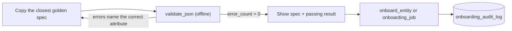

# :material-robot: Agent skills & tools

**FlowX ships a knowledge pack and six function-calling tools so an LLM agent can author, validate, onboard and diagnose specs without inventing attribute names. It does not ship an agent runtime or an "agent console" UI.** This page says exactly what exists, what each tool does, and where the execution history an operator would want actually lives.

!!! abstract "Quick links"
    - Prompt library and task-to-tool table: [Agent skills & prompt library](../15_agent_skills_and_prompts.md)
    - Sources: `agent_skills/SKILL.md`, `agent_skills/governance/SKILL.md`, `agent_skills/tool_specifications.json`, `agent_skills/dlt_observability_tools.json`, `agent_skills/reference/*`
    - The discoverable copy: `.claude/skills/flowx-onboarding/` (kept byte-identical by `scripts/sync_agent_skill.py`)

## What exists

| Asset | Kind | What it gives an agent |
|---|---|---|
| `agent_skills/SKILL.md` | orientation skill, 16 sections | Architecture, spec shape, the three source types, five target types, every load strategy, sinks, reconciliation, secrets, tags, DQ, a step-by-step walkthrough, "where to look for X". A map, not a copy: it links to the authoritative file for everything. |
| `agent_skills/governance/SKILL.md` | policy skill `flowx-governance` | Naming (`dfg_*`, `df_*`, `tf_*`, `rf_*`), mandatory table and column tags, OTel service and metric naming. |
| `agent_skills/tool_specifications.json` | OpenAI-style function specs | `validate_json`, `onboard_entity`, `get_catalog_schema_parameters`, backed by `onboarding/agent_tools.py`. |
| `agent_skills/dlt_observability_tools.json` | function specs | `validate_observability_config`, `generate_pipeline_onboarding_config`, `diagnose_pipeline_telemetry_failures`, backed by `observability/agent_tools.py`; includes LangChain and Semantic Kernel equivalents. |
| `agent_skills/reference/golden_specs.json` | five validated specs | Copy the closest one instead of composing from memory. Regenerated by `scripts/build_golden_specs.py`, guarded by `tests/unit/test_golden_specs.py`. |
| `agent_skills/reference/onboarding_spec_full_reference.json` | attribute dictionary | Machine-readable field-by-field reference. |
| `agent_skills/reference/common_pitfalls.md`, `module_map.md` | reference | Real bugs hit and fixed; one paragraph per runtime subpackage. |

## The six tools

| Tool | Backing function | Needs a cluster? | Use it to |
|---|---|---|---|
| `validate_json` | `onboarding.agent_tools.validate_json(spec_content, catalog, env, strict_mode)` | No | Validate JSON or YAML text with the same `spec_validator.py` the onboarding job runs. Returns `valid`, `error_count`, `errors`, `warnings`, `summary`. |
| `onboard_entity` | `onboarding.agent_tools.onboard_entity(...)` | Yes | Upsert control-table rows for a validated spec (`action_type` CREATE/UPDATE, `dry_run`). Reports `dataflow_group_id`, `affected_tables`, `audit_log_id`. |
| `get_catalog_schema_parameters` | `onboarding.agent_tools.get_catalog_schema_parameters(...)` | Yes | Discover tables, columns and existing tags in a schema before authoring. |
| `validate_observability_config` | `observability.agent_tools.validate_observability_config(config_text, catalog, env)` | No | JSON-Schema-validate an `{"observability": [...]}` fragment. |
| `generate_pipeline_onboarding_config` | `observability.agent_tools.generate_pipeline_onboarding_config(...)` | No | Produce a destinations fragment from a service name, environment and targets. |
| `diagnose_pipeline_telemetry_failures` | `observability.agent_tools.diagnose_pipeline_telemetry_failures(error_message)` | No | Classify a failed run's error text: `category`, `likely_cause`, `remediation`, `matched`. |

=== "Python"

    ```python
    from flowx.lakeflow_framework.onboarding.agent_tools import validate_json

    result = validate_json(open("dfg_orders.json", encoding="utf-8").read(), catalog="flowx", env="dev")
    assert result["valid"], result["errors"]
    ```

=== "Tool call (OpenAI-style)"

    ```json
    {
      "name": "validate_json",
      "arguments": {
        "spec_content": "{ \"dataflow_group_id\": \"dfg_orders\", ... }",
        "catalog": "flowx",
        "env": "dev",
        "strict_mode": true
      }
    }
    ```

=== "Prompt"

    ```text
    Load agent_skills/SKILL.md sections 3–6 and 12, and agent_skills/reference/golden_specs.json.
    Copy the closest golden spec, adapt it for <requirement>, then call validate_json and fix
    every reported error before returning the spec with the passing validation result.
    ```

## The non-negotiable loop



Since v1.7.2 an unrecognised attribute is a hard error, and the message names the attribute you meant (`data_quality` → `dq_config`, `partition_by` → `target_config.partition_columns`). A spec that merely looks right is not evidence of anything; the validation result is. The full alias table is on [Removed & rejected attributes](../reference/json/removed.md#names-the-framework-never-had).

## "Agent console": what exists and what does not

| You might expect | Reality |
|---|---|
| A tab listing active autonomous skills | None. Skills are Markdown files loaded into an agent's context; nothing runs unattended inside FlowX. |
| Execution history of agent actions | `config.onboarding_audit_log`: every onboarding, by a human or an agent, with `onboarded_by`, `action_type`, `status`, `error_message` and the `raw_spec_payload`. Shown on the [Control dashboard → Observability & Audit](control_dashboard.md#observability-audit) page; job runs are in `v_job_runs`. |
| Pipeline auto-healing by an agent | Self-healing is the **reconciliation engine's** append of missing and drifted records to `append_target_table` ([Pillar 3](../pillars/reconciliation.md#self-healing-append)), a deterministic job or in-pipeline lane, not an LLM. |
| SLA enforcement | DQ rules with `action: fail` stop an update; a reconciliation `dq_config` threshold fails an update; anything beyond that is a Databricks SQL alert over `v_group_health_summary` ([Pillar 4](../pillars/observability.md#heartbeats-thresholds-and-triage)). |
| Remediation audits | Combine `onboarding_audit_log` (what changed) with `v_pipeline_updates` (what happened next) on `dataflow_group_id` and time. |

```sql
-- Who changed which group, and did the next update succeed?
SELECT a.dataflow_group_id, a.action_type, a.onboarded_by, a.onboarded_at, a.status AS onboarding_status,
       u.update_id, u.state AS next_update_state, u.start_time
FROM   <catalog>.config.onboarding_audit_log a
LEFT JOIN <catalog>.observability.v_pipeline_updates u
       ON u.dataflow_group_id = a.dataflow_group_id
      AND u.start_time > a.onboarded_at
QUALIFY ROW_NUMBER() OVER (PARTITION BY a.audit_event_id ORDER BY u.start_time) = 1
ORDER  BY a.onboarded_at DESC;
```

## Wiring the tools into an agent stack

`agent_skills/README.md` carries the integration patterns. The shape is the same everywhere: register the six JSON specs as tools, load `SKILL.md` (and `governance/SKILL.md` for production specs) into the system context, and make `validate_json` a mandatory step before any `onboard_entity` call. The discoverable `.claude/skills/flowx-onboarding/` copy does this for Claude Code out of the box; run `python scripts/sync_agent_skill.py` after editing anything under `agent_skills/`.

## Related

- [Agent skills & prompt library](../15_agent_skills_and_prompts.md) · [Genie space](genie.md) · [Console overview](index.md)
- [Docs ↔ code synchronisation](../reference/sync.md) — how the skill copies and the docs stay identical to the code
