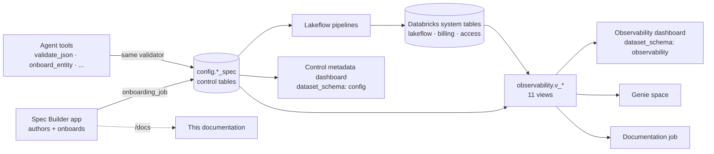

# :material-monitor-dashboard: The FlowX console

**FlowX has no single monolithic UI. Its console is four surfaces that share one data source: the control tables plus the Databricks system tables.** This section walks each surface tab by tab, with the widgets you will see, the action you take on each, and the parameter filters that scope it.

<div class="grid cards" markdown>

- :material-application-cog: **[Spec Builder app · tab by tab](spec_builder.md)**

    ---

    The Databricks App that authors, validates, saves and onboards a spec. Four header tabs (Ingestion, Transformation, Reconciliation, Observability), phased forms, an attribute inspector, live JSON/YAML preview.

- :material-chart-box: **[Observability dashboard](observability_dashboard.md)**

    ---

    The AI/BI dashboard over the `observability` semantic layer. Ten pages: run outcomes, throughput, DQ and reconciliation, cost, lineage, AI forecast, job orchestration, Zerobus streaming.

- :material-table-cog: **[Control metadata dashboard](control_dashboard.md)**

    ---

    What is onboarded, as the control tables see it: every flow, its load strategy, its audit history, the raw JSON, and which framework wheel each group runs on.

- :material-chat-question: **[Genie space](genie.md)**

    ---

    Natural-language questions over the eleven views and two control tables, with curated SQL examples and benchmarks.

- :material-robot: **[Agent skills & tools](agent_skills.md)**

    ---

    The skill pack and function-calling tool specifications for LLM agents. Read what exists, what it can do offline, and what an "agent console" is not.

</div>

## How the surfaces fit together



## If you are looking for a tab called …

The brief for this hub asked for four operational tabs. FlowX does not have them under those names. This is where each concern actually lives, and what is Databricks-native rather than FlowX.

| You expect | Where it is in FlowX | What is Databricks-native, not FlowX |
|---|---|---|
| **Pipeline Operations** — job runs, worker status, trigger buttons, run-duration charts | [Observability dashboard → Pipeline Performance](observability_dashboard.md#pipeline-performance) (update volume vs duration, retries, triggers) and [→ Job Orchestration](observability_dashboard.md#job-orchestration) (queue time, phase split, every run). Onboarding is triggered from the [Spec Builder](spec_builder.md#run-onboarding-from-the-app). | Starting or stopping a pipeline update, cluster/worker status and the update log live in the Databricks Pipelines UI or `databricks bundle run <pipeline>`. FlowX adds no trigger buttons of its own. |
| **Data Quality & Recon** — mismatch heatmaps, drill-downs, ad-hoc dispatchers | [Observability dashboard → Quality & Reconciliation](observability_dashboard.md#quality-reconciliation) (dataset × rule heatmap of failed records, classification per flow, run table); [Control dashboard → Reconciliation](control_dashboard.md#reconciliation); row-level detail in `config.reconciliation_mismatch_log`. An ad-hoc historical window is a `pipeline_parameters` change plus a job run: see [Pillar 3](../pillars/reconciliation.md#parameterised-sql-for-ad-hoc-historical-windows). | — |
| **Telemetry & Logs** — stdout/stderr, Spark executor health, query profiles | Exported telemetry: [Pillar 4 → destinations](../pillars/observability.md#telemetry-destinations) (Volume JSONL or an OTLP collector); update outcomes in `v_pipeline_updates`; structured JSON log lines in the pipeline event log. | Driver stdout/stderr, executor health and query profiles are the Databricks pipeline event log, Spark UI and query history. FlowX does not proxy them. |
| **Agent Console** — active skills, execution history, remediation audits | There is no agent UI. Skills are files and tool specs ([Agent skills & tools](agent_skills.md)); execution history is `config.onboarding_audit_log` (surfaced on the [Control dashboard → Observability & Audit](control_dashboard.md#observability-audit) page) plus `v_job_runs`. "Auto-healing" is the reconciliation engine's self-healing append, not an agent. | — |

## Deploying the console

All four surfaces are bundle resources. Deploy them with the framework, then remember the one step `bundle deploy` does not do.

```bash
# Dashboards, Genie space, app resource and its spec Volume
databricks bundle deploy -t <target> -p <profile>

# The app does NOT pick up new code on deploy alone: this pushes the committed web/dist and docs_site
databricks bundle run flowx_onboarding_app -t <target> -p <profile>
```

| Surface | Resource | Notes |
|---|---|---|
| Spec Builder app | `resources/flowx_app/flowx_onboarding_app.yml` (+ `flowx_onboarding_specs_volume.yml`) | Databricks Apps does not run `npm run build`; the committed `databricks-app/web/dist/` is the frontend, and `databricks-app/docs_site/` is this wiki served at `/docs`. Rebuild both before deploying (`npm run build`, `python scripts/build_app_docs.py`). |
| Observability dashboard | `resources/flowx_bi/flowx_observability_dashboard.yml` | `dataset_catalog: ${var.catalog}`, `dataset_schema: observability`; queries carry bare view names so one JSON serves every target. Needs `var.dashboard_warehouse_id`. |
| Control metadata dashboard | `resources/flowx_bi/flowx_control_dashboard.yml` | Same pattern with `dataset_schema: config`. |
| Genie space | `resources/flowx_genie/flowx_observability_genie_space.yml` | The serialized space carries fully-qualified table names, so the catalog is baked in per target by `scripts/render_genie_space.py --catalog <catalog>`. |
| Views the dashboards and Genie read | created by the observability setup step (`get_all_observability_view_ddls`) | Prerequisites and exact failure modes: [docs/17 §9](../17_framework_observability_and_genie.md#9-prerequisites-and-exactly-what-breaks-when-they-are-unmet). |

!!! warning "System-table grants decide how much of the console lights up"
    The control-metadata dashboard and the declarative half of the observability views need only the control tables. Everything about runs, rows, DQ, cost and lineage needs `SELECT` on `system.lakeflow.*`, `system.billing.*` and `system.access.table_lineage`, plus the `dataflow_group_id` job tag on every FlowX job. Without them the pages render with empty counters, not errors.

## Related

- [Pillars overview](../pillars/index.md) · [Master configuration reference](../reference/json/index.md)
- [Framework observability, AI/BI & Genie (deep dive)](../17_framework_observability_and_genie.md)
- [Using the Spec Builder app (getting started)](../onboarding/03_spec_builder_app.md)
