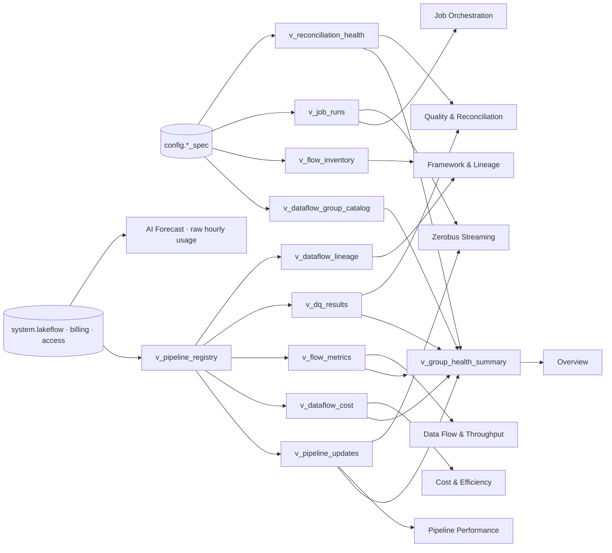

# :material-chart-box: Observability dashboard · page by page

**The `Metaflow Framework Observability` AI/BI dashboard is the operational console: ten pages over the `observability` semantic layer, joining what each dataflow group was onboarded to do with how it is actually running, what it costs, and what it will cost.** Source: `databricks-bi/flowx_observability_dashboard.lvdash.json`, deployed by `resources/flowx_bi/flowx_observability_dashboard.yml`.

!!! abstract "Quick links"
    - Deep dive on the views, the join key and the forecast rules: [docs/17](../17_framework_observability_and_genie.md)
    - The pillar behind it: [Pillar 4 · Observability](../pillars/observability.md)
    - The conversational twin: [Genie space](genie.md)
    - Editing traps (widget versions, encoded fields, silent-wrong SQL): [docs/17 §10](../17_framework_observability_and_genie.md#10-gotchas-six-bugs-live-data-caught)

## What feeds it



Fifteen datasets. Ten view-backed datasets carry **bare** view names so `dataset_catalog`/`dataset_schema` inject the catalog per target; the two forecast datasets read `system.billing.*` three-part names because `AI_FORECAST` needs the raw hourly grain. Never hard-code a catalog in a query: two unit tests reject it.

## Global Filters

Three filters, bound across pages. Set them first; every page below honours them except the forecast datasets.

| Filter | Bound to | Note |
|---|---|---|
| **Dataflow Group** (multi-select) | 10 datasets | The primary key of the whole domain. |
| **Date range** | the 6 time-series datasets | Defaults to the last 30 days. |
| **Environment** (single-select) | `environment` on the group catalog | `dev` / `prod` as onboarded. |

!!! note "The three forecast datasets are deliberately not filter-bound"
    A forecast fitted to a filtered subset of hours is a forecast of a different series than the chart claims. The AI Forecast page is workspace-wide by construction.

## Overview

<div class="fx-mock" markdown="0">┌ Dataflow Groups ┐┌ Total Flows ┐┌ Rows Processed ┐┌ Est. Cost (30d) ┐
│       7         ││     41      ││   128.4 M      ││   $ 1,942       │
└─────────────────┘└─────────────┘└────────────────┘└─────────────────┘
┌ Pipeline Updates ┐┌ Update Success Rate ┐┌ DQ Pass Rate ┐┌ Recon Discrepancies ┐
│      312         ││       97.8 %        ││    99.2 %    ││        14           │
└──────────────────┘└─────────────────────┘└──────────────┘└─────────────────────┘
│ Pipeline updates per day by outcome  ▂▃▅▆▇▆▅   │ Rows written per day by dataflow group ▁▂▄▆▇ │
│ Every dataflow group at a glance (table)       │ Declared capability footprint (table)         │</div>

- **Widgets:** Dataflow Groups · Total Flows · Rows Processed · Est. Cost (30d) · Pipeline Updates · Update Success Rate · DQ Pass Rate · Recon Discrepancies · updates per day by outcome · rows written per day by group · every group at a glance · declared capability footprint.
- **Datasets:** Dataflow Group Scorecard (`v_group_health_summary`), Pipeline Updates (30d), Flow Throughput (30d), Flow Inventory.
- **Use it to:** spot the group whose success rate or DQ pass rate dropped, then narrow the Dataflow Group filter and read the other pages for that group only.

**Action checklist**

- [ ] Any group with Update Success Rate below its neighbours: open **Pipeline Performance**.
- [ ] Recon Discrepancies above zero: open **Quality & Reconciliation**.
- [ ] A group with zero rows and a non-zero cost: open **Cost & Efficiency**.

## Pipeline Performance

- **Widgets:** Updates · Failed Updates · Automatic Retries · Avg Duration (min) · update volume vs average duration (combo) · average update duration by dataflow group · what triggers updates · every pipeline update (table).
- **Dataset:** Pipeline Updates (30d) on `v_pipeline_updates`.
- **Reading it:** retries are counted separately from throughput, so a flapping pipeline shows as many retries with a flat update count. "What triggers updates" splits manual, scheduled and API-triggered updates; full refreshes are flagged in the table.

**Action checklist**

- [ ] Duration creeping up with flat volume: check the group's `spark_config` and the table layout in [Pillar 2](../pillars/transformation.md#table-layout).
- [ ] Failed updates with a retry storm: stop the auto-retry loop before a full refresh (a streaming source rename needs one).

## Data Flow & Throughput

- **Widgets:** Rows Written · Active Flows · Rows Upserted · Rows Dropped by DQ · table selector · rows written by dataset · daily throughput by dataflow group (area) · per-flow, per-update row counts.
- **Dataset:** Flow Throughput (30d) on `v_flow_metrics` (update × flow grain from the Unity Catalog event logs).
- **Reading it:** streaming flows never report `num_output_rows` in the event log; a streaming flow legitimately shows blanks here. Rows Dropped by DQ are `drop`-action expectations only; `quarantine` rows are written elsewhere and counted on the next page.

**Action checklist**

- [ ] Rows written at zero for a flow that should be busy: the watched directory is probably not where files land ([gotchas](../13_known_limitations_and_gotchas.md)).
- [ ] Rows Upserted far above Rows Written: an SCD2 `columns_to_check` list includes a non-deterministic column.

## Quality & Reconciliation

- **Widgets:** DQ Rules Evaluated · Pass Rate · Failed Records · Recon Discrepancies · records passed vs failed per rule · failed records by dataset and rule (**heatmap**) · reconciliation classification by flow · reconciliation runs (table).
- **Datasets:** Data Quality Results (30d) on `v_dq_results`; Reconciliation Health on `v_reconciliation_health` (one row per run, left-joined so a flow that has never run still appears).
- **Reading it:** the heatmap is dataset × rule; a hot cell names the exact `rule_id` to open in the spec. The classification chart stacks `MATCHED`, `VALUE_DRIFT`, `MISSING_IN_TARGET` and `MISSING_IN_SOURCE` per flow.

**Action checklist**

- [ ] Drill into a hot cell: `SELECT * FROM <catalog>.config.reconciliation_mismatch_log WHERE reconciliation_id = '<id>' ORDER BY detected_at DESC` for row-level detail, or the `<target>_quarantine` table for DQ rows.
- [ ] Dispatch an ad-hoc comparison for a historical window: change `pipeline_parameters`, re-onboard with `UPDATE`, run the job ([Pillar 3](../pillars/reconciliation.md#parameterised-sql-for-ad-hoc-historical-windows)).

## Cost & Efficiency

- **Widgets:** Est. Cost (30d) · DBUs Consumed · Billed Entities · daily estimated cost by dataflow group (area) · share of spend by group (pie) · cost vs rows processed per group (combo) · daily usage records.
- **Datasets:** Cost & DBUs (30d) on `v_dataflow_cost` (group × date × workload × SKU), Dataflow Group Scorecard.
- **Reading it:** cost vs rows is the efficiency question. Cost attribution needs the `dataflow_group_id` job tag on every Metaflow job and the `configuration['dataflow.group.id']` pipeline setting; a job without the tag is unattributed, not free.

## Framework & Lineage

- **Widgets:** Flows Defined · Flows with DQ · Flows with Quarantine · Lineage Edges · flows per group by kind · load strategies in use · source to target data flow (**sankey**) · lineage explorer with click-through to Unity Catalog · every flow the framework manages.
- **Datasets:** Flow Inventory on `v_flow_inventory`, Observed Lineage on `v_dataflow_lineage` (`system.access.table_lineage` left-joined to the pipeline registry).
- **Reading it:** the sankey is **observed** lineage, from reads that actually happened, not the spec's declared inputs. A declared input that never appears here was never read.

## AI Forecast

- **Widgets:** Forecast Next 48h · Projected 30d Run Rate · Observed Spend · Hours of History · hourly framework spend, actual and forecast (forecast-line) · hourly pipeline updates, actual and forecast · forecast summary.
- **Datasets:** Spend Forecast and Run Volume Forecast (`AI_FORECAST` over `system.billing.usage` at the hourly grain), Forecast Summary.

!!! danger "Read docs/17 §6 before trusting a number here"
    `AI_FORECAST` needs hourly grain, enough history, and a series that is not a filtered subset. The cautionary tale in [docs/17 §6](../17_framework_observability_and_genie.md#6-ai_forecast-the-four-rules-and-the-ten-billion-dbu-cautionary-tale) is a ten-billion-DBU forecast produced by breaking one of the four rules. **Hours of History** is on the page so you can see when the model has too little to work with.

## Job Orchestration

- **Widgets:** Job Runs · Job Success Rate · Avg Queue (s) · Avg Duration (min) · average run time split by phase · every job run (with `attribution`).
- **Dataset:** Job Runs (30d) on `v_job_runs` (`system.lakeflow.jobs` and `job_run_timeline`, deduplicated across the slowly-changing jobs table).
- **Reading it:** `attribution` tells you whether a run was matched to a dataflow group by tag, by name or not at all. Queue time is the gap between trigger and start, the serverless warm-up cost.

## Zerobus Streaming

- **Widgets:** Job Runs (30d) · Job Success Rate · Pipeline Updates (30d) · Update Success Rate · runs by role and outcome · CDC update duration trend · every CDC pipeline update.
- **Datasets:** Zerobus Producer/Consumer Jobs (30d), Zerobus CDC Pipeline Updates (30d).
- **Reading it:** the producer/consumer role split shows the simulator job feeding a Zerobus table and the CDC pipeline consuming it (UC3's topology). A consumer that succeeds while the producer fails is reading a stale table.

## Operating the dashboard

```bash
# Deploy (queries keep bare view names; the resource injects catalog and schema)
databricks bundle deploy -t <target> -p <profile> --select dashboards.flowx_observability_dashboard

# Pull UI edits back into the repo before the next deploy overwrites them
databricks bundle generate dashboard --resource flowx_observability_dashboard --force
```

| Trap | Why it bites |
|---|---|
| Editing widget JSON by hand | Widget `version` numbers are per widget type, and several fields are encoded rather than declared. Round-trip through `bundle generate dashboard`. |
| Hard-coding `flowx.observability.v_x` in a query | Breaks every other target. Use the bare name; use `config.<table>` (two-part) only to reach a control table. |
| Trusting a streaming flow's row count | Streaming flows report no `num_output_rows`; blanks are expected, not a defect. |
| Filtering the forecast | It is not bound on purpose. |

## Related

- [Control metadata dashboard](control_dashboard.md) · [Genie space](genie.md) · [Console overview](index.md)
- [Pillar 4 · Observability](../pillars/observability.md) · [docs/17](../17_framework_observability_and_genie.md)
