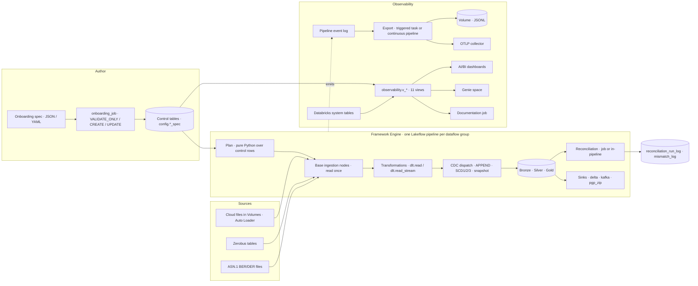

---
hide:
  - toc
---

<div class="fx-hero" markdown>

# FlowX Documentation

<p class="fx-lede">Metadata-driven ingestion, transformation, reconciliation and observability on Databricks Lakeflow. One JSON or YAML spec in, a governed pipeline out. Everything below is one click away.</p>

</div>

<div class="fx-directory" markdown>
<div class="fx-topics" markdown>

<div class="fx-topic" markdown>

### Get started

- [Prerequisites](onboarding/01_prerequisites.md)
- [Your first pipeline](onboarding/02_first_pipeline.md)
- [Using the Spec Builder app](onboarding/03_spec_builder_app.md)
- [Deploying with DABs](onboarding/04_deploying.md)
- [New-workspace bootstrap](onboarding/05_new_workspace_bootstrap.md)

</div>
<div class="fx-topic" markdown>

### Framework pillars

- [Pillars overview](pillars/index.md)
- [1 · Ingestion](pillars/ingestion.md)
- [2 · Transformation](pillars/transformation.md)
- [3 · Reconciliation](pillars/reconciliation.md)
- [4 · Observability](pillars/observability.md)

</div>
<div class="fx-topic" markdown>

### Console & dashboards

- [Console overview](console/index.md)
- [Spec Builder app · tab by tab](console/spec_builder.md)
- [Observability dashboard](console/observability_dashboard.md)
- [Control metadata dashboard](console/control_dashboard.md)
- [Genie space](console/genie.md)
- [Agent skills & tools](console/agent_skills.md)

</div>
<div class="fx-topic" markdown>

### Configuration reference

- [Master configuration reference](reference/json/index.md)
- [Spec tree view](reference/json/tree.md)
- [Ingestion flows](reference/json/ingestion.md) · [Transformation flows](reference/json/transformation.md)
- [Reconciliation flows](reference/json/reconciliation.md) · [Observability](reference/json/observability.md)
- [CDC / load strategy](reference/json/ingestion-transformation.md)
- [Removed & rejected attributes](reference/json/removed.md)
- [Full attribute dictionary](00_master_reference_index.md)

</div>
<div class="fx-topic" markdown>

### Architecture

- [Platform architecture & core concepts](01_platform_architecture.md)
- [The Single-Read DAG source plane](01_platform_architecture.md#7-the-single-read-dag-source-plane)
- [Deterministic hashing standard](11_hashing_and_determinism.md)
- [Module permutation matrix](12_module_permutation_matrix.md)
- [Security & cryptography](05_security_and_cryptography.md)
- [Egress & Lakeflow sinks](06_egress_and_lakeflow_sinks.md)

</div>
<div class="fx-topic" markdown>

### Operate & troubleshoot

- [Developer guide & recipes](09_developer_guide_and_recipes.md)
- [Use case implementation guide](16_usecase_implementation_guide.md)
- [Onboarding restrictions & validation rules](14_onboarding_restrictions_and_validation_rules.md)
- [Known limitations & gotchas](13_known_limitations_and_gotchas.md)
- [FAQ](faq.md) · [Multi-role FAQs](10_multi_role_faqs.md)

</div>
<div class="fx-topic" markdown>

### Code

- [Code reference overview](reference/code/index.md)
- [engine](reference/code/engine.md) · [onboarding](reference/code/onboarding.md)
- [ingestion](reference/code/ingestion.md) · [cdc](reference/code/cdc.md)
- [reconciliation](reference/code/reconciliation.md) · [observability](reference/code/observability.md)
- [control_plane](reference/code/control_plane.md)

</div>
<div class="fx-topic" markdown>

### Use cases

- [UC3 · Excalibur streaming CDC & batch recon](UC3/UC3_MASTER_DOCUMENT.md)
- [UC6 · EA Flood Warning](UC6/UC6_MASTER_DOCUMENT.md)
- [UC7 · CDR ASN.1 decoding](UC7/UC7_MASTER_DOCUMENT.md)
- [UC7 · plain-English guide](UC7/UC7_PLAIN_ENGLISH_GUIDE.md)

</div>

</div>
<div class="fx-panels" markdown>

<div class="fx-panel" markdown>

#### Release information · v1.7.13

- [Release notes](https://github.com/Madhan-RAGHU/NextGen_Metadata_Framework/blob/main/RELEASE_NOTES.md)
- [v1.7.13 enhancement log · documentation hub](https://github.com/Madhan-RAGHU/NextGen_Metadata_Framework/blob/main/enhancement_logs/v1.7.13_enhancement_log.md)
- [Recently added attributes](reference/json/index.md#recently-added-attributes)
- [Removed & rejected attributes](reference/json/removed.md)
- [v1.4.0 attribute delta](v1.4.0_attribute_delta.md)

</div>
<div class="fx-panel" markdown>

#### Setup & deployment

- [Prerequisites: catalog, schemas, Volumes, grants](onboarding/01_prerequisites.md)
- [Deploying with DABs](onboarding/04_deploying.md)
- [New-workspace bootstrap runbook](onboarding/05_new_workspace_bootstrap.md)
- [BT Digital POC deployment issues](onboarding/06_bt_digital_poc_deployment_issues.md)
- [Open the Spec Builder app](/)

</div>
<div class="fx-panel" markdown>

#### Extend FlowX

- [Developer guide & recipes](09_developer_guide_and_recipes.md)
- [Docs ↔ code synchronisation](reference/sync.md)
- [Agent skills & prompt library](15_agent_skills_and_prompts.md)
- [Architecture review · Aug 2026 audit](architecture_review/00_executive_summary.md)
- [Building this site](#building-this-site)

</div>

</div>
</div>

---

## What FlowX solves

Enterprise data platforms drown in one-notebook-per-source pipelines: the same Auto Loader boilerplate, the same `MERGE`, the same hand-rolled row counts, copied a hundred times and drifting apart. FlowX replaces that with **one declarative spec per dataflow group**. The onboarding job validates the spec and writes control-table rows. One generic engine notebook reads those rows on every pipeline update and builds the Lakeflow graph at runtime: base ingestion nodes read each source exactly once, transformations chain through `dlt.read`, CDC strategies dispatch to `apply_changes`, reconciliation classifies every record, and telemetry leaves through OpenTelemetry. No per-source Python for the common cases. Framework Python only when a genuinely new capability arrives.

<div class="grid cards" markdown>

- :material-engine: **Framework Engine**

    ---

    Metadata-driven execution: control tables in, a Lakeflow pipeline graph out. Two-phase model, eight control tables, Single-Read source plane, six CDC load strategies.

    [Platform architecture](01_platform_architecture.md) · [Pillars](pillars/index.md)

- :material-chart-timeline-variant: **Observability & Monitoring**

    ---

    Event-log export to a Volume or an OTLP collector, plus an eleven-view semantic layer joining control metadata to Databricks system tables: throughput, DQ pass rates, reconciliation drift, cost and AI forecasts.

    [Pillar 4 · Observability](pillars/observability.md) · [Dashboard walkthrough](console/observability_dashboard.md)

- :material-chat-question: **Genie**

    ---

    A conversational space over the observability views and two control tables. Ask which groups are unhealthy, what a dataflow group does flow by flow, or what the spend forecast looks like.

    [Genie space](console/genie.md)

- :material-robot: **Agent Skills**

    ---

    A skill pack and tool specifications for LLM agents: validate and onboard specs offline, discover catalog schemas, generate observability config, diagnose telemetry failures. Read what exists and what does not.

    [Agent skills & tools](console/agent_skills.md) · [Prompt library](15_agent_skills_and_prompts.md)

- :material-application-cog: **FlowX App · Spec Builder**

    ---

    A Databricks App that renders the whole attribute registry as a guided form: Ingestion, Transformation, Reconciliation and Observability tabs, an attribute inspector, live JSON/YAML preview, save to a Volume, trigger onboarding.

    [Tab-by-tab walkthrough](console/spec_builder.md) · [Open the app](/)

- :material-book-search: **Master Configuration Reference**

    ---

    Every attribute with type, default, sample, offline validation, CLI onboarding, SQL verification, the control-table column it persists into, and four or more FAQs. Generated, never hand-copied.

    [Master reference](reference/json/index.md) · [Spec tree view](reference/json/tree.md)

</div>

## Architecture flow

Source to sink, and the two paths telemetry takes out. Every box is a real component you can open from this page.



## The four pillars at a glance

| Pillar | You configure | The framework produces | Reference |
|---|---|---|---|
| [**1 · Ingestion**](pillars/ingestion.md) | `ingestion_flows[]`: a source type, a landing path or table, ZIP/PGP handling, dedup watermark, standardisation SQL | A Bronze streaming table read exactly once, with technical-metadata and rescue columns | [Ingestion attributes](reference/json/ingestion.md) |
| [**2 · Transformation**](pillars/transformation.md) | `transformation_flows[]`: SQL over `source_inputs[]` plus a CDC load strategy, layout, encryption, DQ rules, tags | Silver/Gold tables maintained by `apply_changes`, deterministic hash columns, quarantine tables, Unity Catalog tags | [Transformation attributes](reference/json/transformation.md) |
| [**3 · Reconciliation**](pillars/reconciliation.md) | `reconciliation_flows[]`: a baseline, one or more targets, match keys, compare columns, `${param}` windows | Four-way drift classification, per-record mismatch log, optional self-healing append | [Reconciliation attributes](reference/json/reconciliation.md) |
| [**4 · Observability**](pillars/observability.md) | `observability[]`: destinations, mode, auth, retry | OpenTelemetry payloads to a Volume or collector; views, dashboards and Genie over control and system tables | [Observability attributes](reference/json/observability.md) |

!!! warning "Two facts that explain most early confusion"
    **Onboarding and running are separate steps.** Onboarding writes control-table rows; the pipeline builds its graph from those rows when it starts. Editing a spec changes nothing until you re-run onboarding.

    **`dataflow_group_id` is the identity of the whole document.** Re-running onboarding with the same id updates in place. Changing it creates a second, independent set of rows, and the original flows keep running.

## Building this site

```bash
pip install -r docs/requirements.txt
mkdocs serve     # http://127.0.0.1:8000 with live reload (uses the committed reference pages)
mkdocs build     # regenerates docs/reference/** via scripts/mkdocs_hooks.py, then writes site/
python scripts/check_docs_warnings.py   # what CI runs: zero warnings outside archive/
```

The reference pages under `reference/json/` and `reference/code/`, and the `UC*/` use-case pages, are generated. Edit their sources, not the pages: see [Docs ↔ code synchronisation](reference/sync.md). `archive/` and `architecture_review/` are retained for provenance and labelled as such in the navigation.
