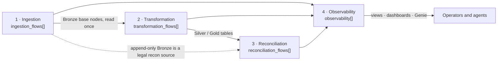

# The four framework pillars

**Every FlowX capability belongs to one of four pillars, and every pillar is driven by one block of the same onboarding spec.** This page is the map; each pillar page is the deep dive with recipes, validator-correct samples, runbooks and the traps that matter.

- :material-database-import: **[Pillar 1 · Ingestion](ingestion.md)**

    ---

    Auto Loader, Zerobus and ASN.1 sources into Bronze. ZIP and PGP pre-extraction, JSON explode and flatten, full-row dedup with a watermark, standardisation SQL, landing retention, the Single-Read source plane, backfills.

    Spec block: `ingestion_flows[]`

- :material-swap-horizontal: **[Pillar 2 · Transformation](transformation.md)**

    ---

    Bronze to Silver to Gold through `dlt.read`. Six CDC load strategies, deterministic hash columns, partitioning and liquid clustering, column encryption, DQ expectations with quarantine, governance tags, sinks.

    Spec block: `transformation_flows[]` (and `target_config` on both flow kinds)

- :material-scale-balance: **[Pillar 3 · Reconciliation](reconciliation.md)**

    ---

    Source-to-target validation on match keys, hash-first diffing, four-way drift classification, per-record mismatch log, self-healing append, three execution modes, `${param}` windows for ad-hoc historical dates.

    Spec block: `reconciliation_flows[]`

- :material-chart-timeline-variant: **[Pillar 4 · Observability](observability.md)**

    ---

    Event-log export to a Volume or an OTLP collector in triggered or continuous mode, structured JSON logging, and the eleven-view semantic layer behind the dashboards, the Genie space and the documentation job.

    Spec block: root `observability[]`

## How the pillars connect

Three rules hold across all four, and the validator enforces the ones it can:

1. **One external read per source table per execution mode.** Ingestion owns the read; everything downstream consumes through `dlt.read` or `dlt.read_stream`. See the [Single-Read DAG source plane](../01_platform_architecture.md#7-the-single-read-dag-source-plane).
2. **Onboarding and running are separate.** Every pillar's block is upserted into a control table by the onboarding job; the pipeline reads the rows on its next update. Nothing changes until you re-onboard.
3. **Removed attributes are rejected, never ignored.** A key the framework no longer reads fails onboarding with a migration message. See [Removed & rejected attributes](../reference/json/removed.md).

## Which pillar page do I need?

| I want to | Go to |
|---|---|
| Land files from a Volume, decrypt a PGP archive, decode ASN.1 CDRs, dedupe a stream | [Ingestion](ingestion.md) |
| Write SQL over Bronze, pick SCD1 vs SCD2 vs snapshot, encrypt a column, add DQ rules or tags, export to Kafka | [Transformation](transformation.md) |
| Prove a target matches its source, log every mismatch, heal missing records, run a comparison for last month only | [Reconciliation](reconciliation.md) |
| Ship telemetry to a collector, see success rates and cost per group, ask Genie what a group does, alert on drift | [Observability](observability.md) |
| Look up one attribute's type, default, sample and FAQs | [Master configuration reference](../reference/json/index.md) |
| See the whole spec as a tree | [Spec tree view](../reference/json/tree.md) |
| Know which combinations are legal | [Module permutation matrix](../12_module_permutation_matrix.md) |
| Know what the validator cannot catch | [Known limitations & gotchas](../13_known_limitations_and_gotchas.md) |

## Common structure of every pillar page

Each pillar page follows the same order so you can jump straight to the section you need:

- **Quick links** to the attribute reference, the deep-dive architecture document, the console surfaces and the gotchas.
- **At a glance** table: capability, the spec attributes that drive it, a status badge, the deep dive.
- **How it works**: a Mermaid diagram of the runtime path.
- **Capabilities**: one section each, with JSON and YAML tabs of the same validator-correct fragment.
- **Operational runbook**: onboard, run, verify with SQL.
- **Where to see it**: the Spec Builder tab, the dashboard pages and a Genie question.
- **Gotchas**: the traps from the known-limitations catalogue that apply to this pillar.

## Badges used across the pillars

| Badge | Meaning |
|---|---|
| Required | The onboarding gate rejects the spec when the attribute is absent. |
| Optional | Safe to omit; the page states the default or the inert behaviour. |
| v1.7.4+ | Added in that framework release. Older specs do not need it. |
| Transformation only | Scoped to one flow kind, one source type or one execution mode. |
| Removed | Rejected on presence with a migration message. |
