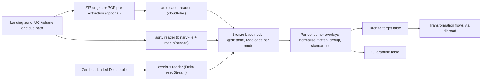

# :material-database-import: Pillar 1 · Ingestion

**One external read per source, per execution mode: FlowX lands files, Zerobus tables and ASN.1 binaries into a Bronze base node exactly once, and every downstream flow reads that node, never the source.**

!!! abstract "Quick links"
    - **Attribute reference:** [Ingestion flows](../reference/json/ingestion.md) · [Spec root](../reference/json/root.md) · [CDC / load strategy](../reference/json/ingestion-transformation.md)
    - **Deep dive:** [Ingestion & source readers](../02_ingestion_and_sources.md) · [The Single-Read source plane](../01_platform_architecture.md#7-the-single-read-dag-source-plane) · [PGP decryption](../05_security_and_cryptography.md#4-pgp-decryption-digital-signatures) · [Permutation matrix](../12_module_permutation_matrix.md#1-ingestion-source_type-target_type-cdc_load_strategy)
    - **Console:** [Spec Builder](../console/spec_builder.md) · [Control Metadata dashboard](../console/control_dashboard.md) · [Observability dashboard](../console/observability_dashboard.md) · [Genie](../console/genie.md) · [Agent skills](../console/agent_skills.md)
    - **Gotchas:** [Known limitations, silent traps & gotchas](../13_known_limitations_and_gotchas.md) · [Validation rules for `ingestion_flows[]`](../14_onboarding_restrictions_and_validation_rules.md#22-ingestion_flows)

## At a glance

| Capability | Spec attributes | Status | Deep dive |
|---|---|---|---|
| Auto Loader file ingestion | [`source_type`](../reference/json/ingestion.md#source-type) · [`path`](../reference/json/ingestion.md#source-configpath) · [`format`](../reference/json/ingestion.md#source-configformat) · [`schema_location`](../reference/json/ingestion.md#source-configschema-location) · [`schema_evolution_mode`](../reference/json/ingestion.md#source-configschema-evolution-mode) · [`reader_options`](../reference/json/ingestion.md#source-configreader-options) · [`file_pattern`](../reference/json/ingestion.md#source-configfile-pattern) | <span class="fx-badge fx-req">Required</span> | [02 §2](../02_ingestion_and_sources.md#2-auto-loader-ingestion-source_type-autoloader) |
| Zerobus streaming source | [`source_catalog`](../reference/json/ingestion.md#source-configsource-catalog) · [`source_schema`](../reference/json/ingestion.md#source-configsource-schema) · [`source_table`](../reference/json/ingestion.md#source-configsource-table) · [`starting_version`](../reference/json/ingestion.md#source-configstarting-version) · [`max_bytes_per_trigger`](../reference/json/ingestion.md#source-configmax-bytes-per-trigger) | <span class="fx-badge fx-opt">Optional</span> | [02 §3](../02_ingestion_and_sources.md#3-streaming-event-bus-source_type-zerobus) |
| ASN.1 BER/DER decoding | [`asn1_schema_path`](../reference/json/ingestion.md#source-configasn1-schema-path) · [`asn1_codec`](../reference/json/ingestion.md#source-configasn1-codec) · [`asn1_pdu_name`](../reference/json/ingestion.md#source-configasn1-pdu-name) | <span class="fx-badge fx-opt">Optional</span> | [02 §4](../02_ingestion_and_sources.md#4-asn1-binary-decoding-source_type-asn1) |
| ZIP / gzip landing with PGP pre-extraction | [`source_zip_handling.enabled`](../reference/json/ingestion.md#source-configsource-zip-handlingenabled) · [`member_format`](../reference/json/ingestion.md#source-configsource-zip-handlingmember-format) · [`pre_extraction_decryption.type`](../reference/json/ingestion.md#source-configsource-zip-handlingpre-extraction-decryptiontype) | <span class="fx-badge fx-opt">Optional</span> <span class="fx-badge fx-ver">v1.7.4+</span> | [02 §5](../02_ingestion_and_sources.md#5-in-flight-pgp-decryption-zip-archive-handling) |
| JSON explode, auto-flatten, JSON-string parsing | [`explode_columns`](../reference/json/ingestion.md#source-configexplode-columns) · [`auto_flatten_all`](../reference/json/ingestion.md#source-configauto-flatten-all) · [`json_string_columns`](../reference/json/ingestion.md#source-configjson-string-columns) | <span class="fx-badge fx-opt">Optional</span> <span class="fx-badge fx-ver">v1.3.0+</span> | [02 §6](../02_ingestion_and_sources.md#6-json-explode-auto-flatten-json-string-column-parsing) |
| Full-row streaming dedup with watermark | [`remove_dups`](../reference/json/ingestion.md#source-configremove-dups) · [`dedup_watermark`](../reference/json/ingestion.md#source-configdedup-watermarkevent-time-column) | <span class="fx-badge fx-opt">Optional</span> <span class="fx-badge fx-ver">v1.3.0+</span> | [02 §7](../02_ingestion_and_sources.md#7-full-row-streaming-deduplication-remove_dups) |
| Column standardisation | [`data_standardization_sql`](../reference/json/ingestion.md#source-configdata-standardization-sql) | <span class="fx-badge fx-opt">Optional</span> | [Reference](../reference/json/ingestion.md#source-configdata-standardization-sql) |
| Landing retention | [`landing_retention_policy.clean_source`](../reference/json/ingestion.md#source-configlanding-retention-policyclean-source) · [`archive_path`](../reference/json/ingestion.md#source-configlanding-retention-policyarchive-path) · [`retention_days`](../reference/json/ingestion.md#source-configlanding-retention-policyretention-days) | <span class="fx-badge fx-opt">Optional</span> | [02 §2](../02_ingestion_and_sources.md#landing-retention-policy-landing_retention_policy) |
| Technical metadata, normalisation, schema config | [`capture_technical_metadata`](../reference/json/ingestion.md#source-configcapture-technical-metadata) · [`column_normalization.enabled`](../reference/json/ingestion.md#source-configcolumn-normalizationenabled) · [`schema_config_path`](../reference/json/ingestion.md#source-configschema-config-path) | <span class="fx-badge fx-opt">Optional</span> | [02 §8](../02_ingestion_and_sources.md#8-technical-metadata-column-normalization) |
| Single-Read source plane | [`source_plane.materialize`](../01_platform_architecture.md#7-the-single-read-dag-source-plane) (spec root) | <span class="fx-badge fx-opt">Optional</span> <span class="fx-badge fx-ver">v1.5.0+</span> | [01 §7](../01_platform_architecture.md#7-the-single-read-dag-source-plane) |
| Backfills and reprocessing | full refresh · `schema_location` identity · `starting_version` | Operator runbook | [Below](#backfills-and-reprocessing) |

## How it works



- The reader opens the source **once** per pipeline update, per execution mode (`__stream` or `__batch`). Sharing is keyed on base-read options only: `format`, `schema_location`, `file_pattern`, `reader_options`, retention and ZIP policy, `starting_version`, `max_bytes_per_trigger`.
- Everything after the read is a per-consumer overlay and never splits it: `schema_config_path`, `column_normalization`, `json_string_columns`, `explode_columns`, `remove_dups`, `data_standardization_sql`.
- File-lifecycle side effects (`landing_retention_policy`, `source_zip_handling`) therefore run exactly once per update. Two different lifecycle policies on one path are rejected at onboarding and again at plan time.
- `is_streaming` is decided by `target_type == "streaming_table"`, not by `source_type`. All three readers call `spark.readStream`; a `materialized_view` or `batch_table` target consumes the staged view with `dlt.read`.

!!! info "What FlowX does not do"
    FlowX has **no catalogue of SaaS or database connectors**. Its sources are files in cloud storage or UC Volumes (via Auto Loader), Delta tables already landed by Zerobus, and ASN.1 binary files. Managed connectors for Salesforce, Workday, SQL Server and similar are **Lakeflow Connect**, a Databricks product outside this framework. Land their output as a Delta table and point a `zerobus` flow at it, or land files and use `autoloader`.

## Capabilities

### Auto Loader file ingestion

- Incremental file discovery over a UC Volume or `s3://` / `abfss://` / `gs://` path with `cloudFiles`. [`format`](../reference/json/ingestion.md#source-configformat) <span class="fx-badge fx-req">Required</span> <span class="fx-badge fx-only">Autoloader only</span> takes any `cloudFiles.format` value (`csv`, `json`, `parquet`, `avro`, `text`, ...).
- [`schema_location`](../reference/json/ingestion.md#source-configschema-location) <span class="fx-badge fx-req">Required</span> is auto-derived to `/Volumes/<target_catalog>/landing/_schemas/<target_table>/` when omitted, and the derived value is persisted. One location per flow, never shared, never inside `path`.
- [`schema_evolution_mode`](../reference/json/ingestion.md#source-configschema-evolution-mode) <span class="fx-badge fx-opt">Optional</span> <span class="fx-badge fx-only">Autoloader only</span>: `addNewColumns` (default), `addNewColumnsWithTypeWidening`, `rescue`, `failOnNewColumns`, `none`. [`file_pattern`](../reference/json/ingestion.md#source-configfile-pattern) maps to the generic `pathGlobFilter` for every format. [`reader_options`](../reference/json/ingestion.md#source-configreader-options) is a string-to-string map passed straight through; throttle with `cloudFiles.maxFilesPerTrigger` or `cloudFiles.maxBytesPerTrigger`.
- Do not put `cloudFiles.fileNamePattern` in `reader_options` (it does not exist, for any format), and do not put [`max_bytes_per_trigger`](../reference/json/ingestion.md#source-configmax-bytes-per-trigger) on an `autoloader` flow: only the `zerobus` reader reads it, so here it is inert.

=== "JSON"

    ```json
    {
      "dataflow_id": "df_orders_ingest",
      "source_type": "autoloader",
      "source_config": {
        "path": "/Volumes/main/landing/sales/orders/",
        "format": "csv",
        "schema_location": "/Volumes/main/landing/_schemas/orders/",
        "schema_evolution_mode": "addNewColumns",
        "file_pattern": "orders_*.csv",
        "reader_options": { "header": "true", "cloudFiles.maxFilesPerTrigger": "500" }
      },
      "target_catalog": "main", "target_schema": "bronze", "target_table": "orders",
      "target_type": "streaming_table",
      "target_config": { "cdc_load_strategy": "APPEND" }
    }
    ```

=== "YAML"

    ```yaml
    dataflow_id: df_orders_ingest
    source_type: autoloader
    source_config:
      path: /Volumes/main/landing/sales/orders/
      format: csv
      schema_location: /Volumes/main/landing/_schemas/orders/
      schema_evolution_mode: addNewColumns
      file_pattern: orders_*.csv
      reader_options:
        header: 'true'
        cloudFiles.maxFilesPerTrigger: '500'
    target_catalog: main
    target_schema: bronze
    target_table: orders
    target_type: streaming_table
    target_config:
      cdc_load_strategy: APPEND
    ```

???+ warning "An overwritten file is never re-ingested"
    Auto Loader keys its file registry on path, not content. A corrected file re-sent under the same name is skipped and the update still succeeds. `"cloudFiles.allowOverwrites": "true"` fixes it, but on an `APPEND` target the rows land twice. Pair it with `SCD1`/`SCD2`/`FULL_SNAPSHOT_CDC` or `remove_dups`, or land every delivery under a new filename. See [A1](../13_known_limitations_and_gotchas.md#a1-an-overwritten-file-is-never-re-ingested).

### Zerobus streaming source

- Streams an existing Delta table (typically landed by Zerobus Ingest) with `spark.readStream.format("delta").table(...)`. [`source_catalog`](../reference/json/ingestion.md#source-configsource-catalog), [`source_schema`](../reference/json/ingestion.md#source-configsource-schema), [`source_table`](../reference/json/ingestion.md#source-configsource-table) <span class="fx-badge fx-req">Required</span>.
- [`starting_version`](../reference/json/ingestion.md#source-configstarting-version) <span class="fx-badge fx-opt">Optional</span> (integer) maps to `startingVersion`; [`max_bytes_per_trigger`](../reference/json/ingestion.md#source-configmax-bytes-per-trigger) <span class="fx-badge fx-opt">Optional</span> (string, e.g. `"1g"`) maps to `maxBytesPerTrigger`. `startingVersion` is honoured only when the stream has no checkpoint yet.
- The upstream table must be **append-only**. A `MERGE`, `UPDATE` or `DELETE` on it fails the next incremental update with `DELTA_SOURCE_TABLE_IGNORE_CHANGES`; the framework refuses `skipChangeCommits` ([L5](../13_known_limitations_and_gotchas.md#l5-a-delta-streaming-source-must-be-append-only)).
- Must not carry `landing_retention_policy` (rejected: *only applicable to source_type 'autoloader'/'asn1'*) or `source_zip_handling`: there is no landing zone. Pairing with a `materialized_view` target is legal but discards the low-latency point ([12 §1](../12_module_permutation_matrix.md#1-ingestion-source_type-target_type-cdc_load_strategy)).

=== "JSON"

    ```json
    {
      "dataflow_id": "df_device_events_ingest",
      "source_type": "zerobus",
      "source_config": {
        "source_catalog": "main",
        "source_schema": "landing",
        "source_table": "device_events_raw",
        "starting_version": 0,
        "max_bytes_per_trigger": "1g"
      },
      "target_catalog": "main", "target_schema": "bronze", "target_table": "device_events",
      "target_type": "streaming_table",
      "target_config": { "cdc_load_strategy": "APPEND" }
    }
    ```

=== "YAML"

    ```yaml
    dataflow_id: df_device_events_ingest
    source_type: zerobus
    source_config:
      source_catalog: main
      source_schema: landing
      source_table: device_events_raw
      starting_version: 0
      max_bytes_per_trigger: 1g
    target_catalog: main
    target_schema: bronze
    target_table: device_events
    target_type: streaming_table
    target_config:
      cdc_load_strategy: APPEND
    ```

### ASN.1 BER/DER binary decoding

- Reads binary CDR files through Auto Loader (`cloudFiles.format = binaryFile`) and decodes them with `mapInPandas`, compiling the `.asn` module once per partition. [`asn1_schema_path`](../reference/json/ingestion.md#source-configasn1-schema-path) and [`asn1_codec`](../reference/json/ingestion.md#source-configasn1-codec) (`ber` | `der`) <span class="fx-badge fx-req">Required</span>, plus `path` and `schema_location`. Never set `format`; the reader fixes it.
- [`asn1_pdu_name`](../reference/json/ingestion.md#source-configasn1-pdu-name) <span class="fx-badge fx-opt">Optional</span>: omit it and the decoder auto-detects the module's root PDU; set it to override. The PDU must resolve to a `SEQUENCE` with no `CHOICE` or recursion anywhere in its member tree, which is why real TAP3 files ingest `Notification`, not `DataInterChange`. Ask the resolver which PDUs derive: [02 §4](../02_ingestion_and_sources.md#choosing-asn1_pdu_name-on-a-real-telecom-module).
- Nested constructs become `struct` / `array` columns; flatten downstream with `explode_columns`. Per-row decode failures populate `_asn1_decode_error` instead of failing the batch, so `"_asn1_decode_error IS NULL"` with `action: "quarantine"` is the standard first DQ rule.
- One ASN.1 module per file; `IMPORTS` across files is not supported.

=== "JSON"

    ```json
    {
      "dataflow_id": "df_tap3_notification_ingest",
      "source_type": "asn1",
      "source_config": {
        "path": "/Volumes/main/telecom/landing/tap3/incoming/",
        "schema_location": "/Volumes/main/telecom/landing/_schemas/tap3_notification_raw/",
        "file_pattern": "*.ber",
        "asn1_schema_path": "/Volumes/main/telecom/landing/tap3/schemas/TAP.310.asn1",
        "asn1_codec": "ber",
        "asn1_pdu_name": "Notification"
      },
      "target_catalog": "main", "target_schema": "bronze", "target_table": "tap3_notification_raw",
      "target_type": "streaming_table",
      "target_config": { "cdc_load_strategy": "APPEND" }
    }
    ```

=== "YAML"

    ```yaml
    dataflow_id: df_tap3_notification_ingest
    source_type: asn1
    source_config:
      path: /Volumes/main/telecom/landing/tap3/incoming/
      schema_location: /Volumes/main/telecom/landing/_schemas/tap3_notification_raw/
      file_pattern: '*.ber'
      asn1_schema_path: /Volumes/main/telecom/landing/tap3/schemas/TAP.310.asn1
      asn1_codec: ber
      asn1_pdu_name: Notification
    target_catalog: main
    target_schema: bronze
    target_table: tap3_notification_raw
    target_type: streaming_table
    target_config:
      cdc_load_strategy: APPEND
    ```

### ZIP / gzip landing with PGP pre-extraction

- Decrypts and extracts archives **inside the reader**, at pipeline execution time, then hands the members to `autoloader` or `asn1`. Legal on those two source types only. [`source_zip_handling.enabled`](../reference/json/ingestion.md#source-configsource-zip-handlingenabled) <span class="fx-badge fx-opt">Optional</span>; when `true`, [`source_zip_path`](../reference/json/ingestion.md#source-configsource-zip-handlingsource-zip-path) (a directory), [`zip_file_pattern`](../reference/json/ingestion.md#source-configsource-zip-handlingzip-file-pattern) (case-sensitive glob) and [`target_volume_path`](../reference/json/ingestion.md#source-configsource-zip-handlingtarget-volume-path) become <span class="fx-badge fx-req">Required</span>.
- [`pre_extraction_decryption.type`](../reference/json/ingestion.md#source-configsource-zip-handlingpre-extraction-decryptiontype): `pgp` (recipient keypair, needs [`private_key_secret`](../reference/json/ingestion.md#source-configsource-zip-handlingpre-extraction-decryptionprivate-key-secretsecret-key)) or `pgp_symmetric` <span class="fx-badge fx-ver">v1.7.4+</span> (shared passphrase, needs [`passphrase_secret`](../reference/json/ingestion.md#source-configsource-zip-handlingpre-extraction-decryptionpassphrase-secretsecret-key), rejects `private_key_secret`). [`secret_passphrase`](../reference/json/ingestion.md#source-configsource-zip-handlingpre-extraction-decryptionsecret-passphrasesecret-key) is the AES password of the ZIP itself, independent of `type`.
- [`member_format`](../reference/json/ingestion.md#source-configsource-zip-handlingmember-format) <span class="fx-badge fx-ver">v1.7.4+</span>: `zip` (default) or `gzip` for an **encrypted** `.gz`. An unencrypted `.gz` needs no handling block; Spark decompresses it on read. `secret_passphrase` is rejected with `gzip`.
- [`delete_source_after_extract.action`](../reference/json/ingestion.md#source-configsource-zip-handlingdelete-source-after-extractaction): `delete_now` (default) or `delete_after_x_days` with [`days`](../reference/json/ingestion.md#source-configsource-zip-handlingdelete-source-after-extractdays). Governs the **raw archive** only; `landing_retention_policy` governs the extracted files.

=== "JSON"

    ```json
    "source_config": {
      "path": "/Volumes/main/landing/secure/orders/",
      "format": "csv",
      "schema_location": "/Volumes/main/landing/_schemas/secure_orders/",
      "source_zip_handling": {
        "enabled": true,
        "source_zip_path": "/Volumes/main/landing/secure/incoming/",
        "zip_file_pattern": "orders_*.zip.pgp",
        "target_volume_path": "/Volumes/main/landing/secure/orders/",
        "pre_extraction_decryption": {
          "type": "pgp",
          "private_key_secret": { "secret_catalog": "main", "secret_schema": "security", "secret_key": "pgp_private_key" },
          "passphrase_secret": { "secret_catalog": "main", "secret_schema": "security", "secret_key": "pgp_passphrase" }
        },
        "delete_source_after_extract": { "action": "delete_after_x_days", "days": 30 }
      }
    }
    ```

=== "YAML"

    ```yaml
    source_config:
      path: /Volumes/main/landing/secure/orders/
      format: csv
      schema_location: /Volumes/main/landing/_schemas/secure_orders/
      source_zip_handling:
        enabled: true
        source_zip_path: /Volumes/main/landing/secure/incoming/
        zip_file_pattern: orders_*.zip.pgp
        target_volume_path: /Volumes/main/landing/secure/orders/
        pre_extraction_decryption:
          type: pgp
          private_key_secret:
            secret_catalog: main
            secret_schema: security
            secret_key: pgp_private_key
          passphrase_secret:
            secret_catalog: main
            secret_schema: security
            secret_key: pgp_passphrase
        delete_source_after_extract:
          action: delete_after_x_days
          days: 30
    ```

???+ warning "`target_volume_path` and `path` must be the same directory"
    Two fields, no cross-check. If they differ, the archive decrypts and extracts fine, Auto Loader reads a directory nothing was written to, the update **succeeds**, and the table gains zero rows. See [S1](../13_known_limitations_and_gotchas.md#s1-target_volume_path-and-path-must-point-at-the-same-directory).

??? example "Deep dive: an encrypted gzip with a shared passphrase (v1.7.4)"
    The landed filename has its `.gz` and `.gpg`/`.pgp` suffixes stripped, so `file_pattern` must match the **stripped** name. Symmetric encryption gives confidentiality but not provenance: anyone holding the passphrase can forge a file ([05 §4.1](../05_security_and_cryptography.md#41-asymmetric-vs-symmetric-two-different-messages-not-two-settings)).

    ```json
    "source_zip_handling": {
      "enabled": true,
      "source_zip_path": "/Volumes/main/landing/ea/raw/",
      "zip_file_pattern": "EE_*-REQUEST_*.csv.gz.gpg",
      "target_volume_path": "/Volumes/main/landing/ea/_extracted/request/",
      "member_format": "gzip",
      "pre_extraction_decryption": {
        "type": "pgp_symmetric",
        "passphrase_secret": { "secret_catalog": "main", "secret_schema": "security", "secret_key": "pgpkey" }
      },
      "delete_source_after_extract": { "action": "delete_now" }
    }
    ```

### JSON explode, auto-flatten and JSON-string parsing

- [`explode_columns`](../reference/json/ingestion.md#source-configexplode-columns) <span class="fx-badge fx-opt">Optional</span>: **absent** or `null` is schema-preserving pass-through; a populated list flattens or explodes exactly those top-level columns; a literal `[]` flattens every struct and explodes every array. [`auto_flatten_all`](../reference/json/ingestion.md#source-configauto-flatten-all) `true` equals `[]`.
- [`json_string_columns`](../reference/json/ingestion.md#source-configjson-string-columns) <span class="fx-badge fx-ver">v1.3.0+</span> parses a JSON document held in a `STRING` column with `from_json` immediately before the flatten pass, so Parquet, CSV, Delta and Zerobus sources get the same treatment as native JSON. Always supply `schema_ddl`; the bare-name form infers and works only on a streaming DataFrame.
- Runs after normalisation, before `remove_dups` and `data_standardization_sql`; column names are post-normalisation. A named column that is not a struct or array raises `FrameworkConfigError` at runtime; the validator cannot see the source schema.
- Do not rely on `cloudFiles.inferColumnTypes` (default false) to type nested JSON: it arrives as `STRING` and the explode fails ([A2](../13_known_limitations_and_gotchas.md#a2-cloudfilesinfercolumntypes-defaults-to-false-nested-json-arrives-as-string)). Declare the shape with `schema_ddl`.

=== "JSON"

    ```json
    "source_config": {
      "path": "/Volumes/main/landing/iot/readings/",
      "format": "parquet",
      "schema_location": "/Volumes/main/landing/_schemas/iot_readings/",
      "json_string_columns": [
        { "column": "payload", "schema_ddl": "struct<device_id:string,metrics:array<struct<sensor:string,val:double>>>" }
      ],
      "explode_columns": ["payload"]
    }
    ```

=== "YAML"

    ```yaml
    source_config:
      path: /Volumes/main/landing/iot/readings/
      format: parquet
      schema_location: /Volumes/main/landing/_schemas/iot_readings/
      json_string_columns:
      - column: payload
        schema_ddl: struct<device_id:string,metrics:array<struct<sensor:string,val:double>>>
      explode_columns:
      - payload
    ```

???+ warning "Emptying the list does not switch flattening off"
    `"explode_columns": []` means **flatten everything**. Delete the key to disable. Getting this backwards changes production row counts, not just column shapes. See [C8](../13_known_limitations_and_gotchas.md#c8-explode_columns-absent-null-and-mean-three-different-things).

### Full-row streaming dedup with `dedup_watermark`

- [`remove_dups`](../reference/json/ingestion.md#source-configremove-dups) <span class="fx-badge fx-opt">Optional</span> <span class="fx-badge fx-ver">v1.3.0+</span> applies `dropDuplicates` over every column except `__framework_*`, `_rescued_data`, `_metadata`, `_object_metadata` and `_asn1_decode_error`. Runs after explode, before standardisation, so a doubled source row that exploded into 2×M rows collapses correctly.
- [`dedup_watermark`](../reference/json/ingestion.md#source-configdedup-watermarkevent-time-column) <span class="fx-badge fx-opt">Optional</span> is the framework's watermarking. It needs both [`event_time_column`](../reference/json/ingestion.md#source-configdedup-watermarkevent-time-column) (a `TIMESTAMP`) and [`delay_threshold`](../reference/json/ingestion.md#source-configdedup-watermarkdelay-threshold) (a Spark interval). On a stream the chain becomes `withWatermark(...).dropDuplicatesWithinWatermark(...)`: bounded state, at the price that a duplicate arriving outside the window survives.
- Without it, a streaming dedup keeps state for every distinct row **forever**; the framework logs a `WARNING` once per flow. On a batch source the watermark is ignored at `INFO`.
- Must not appear without `remove_dups: true`; the validator rejects it (*only meaningful alongside remove_dups: true*). Which duplicate survives is arbitrary; use an SCD strategy for "keep the latest".

=== "JSON"

    ```json
    "source_config": {
      "path": "/Volumes/main/landing/sales/orders/",
      "format": "csv",
      "schema_location": "/Volumes/main/landing/_schemas/orders_dedup/",
      "remove_dups": true,
      "dedup_watermark": { "event_time_column": "order_ts", "delay_threshold": "2 hours" }
    }
    ```

=== "YAML"

    ```yaml
    source_config:
      path: /Volumes/main/landing/sales/orders/
      format: csv
      schema_location: /Volumes/main/landing/_schemas/orders_dedup/
      remove_dups: true
      dedup_watermark:
        event_time_column: order_ts
        delay_threshold: 2 hours
    ```

### Column standardisation with `data_standardization_sql`

- [`data_standardization_sql`](../reference/json/ingestion.md#source-configdata-standardization-sql) <span class="fx-badge fx-opt">Optional</span> is a list of single column expressions, each ending `AS <column_name>`. The runtime writes each expression to exactly that column.
- Restricted grammar, enforced at onboarding: no `SELECT`, `FROM`, `JOIN`, `UNION`, `WHERE`, DML or DDL keywords, and no `;`. One expression per entry.
- Runs last in the ingestion chain, after dedup, against **post-normalisation** names. It is not a row filter; the only ingestion-time row filter is a `dq_config` rule with `action: "drop"`.

=== "JSON"

    ```json
    "source_config": {
      "path": "/Volumes/main/landing/crm/customers/",
      "format": "csv",
      "schema_location": "/Volumes/main/landing/_schemas/customers/",
      "data_standardization_sql": [
        "trim(customer_name) AS customer_name",
        "upper(country_code) AS country_code",
        "CAST(signup_date AS DATE) AS signup_date"
      ]
    }
    ```

=== "YAML"

    ```yaml
    source_config:
      path: /Volumes/main/landing/crm/customers/
      format: csv
      schema_location: /Volumes/main/landing/_schemas/customers/
      data_standardization_sql:
      - trim(customer_name) AS customer_name
      - upper(country_code) AS country_code
      - CAST(signup_date AS DATE) AS signup_date
    ```

### Landing retention with `landing_retention_policy`

- Maps to Auto Loader's `cloudFiles.cleanSource*` options and acts on a landing file **after** it is committed. [`clean_source`](../reference/json/ingestion.md#source-configlanding-retention-policyclean-source) <span class="fx-badge fx-opt">Optional</span>: `archive`, `delete` or `off` (default). [`retention_days`](../reference/json/ingestion.md#source-configlanding-retention-policyretention-days) defaults to **7** when omitted; `0` means "eligible the moment it is committed".
- [`archive_path`](../reference/json/ingestion.md#source-configlanding-retention-policyarchive-path) is never required. `archive` with an empty or absent path degrades to `off` with a `WARNING`, a deliberate way to pause archiving without deleting the block. `delete` ignores it.
- Legal on `autoloader` and `asn1` only; rejected on `zerobus`. Never applied to the raw ZIP pre-extraction path, which has its own `delete_source_after_extract` lifecycle.
- Two different policies on the same `path` are rejected at onboarding and at plan time (V-CYC-8): the side effect runs once per update, so competing regimes on one directory is a data-loss bug.

=== "JSON"

    ```json
    "source_config": {
      "path": "/Volumes/main/landing/sales/orders/",
      "format": "csv",
      "schema_location": "/Volumes/main/landing/_schemas/orders_archive/",
      "landing_retention_policy": {
        "clean_source": "archive",
        "archive_path": "/Volumes/main/landing/archive/orders/",
        "retention_days": 7
      }
    }
    ```

=== "YAML"

    ```yaml
    source_config:
      path: /Volumes/main/landing/sales/orders/
      format: csv
      schema_location: /Volumes/main/landing/_schemas/orders_archive/
      landing_retention_policy:
        clean_source: archive
        archive_path: /Volumes/main/landing/archive/orders/
        retention_days: 7
    ```

### Technical metadata, column normalisation and `schema_config_path`

- [`capture_technical_metadata`](../reference/json/ingestion.md#source-configcapture-technical-metadata) <span class="fx-badge fx-opt">Optional</span> (default `true`) adds `__framework_source_file_name`, `__framework_source_file_size`, `__framework_source_file_modification_time` and `__framework_ingestion_timestamp_utc`. Setting it `false` removes the default `sequence_by_column` for CDC strategies; name a real one if you do.
- [`column_normalization.enabled`](../reference/json/ingestion.md#source-configcolumn-normalizationenabled) <span class="fx-badge fx-opt">Optional</span> <span class="fx-badge fx-ver">v1.3.0+</span> trims, replaces every character outside `[A-Za-z0-9_]` with `_`, collapses runs and strips edges. [`case`](../reference/json/ingestion.md#source-configcolumn-normalizationcase) (`lower` default, `preserve`, `upper`) is the only configurable step; collision detection always runs on the lowercased projection. `normalize_column_names` <span class="fx-badge fx-dep">Removed</span> (v1.4.0) is rejected with a migration message, never ignored.
- [`schema_config_path`](../reference/json/ingestion.md#source-configschema-config-path) <span class="fx-badge fx-opt">Optional</span> points to a JSON/YAML dictionary of casts, renames, nullability notes and UC comments. It **does not project**: undeclared columns pass through unchanged. A directory path loads the most recently modified file, with no re-onboarding.
- Ordering: raw read, `schema_config_path` renames, normalisation, then every later stage. `explode_columns`, `data_standardization_sql`, `dq_config.rules[].expression` and `target_config` references all use the **normalised** names.

=== "JSON"

    ```json
    "source_config": {
      "path": "/Volumes/main/landing/fin/transactions/",
      "format": "csv",
      "schema_location": "/Volumes/main/landing/_schemas/transactions/",
      "capture_technical_metadata": true,
      "column_normalization": { "enabled": true, "case": "lower" },
      "schema_config_path": "/Volumes/main/landing/_schema_config/transactions.yaml"
    }
    ```

=== "YAML"

    ```yaml
    source_config:
      path: /Volumes/main/landing/fin/transactions/
      format: csv
      schema_location: /Volumes/main/landing/_schemas/transactions/
      capture_technical_metadata: true
      column_normalization:
        enabled: true
        case: lower
      schema_config_path: /Volumes/main/landing/_schema_config/transactions.yaml
    ```

???+ warning "Enabling normalisation on a deployed flow is a breaking schema change"
    It renames columns on a live table and orphans every downstream query. Plan it as a migration: a new target, or a full refresh with consumers notified. See [C4](../13_known_limitations_and_gotchas.md#c4-turning-normalization-on-for-a-deployed-flow-renames-columns-on-a-live-table).

### Single-Read source plane with `source_plane.materialize`

- A spec-root block, not a flow attribute. [`source_plane`](../01_platform_architecture.md#7-the-single-read-dag-source-plane) <span class="fx-badge fx-opt">Optional</span> <span class="fx-badge fx-ver">v1.5.0+</span> has exactly three keys: `materialize`, `catalog`, `schema`.
- `materialize` defaults to `"always"` (the only policy since v1.7.3): every external locator becomes its own `_src__<locator>__<8hex>__stream|__batch` base node, a streaming table if any consumer streams, else a materialized view. `"auto"` is the retained legacy policy (materialise only at fan-out ≥ 2) for groups onboarded before v1.7.3; do not use it for new specs. `"never"` <span class="fx-badge fx-dep">Removed</span> is hard-rejected.
- `catalog` and `schema` both `null` (default): the node is a pipeline-scoped `@dlt.table(temporary=True)`, materialised once but never published. Set **both** to publish it as a durable, queryable table; setting one behaves as unpublished.
- Materialisation is a real cost, deliberately paid: a physical copy, an extra DAG step, and no predicate pushdown into the original source. A `@dlt.view` cannot serve here; a view is inlined into each consumer, so "declared once" is not "read once".

=== "JSON"

    ```json
    {
      "dataflow_group_id": "dfg_sales_ingest",
      "source_plane": { "materialize": "always", "catalog": null, "schema": null },
      "ingestion_flows": [
        {
          "dataflow_id": "df_orders_ingest",
          "source_type": "autoloader",
          "source_config": {
            "path": "/Volumes/main/landing/sales/orders/",
            "format": "csv",
            "schema_location": "/Volumes/main/landing/_schemas/orders/"
          },
          "target_catalog": "main", "target_schema": "bronze", "target_table": "orders",
          "target_type": "streaming_table",
          "target_config": { "cdc_load_strategy": "APPEND" }
        }
      ]
    }
    ```

=== "YAML"

    ```yaml
    dataflow_group_id: dfg_sales_ingest
    source_plane:
      materialize: always
      catalog: null
      schema: null
    ingestion_flows:
    - dataflow_id: df_orders_ingest
      source_type: autoloader
      source_config:
        path: /Volumes/main/landing/sales/orders/
        format: csv
        schema_location: /Volumes/main/landing/_schemas/orders/
      target_catalog: main
      target_schema: bronze
      target_table: orders
      target_type: streaming_table
      target_config:
        cdc_load_strategy: APPEND
    ```

??? example "Deep dive: the verbatim rejection for `never`"
    ```
    source_plane.materialize: materialize='never' is deprecated and prohibited under the Single-Read architectural mandate. Remove this setting to default to 'always', ensuring base tables are read once and reused via dlt.read().
    ```
    What is and is not in the read identity: [01 §7](../01_platform_architecture.md#what-is-in-the-identity-and-what-is-not). `describe_plan` emits one `source_plane_node` event per node, so "was my table read once?" is answerable from the log stream.

## Backfills and reprocessing

A full refresh truncates the selected streaming tables, discards their checkpoints (Auto Loader's processed-file registry, Zerobus's Delta offsets) and re-reads whatever is present **now**. It does not touch `schema_location`, the landing zone or archived files.

1. **Quiesce first.** Stop the landing drops, and never `bundle deploy` while an update is running: the deploy prunes superseded artifacts and kills the update with `ENVIRONMENT_PIP_INSTALL_ERROR` ([O1](../13_known_limitations_and_gotchas.md#o1-never-bundle-deploy-while-a-pipeline-update-is-running)).
2. **Restore what the refresh will read.** With `clean_source: "archive"` or `"delete"`, committed files are no longer under `path`; copy them back from `archive_path` first. Extracted ZIP members under `target_volume_path` are re-read as-is. To force a retained archive to re-extract, delete its sidecar marker `.<archive_name>.__framework_extracted__` in `source_zip_path`.
3. **Refresh one table, or the whole graph.**

    ```bash
    # Selected tables only (dataset names as the pipeline knows them)
    databricks bundle run <pipeline_key> -t <target> --full-refresh orders,orders_dedup

    # Whole graph
    databricks bundle run <pipeline_key> -t <target> --full-refresh-all

    # Same thing by pipeline id; this command has no --full-refresh-all flag
    databricks pipelines start-update <pipeline_id> --full-refresh
    ```

4. **Zerobus replay point.** `starting_version` is read only when the stream has no checkpoint, so a full refresh is exactly when it applies. Set it to the commit to replay from; leave it unset to start from the table's current snapshot. Re-onboard with `action_type=UPDATE` before the refresh if you change it.
5. **A corrected file under the same name is not a backfill.** Auto Loader skips it ([A1](../13_known_limitations_and_gotchas.md#a1-an-overwritten-file-is-never-re-ingested)). Land it under a new name, or accept `cloudFiles.allowOverwrites` with a CDC strategy that absorbs the re-delivery.
6. **`schema_location` is identity.** Moving it loses the stream's checkpoint identity and reprocesses everything; sharing it between two flows interleaves their schema histories and processed-file registries ([A4](../13_known_limitations_and_gotchas.md#a4-schema_location-must-be-unique-per-flow)). Change it only as a deliberate full reprocess.
7. **Changing what a flow streams from needs a full refresh.** A new source type or a different upstream table breaks the existing checkpoint on the next incremental update; stop the auto-retry loop, then refresh once.

## Operational runbook

**Onboard**

1. Lint offline through both gates (JSON schema and `spec_validator`), no workspace needed ([14 §5](../14_onboarding_restrictions_and_validation_rules.md#5-testing-a-spec-without-onboarding-it)):

    ```python
    import sys; sys.path.insert(0, "src")
    from flowx.lakeflow_framework.onboarding.agent_tools import validate_json
    result = validate_json(open("specs/orders.json", encoding="utf-8").read())
    print(result["summary"]); [print(" ERROR:", e) for e in result["errors"]]
    ```

2. Deploy the bundle, dry-run the onboarding with `VALIDATE_ONLY`, then write the control-table rows with `CREATE`:

    ```bash
    databricks bundle validate -t <target>
    databricks bundle deploy -t <target>
    databricks bundle run onboarding_job -t <target> \
      --params spec_file_path=/Workspace/Users/<you>/specs/orders.json,catalog=<catalog>,env=<target>,action_type=VALIDATE_ONLY
    databricks bundle run onboarding_job -t <target> \
      --params spec_file_path=/Workspace/Users/<you>/specs/orders.json,catalog=<catalog>,env=<target>,action_type=CREATE
    ```

    `action_type` is one of `CREATE`, `UPDATE`, `VALIDATE_ONLY`. Re-run with `UPDATE` after every spec edit: editing a spec changes nothing until onboarding runs again. Deleting a flow from the spec does **not** deactivate its control row; pass `prune_missing_flows=true` (opt-in) to soft-disable rows the spec no longer declares.

**Run**

```bash
databricks bundle run <pipeline_key> -t <target>
```

**Verify**

```sql
-- What did onboarding record?
SELECT dataflow_id, source_type, target_table, cdc_load_strategy, is_active, updated_at
FROM <catalog>.<control_schema>.ingestion_flow_spec
WHERE dataflow_group_id = 'dfg_sales_ingest';

-- What landed, file by file? (framework columns need capture_technical_metadata, the default)
SELECT __framework_source_file_name,
       COUNT(*)                                  AS rows_ingested,
       MIN(__framework_ingestion_timestamp_utc)  AS first_seen_utc,
       MAX(__framework_ingestion_timestamp_utc)  AS last_seen_utc
FROM main.bronze.orders
GROUP BY __framework_source_file_name
ORDER BY last_seen_utc DESC
LIMIT 20;
```

A green `bundle run` can still hide a `FAILED` pipeline update; check the pipeline event log or the Observability dashboard before declaring victory.

## Where to see it

- **[Spec Builder](../console/spec_builder.md)**, Ingestion tab: every attribute on this page with its inspector text, and the same validator behind **Validate**.
- **[Control Metadata dashboard](../console/control_dashboard.md)**, *Ingestion Flows* page: the `ingestion_flow_spec` rows per group, with `source_type`, target and load strategy as onboarded.
- **[Observability dashboard](../console/observability_dashboard.md)**, *Data Flow & Throughput* page: rows written, upserted and dropped by DQ per flow and per update; the *Zerobus Streaming* page for Delta-stream sources.
- **[Genie](../console/genie.md)**: ask *"List every flow in a dataflow group with its source, target and load strategy"* or *"Which flows write the most rows?"*.
- **[Agent skills](../console/agent_skills.md)**: the `flowx-onboarding` skill generates and lints ingestion specs against the same rules.

## Gotchas

| | Trap | Fix | Details |
|---|---|---|---|
| 🔴 | `target_volume_path` and `path` differ: extraction succeeds, zero rows land, no error | Make them identical | [S1](../13_known_limitations_and_gotchas.md#s1-target_volume_path-and-path-must-point-at-the-same-directory) |
| 🔴 | AES ZIP password placed outside `pre_extraction_decryption.secret_passphrase` is silently unread | Put it inside `pre_extraction_decryption`; `passphrase_secret` is the PGP key's passphrase | [S2](../13_known_limitations_and_gotchas.md#s2-the-aes-zip-passphrase-lives-inside-pre_extraction_decryption) |
| 🔵 | A bare-prefix `zip_file_pattern` matches the extraction marker, so the archive re-extracts every update | Anchor on the extension: `orders_*.zip` | [S3](../13_known_limitations_and_gotchas.md#s3-a-too-broad-zip_file_pattern-disables-re-extraction-protection) |
| 🔴 | A file overwritten under the same name is never re-ingested | New filename per delivery, or `allowOverwrites` with an absorbing CDC strategy | [A1](../13_known_limitations_and_gotchas.md#a1-an-overwritten-file-is-never-re-ingested) |
| 🔴 | `cloudFiles.inferColumnTypes` defaults to false; nested JSON arrives as `STRING` and `explode_columns` fails | `json_string_columns` with an explicit `schema_ddl` | [A2](../13_known_limitations_and_gotchas.md#a2-cloudfilesinfercolumntypes-defaults-to-false-nested-json-arrives-as-string) |
| 🔵 | Two flows sharing one `schema_location` corrupt each other's schema and file registry | One directory per target table | [A4](../13_known_limitations_and_gotchas.md#a4-schema_location-must-be-unique-per-flow) |
| 🔴 | `schema_config_path` does not project; 4 declared columns still land all 50 | Ingest wide into Bronze, select narrow in a transformation flow | [C1](../13_known_limitations_and_gotchas.md#c1-schema_config-does-not-project-you-cannot-read-only-4-of-50-columns-with-it) |
| 🟡 | `explode_columns: []` flattens everything; absent means pass-through | Delete the key to disable | [C8](../13_known_limitations_and_gotchas.md#c8-explode_columns-absent-null-and-mean-three-different-things) |

Severity legend: [docs/13](../13_known_limitations_and_gotchas.md#severity-legend).

## Related

- [Pillars overview](index.md) · [Pillar 2 · Transformation](transformation.md) · [Pillar 3 · Reconciliation](reconciliation.md) · [Pillar 4 · Observability](observability.md)
- [Ingestion & source readers (deep dive)](../02_ingestion_and_sources.md) · [Platform architecture §7, the source plane](../01_platform_architecture.md#7-the-single-read-dag-source-plane)
- [Ingestion attribute reference](../reference/json/ingestion.md) · [Validation rules, cross-field rejections](../14_onboarding_restrictions_and_validation_rules.md#43-cross-field-rejections) · [Testing a spec without onboarding it](../14_onboarding_restrictions_and_validation_rules.md#5-testing-a-spec-without-onboarding-it)
- [Security & cryptography §4, PGP](../05_security_and_cryptography.md#4-pgp-decryption-digital-signatures) · [Module permutation matrix §1](../12_module_permutation_matrix.md#1-ingestion-source_type-target_type-cdc_load_strategy)
- [Known limitations, silent traps & gotchas](../13_known_limitations_and_gotchas.md) · [Ingestion code reference](../reference/code/ingestion.md)
