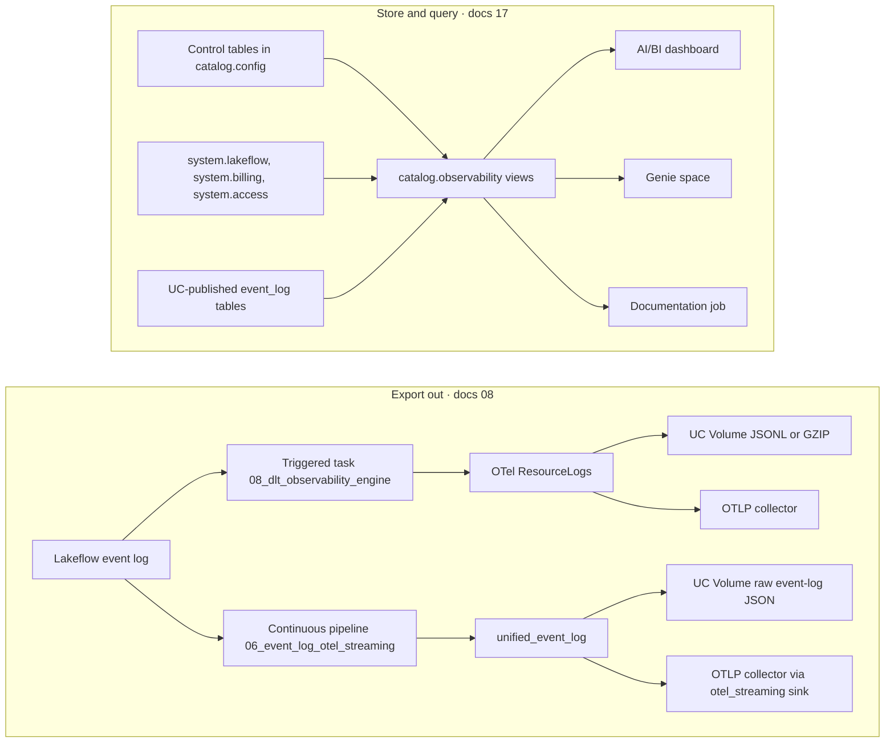

# :material-chart-timeline-variant: Pillar 4 · Observability

**Metaflow measures itself twice: it ships every pipeline event out of the platform as OpenTelemetry, and it keeps a queryable semantic layer inside the platform so the same facts can be asked in SQL, on a dashboard, or in plain English.**

!!! abstract "Quick links"
    - Attribute reference: [`observability[]`](../reference/json/observability.md) (every field, type, default and best practice)
    - Deep dive, export out: [08 · Observability and telemetry](../08_observability_and_telemetry.md)
    - Deep dive, store and query: [17 · Framework observability, AI/BI and Genie](../17_framework_observability_and_genie.md)
    - Console pages: [Observability dashboard](../console/observability_dashboard.md) · [Genie space](../console/genie.md) · [Control Metadata dashboard](../console/control_dashboard.md) · [Spec Builder](../console/spec_builder.md)
    - Traps: [13 · Known limitations and gotchas](../13_known_limitations_and_gotchas.md)

## At a glance

| Capability | Spec attributes or asset | Status | Deep dive |
|---|---|---|---|
| Volume export after each update | [`@observability[].type`](../reference/json/observability.md#observabilitytype) = `DATABRICKS_VOLUME`, [`volume_path`](../reference/json/observability.md#observabilitydestination-configvolume-path) | <span class="fx-badge fx-opt">Optional</span> | [08 §1.1](../08_observability_and_telemetry.md#11-triggered-mode) |
| OTLP export after each update | `type` = `OTLP_CONSUMER`, [`endpoint`](../reference/json/observability.md#observabilitydestination-configendpoint), [`auth`](../reference/json/observability.md#observabilityauthtype), [`retry`](../reference/json/observability.md#observabilityretrymax-attempts) | <span class="fx-badge fx-opt">Optional</span> | [08 §2](../08_observability_and_telemetry.md#21-destination-object-top-level-fields) |
| Always-on streaming export | [`@observability[].mode`](../reference/json/observability.md#observabilitymode) = `continuous`, [`event_log_tables`](../reference/json/observability.md#observabilitydestination-configevent-log-tables) | <span class="fx-badge fx-ver">v1.3.0+</span> | [08 §6](../08_observability_and_telemetry.md#6-continuous-mode) |
| Triggered-task parameter contract | Job task `base_parameters` (not a spec attribute) | <span class="fx-badge fx-ver">v1.4.0+</span> | [08 §1.1.1](../08_observability_and_telemetry.md#111-triggered-mode-run-parameters-v140) |
| OpenTelemetry mapping of Lakeflow events | `observability/otel_payload_builder.py` | <span class="fx-badge fx-opt">Optional</span> | [08 §3](../08_observability_and_telemetry.md#3-opentelemetry-event-mapping) |
| In-pipeline structured JSON logging | `observability/structured_logger.py` | Always on | [08 §4](../08_observability_and_telemetry.md#4-in-pipeline-structured-json-logging) |
| Telemetry error matrix and agent tools | `agent_skills/dlt_observability_tools.json` | Always on | [08 §7](../08_observability_and_telemetry.md#7-telemetry-error-handling-matrix) |
| `<catalog>.observability` semantic layer | `control_plane/observability_views.py`, no spec attribute | Provisioned by `01_setup` | [17 §4](../17_framework_observability_and_genie.md#4-the-11-views) |
| AI/BI observability dashboard (10 pages) | `databricks-bi/flowx_observability_dashboard.lvdash.json` | Bundle resource | [17 §5](../17_framework_observability_and_genie.md#5-the-aibi-dashboard) |
| Genie space | `databricks-genie/flowx_observability.geniespace.json` | Bundle resource | [17 §7](../17_framework_observability_and_genie.md#7-the-genie-space) |
| Per-group documentation job | `resources/flowx_docs/dataflow_documentation_job.yml` | Bundle resource | [17 §8](../17_framework_observability_and_genie.md#8-the-documentation-generator) |
| Alerting or paging engine | None shipped. Use Databricks SQL alerts or the OTLP consumer's rules | Not in Metaflow | [Heartbeats, thresholds and triage](#heartbeats-thresholds-and-triage) |

## How it works

Two halves, one source. Both read the Lakeflow event log; one reshapes and forwards individual events, the other aggregates them next to the control tables and the Databricks system tables.



- **Export out** is configured in the spec's root `observability[]` array and upserted into the `observability_config` control table by `onboarding/metadata_upsert.py::upsert_observability_config`. There is no separate observability config file.
- **Store and query** has no spec attribute at all. Section 5 of `notebooks/01_setup/01_setup_control_tables.py` provisions the schema and views; the join key every Metaflow pipeline already writes (`configuration['dataflow.group.id']`) does the rest.
- The two never overlap in output. A `num_output_rows` that left as an OTLP attribute cannot be summed; `v_flow_metrics` can. Cost is only in the second half. See [08 §8](../08_observability_and_telemetry.md#8-export-out-telemetry-vs-store-and-query-observability).

## Telemetry destinations

Three real combinations, one destination per tab. Each is a complete `observability[]` element as the offline validator accepts it. `mode` is what selects the engine; a destination is served by exactly one engine, never both.

=== "Volume · triggered"

    Exported once per pipeline update by the downstream job task. One `<dataflow_group_id>_<task_run_id>` file per run.

    ```json
    {
      "observability": [
        {
          "id": "dest-post-update-volume",
          "type": "DATABRICKS_VOLUME",
          "mode": "triggered",
          "enabled": true,
          "destination_config": {
            "volume_path": "/Volumes/poc/observability/telemetry/",
            "file_format": "JSONL",
            "compression": "GZIP"
          }
        }
      ]
    }
    ```

=== "OTLP · continuous"

    Streamed by the always-on pipeline. `event_log_tables` is mandatory here and rejected on a triggered destination.

    ```json
    {
      "observability": [
        {
          "id": "dest-continuous-otlp",
          "type": "OTLP_CONSUMER",
          "mode": "continuous",
          "enabled": true,
          "destination_config": {
            "endpoint": "https://otel-collector.example.com/v1/logs",
            "protocol": "OTLP_HTTP_JSON",
            "event_log_tables": [
              "observability.event_logs.orders_pipeline",
              "observability.event_logs.customers_pipeline"
            ]
          }
        }
      ]
    }
    ```

=== "Volume · continuous"

    <span class="fx-badge fx-ver">v1.3.0+</span> A native `dlt.create_sink(format="json")` fed from `unified_event_log`. Writes **raw event-log rows**, not OTel.

    ```json
    {
      "observability": [
        {
          "id": "dest-continuous-volume",
          "type": "DATABRICKS_VOLUME",
          "mode": "continuous",
          "enabled": true,
          "destination_config": {
            "volume_path": "/Volumes/poc/observability/streaming/",
            "event_log_tables": ["observability.event_logs.orders_pipeline"]
          }
        }
      ]
    }
    ```

Two continuous destinations naming the same event-log table still read it **once**: `config_loader.py::resolve_event_log_tables` de-duplicates the union before any `@dlt.view` is declared. See [08 §2.5](../08_observability_and_telemetry.md#25-copy-pasteable-example-all-three-real-combinations) and the legality matrix in [12 §5](../12_module_permutation_matrix.md#5-observability-mode-destination_type-trigger-source).

## Capabilities

### Destinations and modes

- [`id`](../reference/json/observability.md#observabilityid) <span class="fx-badge fx-req">Required</span> Unique within the spec; the upsert key into `observability_config.destination_id`. A duplicate is rejected.
- [`type`](../reference/json/observability.md#observabilitytype) <span class="fx-badge fx-req">Required</span> `DATABRICKS_VOLUME` or `OTLP_CONSUMER`.
- [`mode`](../reference/json/observability.md#observabilitymode) <span class="fx-badge fx-opt">Optional</span> <span class="fx-badge fx-ver">v1.3.0+</span> `triggered` (default) or `continuous`. Absent or `NULL` in the control table resolves to `triggered`, so pre-v1.3.0 rows need no migration.
- [`enabled`](../reference/json/observability.md#observabilityenabled) <span class="fx-badge fx-opt">Optional</span> Default `true`. A disabled row is dropped by `config_loader.py`; no downstream code ever sees it.
- [`destination_config`](../reference/json/observability.md#observabilitydestination-configvolume-path) <span class="fx-badge fx-req">Required</span> Shape depends on `type` and `mode`.

| `type` | Field | Rule |
|---|---|---|
| `DATABRICKS_VOLUME` | [`volume_path`](../reference/json/observability.md#observabilitydestination-configvolume-path) | Required. Must start with `/Volumes/`. |
| `DATABRICKS_VOLUME` | [`file_format`](../reference/json/observability.md#observabilitydestination-configfile-format) | `JSONL` (default) or `JSON`. |
| `OTLP_CONSUMER` | [`endpoint`](../reference/json/observability.md#observabilitydestination-configendpoint) | Required. Full `http://` or `https://` URL. |
| `OTLP_CONSUMER` | [`protocol`](../reference/json/observability.md#observabilitydestination-configprotocol) | `OTLP_HTTP_JSON`, `OTLP_HTTP_PROTO`, `OTLP_GRPC` accepted by the validator. `destination_dispatcher.py` posts a JSON body with `Content-Type: application/json` regardless; the schema's own comment says only `OTLP_HTTP_JSON` is implemented today. |
| `OTLP_CONSUMER` | [`resource_attributes`](../reference/json/observability.md#observabilitydestination-configresource-attributes) | String to string map, merged into every `ResourceLogs.resource.attributes`. A same-named key overrides the framework-built value. |
| both | [`compression`](../reference/json/observability.md#observabilitydestination-configcompression) | Exactly `GZIP`, `gzip`, `none` or `""`. `NONE` in upper case is rejected. |
| both | [`event_log_tables`](../reference/json/observability.md#observabilitydestination-configevent-log-tables) <span class="fx-badge fx-only">Continuous only</span> | Required when `mode` is `continuous`; rejected when `triggered`. Every entry is a three-part `catalog.schema.table`. |

??? note "Why the triggered engine rejects `event_log_tables` instead of ignoring it"
    The triggered engine resolves its pipeline from the upstream task run, so a table list there would be silently meaningless. `spec_validator.py::_validate_observability_event_log_tables` reports it against the destination path. Verbatim: `observability[0].destination_config.event_log_tables: only meaningful when mode is 'continuous', but this destination's mode is 'triggered' (the triggered engine resolves its pipeline from the upstream task run)`. The cross-field rule is listed as rejection 19 in [14 §4.3](../14_onboarding_restrictions_and_validation_rules.md#43-cross-field-rejections).

### Triggered export: the four-parameter contract

<span class="fx-badge fx-ver">v1.4.0+</span> The engine is an ordinary Workflow notebook task, `notebooks/08_observability/08_dlt_observability_engine.py`, chained after a `pipeline_task` with `depends_on`.

- Four **required** `base_parameters`: `dataflow_group_id`, `catalog`, `env`, `pipeline_task_run_id`. `observability/runtime_params.py::resolve_triggered_run_parameters` validates all four before a `WorkspaceClient` exists. Every missing parameter is reported at once.
- `pipeline_task_run_id` is `{{tasks.<pipeline_task_key>.run_id}}`, a Jobs dynamic value reference. It is a **task** parameter. It must not be declared in the pipeline's `configuration:` or `pipeline_parameters`; there is no job run for it to resolve against there.
- A mistyped task key does not fail on its own. The Jobs service passes the literal `{{tasks.typo.run_id}}` text through. `runtime_params.py` checks for exactly that and names the fix.
- `dataflow_group_id` is declared, then cross-checked against the observed pipeline's `dataflow.group.id`. A disagreement raises and names both. This is what catches a copy-pasted block still pointing at the job it came from.
- Optional: `service_name` (default `dlt-observability`), `fail_task_on_dispatch_error` (default `true`), `narrow_to_task_updates` (default `true`).

??? info "Update narrowing"
    The task's wall-clock window can contain two updates (a retry, or a manual update racing the schedule). `event_log_extractor.py::resolve_update_ids_for_window` asks the Pipelines API which updates were created inside the window and adds `origin.update_id IN (...)` to the query. It is best-effort: an API failure or an empty result logs a `WARNING` and falls back to the window-only query. Set `narrow_to_task_updates` to `"false"` to disable it. See [08 §5](../08_observability_and_telemetry.md#5-triggered-mode-update-narrowing).

### Continuous export

<span class="fx-badge fx-ver">v1.3.0+</span> <span class="fx-badge fx-only">Continuous only</span> `notebooks/06_observability_streaming/06_event_log_otel_streaming_pipeline.py`, deployed by `resources/observability/observability_otel_streaming_pipeline.yml` as a `continuous: true` pipeline. It observes *other* pipelines' event logs.

- Table list resolution, in order: `observability_config` rows with `mode = 'continuous'` for this pipeline's `dataflow.group.id` (requires both `dataflow.group.id` and `dataflow.control.catalog` in the pipeline `configuration:`), then the `dataflow.otel_streaming.event_log_tables` pipeline configuration key as a permanent bootstrap fallback. Neither yields a table: the pipeline fails at graph definition with a message that names both options.
- One `@dlt.view` per table (`spark.readStream.table`), tagged `source_pipeline`, unioned with `unionByName` into `unified_event_log`. A schema mismatch surfaces as a `FrameworkConfigError` naming every view.
- **Volume sink**: one `dlt.create_sink(format="json", options={"path": volume_path})` per continuous `DATABRICKS_VOLUME` destination, each with its own `@dlt.append_flow`. A destination missing `volume_path` is skipped with a `WARNING`; one bad destination never takes down the export serving the others.
- **OTLP sink**: the custom `otel_streaming` Lakeflow sink, gated by `dataflow.otel_streaming.otel_export_enabled`, posting to `dataflow.otel_streaming.otel_endpoint`. Its payload builder is `build_resource_logs_from_event_rows`: one flat `databricks.event_log.<column>` attribute per row column plus `service.name`, a row dump rather than the curated mapping below.

!!! warning "What the continuous destination row does and does not control"
    In continuous mode the destination row supplies `event_log_tables` (and `volume_path` for a Volume sink). The OTLP endpoint comes from the pipeline's `dataflow.otel_streaming.otel_endpoint` key, and `otel_streaming_sink.py` has **no auth option**: its `auth_config` is always empty. `auth`, `retry` and `timeout_ms` are honoured by the **triggered** dispatcher only. See [08 §6.1.1](../08_observability_and_telemetry.md#611-resolution-order) and [08 §6.2](../08_observability_and_telemetry.md#62-two-sinks-fed-from-the-same-stream).

### Authentication and credential references

<span class="fx-badge fx-only">OTLP only</span> [`auth`](../reference/json/observability.md#observabilityauthtype) is read by `destination_dispatcher.py::build_auth_headers`. It is ignored for `DATABRICKS_VOLUME`, which relies on Unity Catalog permissions.

| [`auth.type`](../reference/json/observability.md#observabilityauthtype) | [`auth.credentials`](../reference/json/observability.md#observabilityauthcredentials) shape |
|---|---|
| `BEARER_TOKEN` | `{"token": <ref>}` |
| `API_KEY` | `{"header_name": "<plain string>", "api_key": <ref>}` |
| `BASIC_AUTH` | `{"username": <ref>, "password": <ref>}` |
| `NONE` | no credentials |

Every `<ref>` must match `env:<VAR_NAME>` or `secret:<scope>:<key>` (`_CREDENTIAL_REF_PATTERN` in `spec_validator.py`). A literal secret value is a validation error, always. `env:` reads an environment variable at dispatch time; `secret:` resolves through `dbutils.secrets.get(scope, key)`. A missing variable or secret raises `ObservabilityConfigError` before any HTTP call.

=== "JSON"

    ```json
    {
      "observability": [
        {
          "id": "dest-otlp-collector",
          "type": "OTLP_CONSUMER",
          "destination_config": {
            "endpoint": "https://otel-collector.internal.net:4318/v1/logs",
            "protocol": "OTLP_HTTP_JSON",
            "compression": "gzip",
            "resource_attributes": {
              "service.name": "dlt-observability-orders",
              "deployment.environment": "dev"
            }
          },
          "auth": {
            "type": "BEARER_TOKEN",
            "credentials": { "token": "secret:otel/collector:bearer_token" }
          },
          "retry": { "max_attempts": 5, "backoff_multiplier": 2.0 },
          "timeout_ms": 5000
        }
      ]
    }
    ```

=== "YAML"

    ```yaml
    observability:
      - id: dest-otlp-collector
        type: OTLP_CONSUMER
        destination_config:
          endpoint: https://otel-collector.internal.net:4318/v1/logs
          protocol: OTLP_HTTP_JSON
          compression: gzip
          resource_attributes:
            service.name: dlt-observability-orders
            deployment.environment: dev
        auth:
          type: BEARER_TOKEN
          credentials:
            token: "secret:otel/collector:bearer_token"
        retry:
          max_attempts: 5
          backoff_multiplier: 2.0
        timeout_ms: 5000
    ```

### Retry, timeout and compression

<span class="fx-badge fx-only">OTLP only</span> for retry and timeout; compression applies to both types.

- [`retry.max_attempts`](../reference/json/observability.md#observabilityretrymax-attempts) integer ≥ 1, default `3`. [`retry.backoff_multiplier`](../reference/json/observability.md#observabilityretrybackoff-multiplier) number > 1, default `2.0`.
- Delay before attempt *n+1* is `1s × multiplier^(n-1)`, capped at **30 s** (`MAX_BACKOFF_DELAY_SECONDS`). A `Retry-After` header overrides the computed delay, also capped at 30 s.
- Retried HTTP statuses: `429, 500, 502, 503, 504`. Network and timeout exceptions retry the same way. Any other status stops immediately.
- [`timeout_ms`](../reference/json/observability.md#observabilitytimeout-ms) integer ≥ 1, default `5000`. It sits at the destination's top level in the spec but is folded into `retry_config_json` by `upsert_observability_config`.
- `compression: GZIP` gzips the body and sets `Content-Encoding: gzip`; for a Volume it gzips the file.
- A failed dispatch returns a `DispatchResult(status="FAILED", error=...)`. With `fail_task_on_dispatch_error` at its default `true`, the task fails after every destination has been attempted.

### OpenTelemetry mapping of Lakeflow events

The triggered engine's `otel_payload_builder.py::build_resource_logs` turns raw event-log rows into OTel `ResourceLogs` with three curated record kinds.

| Lakeflow field | OTel field |
|---|---|
| `timestamp` | `Timestamp` (epoch nanoseconds) |
| `level` (`INFO`, `WARN`, `ERROR`) | `SeverityText` / `SeverityNumber` |
| `message` | `Body.stringValue` |
| record kind | `Attributes["event.name"]`: `flow_performance_summary`, `data_quality_expectation`, `pipeline_error` |
| `details.flow_progress.status`, `.metrics.num_output_rows` | `flow.status`, `flow.num_output_rows`, plus `flow.num_upserted_rows`, `flow.num_deleted_rows`, `flow.dropped_records`, `flow.duration_ms`, `flow.backlog_bytes`, `flow.backlog_files` |
| `details.flow_progress.data_quality.expectations[]` | `expectation.name`, `expectation.dataset`, `expectation.passed_records`, `expectation.failed_records` |
| error events | `error.event_type`, `error.level`, `error.fatal`, `error.class_name`, `error.stack_trace` |
| run context | `Resource.Attributes`: `databricks.pipeline_id`, `databricks.job_id`, `databricks.task_run_id`, `databricks.dataflow_group_id`, `databricks.dataflow_id`, `databricks.step_id`, `service.name`, `deployment.environment` |

- `origin.flow_name` is used for keying but is not emitted as an attribute.
- An empty window emits one record with `event.name = no_flow_events_in_window` and `window.total_events`, so a silent run is still visible at the collector.
- This mapping is the **triggered** engine's only. The continuous OTLP sink dumps raw columns as `databricks.event_log.<column>`; the continuous Volume sink writes raw rows. See [08 §3](../08_observability_and_telemetry.md#3-opentelemetry-event-mapping).

### In-pipeline structured JSON logging

`flowx.lakeflow_framework.observability.structured_logger` is the framework's own operational log line, used at every wiring point (`engine/flow_registration.py`, `engine/sink_registration.py`, `dq/quarantine.py`, `reconciliation/appender.py`, `control_plane/post_deployment.py`).

- `log_flow_event(operation, flow_id, status, records_read=None, records_written=None, records_rejected=None, records_quarantined=None, duration_ms=None, error=None, **extra)` emits one JSON line. Anything in `**extra` is merged into the payload.
- `logged_operation(operation, flow_id, **extra)` is a context manager: it times the block, emits `SUCCESS` on exit or `FAILED` with `error=str(exc)` on exception, then **re-raises the original exception unchanged**. Logging never masks a processing error.
- `operation` is a free string label, not an enum. New operations are new literals at the call site.

```python
from flowx.lakeflow_framework.observability.structured_logger import log_flow_event

log_flow_event(
    operation="SCHEMA_DRIFT_DETECTED",
    flow_id="df_orders_bronze",
    status="WARN",
    records_read=12_000,
    new_columns=["loyalty_tier"],
)
```

These lines land in the driver log. They are not exported by either engine and are not in any view. See [08 §4](../08_observability_and_telemetry.md#4-in-pipeline-structured-json-logging).

### Telemetry error matrix and agent tools

`observability/agent_tools.py::_FAILURE_MATRIX` encodes six categories: `task_wiring`, `pipeline_config`, `destination_config`, `credentials`, `destination_outage`, `event_log_access`. [08 §7](../08_observability_and_telemetry.md#7-telemetry-error-handling-matrix) adds the three v1.3.0 mode rows (`mode_mismatch`, `missing_event_log_tables`, `nothing_to_stream`).

| Category | Symptom | Fix |
|---|---|---|
| `task_wiring` | `ObservabilityConfigError` from `task_context_resolver.py`: not a `pipeline_task` run, or no start/end time yet | `depends_on` the pipeline task; pass `{{tasks.<key>.run_id}}` |
| `pipeline_config` | Onboarding validation error on `observability[]` | Run `validate_observability_config` |
| `destination_config` | `volume_path` not under `/Volumes/`; non-raising `DispatchResult(error=...)` | Fix the path or endpoint |
| `credentials` | `401` / `403` | Check the secret with `databricks secrets get-secret` |
| `destination_outage` | `503` / `ConnectionTimeout` | Collector health; raise `timeout_ms`, `retry.max_attempts` |
| `event_log_access` | `PermissionDenied` on the event log | Grant `SELECT` to the running principal |

Three pure-Python tools, declared in `agent_skills/dlt_observability_tools.json` in OpenAI function-calling shape (the file notes the LangChain and Semantic Kernel equivalents) and implemented in `flowx.lakeflow_framework.observability.agent_tools`:

- `validate_observability_config(config_text, catalog="", env="")` lints an `{"observability": [...]}` JSON or YAML fragment, substituting `{{catalog}}` and `{{env}}` first. Returns `{valid, errors[], summary}`.
- `generate_pipeline_onboarding_config(dataflow_group_id, destination_targets, service_name=None, deployment_environment=None)` builds the array from `template: databricks_volume | otlp_http` descriptors; each accepts an optional `mode`, and `continuous` requires `event_log_tables`. Pass the result through the validator, then merge it into the spec.
- `diagnose_pipeline_telemetry_failures(error_message)` matches a failed task's error text against the matrix and returns `{matched, category, likely_cause, remediation}`. `matched=False` means a genuinely new failure mode.

See the [agent skills console page](../console/agent_skills.md) for how these are loaded.

### The semantic layer: views and the join key

`<catalog>.observability` is a grant boundary. Granting `SELECT` on the schema gives a BI user or Genie the derived facts without exposing the `*_json` and `raw_spec_payload` columns in `<catalog>.config`. Column `COMMENT`s are the semantic model Genie reads; they are load-bearing.

- **Join key, pipelines**: `p.configuration['dataflow.group.id']`, which every Metaflow pipeline resource already sets. `v_pipeline_registry` computes it once, filters `IS NOT NULL` and `delete_time IS NULL`, and every other view joins through it.
- **Join key, jobs**: `system.lakeflow.jobs.tags['dataflow_group_id']` (`attribution = 'tag'`, exact), else a case-insensitive name match (`'name_match'`, heuristic), else `NULL`. Cost is attributed by tag only. Notebook `base_parameters` do not surface in `job_task_run_timeline`, which is why the tag exists. [17 §3.2](../17_framework_observability_and_genie.md#32-jobs-not-free-and-why-a-tag-was-needed)
- **Event log location is discovered**, not constructed: `system.lakeflow.pipelines.settings` has no `catalog` or `target`, so `01_setup` joins `system.information_schema.tables` on `event_log_<pipeline_id>`. [17 §3.3](../17_framework_observability_and_genie.md#33-event-log-location-is-discovered-not-constructed)

| # | View | Grain | Reads |
|---|---|---|---|
| 1 | `v_dataflow_group_catalog` | one row per group; `has_cdc`, `has_dq`, `feature_summary` | control tables |
| 2 | `v_flow_inventory` | one row per flow, all three kinds | control tables |
| 3 | `v_pipeline_registry` | one row per Metaflow pipeline | `system.lakeflow.pipelines` + `information_schema` |
| 4 | `v_pipeline_updates` | one row per update; `is_success`, `is_failure`, `is_retry`, `is_full_refresh`, `duration_minutes` | `pipeline_update_timeline` |
| 5 | `v_job_runs` | one row per job run with `attribution` and the queue/setup/execution split | `jobs`, `job_run_timeline` |
| 6 | `v_dataflow_cost` | group × date × workload × SKU; `dbus`, `estimated_cost_usd` at list price | `system.billing.*` |
| 7 | `v_flow_metrics` | update × flow; `rows_written`, `rows_upserted`, `rows_deleted`, `rows_dropped` | UC event logs |
| 8 | `v_dq_results` | update × flow × expectation; `passed_records`, `failed_records`, `pass_rate_pct`, `has_failures` | UC event logs |
| 9 | `v_reconciliation_health` | one row per recon run; `has_run_history`, `match_rate_pct`, `is_clean` | `reconciliation_flow_spec` ⟕ `reconciliation_run_log` |
| 10 | `v_dataflow_lineage` | observed source → target edge | `system.access.table_lineage` |
| 11 | `v_group_health_summary` | one row per group, rolling 30 days, `health_status` | views 1, 4, 6, 7, 8, 9 |

??? note "A twelfth DDL: `v_deployment_versions`"
    `get_all_observability_view_ddls` returns twelve statements. The eleven above are the ones [17 §4](../17_framework_observability_and_genie.md#4-the-11-views) documents; the twelfth, `v_deployment_versions`, reports which framework wheel each group last ran (`wheel_version`, `is_on_latest_wheel`, `wheel_status`, `versions_behind`) parsed from the event log, plus the orchestrating job's `job_attribution`. It is consumed by the Control Metadata dashboard, not by the observability dashboard or the Genie space.

??? info "Prerequisites, and what breaks when each is missing"
    - `SELECT` on `system.lakeflow.*`, `system.billing.*`, `system.access.table_lineage`: without it the views are created but **error at query time**. Red widgets.
    - A pipeline publishing its event log to Unity Catalog: without it `v_flow_metrics` and `v_dq_results` are created over a typed empty relation. Blank widgets, not broken ones. Re-run `01_setup` after the first update publishes a log, because the table list is baked in at DDL-build time.
    - The `dataflow_group_id` job tag, redeployed: without it job runs fall to `name_match` and job cost is not attributed. Historical runs never gain the tag.
    - `logging_config.run_log_capture: true` on the recon flow: without it `has_run_history = FALSE`. Zero discrepancies is then "cannot tell", not "clean".
    Full table: [17 §9](../17_framework_observability_and_genie.md#9-prerequisites-and-exactly-what-breaks-when-they-are-unmet).

### Dashboard, Genie and AI_FORECAST

**AI/BI dashboard.** `databricks-bi/flowx_observability_dashboard.lvdash.json`, deployed as `flowx_observability_dashboard` ("Metaflow Framework Observability") with `dataset_schema: observability`. Ten pages, fifteen datasets:

| Page | Reads | Answers |
|---|---|---|
| Overview | `v_group_health_summary`, `v_pipeline_updates`, `v_flow_metrics`, `v_flow_inventory` | 8 counters, updates by outcome, rows by group, scorecard |
| Pipeline Performance | `v_pipeline_updates` | volume vs duration, retries counted separately |
| Data Flow & Throughput | `v_flow_metrics` | rows written, upserted, dropped by DQ |
| Quality & Reconciliation | `v_dq_results`, `v_reconciliation_health` | pass/fail per rule, dataset × rule heatmap, recon runs |
| Cost & Efficiency | `v_dataflow_cost`, `v_group_health_summary` | daily cost, share of spend, cost vs rows |
| Framework & Lineage | `v_flow_inventory`, `v_dataflow_lineage` | flows per group, load strategies, source → target sankey |
| AI Forecast | `system.billing.usage`, `system.billing.list_prices`, `v_pipeline_updates` | hourly spend and run-volume forecasts, `observed_hours` |
| Job Orchestration | `v_job_runs` | success rate, queue time, phase split, `attribution` |
| Zerobus Streaming | `v_job_runs`, `v_pipeline_updates` | producer/consumer job runs by role and outcome, CDC update duration trend |
| Global Filters | `v_dataflow_group_catalog` | Dataflow Group, Date range, Environment across the bound datasets |

Bare view names in the queries resolve to `<dataset_catalog>.observability.<name>`; three-part `system.*` names pass through untouched. Two unit tests reject a hard-coded catalog. [17 §5.1](../17_framework_observability_and_genie.md#51-dataset_schema-observability-and-the-two-part-name-subtlety)

**Genie space.** `databricks-genie/flowx_observability.geniespace.json`, deployed as `flowx_observability_genie_space`. Fifteen data sources: the eleven views, `config.onboarding_audit_log`, `config.reconciliation_mismatch_log`, `system.billing.usage`, `system.billing.list_prices`. Twelve example question/SQL pairs, twelve sample questions, four benchmarks. Sample questions include *"Which dataflow groups are unhealthy, and why?"*, *"Which data quality rules are failing and on which datasets?"*, *"Forecast our framework spend for the next two days"*.

??? warning "Genie serialized format and the literal catalog"
    `version: 2`; every human-readable string is an array of lines; `data_sources.tables` sorted by identifier and every other repeated block sorted by `id`. The API hard-rejects an unsorted array. Table identifiers are three-part with the catalog spelled literally (`flowx.observability.v_...`), so deploying to another catalog means editing them. Pull UI edits back with `databricks bundle generate genie-space --resource flowx_observability_genie_space --force`. [17 §7.2](../17_framework_observability_and_genie.md#72-the-serialized-format-three-hard-requirements)

**AI_FORECAST, four rules.** Encoded in the dashboard SQL and the Genie instructions. Break one and the function returns a well-formed absurd number with a confidence band; the first daily-grain attempt projected ten billion DBUs from three points.

1. Hourly grain, never daily: `date_trunc('HOUR', ...)`.
2. Exclude the current, partly-elapsed bucket: `WHERE usage_start_time < date_trunc('HOUR', current_timestamp())`.
3. Always pass `parameters => '{"global_floor": 0}'`.
4. Report the band and `observed_hours`, never the point forecast alone.

The three forecast datasets are deliberately not filter-bound. [17 §6.2](../17_framework_observability_and_genie.md#62-the-four-rules)

### Per-group documentation job

`dataflow_documentation_job` (`resources/flowx_docs/dataflow_documentation_job.yml`) runs `notebooks/09_documentation/09_dataflow_documentation.py`, which renders through the pure functions in `observability/dataflow_documenter.py`. The batch counterpart to Genie, reading the same views so the two cannot disagree.

- Parameters: `catalog` (default `${var.catalog}`), `dataflow_group_id` (blank means every group), `output_volume` (blank derives `/Volumes/<catalog>/config/framework_docs/dataflow_groups`), `lookback_days` (`30`).
- Output: one Markdown design document per group plus a `README.md` index, written with `dbutils.fs.put(..., overwrite=True)` into the `framework_docs` Volume.
- Eight sections: purpose and scale, capabilities exercised, flows, data quality, reconciliation, operational behaviour, observed lineage, published tables.
- Degrade, do not fail: only a missing or empty `v_dataflow_group_catalog` is fatal. Every operational view goes through `optional_rows()`, so a workspace without a system-table grant still gets the declarative half.
- It reads the control tables, not the spec files. When the two disagree the document is right and the spec is stale.

### Heartbeats, thresholds and triage

What exists, exactly:

- **Pipeline heartbeat**: `v_pipeline_updates` carries one row per update with `result_state` (`COMPLETED`, `FAILED`, `CANCELED`; `NULL` while running), `is_success`, `is_failure`, `is_retry`, `started_at`, `ended_at`. `v_group_health_summary` rolls it up: `last_update_at`, `last_update_state`, `failed_updates`, `retry_updates`, `success_rate_pct`, `p95_duration_minutes`.
- **DQ thresholds**: a `dq_config` rule's `action` is `warn`, `drop`, `quarantine` or `fail`. `fail` maps to `expect_or_fail`; one violating row stops the whole update and leaves every downstream table unwritten ([13 · Q1](../13_known_limitations_and_gotchas.md#q1-action-fail-fails-the-entire-pipeline-update)). Every rule's per-update outcome is in `v_dq_results` (`rule_name`, `passed_records`, `failed_records`, `pass_rate_pct`, `has_failures`), provided the pipeline publishes its event log.
- **Reconciliation thresholds** <span class="fx-badge fx-ver">v1.5.0+</span>: a reconciliation flow's `dq_config` attaches expectations to its one-row `__metrics` dataset, e.g. `value_drift_count = 0` with `action: "fail"`. This is the declarative way a threshold fails an update. `quarantine` is rejected there, and the block is rejected under `execution_mode: "job"`. Outcomes roll into `v_reconciliation_health` (`total_discrepancies`, `is_clean`, `has_run_history`) and `v_group_health_summary.recon_discrepancies`.
- **Health verdict**: `v_group_health_summary.health_status` is `INACTIVE`, `NO_RUNS`, `FAILING` (most recent update failed), `DEGRADED` (any failed update, DQ failed record or recon discrepancy in 30 days) or `HEALTHY`, evaluated in that order.
- **Triage**: paste a failed `observability_export` error into `diagnose_pipeline_telemetry_failures`; for a failed pipeline update, `v_pipeline_updates` gives the `update_id` and `pipeline_id` to open in the Lakeflow UI.

!!! danger "Metaflow ships no alerting or paging engine"
    Nothing in the framework fires a notification, opens an incident or evaluates a schedule. Alerting is built **on top of** these surfaces: a Databricks SQL alert over a view, or the OTLP consumer's own rules (Dynatrace, Datadog, Splunk, an OTel Collector) over the exported `ResourceLogs`. The views make the first route a five-minute job.

Example Databricks SQL alert over the scorecard. Condition: row count greater than 0.

```sql
SELECT
  dataflow_group_id,
  health_status,
  last_update_state,
  last_update_at,
  failed_updates,
  dq_failed_records,
  recon_discrepancies
FROM flowx.observability.v_group_health_summary
WHERE health_status IN ('FAILING', 'DEGRADED')
ORDER BY CASE health_status WHEN 'FAILING' THEN 0 ELSE 1 END, dataflow_group_id
```

For a tighter heartbeat, alert on `v_pipeline_updates` where `is_failure` and `started_at >= current_timestamp() - INTERVAL 1 DAY`, or on a group whose `last_update_at` is older than its schedule allows. Replace `flowx` with the target's catalog.

## Operational runbook

1. **Author the destinations.** Add `observability[]` to the group's spec. Lint offline with `validate_observability_config`, or with the Spec Builder's Observability tab, then onboard through `onboarding_job` or `framework_config_onboarding_job`. The row lands in `<catalog>.config.observability_config`.

2. **Wire the triggered task.** Copy this block into the job that runs the group's pipeline. The pipeline resource itself does not change.

    ```yaml
    - task_key: observability_export
      depends_on:
        - task_key: run_pipeline_update          # this job's pipeline_task
      notebook_task:
        notebook_path: ../../notebooks/08_observability/08_dlt_observability_engine.py
        base_parameters:
          dataflow_group_id: dfg_uc6_ea_flood_warning
          catalog: flowx
          env: dev
          pipeline_task_run_id: "{{tasks.run_pipeline_update.run_id}}"
      environment_key: framework_env
    ```

    `resources/uc6/uc6_ea_flood_warning_job.yml` and `resources/uc7/uc7_cdr_asn_job.yml` carry exactly this `run_pipeline_update -> observability_export` pair, plus the `dataflow_group_id` job tag the views need.

3. **Run it.** `databricks bundle deploy -t <target>` then `databricks bundle run uc6_ea_flood_warning_job -t <target>`. The reference job `dlt_observability_job` in `resources/observability/dlt_observability_job.yml` is the annotated template; its include line is commented out in `databricks.yml` (`#  - resources/observability/*.yml`), so uncomment it before `databricks bundle run dlt_observability_job -t <target>`. Never deploy while an update is running ([13 · O1](../13_known_limitations_and_gotchas.md#o1-never-bundle-deploy-while-a-pipeline-update-is-running)).

4. **Continuous export, if used.** Set `dataflow.group.id` and `dataflow.control.catalog` in `resources/observability/observability_otel_streaming_pipeline.yml`, keep `dataflow.otel_streaming.otel_endpoint` and `otel_export_enabled` for the OTLP sink, then `databricks bundle run observability_otel_streaming_pipeline -t <target>`. Databricks keeps a continuous pipeline running; no job wraps it. A new `event_log_tables` entry is a spec upsert picked up on the next restart, not a redeploy.

5. **Provision the semantic layer.** Run `framework_config_onboarding_job`; its `setup_control_tables` task executes `notebooks/01_setup/01_setup_control_tables.py`, whose section 5 creates `<catalog>.observability` and the views from `get_all_observability_view_ddls`. Non-fatal by design. Re-run after a pipeline first publishes its event log to UC so `v_flow_metrics` and `v_dq_results` pick it up ([17 §9.1](../17_framework_observability_and_genie.md#91-re-provisioning)).

6. **Deploy the consumers.** `resources/flowx_bi`, `resources/flowx_genie` and `resources/flowx_docs` are in the bundle's `include:` list, so `databricks bundle deploy -t <target>` publishes the dashboard, the Genie space and the documentation job. Then `databricks bundle run dataflow_documentation_job -t <target>` (add `--params dataflow_group_id=<group>` for one group).

7. **Verify.**

    ```sql
    SELECT dataflow_group_id, health_status, total_updates, last_update_state, last_update_at
    FROM flowx.observability.v_group_health_summary
    ORDER BY last_update_at DESC;

    SELECT dataflow_group_id, update_id, result_state, duration_minutes, is_retry
    FROM flowx.observability.v_pipeline_updates
    WHERE run_date >= current_date() - 7
    ORDER BY started_at DESC;
    ```

    For the export side, list the Volume path for a `<dataflow_group_id>_<task_run_id>` file, or check the collector for `event.name = flow_performance_summary` records carrying `databricks.dataflow_group_id`.

## Where to see it

- [Observability dashboard](../console/observability_dashboard.md): the ten pages above, filtered by Dataflow Group, Date range and Environment.
- [Genie space](../console/genie.md): ask the twelve sample questions or your own; answers come from the same views.
- [Control Metadata dashboard, Observability & Audit page](../console/control_dashboard.md): the `observability_config` rows as onboarded, and `v_deployment_versions` wheel drift.
- [Spec Builder, Observability tab](../console/spec_builder.md): authors the `observability[]` array with the same allowed values the validator enforces.

## Gotchas

| | Trap | Fix | Link |
|---|---|---|---|
| 🟡 | A destination's `mode` decides which engine serves it. Wrong mode: never exported, or exported twice if both engines run | Match `mode` to the engine you actually run; the triggered job filters to `triggered`, the streaming pipeline to `continuous` | [13 · G3](../13_known_limitations_and_gotchas.md#g3-a-destinations-mode-decides-which-engine-serves-it) |
| 🟠 | A mistyped `{{tasks.<key>.run_id}}` is passed through as literal text by the Jobs service | `runtime_params.py` fails the task at start and names the key; correct `task_key` to the `depends_on` pipeline task | [08 §1.1.1](../08_observability_and_telemetry.md#111-triggered-mode-run-parameters-v140) |
| 🟡 | A continuous `DATABRICKS_VOLUME` destination writes raw event-log JSON, not OTel `ResourceLogs` | Only `OTLP_CONSUMER` produces `ResourceLogs`; read the Volume archive back with Spark using native columns | [08 §6.2](../08_observability_and_telemetry.md#62-two-sinks-fed-from-the-same-stream) |
| 🟠 | No `SELECT` on the `system` catalog: views exist, every system-backed widget errors | Grant `SELECT` on `system.lakeflow`, `system.billing`, `system.access`; re-run `01_setup` | [17 §9](../17_framework_observability_and_genie.md#9-prerequisites-and-exactly-what-breaks-when-they-are-unmet) |
| 🔵 | Pipeline publishes no UC event log: `v_flow_metrics` and `v_dq_results` are empty, not broken | Set the pipeline's event log destination, run one update, re-run `01_setup` | [17 §9.1](../17_framework_observability_and_genie.md#91-re-provisioning) |
| 🔴 | `has_run_history = FALSE` with zero discrepancies reads as clean; it means "cannot tell" | Enable `logging_config.run_log_capture` with a `publish_schema`; filter on `has_run_history` first | [17 §4.9](../17_framework_observability_and_genie.md#49-v_reconciliation_health-and-has_run_history) |
| 🔴 | `AI_FORECAST` on a daily series returns a confidently absurd number with no error | Hourly grain, exclude the current bucket, `global_floor: 0`, show the band and `observed_hours` | [17 §6](../17_framework_observability_and_genie.md#6-ai_forecast-the-four-rules-and-the-ten-billion-dbu-cautionary-tale) |
| 🔴 | Hand-rolled event-log SQL that dedups by `event_time DESC` alone reports `RUNNING` with partial counts | Order terminal statuses first, then time, as `v_flow_metrics` does | [17 §10.4](../17_framework_observability_and_genie.md#104-flow_status-running-with-a-partial-row-count-newest-terminal) |

Two more worth knowing from docs 13: a module loaded from a job task must not transitively `import dlt` ([O8](../13_known_limitations_and_gotchas.md#o8-a-module-loaded-from-a-job-task-must-not-transitively-import-dlt), fixed in v1.6.1), and streaming flows never report `num_output_rows` in the event log, so a zero-row streaming flow is invisible to `v_flow_metrics` ([O9](../13_known_limitations_and_gotchas.md#o9-a-rate-source-pulse-is-a-race-the-per_update-export-trigger-uses-rate-micro-batch)).

## Related

- Sibling pillars: [Ingestion](ingestion.md) · [Transformation](transformation.md) · [Reconciliation](reconciliation.md) · [Pillars hub](index.md)
- [08 · Observability and telemetry](../08_observability_and_telemetry.md), the export-out reference
- [17 · Framework observability, AI/BI and Genie](../17_framework_observability_and_genie.md), the store-and-query reference
- [12 §5 · Observability permutations](../12_module_permutation_matrix.md#5-observability-mode-destination_type-trigger-source)
- [14 §2.5 · `observability[]` validation rules](../14_onboarding_restrictions_and_validation_rules.md#25-observability)
- [Attribute reference · `observability[]`](../reference/json/observability.md)
- [Agent skills console page](../console/agent_skills.md)
