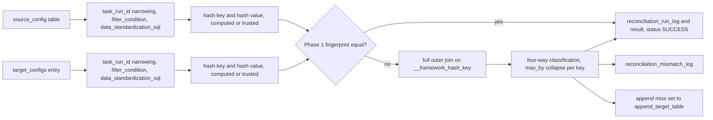
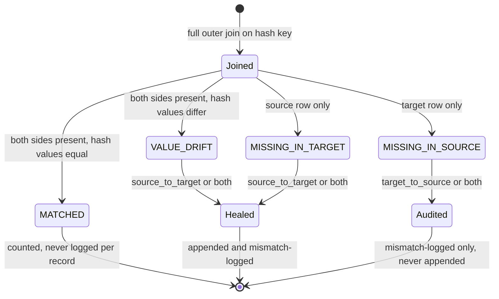

# :material-scale-balance: Pillar 3 · Reconciliation

**Prove that two Delta tables agree as of now, log every record that does not, and append the correction where the next update will pick it up.**

!!! abstract "Quick links"
    - Attribute reference: [`reconciliation_flows[]`](../reference/json/reconciliation.md)
    - Deep dive: [07 Reconciliation and Self-Healing Engine](../07_reconciliation_engine.md)
    - Console: [Spec Builder](../console/spec_builder.md) · [Control Metadata dashboard](../console/control_dashboard.md) · [Observability dashboard](../console/observability_dashboard.md) · [Genie](../console/genie.md)
    - Traps: [Known limitations, reconciliation section](../13_known_limitations_and_gotchas.md#reconciliation)

## At a glance

| Capability | Spec attributes | Status | Deep dive |
|---|---|---|---|
| Flow anatomy: one source, N targets | [`reconciliation_id`](../reference/json/reconciliation.md#reconciliation-id) · [`source_config.table`](../reference/json/reconciliation.md#source-configtable) · [`target_configs`](../reference/json/reconciliation.md#target-configs) · [`match_keys`](../reference/json/reconciliation.md#match-keys) · [`compare_columns`](../reference/json/reconciliation.md#compare-columns) | <span class="fx-badge fx-req">Required</span> | [07 §3](../07_reconciliation_engine.md#3-configuration-schema) |
| Hash-first diffing | [`source_config.hash_precomputed`](../reference/json/reconciliation.md#source-confighash-precomputed) · [`target_configs[].hash_precomputed`](../reference/json/reconciliation.md#target-configshash-precomputed) | <span class="fx-badge fx-opt">Optional</span> | [07 §9](../07_reconciliation_engine.md#9-hash_precomputed-exact-mechanics) · [11 §2](../11_hashing_and_determinism.md#2-the-exact-construction) |
| Two-tier verification | [`two_tier_verification`](../reference/json/reconciliation.md#two-tier-verification) | <span class="fx-badge fx-opt">Optional</span> <span class="fx-badge fx-ver">v1.3.0+</span> | [07 §4](../07_reconciliation_engine.md#4-two-tier-verification-phase-1-phase-2) |
| Four drift categories, mismatch schema | [`logging_config.mismatch_log_capture`](../reference/json/reconciliation.md#logging-configmismatch-log-capture) | <span class="fx-badge fx-opt">Optional</span> | [07 §10](../07_reconciliation_engine.md#10-drift-categories-diagnostic-mismatch-schema) |
| Self-healing append | [`target_configs[].comparison_direction`](../reference/json/reconciliation.md#target-configscomparison-direction) · [`target_configs[].append_target_table`](../reference/json/reconciliation.md#target-configsappend-target-table) · [`transform_sql`](../reference/json/reconciliation.md#transform-sql) | <span class="fx-badge fx-opt">Optional</span> | [07 §8](../07_reconciliation_engine.md#8-self-healing-append-behavior) |
| Heal trigger | `heal_trigger` | <span class="fx-badge fx-opt">Optional</span> <span class="fx-badge fx-only">Pipeline mode only</span> | [07 §11.7](../07_reconciliation_engine.md#117-the-reconciliation-source-must-be-append-only-in-pipeline-mode) |
| Execution modes | [`execution_mode`](../reference/json/reconciliation.md#execution-mode) · [`dataflow_group_id`](../reference/json/reconciliation.md#dataflow-group-id) · [`publish_schema`](../reference/json/reconciliation.md#publish-schema) · [`dq_config.rules`](../reference/json/reconciliation.md#dq-configrules) | <span class="fx-badge fx-ver">v1.5.0+</span> | [07 §11](../07_reconciliation_engine.md#11-execution-modes-job-pipeline-pipeline_audit_only) |
| Logging gates and publication | [`logging_config.run_log_capture`](../reference/json/reconciliation.md#logging-configrun-log-capture) · [`publish_schema`](../reference/json/reconciliation.md#publish-schema) | <span class="fx-badge fx-opt">Optional</span> <span class="fx-badge fx-ver">v1.3.0+</span> | [07 §6](../07_reconciliation_engine.md#6-runtime-log-controls) |
| Failure policy | [`error_handling.on_failure`](../reference/json/reconciliation.md#error-handlingon-failure) | <span class="fx-badge fx-opt">Optional</span> | [07 §11.4](../07_reconciliation_engine.md#114-error_handlingon_failure-same-semantics-larger-blast-radius) |
| Streaming side and run-id narrowing | [`source_config.read_mode`](../reference/json/reconciliation.md#source-configread-mode) · [`source_config.task_run_id_column`](../reference/json/reconciliation.md#source-configtask-run-id-column) | <span class="fx-badge fx-only">Job mode only</span> | [07 §5](../07_reconciliation_engine.md#5-execution-model-triggered-only) |
| Parameterised SQL | [`source_config.filter_condition`](../reference/json/reconciliation.md#source-configfilter-condition) · [`transform_sql`](../reference/json/reconciliation.md#transform-sql) · root `pipeline_parameters` | <span class="fx-badge fx-opt">Optional</span> | [03 §5](../03_transformation_and_cdc.md#5-parameter-substitution-param-catalog-env) |
| `recon_mode`, `generate_surrogate_key` | rejected on presence | <span class="fx-badge fx-dep">Removed</span> | [07 §5](../07_reconciliation_engine.md#5-execution-model-triggered-only) |

## How it works

One flow reads one baseline (`source_config`) and compares it against every entry in `target_configs[]`, independently. Each side is read, narrowed, standardised and hashed. The join is a single equality on `__framework_hash_key`; drift is a single inequality on `__framework_hash_value`. A flow with twelve `compare_columns` costs the same at join time as one with a single column.



- Phase 1 is a per-side aggregate: `row_count` plus an XOR fold of each hash column. Equal fingerprints skip the join and the append, never the log writes.
- Phase 2 is the full outer join. Rows sharing a key are collapsed to one outcome with the priority `MATCHED` beats `VALUE_DRIFT` beats `MISSING_*`, so an append-only target holding a stale row beside its correction still converges.
- Classification is always four-way. `comparison_direction` gates what is done with each class, never whether it is computed.



`MATCHED` exists only inside the matcher. The three other names are the only legal values of `reconciliation_mismatch_log.mismatch_type` (`reconciliation/matcher.py`, `control_plane/ddl_definitions.py`).

## Execution modes

`execution_mode` decides where the comparison runs and which attributes are legal. The default is `job` and stays `job` deliberately: several bundle resources already run reconciliation against onboarded rows, and a `pipeline` default would run those flows twice per cycle.

=== "job"

    **What runs where.** `notebooks/05_reconciliation/05_reconciliation_engine.py` runs as a job notebook task, one `reconciliation_id` per task. It reads the `reconciliation_flow_spec` row, prepares the shared source once, then compares, appends and logs per target in sequence. Nothing is registered in any Lakeflow pipeline.

    **Legal here and nowhere else.** `read_mode: "streaming"` on at most one side (drained with `trigger(availableNow=True)`), `task_run_id_column` narrowing, and a flow with no `dataflow_group_id`. The V-CYC append-loop rules are warnings in this mode, not errors.

    **Rejected on presence.** `publish_schema`, `dq_config` and `heal_trigger`. Verbatim for `publish_schema`:

    ```text
    reconciliation_flow[rf_orders_bronze_vs_silver].publish_schema: not supported when execution_mode is 'job'. publish_schema names the schema where this flow's recon__<reconciliation_id>__<target_id>__classified/__metrics/__mismatch datasets are published inside the hosting Lakeflow pipeline -- a 'job' execution_mode flow has no such datasets at all. Set execution_mode to 'pipeline' or 'pipeline_audit_only', or delete this key.
    ```

    ```json
    {
      "reconciliation_id": "rf_orders_bronze_vs_silver",
      "execution_mode": "job",
      "source_config": {
        "type": "table",
        "table": "main.bronze.orders_raw",
        "read_mode": "batch",
        "task_run_id_column": "__framework_pipeline_run_id",
        "hash_precomputed": false
      },
      "target_configs": [
        {
          "target_id": "orders_silver",
          "type": "table",
          "table": "main.silver.orders",
          "read_mode": "batch",
          "hash_precomputed": true,
          "comparison_direction": "both",
          "append_target_table": "main.bronze.orders_replay"
        }
      ],
      "match_keys": ["order_id"],
      "compare_columns": ["status", "total"],
      "error_handling": { "on_failure": "fail" },
      "logging_config": { "run_log_capture": true, "mismatch_log_capture": true }
    }
    ```

=== "pipeline"

    **What runs where.** The flow becomes a third flow type inside the owning group's Lakeflow update. L3 prepares both sides, L4 materialises the classification, the one-row `__metrics` and the `__mismatch` datasets, and L5 heals. With the default `heal_trigger` (`source_stream`) the prepared source is a streaming table and a `foreach_batch_sink` handler performs the append. `error_handling.on_failure: "fail"` now fails the pipeline update, not a job task.

    **Required.** `dataflow_group_id` on the flow (V-CYC-6), `read_mode: "batch"` on every side, `publish_schema` whenever a target heals or a capture flag is true, and a source that this same group publishes (V-CYC-1). With `source_stream`, that producer must be append-only (V-CYC-7): an `SCD1`/`SCD2`/`SCD3`/`FULL_SNAPSHOT_CDC` or `TRUNCATE_AND_LOAD` materialised-view source is rejected. `heal_trigger: "update_pulse"` lifts that rule (see Capabilities).

    **Rejected on presence.** `read_mode: "streaming"` and `task_run_id_column`, on either side. Verbatim for `read_mode`:

    ```text
    reconciliation_flow[rf_ledger_vs_gold].source_config.read_mode: 'streaming' is not supported when execution_mode is 'pipeline'. The in-pipeline comparison is a whole-snapshot batch classification, and a stream-static join supports only inner/left_outer, which cannot express MISSING_IN_SOURCE. Use read_mode 'batch' (the default), or set execution_mode to 'job' to keep the standalone streaming engine.
    ```

    ```json
    {
      "reconciliation_id": "rf_ledger_vs_gold",
      "execution_mode": "pipeline",
      "dataflow_group_id": "dfg_finance_recon",
      "publish_schema": "reconciliation",
      "source_config": { "type": "table", "table": "main.bronze.ledger", "read_mode": "batch" },
      "target_configs": [
        {
          "target_id": "gold_ledger",
          "type": "table",
          "table": "main.gold.ledger_final",
          "read_mode": "batch",
          "comparison_direction": "source_to_target",
          "append_target_table": "main.landing.ledger_replay"
        }
      ],
      "match_keys": ["txn_id"],
      "compare_columns": ["amount", "currency"],
      "error_handling": { "on_failure": "warn" },
      "logging_config": { "run_log_capture": true, "mismatch_log_capture": true }
    }
    ```

    Validated with `main.bronze.ledger` produced by an `APPEND` ingestion flow in the same spec. Delete the flow's standalone job task in the same commit, or the comparison runs twice per cycle ([R8](../13_known_limitations_and_gotchas.md#r8)).

=== "pipeline_audit_only"

    **What runs where.** L3 and L4 only. The comparison, the `__metrics` row and any `dq_config` expectations run inside the update. No heal lane is registered, so healing needs a job-mode task per `reconciliation_id`, or the flow reports forever without correcting anything. The reference sample `resources/sample_jobs/onboarding/sample_03_multi_table_recon.json` is this shape.

    **Required.** `dataflow_group_id`, batch on both sides, and at least one output: a capture flag set true together with `publish_schema`, or `dq_config.rules`. Since v1.7.3 both capture flags default to `false`, so a flow that omits `logging_config` and `dq_config` is rejected for registering compute with no output.

    **Rejected on presence.** `read_mode: "streaming"`, `task_run_id_column`, and `heal_trigger`. Verbatim for `heal_trigger`:

    ```text
    reconciliation_flow[rf_ledger_vs_source].heal_trigger: is only meaningful when execution_mode is 'pipeline' (got 'pipeline_audit_only'). Only 'pipeline' registers the L5 heal lane the trigger drives -- 'pipeline_audit_only' registers no heal lane at all, and 'job' heals from the standalone 05_reconciliation_engine.py task. Remove heal_trigger, or set execution_mode to 'pipeline'.
    ```

    ```json
    {
      "reconciliation_id": "rf_ledger_vs_source",
      "dataflow_group_id": "dfg_finance_recon",
      "execution_mode": "pipeline_audit_only",
      "publish_schema": "recon",
      "dq_config": {
        "rules": [
          { "rule_id": "no_value_drift", "expression": "value_drift_count = 0", "action": "warn" }
        ]
      },
      "match_keys": ["txn_id"],
      "compare_columns": ["amount", "currency"],
      "source_config": { "type": "table", "table": "main.bronze.ledger", "read_mode": "batch" },
      "target_configs": [
        {
          "target_id": "gold_ledger",
          "type": "table",
          "table": "main.gold.ledger_final",
          "append_target_table": "main.landing.ledger_replay"
        }
      ],
      "error_handling": { "on_failure": "warn" },
      "logging_config": { "run_log_capture": true, "mismatch_log_capture": true }
    }
    ```

    `dq_config` rules take `rule_id`, `expression` and `action` (`warn`, `drop`, `fail`). `quarantine` is rejected: there is nothing to quarantine on a one-row metrics table. This is the first declarative way a reconciliation threshold fails an update, and it is additive to `error_handling.on_failure`.

## Capabilities

### Flow anatomy: `match_keys` and `compare_columns`

- `match_keys` <span class="fx-badge fx-req">Required</span>: the columns that identify the same logical record on both sides. Hashed, in declared order, into `__framework_hash_key`.
- `compare_columns` <span class="fx-badge fx-opt">Optional</span>: the columns checked for drift once matched. Hashed, alphabetically sorted, into `__framework_hash_value`. Absent or empty means key-presence-only matching: every key present on both sides counts as `MATCHED`.
- Both sides must already carry the match-key columns. There is no mode that invents a key.
- `type` is always `"table"` and the table must be Delta. `file` and `sink` were removed in v1.3.0 and are rejected at onboarding and again at read time.

=== "JSON"

    ```json
    {
      "reconciliation_id": "rf_ledger_heal",
      "source_config": { "type": "table", "table": "main.bronze.ledger" },
      "target_configs": [
        {
          "target_id": "gold_ledger",
          "type": "table",
          "table": "main.gold.ledger_final",
          "comparison_direction": "source_to_target",
          "append_target_table": "main.landing.ledger_replay"
        }
      ],
      "match_keys": ["txn_id"],
      "compare_columns": ["amount", "currency"],
      "transform_sql": "SELECT txn_id, amount, currency, current_timestamp() AS healed_at FROM _reconciliation_unmatched_records",
      "logging_config": { "run_log_capture": true, "mismatch_log_capture": true }
    }
    ```

=== "YAML"

    ```yaml
    reconciliation_id: rf_ledger_heal
    source_config:
      type: table
      table: main.bronze.ledger
    target_configs:
    - target_id: gold_ledger
      type: table
      table: main.gold.ledger_final
      comparison_direction: source_to_target
      append_target_table: main.landing.ledger_replay
    match_keys: [txn_id]
    compare_columns: [amount, currency]
    transform_sql: SELECT txn_id, amount, currency, current_timestamp() AS healed_at FROM _reconciliation_unmatched_records
    logging_config:
      run_log_capture: true
      mismatch_log_capture: true
    ```

### Hash-first diffing and two-tier verification

- Every framework hash is `sha2(concat_ws('||', coalesce(trim(lower(cast(c AS STRING))), '__NULL__'), ...), 256)`. One construction, shared by CDC and reconciliation ([11 §2](../11_hashing_and_determinism.md#2-the-exact-construction)).
- `hash_precomputed` <span class="fx-badge fx-opt">Optional</span> is **an assertion, not an instruction**. `true` declares that this side already carries `__framework_hash_key` and `__framework_hash_value` from an upstream CDC-dispatched flow, and they are trusted verbatim. `false` (default) computes both now. Nothing is ever precomputed by setting it.
- `true` on a table without those columns is a hard `FrameworkConfigError` at read time, not a silent recompute.
- The trust is safe only when the upstream flow's `primary_keys` equal this flow's `match_keys` and its comparison columns equal `compare_columns`. If they differ nothing errors: every row reports as drift. When unsure, use `false`.
- `two_tier_verification` <span class="fx-badge fx-opt">Optional</span> <span class="fx-badge fx-ver">v1.3.0+</span> defaults to `true`. Set `false` for a flow that cannot tolerate the XOR fold's even-multiplicity collision: Phase 1 can produce a false "equal", never a false "different".

=== "JSON"

    ```json
    {
      "reconciliation_id": "rf_customer_dim_vs_bus",
      "two_tier_verification": false,
      "source_config": { "type": "table", "table": "main.bronze.customer_bus", "hash_precomputed": false },
      "target_configs": [
        {
          "target_id": "customer_dim",
          "type": "table",
          "table": "main.silver.customer_dim",
          "hash_precomputed": true,
          "comparison_direction": "target_to_source"
        }
      ],
      "match_keys": ["customer_id"],
      "compare_columns": ["email", "segment"],
      "logging_config": { "run_log_capture": true, "mismatch_log_capture": true }
    }
    ```

=== "YAML"

    ```yaml
    reconciliation_id: rf_customer_dim_vs_bus
    two_tier_verification: false
    source_config:
      type: table
      table: main.bronze.customer_bus
      hash_precomputed: false
    target_configs:
    - target_id: customer_dim
      type: table
      table: main.silver.customer_dim
      hash_precomputed: true
      comparison_direction: target_to_source
    match_keys: [customer_id]
    compare_columns: [email, segment]
    logging_config:
      run_log_capture: true
      mismatch_log_capture: true
    ```

??? note "Why the fingerprint short-circuit is safe"
    Phase 1 folds `row_count`, `bit_xor(__framework_hash_key)` and `bit_xor(__framework_hash_value)` in one shuffle-free aggregate per side. Any cardinality difference escalates to Phase 2, so the only undetectable case is a same-cardinality, even-multiplicity permutation of identical rows. A Phase 1 match still writes the run-log and result rows with `matched_count = source_record_count`; the structured event carries `phase="PHASE_1_MATCH"` so an operator can tell "skipped the join" from "joined and matched everything".

### Drift categories and the mismatch schema

Three control tables in `<catalog>.config`, all defined in `control_plane/ddl_definitions.py`:

| Table | Grain | Columns |
|---|---|---|
| `reconciliation_run_log` | one row per target per run | `run_id`, `reconciliation_id`, `target_id`, `source_batch_fingerprint`, `source_record_count`, `target_record_count`, `matched_count`, `missing_in_target_count`, `missing_in_source_count`, `value_drift_count`, `appended_count`, `failed_count`, `status`, `error_message`, `task_run_id`, `run_at` |
| `reconciliation_mismatch_log` | one row per non-matched record | `mismatch_id`, `run_id`, `reconciliation_id`, `target_id`, `match_key_values_json`, `mismatch_type`, `differing_columns_json`, `source_hash_value`, `target_hash_value`, `task_run_id`, `detected_at` |
| `reconciliation_result` | one row per target per run, lighter | `result_id`, `run_id`, `reconciliation_id`, `target_id`, `task_run_id`, `status`, `matched_count`, `missing_in_target_count`, `missing_in_source_count`, `value_drift_count`, `run_at` |

- `status` is `SUCCESS`, `FAILED` or `SKIPPED_ALREADY_PROCESSED`.
- `missing_in_target_count` is the union of `MISSING_IN_TARGET` and `VALUE_DRIFT`: it is the size of the append set, not only the absent rows.
- `differing_columns_json` is a JSON array of `{column, source_value, target_value}`, populated only for `VALUE_DRIFT` and only for the columns genuinely responsible.
- `source_batch_fingerprint` is the batch restartability ledger: a later run whose miss set hashes identically is a `SKIPPED_ALREADY_PROCESSED` no-op and appends nothing.

### Self-healing append

- `comparison_direction` <span class="fx-badge fx-opt">Optional</span> defaults to `both`. It gates action, not classification.
- `source_to_target` and `both`: the `MISSING_IN_TARGET` plus `VALUE_DRIFT` set is appended into `append_target_table` <span class="fx-badge fx-req">Required</span> for these two values, and mismatch-logged.
- `target_to_source` and `both`: `MISSING_IN_SOURCE` records are mismatch-logged only. Nothing in the framework may delete or modify a target on that finding.
- A drifted record is re-appended as a correction, never updated in place. The append target is usually the CDC or Zerobus bus that feeds the target's own materialisation, so the next update heals it.
- `transform_sql` <span class="fx-badge fx-opt">Optional</span> reshapes the miss set when source and target schemas differ. Read `FROM _reconciliation_unmatched_records`; the framework rewrites that token to a per-flow, per-target view name (`reconciliation/appender.py`). It is validated for parse-ability like `transformation_sql`, not against a keyword allowlist.
- There is no `enable_self_healing` flag. Any such key is rejected as an unrecognised attribute.

??? warning "The append target must be written append-only, and must pre-exist"
    If `append_target_table` is also a streaming source for another pipeline, any rewrite of an existing row in it breaks that stream with `DELTA_SOURCE_TABLE_IGNORE_CHANGES` ([R1](../13_known_limitations_and_gotchas.md#r1)). The reconciliation appender is insert-only by design; every other writer to the same table must be too. In pipeline mode the table must already exist, with `CLUSTER BY (__framework_hash_key)` where that matters, because `spark.catalog.tableExists` is unusable during graph execution.

### Heal trigger for a source that cannot be streamed

`heal_trigger` <span class="fx-badge fx-opt">Optional</span> <span class="fx-badge fx-only">Pipeline mode only</span> decides what drives the L5 heal lane under `execution_mode: "pipeline"`. Allowed values: `source_stream` (default) and `update_pulse`. It is rejected on presence under `job` and `pipeline_audit_only`.

- `source_stream` streams the reconciliation source. The heal lane inherits the source's streamability, so a `MERGE`-written or fully recomputed source fails V-CYC-7 at onboarding.
- `update_pulse` decouples trigger from payload. A shared `rate-micro-batch` pulse ticks once per update and carries no data; the miss set joins in as a batch `dlt.read`; the append is a declarative `dlt.create_sink(format="delta")` plus `@dlt.append_flow` per healing target. Nothing streams the source, so V-CYC-7 does not apply and a `TRUNCATE_AND_LOAD` materialised view can heal in-graph. This is the UC3 batch lane's shape (`BT_Usecase/UC3/onboarding/uc3_excalibur_batch_recon.json`).
- `publish_schema` is still required at onboarding for any pipeline-mode healing flow, whichever trigger is chosen.
- The sample below validates with `main.staging.physical_device_batch` produced by a `TRUNCATE_AND_LOAD` materialised-view transformation flow in the same spec. Remove `heal_trigger` and onboarding fails with the V-CYC-7 message naming `pipeline_audit_only` and `job` as the alternatives.

!!! bug "Known gap (2026-09-14): `heal_trigger` is validated and read at runtime, but not yet persisted"
    `spec_validator.py` accepts `heal_trigger`, and `engine/source_plane.py` and `reconciliation/graph_registration.py` read it from the `reconciliation_flow_spec` row. `onboarding/metadata_upsert.py` does not write the column and `control_plane/ddl_definitions.py` does not declare it, so `update_pulse` onboards cleanly and is read back as `source_stream`. V-CYC-7 still protects you at onboarding; the in-graph heal lane will stream the source until the persistence fix lands. Tracked in the v1.7.13 enhancement log; the patch is in `scratch/heal_trigger_persistence.patch`.

=== "JSON"

    ```json
    {
      "reconciliation_id": "rf_device_batch_vs_bronze",
      "execution_mode": "pipeline",
      "heal_trigger": "update_pulse",
      "dataflow_group_id": "dfg_device_batch_recon",
      "publish_schema": "reconciliation",
      "source_config": { "type": "table", "table": "main.staging.physical_device_batch", "read_mode": "batch" },
      "target_configs": [
        {
          "target_id": "bronze_physical_device",
          "type": "table",
          "table": "main.bronze.physical_device",
          "read_mode": "batch",
          "comparison_direction": "both",
          "append_target_table": "main.staging.oracle_cdc_landing"
        }
      ],
      "match_keys": ["customer_id", "equipment_no"],
      "compare_columns": ["model_code", "lock_code"],
      "logging_config": { "run_log_capture": true, "mismatch_log_capture": true }
    }
    ```

=== "YAML"

    ```yaml
    reconciliation_id: rf_device_batch_vs_bronze
    execution_mode: pipeline
    heal_trigger: update_pulse
    dataflow_group_id: dfg_device_batch_recon
    publish_schema: reconciliation
    source_config:
      type: table
      table: main.staging.physical_device_batch
      read_mode: batch
    target_configs:
    - target_id: bronze_physical_device
      type: table
      table: main.bronze.physical_device
      read_mode: batch
      comparison_direction: both
      append_target_table: main.staging.oracle_cdc_landing
    match_keys: [customer_id, equipment_no]
    compare_columns: [model_code, lock_code]
    logging_config:
      run_log_capture: true
      mismatch_log_capture: true
    ```

### Logging gates and `publish_schema`

- `logging_config.run_log_capture` gates `reconciliation_run_log`, `reconciliation_result` and, in pipeline modes, whether `recon__<rid>__<tid>__metrics` is registered at all. `mismatch_log_capture` gates `reconciliation_mismatch_log` and the `__mismatch` dataset.
- **Both default to `false` since v1.7.3.** A flow that says nothing about logging writes nothing. Dashboards and alerts over the control tables go empty for flows that have not opted in.
- Runtime override, job mode: the tri-state widgets `recon_run_log_capture` and `recon_mismatch_log` (`""`, `"true"`, `"false"`). Pipeline modes: the pipeline-conf keys `dataflow.recon.run_log_capture` and `dataflow.recon.mismatch_log`. Precedence is job parameter, then `logging_config`, then `false`.
- `publish_schema` <span class="fx-badge fx-only">Pipeline mode only</span> <span class="fx-badge fx-ver">v1.5.0+</span> is, since v1.7.07, the only thing that publishes. Without it `__metrics` and `__mismatch` are pipeline-scoped temporary tables: a `dq_config` gate still fires, but no control-table row can be exported, so a capture flag set true without `publish_schema` is rejected at onboarding.
- Use a dedicated reconciliation schema inside the pipeline's own catalog. The business schema is never used implicitly any more.

??? note "The two contradictions the validator refuses"
    `pipeline_audit_only` with both flags resolving `false` and no `dq_config.rules` (compute with no output), and any pipeline-mode capture flag set true with no `publish_schema`. Both are checked at onboarding and again at graph definition, where a pipeline-conf override can flip a flag the spec left off.

### Failure policy: `error_handling.on_failure`

- `fail` (default) propagates the first target's exception and stops the run. `warn` logs it, writes a `FAILED` run-log row for that target and continues to the next.
- Evaluated per target, as a Python `try`/`except`. It is not a data-quality gate: a run that finds drift is still `SUCCESS`. Use `dq_config` on `__metrics` for a finding-level gate.
- Blast radius changes with mode: a job task in `job`, the whole pipeline update in `pipeline` and `pipeline_audit_only`.

### Streaming side and run-id narrowing in job mode

- `read_mode: "streaming"` <span class="fx-badge fx-only">Job mode only</span> is legal on at most one side of a given target's comparison. It is drained under `trigger(availableNow=True)` and stops; the checkpoint is `{checkpoint_root}/{reconciliation_id}/{target_id}`. Stream-stream is refused because a four-way classification needs full outer-join semantics.
- `task_run_id_column` <span class="fx-badge fx-only">Job mode only</span> <span class="fx-badge fx-ver">v1.3.0+</span>: when the `task_run_id` widget is set and this side names a column (typically `__framework_pipeline_run_id`), the read is narrowed to that producing run's rows, before `filter_condition`. Only the static side is ever narrowed. In pipeline modes it is rejected because `pipelines.id` is constant across updates and would match every row the pipeline ever wrote.
- Restartability differs: batch uses the `source_batch_fingerprint` ledger, streaming uses the Spark checkpoint ([R6](../13_known_limitations_and_gotchas.md#r6)).

=== "JSON"

    ```json
    {
      "reconciliation_id": "rf_bus_stream_vs_dim",
      "execution_mode": "job",
      "source_config": { "type": "table", "table": "main.bronze.customer_bus", "read_mode": "streaming" },
      "target_configs": [
        {
          "target_id": "customer_dim",
          "type": "table",
          "table": "main.silver.customer_dim",
          "read_mode": "batch",
          "task_run_id_column": "__framework_pipeline_run_id",
          "comparison_direction": "both",
          "append_target_table": "main.bronze.customer_replay"
        }
      ],
      "match_keys": ["customer_id"],
      "logging_config": { "run_log_capture": true, "mismatch_log_capture": false }
    }
    ```

=== "YAML"

    ```yaml
    reconciliation_id: rf_bus_stream_vs_dim
    execution_mode: job
    source_config:
      type: table
      table: main.bronze.customer_bus
      read_mode: streaming
    target_configs:
    - target_id: customer_dim
      type: table
      table: main.silver.customer_dim
      read_mode: batch
      task_run_id_column: __framework_pipeline_run_id
      comparison_direction: both
      append_target_table: main.bronze.customer_replay
    match_keys: [customer_id]
    logging_config:
      run_log_capture: true
      mismatch_log_capture: false
    ```

**Job notebook widgets** (`notebooks/05_reconciliation/05_reconciliation_engine.py`). None of them carries a date or any other `${param}` value.

| Widget | Values | Effect |
|---|---|---|
| `catalog` | text | Catalog whose `config` schema holds the control tables |
| `reconciliation_id` | text, required | Which active `reconciliation_flow_spec` row to run |
| `task_run_id` | text, optional | Correlation id on every log row; also the narrowing value for any side with `task_run_id_column` |
| `checkpoint_root` | path, required only if a side streams | Root for `{reconciliation_id}/{target_id}` checkpoints |
| `recon_run_log_capture` | `""`, `"true"`, `"false"` | Per-run override of `logging_config.run_log_capture` |
| `recon_mismatch_log` | `""`, `"true"`, `"false"` | Per-run override of `logging_config.mismatch_log_capture` |

### Parameterised SQL for ad-hoc historical windows

The framework substitutes `${param}` placeholders from the root `pipeline_parameters` into `filter_condition` and `transform_sql` at every run (`transformation/parameters.py`). The placeholder stays raw in the control row; the value is read fresh from the group's `pipeline_parameters_json`.

- The only grammar is `${name}`. Colon-style named parameters such as `:start_date` are **not supported**: the text reaches Spark unchanged and fails there.
- String values are rendered single-quoted. **Do not author quotes around a placeholder.** `event_date BETWEEN '${start_date}' AND '${end_date}'` becomes `''2026-01-01''` and raises a `ParseException`.
- A missing parameter fails loudly and names the placeholder. At onboarding: `reconciliation_flow[rf_events_window].source_config: Path text references undefined parameter(s): ['end_date', 'start_date']`. At run time: `Transformation SQL references undefined parameter(s): [...]`.
- A flow with no `dataflow_group_id` resolves against an empty parameter set, so any placeholder in it fails.
- **No job widget overrides the dates.** To change the window: edit `pipeline_parameters`, re-run onboarding with `action_type=UPDATE` (the onboarding job accepts `CREATE`, `UPDATE`, `VALIDATE_ONLY`), then run the reconciliation.

=== "JSON"

    ```json
    {
      "dataflow_group_id": "dfg_events",
      "pipeline_parameters": { "start_date": "2026-01-01", "end_date": "2026-01-31" },
      "reconciliation_flows": [
        {
          "reconciliation_id": "rf_events_window",
          "source_config": { "type": "table", "table": "main.bronze.events_raw", "filter_condition": "event_date BETWEEN ${start_date} AND ${end_date}" },
          "target_configs": [
            {
              "target_id": "events_silver",
              "type": "table",
              "table": "main.silver.events",
              "filter_condition": "event_date BETWEEN ${start_date} AND ${end_date}",
              "comparison_direction": "source_to_target",
              "append_target_table": "main.bronze.events_replay"
            }
          ],
          "match_keys": ["event_id"],
          "compare_columns": ["amount", "status"],
          "transform_sql": "SELECT event_id, event_date, amount, status FROM _reconciliation_unmatched_records WHERE event_date BETWEEN ${start_date} AND ${end_date}",
          "logging_config": { "run_log_capture": true, "mismatch_log_capture": true }
        }
      ]
    }
    ```

=== "YAML"

    ```yaml
    dataflow_group_id: dfg_events
    pipeline_parameters:
      start_date: "2026-01-01"
      end_date: "2026-01-31"
    reconciliation_flows:
    - reconciliation_id: rf_events_window
      source_config:
        type: table
        table: main.bronze.events_raw
        filter_condition: event_date BETWEEN ${start_date} AND ${end_date}
      target_configs:
      - target_id: events_silver
        type: table
        table: main.silver.events
        filter_condition: event_date BETWEEN ${start_date} AND ${end_date}
        comparison_direction: source_to_target
        append_target_table: main.bronze.events_replay
      match_keys: [event_id]
      compare_columns: [amount, status]
      transform_sql: SELECT event_id, event_date, amount, status FROM _reconciliation_unmatched_records WHERE event_date BETWEEN ${start_date} AND ${end_date}
      logging_config:
        run_log_capture: true
        mismatch_log_capture: true
    ```

=== "Run (CLI)"

    ```bash
    # 1. Edit pipeline_parameters in the spec file, then rewrite the group's control row.
    databricks bundle run onboarding_job -t <target> -p <profile> \
      --params spec_file_path=<workspace file path>/dfg_events.json,catalog=<catalog>,env=<target>,action_type=UPDATE

    # 2. Run the reconciliation. Job mode: the job carrying the 05 notebook task for this
    #    reconciliation_id. Pipeline modes: the group's pipeline job.
    databricks bundle run <job_with_reconciliation_task> -t <target> -p <profile>
    ```

## Operational runbook

1. **Onboard the spec.** `databricks bundle run onboarding_job -t <target> -p <profile> --params spec_file_path=<workspace file path>/<spec>.json,catalog=<catalog>,env=<target>,action_type=CREATE`. Onboarding runs the same validator as the offline check and raises on any error. Use `action_type=VALIDATE_ONLY` to check without writing.
2. **Run it.**
    - Pipeline modes run inside the group's pipeline job. The reference sample is `databricks bundle run flowx_sample_03_multi_table_recon_job -t dev_flowx -p dev_flowx` (seed once with `flowx_sample_seed_job`). Its `observability_task` exports the run-log, mismatch and result rows from the published `__metrics` and `__mismatch` datasets.
    - Job mode runs `notebooks/05_reconciliation/05_reconciliation_engine.py` as a notebook task with `reconciliation_id` (and `catalog`, `task_run_id`, `checkpoint_root` as needed) in `base_parameters`. No bundled generic reconciliation job exists in `resources/` today; add the task to your group's job.
3. **Verify.** A `SKIPPED_ALREADY_PROCESSED` row means the miss set was identical to a prior `SUCCESS` run: nothing was appended, by design.

```sql
SELECT reconciliation_id, target_id, status, source_record_count, target_record_count,
       matched_count, missing_in_target_count, value_drift_count, missing_in_source_count,
       appended_count, run_at
FROM <catalog>.config.reconciliation_run_log
WHERE reconciliation_id = 'rf_orders_bronze_vs_silver'
ORDER BY run_at DESC
LIMIT 20;

SELECT mismatch_type, match_key_values_json, differing_columns_json
FROM <catalog>.config.reconciliation_mismatch_log
WHERE run_id = '<run_id from the first query>'
ORDER BY mismatch_type
LIMIT 50;
```

## Where to see it

- [Spec Builder](../console/spec_builder.md): the **Reconciliation** tab builds a flow with every attribute on this page and runs the same validator.
- [Control Metadata dashboard](../console/control_dashboard.md): the **Reconciliation** page lists active flows and their latest run status.
- [Observability dashboard](../console/observability_dashboard.md): the **Quality & Reconciliation** page trends the four counts per target over time.
- [Genie](../console/genie.md): ask *"Show reconciliation health: what is not matching?"*

## Gotchas

| | Trap | Fix | Link |
|---|---|---|---|
| 🔴 | Appending into a table that is a streaming source for another pipeline with anything but INSERT breaks that stream | Keep every writer to `append_target_table` insert-only, seeders included | [R1](../13_known_limitations_and_gotchas.md#r1) |
| 🟠 | Both sides `read_mode: "streaming"` | Make one side `batch`; stream-stream cannot express `MISSING_IN_SOURCE` | [R2](../13_known_limitations_and_gotchas.md#r2) |
| 🟠 | `type: "table"` pointing at a view, foreign or Parquet table | Land it in a Delta table first | [R3](../13_known_limitations_and_gotchas.md#r3) |
| 🟡 | Expecting `target_to_source` to heal, or `source_to_target` to log `MISSING_IN_SOURCE` rows | Direction gates action; use `both` when you want both | [R4](../13_known_limitations_and_gotchas.md#r4) |
| 🟠 | `execution_mode: "pipeline"` over a `TRUNCATE_AND_LOAD`, SCD, snapshot or MV source | `pipeline_audit_only`, or `heal_trigger: "update_pulse"` | [R7](../13_known_limitations_and_gotchas.md#r7) |
| 🔴 | A job-mode task left in the YAML beside a pipeline-mode flow | Delete the task in the same commit; grep `resources/` for the `reconciliation_id` | [R8](../13_known_limitations_and_gotchas.md#r8) |
| 🔵 | Expecting an in-graph heal to converge in the same update | It converges one update per correction round; read `appended_count` as "expect convergence next update" | [L10](../13_known_limitations_and_gotchas.md#l10) |
| 🔴 | Upgrading a deployed pipeline-mode flow to v1.6.0 or later without planning it | Intermediates are renamed and unpublished; a streaming `_src` checkpoint resets | [O7](../13_known_limitations_and_gotchas.md#o7) |

## Related

- Sibling pillars: [Ingestion](ingestion.md) · [Transformation](transformation.md) · [Observability](observability.md) · [Hub](index.md)
- [07 Reconciliation and Self-Healing Engine](../07_reconciliation_engine.md), especially [§11.5](../07_reconciliation_engine.md#115-limitation-healing-is-source-change-triggered-in-pipeline-mode), [§11.8](../07_reconciliation_engine.md#118-validator-severity-the-v-cyc-append-loop-rules-are-mode-dependent) and [§11.10](../07_reconciliation_engine.md#1110-v160-the-intermediate-object-rule-and-the-conditional-audit-datasets)
- [11 Hashing §3 column ordering](../11_hashing_and_determinism.md#3-column-ordering-rules) · [12 Permutation matrix §4.1](../12_module_permutation_matrix.md#41-execution_mode-what-is-legal-v150) · [03 §5 dynamic parameters](../03_transformation_and_cdc.md#dynamic-runtime-parameters-param)
- [14 Onboarding rules §4.2](../14_onboarding_restrictions_and_validation_rules.md#42-mode-incompatible-keys-reconciliation-execution_mode) and [§4.4](../14_onboarding_restrictions_and_validation_rules.md#44-graph-cycle-and-placement-rules-v-cyc-1-v-cyc-8)
- Golden spec `05_reconciliation_in_pipeline` in `agent_skills/reference/golden_specs.json`
