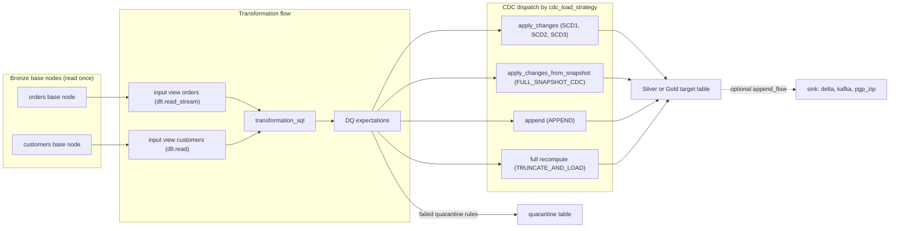
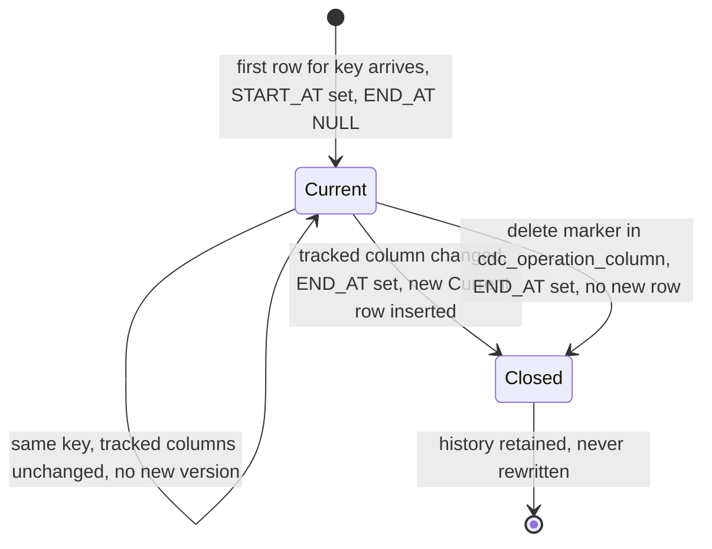

# :material-swap-horizontal: Pillar 2 · Transformation

**One SQL statement, one declared load strategy, one Silver or Gold table: FlowX turns each `transformation_flows[]` entry into a Lakeflow graph node that reads every Bronze source exactly once and merges downstream through `apply_changes`, snapshot diffing, append or full recompute.**

!!! abstract "Quick links"
    - Attribute reference: [Transformation flows](../reference/json/transformation.md) · [CDC / load strategy](../reference/json/ingestion-transformation.md) · [Root attributes](../reference/json/root.md)
    - Deep dives: [03 Transformation & CDC](../03_transformation_and_cdc.md) · [04 Data Quality & Governance](../04_data_quality_and_governance.md) · [05 Security & Cryptography](../05_security_and_cryptography.md) · [06 Egress & Sinks](../06_egress_and_lakeflow_sinks.md) · [11 Hashing](../11_hashing_and_determinism.md) · [12 Permutation matrix §3](../12_module_permutation_matrix.md#3-transformation-cdc_load_strategy-required-target_type) · [14 Validation rules §2.3](../14_onboarding_restrictions_and_validation_rules.md#23-transformation_flows)
    - Console: [Spec Builder](../console/spec_builder.md) · [Control Metadata dashboard](../console/control_dashboard.md) · [Observability dashboard](../console/observability_dashboard.md) · [Genie](../console/genie.md)
    - Traps: [13 Known limitations, CDC strategies](../13_known_limitations_and_gotchas.md#cdc-strategies)

## At a glance

| Capability | Spec attributes | Status | Deep dive |
|---|---|---|---|
| Flow anatomy | [`flow_step_id`](../reference/json/transformation.md#flow-step-id), [`dataflow_id`](../reference/json/transformation.md#dataflow-id), [`source_inputs`](../reference/json/transformation.md#source-inputs), [`transformation_sql`](../reference/json/transformation.md#transformation-sql), [`target_type`](../reference/json/transformation.md#target-type) | <span class="fx-badge fx-req">Required</span> | [03 §1](../03_transformation_and_cdc.md#1-transformation-flow-architecture) |
| Medallion chaining | [`source_inputs[].table`](../reference/json/transformation.md#source-inputstable), [`source_inputs[].is_streaming`](../reference/json/transformation.md#source-inputsis-streaming) | <span class="fx-badge fx-ver">v1.5.0+</span> | [01 §7](../01_platform_architecture.md#7-the-read-once-source-plane) |
| Load strategies | [`target_config.cdc_load_strategy`](../reference/json/ingestion-transformation.md#target-configcdc-load-strategy), [`primary_keys`](../reference/json/ingestion-transformation.md#target-configprimary-keys), [`sequence_by_column`](../reference/json/ingestion-transformation.md#target-configsequence-by-column) | <span class="fx-badge fx-req">Required</span> | [03 §2](../03_transformation_and_cdc.md#2-complete-cdc-load-strategies-guide) |
| Change scoping | [`columns_to_check`](../reference/json/ingestion-transformation.md#target-configcolumns-to-check), [`columns_to_exclude`](../reference/json/ingestion-transformation.md#target-configcolumns-to-exclude) | <span class="fx-badge fx-opt">Optional</span> | [03 §2.4](../03_transformation_and_cdc.md#24-scd2-slowly-changing-dimension-type-2) |
| Delete markers | [`cdc_operation_column`](../reference/json/ingestion-transformation.md#target-configcdc-operation-column), [`cdc_operation_mapping.delete_values`](../reference/json/ingestion-transformation.md#target-configcdc-operation-mappingdelete-values) | <span class="fx-badge fx-opt">Optional</span> | [14 §4.3](../14_onboarding_restrictions_and_validation_rules.md#43-cross-field-rejections) |
| Hash columns | [`generate_hash_columns`](../reference/json/ingestion-transformation.md#target-configgenerate-hash-columns) | <span class="fx-badge fx-opt">Optional</span> <span class="fx-badge fx-ver">v1.3.0+</span> | [11 §2](../11_hashing_and_determinism.md#2-the-exact-construction) |
| Table layout | [`storage_format`](../reference/json/transformation.md#target-configstorage-format), [`partition_columns`](../reference/json/transformation.md#target-configpartition-columns), [`liquid_clustering_columns`](../reference/json/transformation.md#target-configliquid-clustering-columns), [`table_properties`](../reference/json/transformation.md#target-configtable-properties), [`auto_ttl`](../reference/json/transformation.md#target-configauto-ttltimestamp-column) | <span class="fx-badge fx-opt">Optional</span> | [03 §3](../03_transformation_and_cdc.md#3-table-layout-partitioning-liquid-clustering) |
| Parameters | [`pipeline_parameters`](../reference/json/root.md#pipeline-parameters), `${param}` inside `transformation_sql` | <span class="fx-badge fx-opt">Optional</span> | [03 §5](../03_transformation_and_cdc.md#5-parameter-substitution-param-catalog-env) |
| Encryption | [`encrypted_columns`](../reference/json/transformation.md#target-configencrypted-columns), [`decrypted_columns`](../reference/json/transformation.md#decrypted-columns) | <span class="fx-badge fx-opt">Optional</span> | [05 §2](../05_security_and_cryptography.md#2-column-level-aes-encryption), [05 §3](../05_security_and_cryptography.md#3-transformation-input-decryption) |
| Data quality | [`dq_config.rules`](../reference/json/transformation.md#dq-configrules), [`quarantine_table`](../reference/json/transformation.md#dq-configquarantine-table), [`record_id_column`](../reference/json/transformation.md#dq-configrecord-id-column) | <span class="fx-badge fx-opt">Optional</span> | [04 §2](../04_data_quality_and_governance.md#2-quarantine-routing-architecture) |
| Governance | [`governance_tags.table_tags`](../reference/json/transformation.md#governance-tagstable-tags), [`column_tags`](../reference/json/transformation.md#governance-tagscolumn-tags) | <span class="fx-badge fx-opt">Optional</span> | [04 §3](../04_data_quality_and_governance.md#3-unity-catalog-governance-tagging) |
| Egress | `target_type: sink` or `external_sink`, [`sink_config.format`](../reference/json/transformation.md#target-configsink-configformat) | <span class="fx-badge fx-opt">Optional</span> | [06 §1](../06_egress_and_lakeflow_sinks.md#1-lakeflow-native-in-graph-sink-architecture) |
| SCD3 | `cdc_load_strategy: SCD3` | <span class="fx-badge fx-only">Transformation only</span> | [03 §2.5](../03_transformation_and_cdc.md#25-scd3-slowly-changing-dimension-type-3) |
| Surrogate-key engine | `FULL_SNAPSHOT_CDC_NO_PK`, `generate_surrogate_key`, `surrogate_key_columns`, `surrogate_key_exclude_columns` | <span class="fx-badge fx-dep">Removed</span> <span class="fx-badge fx-ver">v1.4.0+</span> | [03 §2.7](../03_transformation_and_cdc.md#27-full_snapshot_cdc_no_pk-removed-in-v140) |

## How it works

A transformation flow never opens a storage path. Each `source_inputs[]` entry is a `@dlt.view` alias that binds to the read-once source plane, then `transformation_sql` joins the aliases, DQ expectations fork bad rows, and the CDC dispatcher picks the registration primitive from `cdc_load_strategy`.



- Rule 2 of the [Single-Read DAG mandate](../01_platform_architecture.md#7-the-read-once-source-plane): downstream lineage goes through `dlt.read()` / `dlt.read_stream()`. A table published by the same dataflow group becomes a real graph edge, never a second scan.
- Two inputs naming the same physical table share one read (v1.5.0). `input_name` must be unique across every transformation flow in the spec because all of them register views in one pipeline graph.
- `APPEND` and `TRUNCATE_AND_LOAD` skip the dispatcher and register the target as a `@dlt.table` directly. The other four merge on `primary_keys`, set `delta.enableChangeDataFeed`, and add the hash columns.

SCD2 is the strategy people ask about most. One dataset, versioned rows, Lakeflow-owned `__START_AT` / `__END_AT`:



Current rows are `WHERE __END_AT IS NULL`. The `<target>_current` companion dataset was removed in v0.0.6; alias `__START_AT AS valid_from` in your own query or a plain UC view instead.

## Load strategies

Six values for [`cdc_load_strategy`](../reference/json/ingestion-transformation.md#target-configcdc-load-strategy). Choose by asking about the source: is there a key, does every run deliver every live row, how much history does the business need. The `target_type` pairing is enforced or strongly implied by the validator, so each tab shows both.

=== "APPEND"

    - Use when: immutable events, telemetry, audit trails. No key, no merge, no dedup.
    - Requires: nothing beyond the strategy. Honours `partition_columns`, `liquid_clustering_columns`, `auto_ttl`.
    - Not allowed with: `columns_to_exclude`, `cdc_operation_column`, `empty_target_if_source_empty` (each is a validation error). Worst failure is a replayed file appending every row again with nothing detecting it.

    ```json
    {
      "target_type": "streaming_table",
      "target_config": {
        "cdc_load_strategy": "APPEND",
        "liquid_clustering_columns": ["region", "order_date"]
      }
    }
    ```

    <span class="fx-badge fx-req">Required</span> `cdc_load_strategy` · <span class="fx-badge fx-opt">Optional</span> layout fields

=== "TRUNCATE_AND_LOAD"

    - Use when: small reference or lookup tables replaced wholesale each update. Realised as a full recompute of a `materialized_view` or `batch_table`.
    - Requires: `target_type` of `materialized_view` or `batch_table`. On a `streaming_table` it is rejected (v1.7.07): it would run as a plain append identical to `APPEND`.
    - Not allowed with: `columns_to_exclude`, `cdc_operation_column`; `columns_to_check` is meaningless. [`empty_target_if_source_empty`](../reference/json/ingestion-transformation.md#target-configempty-target-if-source-empty) validates but is inert since 2026-08-29 (trap D2 below): a zero-row source blanks the target.

    ```json
    {
      "target_type": "materialized_view",
      "target_config": {
        "cdc_load_strategy": "TRUNCATE_AND_LOAD",
        "table_properties": { "log_retention_duration": "interval 30 days" }
      }
    }
    ```

    <span class="fx-badge fx-req">Required</span> `cdc_load_strategy` · <span class="fx-badge fx-ver">v1.7.07+</span> streaming_table pairing rejected

=== "SCD1"

    - Use when: current-state entity tables on an incremental keyed feed. `dlt.apply_changes(stored_as_scd_type="1")`, updates in place.
    - Requires: [`primary_keys`](../reference/json/ingestion-transformation.md#target-configprimary-keys). `sequence_by_column` optional (falls back to `__framework_ingestion_timestamp_utc`). Deletes propagate only with `cdc_operation_column` plus `cdc_operation_mapping.delete_values`.
    - Not allowed with: `empty_target_if_source_empty`, a fully-populated `auto_ttl`. Layout fields are accepted but inert.

    ```json
    {
      "target_type": "streaming_table",
      "target_config": {
        "cdc_load_strategy": "SCD1",
        "primary_keys": ["customer_id"],
        "sequence_by_column": "updated_at",
        "columns_to_exclude": ["load_batch_id"],
        "cdc_operation_column": "op",
        "cdc_operation_mapping": { "delete_values": ["D"] }
      }
    }
    ```

    <span class="fx-badge fx-req">Required</span> `primary_keys` · <span class="fx-badge fx-opt">Optional</span> `sequence_by_column`, `columns_to_check`, `columns_to_exclude`, delete marker

=== "SCD2"

    - Use when: regulatory audit, point-in-time joins, historical dimensions. `dlt.apply_changes(stored_as_scd_type="2")` on a `streaming_table`.
    - Requires: `primary_keys`. Scope `columns_to_check` (maps to `track_history_column_list`) or one volatile source column versions every row on every run.
    - Not allowed with: `empty_target_if_source_empty`, a fully-populated `auto_ttl`. A delete marker closes the open version (sets `__END_AT`) rather than removing the row.

    ```json
    {
      "target_type": "streaming_table",
      "target_config": {
        "cdc_load_strategy": "SCD2",
        "primary_keys": ["account_id"],
        "sequence_by_column": "txn_timestamp",
        "columns_to_check": ["status", "balance", "credit_limit"]
      }
    }
    ```

    <span class="fx-badge fx-req">Required</span> `primary_keys` · <span class="fx-badge fx-opt">Optional</span> `sequence_by_column`, `columns_to_check`

=== "SCD3"

    - Use when: the business explicitly wants current and previous side by side. Built by materialising full history into a hidden `_<target_table>_scd2_history` table and pivoting the two latest versions per key into `current_<col>` / `previous_<col>` on a `materialized_view`.
    - Requires: `primary_keys`, and `columns_to_check` (registration fails without it: those are the columns that get pivoted). Transformation flows only; an ingestion flow declaring it is rejected.
    - Not allowed with: `cdc_operation_column` (no delete path), `empty_target_if_source_empty`, a fully-populated `auto_ttl`. If you are paying for full history anyway, SCD2 gives strictly more.

    ```json
    {
      "target_type": "materialized_view",
      "target_config": {
        "cdc_load_strategy": "SCD3",
        "primary_keys": ["employee_id"],
        "sequence_by_column": "effective_from",
        "columns_to_check": ["sales_rep", "territory"]
      }
    }
    ```

    <span class="fx-badge fx-only">Transformation only</span> · <span class="fx-badge fx-req">Required</span> `primary_keys`, `columns_to_check`

=== "FULL_SNAPSHOT_CDC"

    - Use when: a keyed source delivers a complete extract every run and vanished rows must vanish downstream. `dlt.apply_changes_from_snapshot` diffs successive snapshots on `primary_keys` and emits insert, update and delete.
    - Requires: `primary_keys` (v1.4.0: no framework-generated substitute exists). `sequence_by_column` passes validation and is then never read. A key that never reaches the clean upstream is caught at graph execution and reported with the available columns.
    - Not allowed with: `columns_to_check`, `columns_to_exclude`, `empty_target_if_source_empty`. Never point it at an incremental feed: every key absent from the batch is deleted, and an accumulating streaming upstream never deletes at all (trap D1 below).

    ```json
    {
      "target_type": "streaming_table",
      "target_config": {
        "cdc_load_strategy": "FULL_SNAPSHOT_CDC",
        "primary_keys": ["account_no", "product_code"]
      }
    }
    ```

    <span class="fx-badge fx-req">Required</span> `primary_keys` · <span class="fx-badge fx-ver">v1.4.0+</span> key mandatory

???+ warning "Removed: `FULL_SNAPSHOT_CDC_NO_PK` and the surrogate-key engine"
    <span class="fx-badge fx-dep">Removed</span> in v1.4.0, rejected on presence, never ignored. Onboarding answers a spec still carrying the strategy with:

    ```text
    <path>.cdc_load_strategy: removed in v1.4.0 -- it existed only to consume the surrogate-key engine, hashing every payload column of every row on every run to manufacture a diff key. Use FULL_SNAPSHOT_CDC with target_config.primary_keys (the Databricks-native apply_changes_from_snapshot pattern -- https://docs.databricks.com/aws/en/ldp/cdc), or TRUNCATE_AND_LOAD if this source genuinely has no key to diff on.
    ```

    `target_config.generate_surrogate_key`, `surrogate_key_columns` and `surrogate_key_exclude_columns` are rejected the same way. Row identity is `primary_keys`; change detection is `columns_to_check` / `columns_to_exclude`. Verify candidate-key uniqueness in the source before migrating (`SELECT k, count(*) FROM src GROUP BY k HAVING count(*) > 1`); a non-unique key silently collapses rows. See [03 §2.7](../03_transformation_and_cdc.md#27-full_snapshot_cdc_no_pk-removed-in-v140) and [14 §4.1](../14_onboarding_restrictions_and_validation_rules.md#41-removed-attributes-rejected-on-presence-never-silently-ignored).

## Capabilities

### Flow anatomy and medallion chaining

- [`flow_step_id`](../reference/json/transformation.md#flow-step-id) is the flow's primary key in the control tables; [`dataflow_id`](../reference/json/transformation.md#dataflow-id) is a dependency-ordering label. The real data dependency is [`source_inputs[].table`](../reference/json/transformation.md#source-inputstable), a fully-qualified `catalog.schema.table`.
- [`source_inputs[].input_name`](../reference/json/transformation.md#source-inputsinput-name) is the SQL identifier `transformation_sql` selects from. It becomes a `@dlt.view`, so it must be unique across the whole spec (rule 22 in [14 §4.3](../14_onboarding_restrictions_and_validation_rules.md#43-cross-field-rejections)).
- Bronze to Silver to Gold is a chain of flows: a Gold flow lists a Silver table in `source_inputs`, and because that table is published by the same group the framework wires `dlt.read` / `dlt.read_stream` rather than a fresh scan. Cross-group tables are read once via the source plane.
- [`transformation_sql`](../reference/json/transformation.md#transformation-sql) is parse-validated with `EXPLAIN` at onboarding after `${param}` substitution; unresolved view names are tolerated because the views exist only at pipeline run time.
- `{{catalog}}` in `target_catalog` and `source_inputs[].table` is resolved once at onboarding. `target_type` decides the Lakeflow dataset kind: `streaming_table`, `materialized_view`, `batch_table`, `external_sink`, `sink`.

<span class="fx-badge fx-req">Required</span> `flow_step_id`, `dataflow_id`, `target_catalog`, `target_schema`, `target_table`, `target_type`, `transformation_sql` · <span class="fx-badge fx-ver">v1.5.0+</span> input view is an alias, not the read

=== "JSON"

    ```json
    {
      "flow_step_id": "tf_orders_enriched",
      "dataflow_id": "df_orders_enriched",
      "source_inputs": [
        { "input_name": "orders", "table": "{{catalog}}.silver.sales_orders", "is_streaming": true },
        { "input_name": "customers", "table": "{{catalog}}.silver.customer_dim", "is_streaming": false }
      ],
      "transformation_sql": "SELECT o.order_id, o.order_total, c.customer_id, c.tier FROM orders o JOIN customers c ON o.customer_id = c.customer_id",
      "target_catalog": "{{catalog}}",
      "target_schema": "gold",
      "target_table": "orders_enriched",
      "target_type": "streaming_table",
      "target_config": { "cdc_load_strategy": "APPEND" }
    }
    ```

=== "YAML"

    ```yaml
    flow_step_id: tf_orders_enriched
    dataflow_id: df_orders_enriched
    source_inputs:
      - input_name: orders
        table: "{{catalog}}.silver.sales_orders"
        is_streaming: true
      - input_name: customers
        table: "{{catalog}}.silver.customer_dim"
        is_streaming: false
    transformation_sql: SELECT o.order_id, o.order_total, c.customer_id, c.tier FROM orders o JOIN customers c ON o.customer_id = c.customer_id
    target_catalog: "{{catalog}}"
    target_schema: gold
    target_table: orders_enriched
    target_type: streaming_table
    target_config:
      cdc_load_strategy: APPEND
    ```

### Streaming inputs and watermarks

- [`is_streaming`](../reference/json/transformation.md#source-inputsis-streaming) (default `false`) picks `dlt.read_stream` over `dlt.read`. It must match how the upstream was registered ([L4](../13_known_limitations_and_gotchas.md#l4)), and a Delta streaming source must be append-only ([L5](../13_known_limitations_and_gotchas.md#l5)): read an SCD, snapshot or `TRUNCATE_AND_LOAD` target with `is_streaming: false`.
- [`watermark`](../reference/json/transformation.md#source-inputswatermarkevent-time-column) applies `withWatermark` on the input view; `event_time_column` is auto-cast to timestamp. Both sub-fields are required together. Declare it when a streaming input is range-joined against another stream, and for any stateful streaming SQL that must bound state.
- A streaming input feeding a `materialized_view` target is legal; the reverse (batch input into a sink) is not, because Lakeflow sinks accept streaming queries only ([K1](../13_known_limitations_and_gotchas.md#k1)).

<span class="fx-badge fx-opt">Optional</span> `is_streaming`, `watermark`

=== "JSON"

    ```json
    {
      "source_inputs": [
        {
          "input_name": "orders",
          "table": "main.silver.sales_orders",
          "is_streaming": true,
          "watermark": { "event_time_column": "order_ts", "delay_threshold": "10 minutes" }
        },
        { "input_name": "customers", "table": "main.silver.customer_dim", "is_streaming": false }
      ]
    }
    ```

=== "YAML"

    ```yaml
    source_inputs:
      - input_name: orders
        table: main.silver.sales_orders
        is_streaming: true
        watermark:
          event_time_column: order_ts
          delay_threshold: 10 minutes
      - input_name: customers
        table: main.silver.customer_dim
        is_streaming: false
    ```

### Deduplication and sequencing

- The merging strategies dedup by construction: `apply_changes` keeps, per `primary_keys`, the row with the highest [`sequence_by_column`](../reference/json/ingestion-transformation.md#target-configsequence-by-column). Two versions of one key in one batch resolve to the later sequence value.
- Omit `sequence_by_column` and the framework sequences by `__framework_ingestion_timestamp_utc`, which is `current_timestamp()` evaluated once per batch. Correct across runs, tied within one: the winner is non-deterministic, and on SCD2 a tie corrupts history order ([D6](../13_known_limitations_and_gotchas.md#d6)). Setting [`capture_technical_metadata`](../reference/json/transformation.md#target-configcapture-technical-metadata) to `false` removes the fallback column and makes `sequence_by_column` mandatory.
- `FULL_SNAPSHOT_CDC` ignores `sequence_by_column` entirely: `apply_changes_from_snapshot` has no such parameter.
- Full-row dedup of duplicate deliveries is an ingestion concern: `source_config.remove_dups` with `dedup_watermark` on the Bronze flow ([02 §7](../02_ingestion_and_sources.md#7-full-row-streaming-deduplication-remove_dups)). `APPEND` transformation targets never deduplicate.

<span class="fx-badge fx-opt">Optional</span> `sequence_by_column` (strongly recommended on SCD1, SCD2, SCD3)

=== "JSON"

    ```json
    {
      "target_type": "streaming_table",
      "target_config": {
        "cdc_load_strategy": "SCD1",
        "primary_keys": ["order_id"],
        "sequence_by_column": "event_ts"
      }
    }
    ```

=== "YAML"

    ```yaml
    target_type: streaming_table
    target_config:
      cdc_load_strategy: SCD1
      primary_keys: [order_id]
      sequence_by_column: event_ts
    ```

### Schema evolution on Silver

- Lakeflow owns the target schema. A `materialized_view` or `TRUNCATE_AND_LOAD` target is fully recomputed, so a new column in `transformation_sql` output simply appears on the next update. Streaming tables and `apply_changes` targets add new columns additively; an incompatible change (type change, rename) needs a full refresh.
- The framework adds nothing on top: there is no `schema_evolution_mode` on a transformation flow (that key belongs to Auto Loader ingestion, [02 Schema Evolution Policies](../02_ingestion_and_sources.md#schema-evolution-policies)), no type widening, no column drop. A renamed SQL column is a new column plus an orphaned old one.
- [`columns_to_exclude`](../reference/json/ingestion-transformation.md#target-configcolumns-to-exclude) is the only way to keep a column out of a CDC target: it narrows comparison and is passed to `except_column_list`, which drops the column from the table schema (v0.0.5).
- Every column-referencing field (`primary_keys`, `columns_to_check`, DQ expressions, `partition_columns`) must use the final, post-transformation name ([C2](../13_known_limitations_and_gotchas.md#c2)). Treat a rename on a materialised target as a migration, not a config tweak ([C4](../13_known_limitations_and_gotchas.md#c4)).

<span class="fx-badge fx-opt">Optional</span> `columns_to_exclude` (SCD1, SCD2, SCD3 only)

=== "JSON"

    ```json
    {
      "target_type": "streaming_table",
      "target_config": {
        "cdc_load_strategy": "SCD1",
        "primary_keys": ["customer_id"],
        "columns_to_exclude": ["load_batch_id", "source_checksum"]
      }
    }
    ```

=== "YAML"

    ```yaml
    target_type: streaming_table
    target_config:
      cdc_load_strategy: SCD1
      primary_keys: [customer_id]
      columns_to_exclude: [load_batch_id, source_checksum]
    ```

### Deterministic hash columns

- [`generate_hash_columns`](../reference/json/ingestion-transformation.md#target-configgenerate-hash-columns) defaults to `true` on SCD1, SCD2, SCD3 and FULL_SNAPSHOT_CDC and is never applied on APPEND or TRUNCATE_AND_LOAD. Computed in `dq/quarantine.py::_apply_hash_columns` before the clean upstream reaches `apply_changes`.
- `__framework_hash_key` is SHA-256 over `primary_keys` in declared order. `__framework_hash_value` is SHA-256 over the resolved comparison columns, alphabetically sorted. With no comparison columns it is `CAST(NULL AS STRING)`, not a zero-column hash.
- One construction everywhere since v1.3.0: `sha2(concat_ws('||', coalesce(trim(lower(cast(c AS STRING))), '__NULL__'), ...), 256)`. Every pre-v1.3.0 digest changed value ([D5](../13_known_limitations_and_gotchas.md#d5)); reconcile old and new tables only after re-materialising both.
- Reconciliation datasets declaring `hash_precomputed: true` trust these two columns exist; see [Pillar 3](reconciliation.md).

<span class="fx-badge fx-opt">Optional</span> `generate_hash_columns` (default `true`) · <span class="fx-badge fx-ver">v1.3.0+</span> canonical construction

=== "JSON"

    ```json
    {
      "target_type": "streaming_table",
      "target_config": {
        "cdc_load_strategy": "SCD2",
        "primary_keys": ["customer_id", "region"],
        "columns_to_check": ["email", "status", "tier"],
        "generate_hash_columns": true
      }
    }
    ```

=== "YAML"

    ```yaml
    target_type: streaming_table
    target_config:
      cdc_load_strategy: SCD2
      primary_keys: [customer_id, region]
      columns_to_check: [email, status, tier]
      generate_hash_columns: true
    ```

??? example "Deep dive: spot-check a digest by hand"
    The key hash lists `coalesce(...)` lines in `primary_keys` order; the value hash lists them alphabetically. Reproduce with plain Spark SQL, no framework code needed:

    ```sql
    SELECT sha2(concat_ws('||',
             coalesce(trim(lower(cast(customer_id AS STRING))), '__NULL__'),
             coalesce(trim(lower(cast(region      AS STRING))), '__NULL__')), 256) AS __framework_hash_key
    FROM main.silver.customer_history;
    ```

    Full rules, exclusions and the migration checklist: [11 §3](../11_hashing_and_determinism.md#3-column-ordering-rules), [11 §4](../11_hashing_and_determinism.md#4-reproducible-spark-sql), [11 §6](../11_hashing_and_determinism.md#6-breaking-change-migration-note-v130).

### Table layout

- [`storage_format`](../reference/json/transformation.md#target-configstorage-format): `delta` (default) or `iceberg`; `iceberg` is valid only with `target_type: batch_table`. Elsewhere set [`table_properties.enable_iceberg_read_uniformity: true`](../reference/json/transformation.md#target-configtable-properties) for UniForm reads. `table_properties` also takes `log_retention_duration` and `deleted_file_retention_duration`.
- [`partition_columns`](../reference/json/transformation.md#target-configpartition-columns) and [`liquid_clustering_columns`](../reference/json/transformation.md#target-configliquid-clustering-columns) (at most 3) take effect only on APPEND and TRUNCATE_AND_LOAD. On the four merging strategies they are accepted and silently inert ([D3](../13_known_limitations_and_gotchas.md#d3)). An explicit `partition_columns: []` is valid, means unpartitioned, and logs that a human decided so.
- [`auto_ttl`](../reference/json/transformation.md#target-configauto-ttltimestamp-column) with both `timestamp_column` and `expire_in_days` (minimum 1) is a hard error outside APPEND and TRUNCATE_AND_LOAD. Deletion is permanent.
- The Spec Builder's [`partition_mode`](../reference/json/transformation.md#target-configpartition-mode) control (`absent`, `unpartitioned`, `named`) is a form affordance that serialises to `partition_columns`; it never appears in a spec.

<span class="fx-badge fx-opt">Optional</span> all layout fields · honoured by APPEND and TRUNCATE_AND_LOAD only

=== "JSON"

    ```json
    {
      "target_type": "streaming_table",
      "target_config": {
        "cdc_load_strategy": "APPEND",
        "storage_format": "delta",
        "partition_columns": [],
        "liquid_clustering_columns": ["region", "order_date"],
        "table_properties": {
          "log_retention_duration": "interval 30 days",
          "deleted_file_retention_duration": "interval 7 days",
          "enable_iceberg_read_uniformity": true
        },
        "auto_ttl": { "timestamp_column": "order_ts", "expire_in_days": 90 }
      }
    }
    ```

=== "YAML"

    ```yaml
    target_type: streaming_table
    target_config:
      cdc_load_strategy: APPEND
      storage_format: delta
      partition_columns: []
      liquid_clustering_columns: [region, order_date]
      table_properties:
        log_retention_duration: interval 30 days
        deleted_file_retention_duration: interval 7 days
        enable_iceberg_read_uniformity: true
      auto_ttl:
        timestamp_column: order_ts
        expire_in_days: 90
    ```

### Parameter substitution

- `{{catalog}}` and `{{env}}` are a raw-text replace over the whole spec file at onboarding, before parsing. The control tables store the resolved value; changing it means re-onboarding.
- `${param}` values come from root [`pipeline_parameters`](../reference/json/root.md#pipeline-parameters) and are resolved fresh on every pipeline update in `transformation_sql`, `filter_condition`, and every `source_config` / `target_config` path field. `dq_config` expressions are deliberately excluded. Edit `pipeline_parameters` and re-run; no re-onboarding.
- An undefined `${param}` is rejected at onboarding (rule 25 in [14 §4.3](../14_onboarding_restrictions_and_validation_rules.md#43-cross-field-rejections)) and again at planning time.

???+ warning "The quoting trap"
    String parameters are wrapped in single quotes by the substitution. Write `region = ${region_code}`, never `region = '${region_code}'`: the hand-added pair yields `''EMEA''` and a `ParseException` at run time. Numbers and booleans render as raw literals.

<span class="fx-badge fx-opt">Optional</span> `pipeline_parameters`

=== "JSON"

    ```json
    {
      "pipeline_parameters": { "min_order_value": 100.0, "region_code": "EMEA" },
      "transformation_sql": "SELECT o.order_id, o.order_total FROM orders o WHERE o.order_total >= ${min_order_value} AND o.region = ${region_code}"
    }
    ```

=== "YAML"

    ```yaml
    pipeline_parameters:
      min_order_value: 100.0
      region_code: EMEA
    transformation_sql: SELECT o.order_id, o.order_total FROM orders o WHERE o.order_total >= ${min_order_value} AND o.region = ${region_code}
    ```

### Column encryption on write, decryption on input

- [`target_config.encrypted_columns[]`](../reference/json/transformation.md#target-configencrypted-columns) encrypts SQL output columns with AES. [`mode`](../reference/json/transformation.md#target-configencrypted-columnsmode) is `GCM` (default, authenticated, random IV), `CBC`, or `ECB` (deterministic, the only mode that supports equality joins on ciphertext). [`source_data_type`](../reference/json/transformation.md#target-configencrypted-columnssource-data-type) records the pre-encryption type as the UC `original_data_type` tag.
- [`source_inputs[].decrypted_columns[]`](../reference/json/transformation.md#decrypted-columns) is the only place a source column is decrypted. [`cast_to_type`](../reference/json/transformation.md#decrypted-columnscast-to-type) is mandatory and is cross-checked against that tag. [`output_column`](../reference/json/transformation.md#decrypted-columnsoutput-column) keeps ciphertext and plaintext side by side.
- Secrets are Unity Catalog three-level references (`secret_catalog`, `secret_schema`, `secret_key`), resolved eagerly at graph definition ([E2](../13_known_limitations_and_gotchas.md#e2)). Never embed a literal `secret(...)` call in SQL ([E1](../13_known_limitations_and_gotchas.md#e1)).
- Never list a GCM-encrypted column in `columns_to_check`: the random IV makes every row look changed on every run. Key lengths: 16, 24 or 32 bytes ([05 Key Length Requirements](../05_security_and_cryptography.md#key-length-requirements)).

<span class="fx-badge fx-opt">Optional</span> `encrypted_columns`, `decrypted_columns` · <span class="fx-badge fx-ver">v1.4.0+</span> `source_data_type` · <span class="fx-badge fx-only">Transformation only</span> `decrypted_columns`

=== "JSON"

    ```json
    {
      "source_inputs": [
        {
          "input_name": "customers",
          "table": "main.silver.customer_history",
          "is_streaming": false,
          "decrypted_columns": [
            {
              "column_name": "email",
              "cast_to_type": "string",
              "mode": "GCM",
              "output_column": "email_plain",
              "secret": { "secret_catalog": "main", "secret_schema": "security", "secret_key": "pii_aes_gcm_key" }
            }
          ]
        }
      ],
      "transformation_sql": "SELECT c.customer_id, c.email_plain, c.national_id FROM customers c",
      "target_config": {
        "cdc_load_strategy": "APPEND",
        "encrypted_columns": [
          {
            "column_name": "national_id",
            "mode": "GCM",
            "source_data_type": "string",
            "secret": { "secret_catalog": "main", "secret_schema": "security", "secret_key": "pii_aes_gcm_key" }
          }
        ]
      }
    }
    ```

=== "YAML"

    ```yaml
    source_inputs:
      - input_name: customers
        table: main.silver.customer_history
        is_streaming: false
        decrypted_columns:
          - column_name: email
            cast_to_type: string
            mode: GCM
            output_column: email_plain
            secret: { secret_catalog: main, secret_schema: security, secret_key: pii_aes_gcm_key }
    transformation_sql: SELECT c.customer_id, c.email_plain, c.national_id FROM customers c
    target_config:
      cdc_load_strategy: APPEND
      encrypted_columns:
        - column_name: national_id
          mode: GCM
          source_data_type: string
          secret: { secret_catalog: main, secret_schema: security, secret_key: pii_aes_gcm_key }
    ```

### Data quality and quarantine

- [`dq_config.rules[]`](../reference/json/transformation.md#dq-configrules): each rule has [`rule_id`](../reference/json/transformation.md#dq-configrulesrule-id), a SQL predicate [`expression`](../reference/json/transformation.md#dq-configrulesexpression), and an [`action`](../reference/json/transformation.md#dq-configrulesaction) of `warn`, `drop`, `fail` or `quarantine`. Built on Lakeflow expectations.
- `quarantine` forks the stream: valid rows continue into CDC dispatch, failed rows land in the sibling [`quarantine_table`](../reference/json/transformation.md#dq-configquarantine-table) with `__framework_quarantine_timestamp_utc`, `__framework_quarantine_failed_rules` and `__framework_quarantine_source_dataflow_id`. The table is created only when at least one rule uses `quarantine`.
- `fail` aborts the whole pipeline update ([Q1](../13_known_limitations_and_gotchas.md#q1)). Expressions use final column names ([Q3](../13_known_limitations_and_gotchas.md#q3)) and are not `${param}`-substituted.
- A [`quarantine_table`](../reference/json/transformation.md#dq-configquarantine-table) name with no quarantine-action rule is accepted and produces nothing; [`record_id_column`](../reference/json/transformation.md#dq-configrecord-id-column) names the business id carried into the quarantine row.

<span class="fx-badge fx-opt">Optional</span> `dq_config` · <span class="fx-badge fx-req">Required</span> per rule: `rule_id`, `expression`, `action`

=== "JSON"

    ```json
    {
      "dq_config": {
        "rules": [
          { "rule_id": "order_id_not_null", "expression": "order_id IS NOT NULL", "action": "quarantine" },
          { "rule_id": "positive_total", "expression": "order_total > 0", "action": "quarantine" },
          { "rule_id": "known_tier", "expression": "tier IN ('gold', 'silver', 'bronze')", "action": "warn" }
        ],
        "quarantine_table": "orders_enriched_quarantine",
        "record_id_column": "order_id"
      }
    }
    ```

=== "YAML"

    ```yaml
    dq_config:
      rules:
        - { rule_id: order_id_not_null, expression: order_id IS NOT NULL, action: quarantine }
        - { rule_id: positive_total, expression: order_total > 0, action: quarantine }
        - { rule_id: known_tier, expression: "tier IN ('gold', 'silver', 'bronze')", action: warn }
      quarantine_table: orders_enriched_quarantine
      record_id_column: order_id
    ```

### Governance tags

- [`governance_tags.table_tags`](../reference/json/transformation.md#governance-tagstable-tags) is a string-to-string map; [`column_tags`](../reference/json/transformation.md#governance-tagscolumn-tags) is a list of `{column, tags}` objects.
- Lakeflow forbids DDL inside the graph, so tags are applied after the update by `notebooks/04_governance/04_apply_governance_and_egress.py` as idempotent `ALTER TABLE ... SET TAGS` ([G1](../13_known_limitations_and_gotchas.md#g1)). The framework applies tags; it does not enforce policies ([G2](../13_known_limitations_and_gotchas.md#g2)).
- `target_type: sink` flows are skipped (v1.7.5): a pure sink has no table to alter. Put tags on the flow that produces the data.

<span class="fx-badge fx-opt">Optional</span> `governance_tags` · <span class="fx-badge fx-ver">v1.7.5+</span> sink flows skipped

=== "JSON"

    ```json
    {
      "governance_tags": {
        "table_tags": { "cost_center": "CC-1042", "classification": "confidential", "sla": "hourly" },
        "column_tags": [ { "column": "email", "tags": { "pii": "true" } } ]
      }
    }
    ```

=== "YAML"

    ```yaml
    governance_tags:
      table_tags: { cost_center: CC-1042, classification: confidential, sla: hourly }
      column_tags:
        - column: email
          tags: { pii: "true" }
    ```

### Egress via sinks

- `target_type: external_sink` materialises the governed, DQ-quarantined table first and additionally exports it through a second `@dlt.append_flow`; `target_type: sink` writes only to the sink and bypasses CDC dispatch entirely ([K2](../13_known_limitations_and_gotchas.md#k2)). Both need `target_config.sink_config` with [`format`](../reference/json/transformation.md#target-configsink-configformat) `delta`, `kafka` or `pgp_zip`.
- Sinks accept streaming queries only ([K1](../13_known_limitations_and_gotchas.md#k1)). An aggregating `materialized_view` or `TRUNCATE_AND_LOAD` target reaches a `pgp_zip` sink only through [`export_trigger: per_update`](../reference/json/transformation.md#target-configsink-configexport-trigger) (v1.7.5).
- Formats, archive options and the eager-secret rule: [06 §2](../06_egress_and_lakeflow_sinks.md#2-sink-format-specifications), [export trigger](../06_egress_and_lakeflow_sinks.md#export-trigger-export_trigger-v175).

<span class="fx-badge fx-opt">Optional</span> · <span class="fx-badge fx-req">Required</span> `sink_config.format`, `sink_config.path` (delta, pgp_zip) · <span class="fx-badge fx-ver">v1.7.5+</span> `export_trigger`

=== "JSON"

    ```json
    {
      "target_type": "external_sink",
      "target_config": {
        "cdc_load_strategy": "APPEND",
        "sink_config": { "format": "delta", "path": "/Volumes/main/exports/orders_enriched/" }
      }
    }
    ```

=== "YAML"

    ```yaml
    target_type: external_sink
    target_config:
      cdc_load_strategy: APPEND
      sink_config:
        format: delta
        path: /Volumes/main/exports/orders_enriched/
    ```

## Operational runbook

1. **Validate offline first.** Both gates matter: the JSON schema rejects unknown keys, the Python validator applies the cross-field rules.

    ```bash
    python -c "import json; from flowx.lakeflow_framework.onboarding.spec_validator import validate_spec; spec = json.load(open('BT_Usecase/<UC>/specs/<spec>.json')); *_, errors = validate_spec(None, spec); print(errors or 'OK')"
    ```

2. **Onboard.** The generic `onboarding_job` (`resources/flowx_config_jobs/onboarding_job.yml`) is driven by job parameters: `spec_file_path`, `catalog`, `env`, `action_type` in `{CREATE, UPDATE, VALIDATE_ONLY}`, and opt-in `prune_missing_flows` (v1.7.07, soft-disables control rows for flows the spec no longer declares).

    ```bash
    databricks bundle run onboarding_job -t <target> --params spec_file_path=/Workspace/<path>/<spec>.json,catalog=<catalog>,env=<env>,action_type=CREATE
    ```

    Run `action_type=VALIDATE_ONLY` first on a shared workspace. Removing a flow from the spec does not deactivate its control row unless `prune_missing_flows=true`.

3. **Run the pipeline.** Never deploy while an update is running ([O1](../13_known_limitations_and_gotchas.md#o1)).

    ```bash
    databricks bundle run <pipeline_resource_key> -t <target>
    ```

    A changed streaming source, a re-keyed SCD target or a hash re-materialisation needs a one-time full refresh; stop any retry loop first.

4. **Verify.** Hash columns present, SCD2 keys with exactly one open version, no silently collapsed keys.

    ```sql
    -- hash columns exist and are populated (CDC-dispatched strategies only)
    SELECT count(*) AS rows_total,
           count(__framework_hash_key) AS keyed_rows,
           count(DISTINCT __framework_hash_key) AS distinct_keys
    FROM main.silver.customer_history;

    -- SCD2: every key must have exactly one open version
    SELECT customer_id,
           count(*) AS versions,
           sum(CASE WHEN __END_AT IS NULL THEN 1 ELSE 0 END) AS open_versions
    FROM main.silver.customer_history
    GROUP BY customer_id
    HAVING open_versions <> 1;
    ```

## Where to see it

- [Spec Builder](../console/spec_builder.md): the **Transformation** tab writes `source_inputs`, `transformation_sql` and the strategy-scoped `target_config`; the Load strategy step hides attributes the chosen strategy does not use.
- [Control Metadata dashboard](../console/control_dashboard.md): the **Transformation Flows** page lists every `flow_step_id` with its resolved `cdc_load_strategy`, `primary_keys` and target.
- [Observability dashboard](../console/observability_dashboard.md): **Framework & Lineage** shows observed `dlt.read` edges per group; **Quality** shows per-expectation pass and quarantine counts.
- [Genie](../console/genie.md): ask *"Which transformation flows in dfg_sales_gold use SCD2, and what are their primary keys?"*

## Gotchas

Severity emoji follow the [docs/13 legend](../13_known_limitations_and_gotchas.md#severity-legend): 🔴 silent, 🟠 late failure, 🟡 inert, 🔵 operational.

| | Trap | Fix | Link |
|---|---|---|---|
| 🔴 | `FULL_SNAPSHOT_CDC` over a streaming upstream accumulates; deletes never happen | One complete extract per run, landing zone cleared between runs; otherwise SCD1/SCD2 with a real `sequence_by_column` | [D1](../13_known_limitations_and_gotchas.md#d1) |
| 🟡 | `empty_target_if_source_empty` is accepted but inert; a zero-row source blanks a `TRUNCATE_AND_LOAD` target | Row-count check in a post-update job task, outside the graph | [D2](../13_known_limitations_and_gotchas.md#d2) |
| 🟡 | `partition_columns` / `liquid_clustering_columns` silently ignored on SCD1, SCD2, SCD3, FULL_SNAPSHOT_CDC | Expected; layout applies to APPEND and TRUNCATE_AND_LOAD only | [D3](../13_known_limitations_and_gotchas.md#d3) |
| 🟠 | `FULL_SNAPSHOT_CDC_NO_PK` and surrogate-key attributes rejected on presence | Declare `primary_keys` (verify uniqueness first) or switch to `TRUNCATE_AND_LOAD` | [D4](../13_known_limitations_and_gotchas.md#d4) |
| 🔴 | v1.3.0 changed the hash construction; every older digest differs | Re-materialise both sides before reconciling | [D5](../13_known_limitations_and_gotchas.md#d5) |
| 🔵 | `sequence_by_column` falls back to ingestion time, not event time | Always declare a real source timestamp or version column | [D6](../13_known_limitations_and_gotchas.md#d6) |
| 🟠 | `SCD3` on an ingestion flow is rejected | Move it to a transformation flow downstream of the raw ingest | [D7](../13_known_limitations_and_gotchas.md#d7) |
| 🟠 | `is_streaming` does not match how the upstream was registered | Stream only append-only streaming tables; read SCD, snapshot and MV targets with `is_streaming: false` | [L4](../13_known_limitations_and_gotchas.md#l4) |

## Related

- [Pillar hub](index.md) · [Pillar 1 · Ingestion](ingestion.md) · [Pillar 3 · Reconciliation](reconciliation.md) · [Pillar 4 · Observability](observability.md)
- [03 Transformation & CDC](../03_transformation_and_cdc.md) · [12 Permutation matrix §3](../12_module_permutation_matrix.md#3-transformation-cdc_load_strategy-required-target_type) · [14 Restricted SQL grammars](../14_onboarding_restrictions_and_validation_rules.md#36-restricted-sql-grammars)
- [Transformation attribute reference](../reference/json/transformation.md) · [CDC / load strategy reference](../reference/json/ingestion-transformation.md)
- [Medallion architecture](../01_platform_architecture.md#3-medallion-architecture-implementation) · [Single-Read DAG source plane](../01_platform_architecture.md#7-the-read-once-source-plane)
