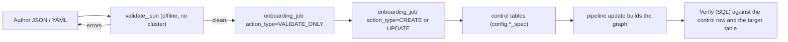

<!-- GENERATED FILE — do not edit.
     Produced by scripts/build_docs_reference.py; edit the source it derives from. -->

# Master configuration reference

Every attribute the framework understands, on one searchable surface. Generated from the same registry the Spec Builder renders, the JSON schema the onboarding job enforces, and the validator's own rejection dictionaries — so this reference, the app and the gate can never disagree.

- :material-file-tree: **[Spec tree view](tree.md)**

    The whole document as a collapsible tree — every parent-child hierarchy, with a link from each leaf into its entry.

- :material-book-open-variant: **[Attributes by section](#sections)**

    188 attributes across 6 sections, each with type, default, sample, validation and 773 FAQs.

- :material-delete-alert: **[Removed & rejected](removed.md)**

    6 removed attributes, the removed enum values, mode-gated keys, and 21 wrong names the validator recognises.

- :material-sync: **[Docs ↔ code synchronisation](../sync.md)**

    How registry, schema, validator and control tables map onto each other, and the hooks that keep this page honest.

## How to read an attribute entry

| Element | What it tells you |
|---|---|
| Required Optional | Whether the onboarding gate rejects the spec when the key is absent. |
| Ingestion | Which flow kinds accept the attribute. A `target_config` key may appear on two. |
| v1.7.4+ | The framework release that added the attribute (from `docs/v*_json_attribute_delta.json`). No badge means it predates the delta record. |
| Load strategy | The Spec Builder step that renders the field. |
| **Type & constraints** | Type, default, allowed values and constraints, read from the JSON schema. |
| **Persisted in** | The control-table column the value lands in after onboarding — the row the pipeline actually reads. |
| **JSON · Validate offline · Onboard (CLI) · Verify (SQL)** | Write it, prove it without a cluster, onboard it, and confirm what landed. |
| **FAQs** | At least four per attribute: what happens when omitted, format gotchas, performance impact, edge cases. |

188 of 188 attributes carry FAQs today. `tests/unit/test_attribute_faqs.py` fails when a registry attribute has fewer than four.

## Sections

| Section | Attributes | FAQs | What it covers |
|---|---|---|---|
| [Spec root](root.md) | 3 | 14 | Top-level attributes of the onboarding document. Everything else hangs off these. |
| [Ingestion flows](ingestion.md) | 110 | 454 | One entry per `ingestion_flows[]` element — reading from a landing zone into Bronze. |
| [Transformation flows](transformation.md) | 77 | 321 | One entry per `transformation_flows[]` element — SQL plus a CDC load strategy. |
| [CDC / load strategy](ingestion-transformation.md) | 10 | 43 | Attributes under `target_config` that only apply to particular CDC load strategies. The Spec Builder shows these on the **Load strategy** step and hides the ones the selected strategy does not use. |
| [Reconciliation flows](reconciliation.md) | 34 | 138 | One entry per `reconciliation_flows[]` element — comparing a baseline against targets. |
| [Observability](observability.md) | 18 | 73 | One entry per `observability[]` element — where telemetry is exported. |

**188 distinct attributes** across 6 sections.

## Verification workflow

Every entry carries the same four tabs. Read them in this order.

## CDC load strategies

| Strategy | Applies to | What it does | Requires |
|---|---|---|---|
| `APPEND` | append-only feed | Immutable facts — events, logs, CDRs. No merge, no per-row diff. | no required parameters |
| `TRUNCATE_AND_LOAD` | full replace | Full extract each run, small enough to recompute entirely. | no required parameters |
| `SCD1` | overwrite current | Entity state where only the current value matters. | primary_keys required |
| `SCD2` | full history | Entity state where full history matters. | primary_keys required |
| `SCD3` | current + previous | Only current and previous value matter. Transformation flows only. | primary_keys + columns_to_check |
| `FULL_SNAPSHOT_CDC` | snapshot diff | Full extract each run, diffed against the previous one on a declared key to derive inserts, updates and deletes. | primary_keys required |
| `FULL_SNAPSHOT_CDC_NO_PK` | Removed | See [Removed & rejected](removed.md#target_configcdc_load_strategy) | — |

## Recently added attributes

| Attribute | Since |
|---|---|
| [`target_config.sink_config.export_trigger`](ingestion.md#target-configsink-configexport-trigger) | v1.7.5+ |
| [`target_config.sink_config.post_export_archive.pgp_encryption.passphrase_secret`](ingestion-transformation.md#target-configsink-configpost-export-archivepgp-encryptionpassphrase-secret) | v1.7.4+ |
| [`target_config.sink_config.post_export_archive.archive_format`](ingestion.md#target-configsink-configpost-export-archivearchive-format) | v1.7.4+ |
| [`source_config.source_zip_handling.pre_extraction_decryption.type`](ingestion.md#source-configsource-zip-handlingpre-extraction-decryptiontype) | v1.7.4+ |
| [`source_config.source_zip_handling.member_format`](ingestion.md#source-configsource-zip-handlingmember-format) | v1.7.4+ |
| [`target_config.sink_config.staged_file_format`](ingestion.md#target-configsink-configstaged-file-format) | v1.6.0+ |
| [`publish_schema`](reconciliation.md#publish-schema) | v1.5.0+ |
| [`execution_mode`](reconciliation.md#execution-mode) | v1.5.0+ |
| [`target_config.encrypted_columns[].source_data_type`](ingestion.md#target-configencrypted-columnssource-data-type) | v1.4.0+ |

## Related

- [Full attribute dictionary](../../00_master_reference_index.md) — the hand-maintained narrative dictionary, including framework-generated columns.
- [Onboarding restrictions & validation rules](../../14_onboarding_restrictions_and_validation_rules.md)
- [Known limitations & gotchas](../../13_known_limitations_and_gotchas.md) — what the validator cannot catch.
- Pillars: [Ingestion](../../pillars/ingestion.md) · [Transformation](../../pillars/transformation.md) · [Reconciliation](../../pillars/reconciliation.md) · [Observability](../../pillars/observability.md)
