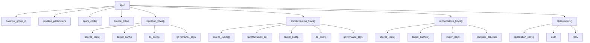

<!-- GENERATED FILE — do not edit.
     Produced by scripts/build_docs_reference.py; edit the source it derives from. -->

# Spec tree view

The whole onboarding document as one collapsible tree, generated from `onboarding_templates/onboarding_spec.schema.json` — the same schema the onboarding job enforces. Expand a node to see its keys; **reference ↗** opens the attribute's full entry (type, sample, validation, FAQs).

!!! info "How to read it"
    `req` marks a key the schema requires inside its parent. *italic* is the JSON type, orange text lists the allowed values, grey text the default. A key with no **reference ↗** link is structural (a container) or is documented on its parent.

**188 documented attributes** · [Master reference](index.md) · [Removed & rejected](removed.md) · [Docs ↔ code synchronisation](../sync.md)

## Tree

<code>spec</code> object · 9 keys
<ul>
<li id="tree-root-dataflow-group-id"><code>dataflow_group_id</code> req string <a href="../root/#dataflow-group-id" title="Open the attribute reference">reference ↗</a></li>
<li id="tree-root-pipeline-parameters"><code>pipeline_parameters</code> object&lt;string, any&gt; <a href="../root/#pipeline-parameters" title="Open the attribute reference">reference ↗</a></li>
<li id="tree-root-spark-config"><code>spark_config</code> object&lt;string, string | number | boolean&gt; <a href="../root/#spark-config" title="Open the attribute reference">reference ↗</a></li>

<code>source_plane</code> object · 3 keys
<ul>
<li id="tree-root-source-planematerialize"><code>materialize</code> string always | auto default &quot;always&quot;</li>
<li id="tree-root-source-planecatalog"><code>catalog</code> string | null</li>
<li id="tree-root-source-planeschema"><code>schema</code> string | null</li>
</ul>

<code>ingestion_flows</code><code>[]</code> array of object · 14 keys
<ul>
<li id="tree-ingestion-dataflow-id"><code>dataflow_id</code> req string <a href="../ingestion/#dataflow-id" title="Open the attribute reference">reference ↗</a></li>
<li id="tree-ingestion-source-system"><code>source_system</code> string <a href="../ingestion/#source-system" title="Open the attribute reference">reference ↗</a></li>
<li id="tree-ingestion-source-database"><code>source_database</code> string <a href="../ingestion/#source-database" title="Open the attribute reference">reference ↗</a></li>
<li id="tree-ingestion-source-table-name"><code>source_table_name</code> string <a href="../ingestion/#source-table-name" title="Open the attribute reference">reference ↗</a></li>
<li id="tree-ingestion-source-description"><code>source_description</code> string <a href="../ingestion/#source-description" title="Open the attribute reference">reference ↗</a></li>
<li id="tree-ingestion-source-type"><code>source_type</code> req autoloader | zerobus | asn1 <a href="../ingestion/#source-type" title="Open the attribute reference">reference ↗</a></li>
<li id="tree-ingestion-target-catalog"><code>target_catalog</code> req string <a href="../ingestion/#target-catalog" title="Open the attribute reference">reference ↗</a></li>
<li id="tree-ingestion-target-schema"><code>target_schema</code> req string <a href="../ingestion/#target-schema" title="Open the attribute reference">reference ↗</a></li>
<li id="tree-ingestion-target-table"><code>target_table</code> req string <a href="../ingestion/#target-table" title="Open the attribute reference">reference ↗</a></li>
<li id="tree-ingestion-target-type"><code>target_type</code> req streaming_table | materialized_view | batch_table | external_sink | sink <a href="../ingestion/#target-type" title="Open the attribute reference">reference ↗</a></li>

<code>source_config</code> object · 32 keys
<ul>
<li id="tree-ingestion-source-configcapture-technical-metadata"><code>capture_technical_metadata</code> boolean <a href="../ingestion/#source-configcapture-technical-metadata" title="Open the attribute reference">reference ↗</a></li>
<li id="tree-ingestion-source-configschema-evolution-mode"><code>schema_evolution_mode</code> addNewColumns | addNewColumnsWithTypeWidening | rescue | failOnNewColumns | none <a href="../ingestion/#source-configschema-evolution-mode" title="Open the attribute reference">reference ↗</a></li>
<li id="tree-ingestion-source-configfile-pattern"><code>file_pattern</code> string <a href="../ingestion/#source-configfile-pattern" title="Open the attribute reference">reference ↗</a></li>
<li id="tree-ingestion-source-configreader-options"><code>reader_options</code> object&lt;string, string&gt; <a href="../ingestion/#source-configreader-options" title="Open the attribute reference">reference ↗</a></li>
<li id="tree-ingestion-source-configexplode-columns"><code>explode_columns</code> array&lt;string&gt; <a href="../ingestion/#source-configexplode-columns" title="Open the attribute reference">reference ↗</a></li>
<li id="tree-ingestion-source-configjson-string-columns"><code>json_string_columns</code> array&lt;object&gt; <a href="../ingestion/#source-configjson-string-columns" title="Open the attribute reference">reference ↗</a></li>
<li id="tree-ingestion-source-configauto-flatten-all"><code>auto_flatten_all</code> boolean default false <a href="../ingestion/#source-configauto-flatten-all" title="Open the attribute reference">reference ↗</a></li>
<li id="tree-ingestion-source-configremove-dups"><code>remove_dups</code> boolean default false <a href="../ingestion/#source-configremove-dups" title="Open the attribute reference">reference ↗</a></li>

<code>dedup_watermark</code> object · 2 keys
<ul>
<li id="tree-ingestion-source-configdedup-watermarkevent-time-column"><code>event_time_column</code> req string <a href="../ingestion/#source-configdedup-watermarkevent-time-column" title="Open the attribute reference">reference ↗</a></li>
<li id="tree-ingestion-source-configdedup-watermarkdelay-threshold"><code>delay_threshold</code> req string <a href="../ingestion/#source-configdedup-watermarkdelay-threshold" title="Open the attribute reference">reference ↗</a></li>
</ul>

<li id="tree-ingestion-source-configdata-standardization-sql"><code>data_standardization_sql</code> array&lt;string&gt; <a href="../ingestion/#source-configdata-standardization-sql" title="Open the attribute reference">reference ↗</a></li>

<code>landing_retention_policy</code> object · 3 keys
<ul>
<li id="tree-ingestion-source-configlanding-retention-policyclean-source"><code>clean_source</code> archive | delete | off default &quot;off&quot; <a href="../ingestion/#source-configlanding-retention-policyclean-source" title="Open the attribute reference">reference ↗</a></li>
<li id="tree-ingestion-source-configlanding-retention-policyarchive-path"><code>archive_path</code> string <a href="../ingestion/#source-configlanding-retention-policyarchive-path" title="Open the attribute reference">reference ↗</a></li>
<li id="tree-ingestion-source-configlanding-retention-policyretention-days"><code>retention_days</code> integer default 7 <a href="../ingestion/#source-configlanding-retention-policyretention-days" title="Open the attribute reference">reference ↗</a></li>
</ul>

<li id="tree-ingestion-source-configpath"><code>path</code> string <a href="../ingestion/#source-configpath" title="Open the attribute reference">reference ↗</a></li>
<li id="tree-ingestion-source-configformat"><code>format</code> string <a href="../ingestion/#source-configformat" title="Open the attribute reference">reference ↗</a></li>
<li id="tree-ingestion-source-configschema-location"><code>schema_location</code> string <a href="../ingestion/#source-configschema-location" title="Open the attribute reference">reference ↗</a></li>

<code>source_zip_handling</code> object · 7 keys
<ul>
<li id="tree-ingestion-source-configsource-zip-handlingenabled"><code>enabled</code> req boolean <a href="../ingestion/#source-configsource-zip-handlingenabled" title="Open the attribute reference">reference ↗</a></li>
<li id="tree-ingestion-source-configsource-zip-handlingsource-zip-path"><code>source_zip_path</code> string <a href="../ingestion/#source-configsource-zip-handlingsource-zip-path" title="Open the attribute reference">reference ↗</a></li>
<li id="tree-ingestion-source-configsource-zip-handlingzip-file-pattern"><code>zip_file_pattern</code> string <a href="../ingestion/#source-configsource-zip-handlingzip-file-pattern" title="Open the attribute reference">reference ↗</a></li>
<li id="tree-ingestion-source-configsource-zip-handlingmember-format"><code>member_format</code> zip | gzip <a href="../ingestion/#source-configsource-zip-handlingmember-format" title="Open the attribute reference">reference ↗</a></li>
<li id="tree-ingestion-source-configsource-zip-handlingtarget-volume-path"><code>target_volume_path</code> string <a href="../ingestion/#source-configsource-zip-handlingtarget-volume-path" title="Open the attribute reference">reference ↗</a></li>

<code>delete_source_after_extract</code> 
<ul>
<li id="tree-ingestion-source-configsource-zip-handlingdelete-source-after-extractaction"><code>action</code> registry-only · validated by spec_validator, not in the JSON schema <a href="../ingestion/#source-configsource-zip-handlingdelete-source-after-extractaction" title="Open the attribute reference">reference ↗</a></li>
<li id="tree-ingestion-source-configsource-zip-handlingdelete-source-after-extractdays"><code>days</code> registry-only · validated by spec_validator, not in the JSON schema <a href="../ingestion/#source-configsource-zip-handlingdelete-source-after-extractdays" title="Open the attribute reference">reference ↗</a></li>
</ul>

<code>pre_extraction_decryption</code> object · 4 keys
<ul>
<li id="tree-ingestion-source-configsource-zip-handlingpre-extraction-decryptiontype"><code>type</code> pgp | pgp_symmetric <a href="../ingestion/#source-configsource-zip-handlingpre-extraction-decryptiontype" title="Open the attribute reference">reference ↗</a></li>

<code>private_key_secret</code> object · 3 keys
<ul>
<li id="tree-ingestion-source-configsource-zip-handlingpre-extraction-decryptionprivate-key-secretsecret-catalog"><code>secret_catalog</code> req string <a href="../ingestion/#source-configsource-zip-handlingpre-extraction-decryptionprivate-key-secretsecret-catalog" title="Open the attribute reference">reference ↗</a></li>
<li id="tree-ingestion-source-configsource-zip-handlingpre-extraction-decryptionprivate-key-secretsecret-schema"><code>secret_schema</code> req string <a href="../ingestion/#source-configsource-zip-handlingpre-extraction-decryptionprivate-key-secretsecret-schema" title="Open the attribute reference">reference ↗</a></li>
<li id="tree-ingestion-source-configsource-zip-handlingpre-extraction-decryptionprivate-key-secretsecret-key"><code>secret_key</code> req string <a href="../ingestion/#source-configsource-zip-handlingpre-extraction-decryptionprivate-key-secretsecret-key" title="Open the attribute reference">reference ↗</a></li>
</ul>

<code>passphrase_secret</code> object · 3 keys
<ul>
<li id="tree-ingestion-source-configsource-zip-handlingpre-extraction-decryptionpassphrase-secretsecret-catalog"><code>secret_catalog</code> req string <a href="../ingestion/#source-configsource-zip-handlingpre-extraction-decryptionpassphrase-secretsecret-catalog" title="Open the attribute reference">reference ↗</a></li>
<li id="tree-ingestion-source-configsource-zip-handlingpre-extraction-decryptionpassphrase-secretsecret-schema"><code>secret_schema</code> req string <a href="../ingestion/#source-configsource-zip-handlingpre-extraction-decryptionpassphrase-secretsecret-schema" title="Open the attribute reference">reference ↗</a></li>
<li id="tree-ingestion-source-configsource-zip-handlingpre-extraction-decryptionpassphrase-secretsecret-key"><code>secret_key</code> req string <a href="../ingestion/#source-configsource-zip-handlingpre-extraction-decryptionpassphrase-secretsecret-key" title="Open the attribute reference">reference ↗</a></li>
</ul>

<code>secret_passphrase</code> object · 3 keys
<ul>
<li id="tree-ingestion-source-configsource-zip-handlingpre-extraction-decryptionsecret-passphrasesecret-catalog"><code>secret_catalog</code> req string <a href="../ingestion/#source-configsource-zip-handlingpre-extraction-decryptionsecret-passphrasesecret-catalog" title="Open the attribute reference">reference ↗</a></li>
<li id="tree-ingestion-source-configsource-zip-handlingpre-extraction-decryptionsecret-passphrasesecret-schema"><code>secret_schema</code> req string <a href="../ingestion/#source-configsource-zip-handlingpre-extraction-decryptionsecret-passphrasesecret-schema" title="Open the attribute reference">reference ↗</a></li>
<li id="tree-ingestion-source-configsource-zip-handlingpre-extraction-decryptionsecret-passphrasesecret-key"><code>secret_key</code> req string <a href="../ingestion/#source-configsource-zip-handlingpre-extraction-decryptionsecret-passphrasesecret-key" title="Open the attribute reference">reference ↗</a></li>
</ul>

</ul>

</ul>

<li id="tree-ingestion-source-configsource-catalog"><code>source_catalog</code> string <a href="../ingestion/#source-configsource-catalog" title="Open the attribute reference">reference ↗</a></li>
<li id="tree-ingestion-source-configsource-schema"><code>source_schema</code> string <a href="../ingestion/#source-configsource-schema" title="Open the attribute reference">reference ↗</a></li>
<li id="tree-ingestion-source-configsource-table"><code>source_table</code> string <a href="../ingestion/#source-configsource-table" title="Open the attribute reference">reference ↗</a></li>
<li id="tree-ingestion-source-configstarting-version"><code>starting_version</code> integer <a href="../ingestion/#source-configstarting-version" title="Open the attribute reference">reference ↗</a></li>
<li id="tree-ingestion-source-configmax-bytes-per-trigger"><code>max_bytes_per_trigger</code> string <a href="../ingestion/#source-configmax-bytes-per-trigger" title="Open the attribute reference">reference ↗</a></li>
<li id="tree-ingestion-source-configasn1-schema-path"><code>asn1_schema_path</code> string <a href="../ingestion/#source-configasn1-schema-path" title="Open the attribute reference">reference ↗</a></li>
<li id="tree-ingestion-source-configasn1-codec"><code>asn1_codec</code> ber | der <a href="../ingestion/#source-configasn1-codec" title="Open the attribute reference">reference ↗</a></li>
<li id="tree-ingestion-source-configasn1-pdu-name"><code>asn1_pdu_name</code> string <a href="../ingestion/#source-configasn1-pdu-name" title="Open the attribute reference">reference ↗</a></li>

<code>column_normalization</code> object · 2 keys
<ul>
<li id="tree-ingestion-source-configcolumn-normalizationenabled"><code>enabled</code> boolean default false <a href="../ingestion/#source-configcolumn-normalizationenabled" title="Open the attribute reference">reference ↗</a></li>
<li id="tree-ingestion-source-configcolumn-normalizationcase"><code>case</code> lower | preserve | upper default &quot;lower&quot; <a href="../ingestion/#source-configcolumn-normalizationcase" title="Open the attribute reference">reference ↗</a></li>
</ul>

<li id="tree-ingestion-source-configschema-config-path"><code>schema_config_path</code> string <a href="../ingestion/#source-configschema-config-path" title="Open the attribute reference">reference ↗</a></li>
<li id="tree-ingestion-source-configexplode-mode"><code>explode_mode</code> registry-only · validated by spec_validator, not in the JSON schema <a href="../ingestion/#source-configexplode-mode" title="Open the attribute reference">reference ↗</a></li>
<li id="tree-ingestion-source-configfilter-condition"><code>filter_condition</code> registry-only · validated by spec_validator, not in the JSON schema <a href="../reconciliation/#source-configfilter-condition" title="Open the attribute reference">reference ↗</a></li>
<li id="tree-ingestion-source-confighash-precomputed"><code>hash_precomputed</code> registry-only · validated by spec_validator, not in the JSON schema <a href="../reconciliation/#source-confighash-precomputed" title="Open the attribute reference">reference ↗</a></li>
<li id="tree-ingestion-source-configread-mode"><code>read_mode</code> registry-only · validated by spec_validator, not in the JSON schema <a href="../reconciliation/#source-configread-mode" title="Open the attribute reference">reference ↗</a></li>
<li id="tree-ingestion-source-configtable"><code>table</code> registry-only · validated by spec_validator, not in the JSON schema <a href="../reconciliation/#source-configtable" title="Open the attribute reference">reference ↗</a></li>
<li id="tree-ingestion-source-configtask-run-id-column"><code>task_run_id_column</code> registry-only · validated by spec_validator, not in the JSON schema <a href="../reconciliation/#source-configtask-run-id-column" title="Open the attribute reference">reference ↗</a></li>
<li id="tree-ingestion-source-configtype"><code>type</code> registry-only · validated by spec_validator, not in the JSON schema <a href="../reconciliation/#source-configtype" title="Open the attribute reference">reference ↗</a></li>
</ul>

<code>target_config</code> object · 18 keys
<ul>
<li id="tree-ingestion-target-configstorage-format"><code>storage_format</code> delta | iceberg <a href="../ingestion/#target-configstorage-format" title="Open the attribute reference">reference ↗</a></li>
<li id="tree-ingestion-target-configpartition-columns"><code>partition_columns</code> array&lt;string&gt; <a href="../ingestion/#target-configpartition-columns" title="Open the attribute reference">reference ↗</a></li>
<li id="tree-ingestion-target-configliquid-clustering-columns"><code>liquid_clustering_columns</code> array&lt;string&gt; <a href="../ingestion/#target-configliquid-clustering-columns" title="Open the attribute reference">reference ↗</a></li>

<code>table_properties</code> object · 3 keys <a href="../ingestion/#target-configtable-properties" title="Open the attribute reference">reference ↗</a>
<ul>
<li id="tree-ingestion-target-configtable-propertieslog-retention-duration"><code>log_retention_duration</code> string</li>
<li id="tree-ingestion-target-configtable-propertiesdeleted-file-retention-duration"><code>deleted_file_retention_duration</code> string</li>
<li id="tree-ingestion-target-configtable-propertiesenable-iceberg-read-uniformity"><code>enable_iceberg_read_uniformity</code> boolean</li>
</ul>

<li id="tree-ingestion-target-configcdc-load-strategy"><code>cdc_load_strategy</code> req APPEND | TRUNCATE_AND_LOAD | SCD1 | SCD2 | SCD3 | FULL_SNAPSHOT_CDC <a href="../ingestion-transformation/#target-configcdc-load-strategy" title="Open the attribute reference">reference ↗</a></li>

<code>auto_ttl</code> object · 2 keys
<ul>
<li id="tree-ingestion-target-configauto-ttltimestamp-column"><code>timestamp_column</code> string <a href="../ingestion/#target-configauto-ttltimestamp-column" title="Open the attribute reference">reference ↗</a></li>
<li id="tree-ingestion-target-configauto-ttlexpire-in-days"><code>expire_in_days</code> integer <a href="../ingestion/#target-configauto-ttlexpire-in-days" title="Open the attribute reference">reference ↗</a></li>
</ul>

<code>encrypted_columns</code><code>[]</code> array of object · 5 keys <a href="../ingestion/#target-configencrypted-columns" title="Open the attribute reference">reference ↗</a>
<ul>
<li id="tree-ingestion-target-configencrypted-columnscolumn-name"><code>column_name</code> req string <a href="../ingestion/#target-configencrypted-columnscolumn-name" title="Open the attribute reference">reference ↗</a></li>
<li id="tree-ingestion-target-configencrypted-columnsoutput-column"><code>output_column</code> string <a href="../ingestion/#target-configencrypted-columnsoutput-column" title="Open the attribute reference">reference ↗</a></li>
<li id="tree-ingestion-target-configencrypted-columnsmode"><code>mode</code> GCM | CBC | ECB <a href="../ingestion/#target-configencrypted-columnsmode" title="Open the attribute reference">reference ↗</a></li>
<li id="tree-ingestion-target-configencrypted-columnssource-data-type"><code>source_data_type</code> string <a href="../ingestion/#target-configencrypted-columnssource-data-type" title="Open the attribute reference">reference ↗</a></li>

<code>secret</code> req object · 3 keys
<ul>
<li id="tree-ingestion-target-configencrypted-columnssecretsecret-catalog"><code>secret_catalog</code> req string <a href="../ingestion/#target-configencrypted-columnssecretsecret-catalog" title="Open the attribute reference">reference ↗</a></li>
<li id="tree-ingestion-target-configencrypted-columnssecretsecret-schema"><code>secret_schema</code> req string <a href="../ingestion/#target-configencrypted-columnssecretsecret-schema" title="Open the attribute reference">reference ↗</a></li>
<li id="tree-ingestion-target-configencrypted-columnssecretsecret-key"><code>secret_key</code> req string <a href="../ingestion/#target-configencrypted-columnssecretsecret-key" title="Open the attribute reference">reference ↗</a></li>
</ul>

</ul>

<li id="tree-ingestion-target-configprimary-keys"><code>primary_keys</code> array&lt;string&gt; <a href="../ingestion-transformation/#target-configprimary-keys" title="Open the attribute reference">reference ↗</a></li>
<li id="tree-ingestion-target-configsequence-by-column"><code>sequence_by_column</code> string <a href="../ingestion-transformation/#target-configsequence-by-column" title="Open the attribute reference">reference ↗</a></li>
<li id="tree-ingestion-target-configcolumns-to-check"><code>columns_to_check</code> array&lt;string&gt; <a href="../ingestion-transformation/#target-configcolumns-to-check" title="Open the attribute reference">reference ↗</a></li>
<li id="tree-ingestion-target-configcolumns-to-exclude"><code>columns_to_exclude</code> array&lt;string&gt; <a href="../ingestion-transformation/#target-configcolumns-to-exclude" title="Open the attribute reference">reference ↗</a></li>
<li id="tree-ingestion-target-configcdc-operation-column"><code>cdc_operation_column</code> string <a href="../ingestion-transformation/#target-configcdc-operation-column" title="Open the attribute reference">reference ↗</a></li>

<code>cdc_operation_mapping</code> object · 1 keys
<ul>
<li id="tree-ingestion-target-configcdc-operation-mappingdelete-values"><code>delete_values</code> req array&lt;string&gt; <a href="../ingestion-transformation/#target-configcdc-operation-mappingdelete-values" title="Open the attribute reference">reference ↗</a></li>
</ul>

<li id="tree-ingestion-target-configgenerate-hash-columns"><code>generate_hash_columns</code> boolean <a href="../ingestion-transformation/#target-configgenerate-hash-columns" title="Open the attribute reference">reference ↗</a></li>
<li id="tree-ingestion-target-configempty-target-if-source-empty"><code>empty_target_if_source_empty</code> boolean default false <a href="../ingestion-transformation/#target-configempty-target-if-source-empty" title="Open the attribute reference">reference ↗</a></li>
<li id="tree-ingestion-target-configcapture-technical-metadata"><code>capture_technical_metadata</code> boolean <a href="../transformation/#target-configcapture-technical-metadata" title="Open the attribute reference">reference ↗</a></li>

<code>sink_config</code> object · 9 keys
<ul>
<li id="tree-ingestion-target-configsink-configformat"><code>format</code> req delta | kafka | pgp_zip <a href="../ingestion/#target-configsink-configformat" title="Open the attribute reference">reference ↗</a></li>
<li id="tree-ingestion-target-configsink-configpath"><code>path</code> string <a href="../ingestion/#target-configsink-configpath" title="Open the attribute reference">reference ↗</a></li>
<li id="tree-ingestion-target-configsink-configstaged-file-format"><code>staged_file_format</code> json | csv <a href="../ingestion/#target-configsink-configstaged-file-format" title="Open the attribute reference">reference ↗</a></li>
<li id="tree-ingestion-target-configsink-configexport-trigger"><code>export_trigger</code> per_micro_batch | per_update <a href="../ingestion/#target-configsink-configexport-trigger" title="Open the attribute reference">reference ↗</a></li>

<code>staged_file_options</code> object · 3 keys
<ul>
<li id="tree-ingestion-target-configsink-configstaged-file-optionsdelimiter"><code>delimiter</code> string <a href="../ingestion/#target-configsink-configstaged-file-optionsdelimiter" title="Open the attribute reference">reference ↗</a></li>
<li id="tree-ingestion-target-configsink-configstaged-file-optionsinclude-header"><code>include_header</code> boolean <a href="../ingestion/#target-configsink-configstaged-file-optionsinclude-header" title="Open the attribute reference">reference ↗</a></li>
<li id="tree-ingestion-target-configsink-configstaged-file-optionsline-terminator"><code>line_terminator</code> crlf | lf <a href="../ingestion/#target-configsink-configstaged-file-optionsline-terminator" title="Open the attribute reference">reference ↗</a></li>
</ul>

<code>kafka_options</code> object · 2 keys <a href="../ingestion/#target-configsink-configkafka-options" title="Open the attribute reference">reference ↗</a>
<ul>
<li id="tree-ingestion-target-configsink-configkafka-optionskafkabootstrapservers"><code>kafka.bootstrap.servers</code> req string</li>
<li id="tree-ingestion-target-configsink-configkafka-optionstopic"><code>topic</code> req string</li>
</ul>

<li id="tree-ingestion-target-configsink-configkafka-secret-options"><code>kafka_secret_options</code> object&lt;string, any&gt;</li>
<li id="tree-ingestion-target-configsink-configwrite-mode"><code>write_mode</code> overwrite | append <a href="../ingestion/#target-configsink-configwrite-mode" title="Open the attribute reference">reference ↗</a></li>

<code>post_export_archive</code> object · 6 keys
<ul>
<li id="tree-ingestion-target-configsink-configpost-export-archiveenabled"><code>enabled</code> req boolean <a href="../ingestion/#target-configsink-configpost-export-archiveenabled" title="Open the attribute reference">reference ↗</a></li>
<li id="tree-ingestion-target-configsink-configpost-export-archiveoutput-zip-path"><code>output_zip_path</code> string <a href="../ingestion/#target-configsink-configpost-export-archiveoutput-zip-path" title="Open the attribute reference">reference ↗</a></li>
<li id="tree-ingestion-target-configsink-configpost-export-archivearchive-format"><code>archive_format</code> zip | gzip <a href="../ingestion/#target-configsink-configpost-export-archivearchive-format" title="Open the attribute reference">reference ↗</a></li>
<li id="tree-ingestion-target-configsink-configpost-export-archiveexport-file-name-format"><code>export_file_name_format</code> string <a href="../ingestion/#target-configsink-configpost-export-archiveexport-file-name-format" title="Open the attribute reference">reference ↗</a></li>

<code>secret</code> object · 3 keys
<ul>
<li id="tree-ingestion-target-configsink-configpost-export-archivesecretsecret-catalog"><code>secret_catalog</code> req string <a href="../ingestion/#target-configsink-configpost-export-archivesecretsecret-catalog" title="Open the attribute reference">reference ↗</a></li>
<li id="tree-ingestion-target-configsink-configpost-export-archivesecretsecret-schema"><code>secret_schema</code> req string <a href="../ingestion/#target-configsink-configpost-export-archivesecretsecret-schema" title="Open the attribute reference">reference ↗</a></li>
<li id="tree-ingestion-target-configsink-configpost-export-archivesecretsecret-key"><code>secret_key</code> req string <a href="../ingestion/#target-configsink-configpost-export-archivesecretsecret-key" title="Open the attribute reference">reference ↗</a></li>
</ul>

<code>pgp_encryption</code> object · 5 keys
<ul>
<li id="tree-ingestion-target-configsink-configpost-export-archivepgp-encryptionenabled"><code>enabled</code> req boolean <a href="../ingestion/#target-configsink-configpost-export-archivepgp-encryptionenabled" title="Open the attribute reference">reference ↗</a></li>

<code>recipient_public_key_secret</code> object · 3 keys
<ul>
<li id="tree-ingestion-target-configsink-configpost-export-archivepgp-encryptionrecipient-public-key-secretsecret-catalog"><code>secret_catalog</code> req string <a href="../ingestion/#target-configsink-configpost-export-archivepgp-encryptionrecipient-public-key-secretsecret-catalog" title="Open the attribute reference">reference ↗</a></li>
<li id="tree-ingestion-target-configsink-configpost-export-archivepgp-encryptionrecipient-public-key-secretsecret-schema"><code>secret_schema</code> req string <a href="../ingestion/#target-configsink-configpost-export-archivepgp-encryptionrecipient-public-key-secretsecret-schema" title="Open the attribute reference">reference ↗</a></li>
<li id="tree-ingestion-target-configsink-configpost-export-archivepgp-encryptionrecipient-public-key-secretsecret-key"><code>secret_key</code> req string <a href="../ingestion/#target-configsink-configpost-export-archivepgp-encryptionrecipient-public-key-secretsecret-key" title="Open the attribute reference">reference ↗</a></li>
</ul>

<code>passphrase_secret</code> object · 3 keys <a href="../ingestion-transformation/#target-configsink-configpost-export-archivepgp-encryptionpassphrase-secret" title="Open the attribute reference">reference ↗</a>
<ul>
<li id="tree-ingestion-target-configsink-configpost-export-archivepgp-encryptionpassphrase-secretsecret-catalog"><code>secret_catalog</code> req string <a href="../ingestion/#target-configsink-configpost-export-archivepgp-encryptionpassphrase-secretsecret-catalog" title="Open the attribute reference">reference ↗</a></li>
<li id="tree-ingestion-target-configsink-configpost-export-archivepgp-encryptionpassphrase-secretsecret-schema"><code>secret_schema</code> req string <a href="../ingestion/#target-configsink-configpost-export-archivepgp-encryptionpassphrase-secretsecret-schema" title="Open the attribute reference">reference ↗</a></li>
<li id="tree-ingestion-target-configsink-configpost-export-archivepgp-encryptionpassphrase-secretsecret-key"><code>secret_key</code> req string <a href="../ingestion/#target-configsink-configpost-export-archivepgp-encryptionpassphrase-secretsecret-key" title="Open the attribute reference">reference ↗</a></li>
</ul>

<code>sign_with_private_key_secret</code> object · 3 keys
<ul>
<li id="tree-ingestion-target-configsink-configpost-export-archivepgp-encryptionsign-with-private-key-secretsecret-catalog"><code>secret_catalog</code> req string <a href="../ingestion/#target-configsink-configpost-export-archivepgp-encryptionsign-with-private-key-secretsecret-catalog" title="Open the attribute reference">reference ↗</a></li>
<li id="tree-ingestion-target-configsink-configpost-export-archivepgp-encryptionsign-with-private-key-secretsecret-schema"><code>secret_schema</code> req string <a href="../ingestion/#target-configsink-configpost-export-archivepgp-encryptionsign-with-private-key-secretsecret-schema" title="Open the attribute reference">reference ↗</a></li>
<li id="tree-ingestion-target-configsink-configpost-export-archivepgp-encryptionsign-with-private-key-secretsecret-key"><code>secret_key</code> req string <a href="../ingestion/#target-configsink-configpost-export-archivepgp-encryptionsign-with-private-key-secretsecret-key" title="Open the attribute reference">reference ↗</a></li>
</ul>

<code>sign_passphrase_secret</code> object · 3 keys
<ul>
<li id="tree-ingestion-target-configsink-configpost-export-archivepgp-encryptionsign-passphrase-secretsecret-catalog"><code>secret_catalog</code> req string <a href="../ingestion/#target-configsink-configpost-export-archivepgp-encryptionsign-passphrase-secretsecret-catalog" title="Open the attribute reference">reference ↗</a></li>
<li id="tree-ingestion-target-configsink-configpost-export-archivepgp-encryptionsign-passphrase-secretsecret-schema"><code>secret_schema</code> req string <a href="../ingestion/#target-configsink-configpost-export-archivepgp-encryptionsign-passphrase-secretsecret-schema" title="Open the attribute reference">reference ↗</a></li>
<li id="tree-ingestion-target-configsink-configpost-export-archivepgp-encryptionsign-passphrase-secretsecret-key"><code>secret_key</code> req string <a href="../ingestion/#target-configsink-configpost-export-archivepgp-encryptionsign-passphrase-secretsecret-key" title="Open the attribute reference">reference ↗</a></li>
</ul>

</ul>

</ul>

</ul>

<li id="tree-ingestion-target-configpartition-mode"><code>partition_mode</code> registry-only · validated by spec_validator, not in the JSON schema <a href="../ingestion/#target-configpartition-mode" title="Open the attribute reference">reference ↗</a></li>
</ul>

<code>dq_config</code> object · 3 keys
<ul>

<code>rules</code><code>[]</code> array of object · 3 keys <a href="../ingestion/#dq-configrules" title="Open the attribute reference">reference ↗</a>
<ul>
<li id="tree-ingestion-dq-configrulesrule-id"><code>rule_id</code> req string <a href="../ingestion/#dq-configrulesrule-id" title="Open the attribute reference">reference ↗</a></li>
<li id="tree-ingestion-dq-configrulesexpression"><code>expression</code> req string <a href="../ingestion/#dq-configrulesexpression" title="Open the attribute reference">reference ↗</a></li>
<li id="tree-ingestion-dq-configrulesaction"><code>action</code> req warn | drop | fail | quarantine <a href="../ingestion/#dq-configrulesaction" title="Open the attribute reference">reference ↗</a></li>
</ul>

<li id="tree-ingestion-dq-configquarantine-table"><code>quarantine_table</code> string <a href="../ingestion/#dq-configquarantine-table" title="Open the attribute reference">reference ↗</a></li>
<li id="tree-ingestion-dq-configrecord-id-column"><code>record_id_column</code> string <a href="../ingestion/#dq-configrecord-id-column" title="Open the attribute reference">reference ↗</a></li>
</ul>

<code>governance_tags</code> object · 2 keys
<ul>

<code>column_tags</code><code>[]</code> array of object · 2 keys <a href="../ingestion/#governance-tagscolumn-tags" title="Open the attribute reference">reference ↗</a>
<ul>
<li id="tree-ingestion-governance-tagscolumn-tagscolumn"><code>column</code> req string <a href="../ingestion/#governance-tagscolumn-tagscolumn" title="Open the attribute reference">reference ↗</a></li>
<li id="tree-ingestion-governance-tagscolumn-tagstags"><code>tags</code> req object&lt;string, string&gt; <a href="../ingestion/#governance-tagscolumn-tagstags" title="Open the attribute reference">reference ↗</a></li>
</ul>

<li id="tree-ingestion-governance-tagstable-tags"><code>table_tags</code> object&lt;string, string&gt; <a href="../ingestion/#governance-tagstable-tags" title="Open the attribute reference">reference ↗</a></li>
</ul>

</ul>

<code>transformation_flows</code><code>[]</code> array of object · 12 keys
<ul>
<li id="tree-transformation-flow-step-id"><code>flow_step_id</code> req string <a href="../transformation/#flow-step-id" title="Open the attribute reference">reference ↗</a></li>
<li id="tree-transformation-dataflow-id"><code>dataflow_id</code> req string <a href="../transformation/#dataflow-id" title="Open the attribute reference">reference ↗</a></li>
<li id="tree-transformation-source-description"><code>source_description</code> string <a href="../ingestion/#source-description" title="Open the attribute reference">reference ↗</a></li>
<li id="tree-transformation-target-catalog"><code>target_catalog</code> req string <a href="../transformation/#target-catalog" title="Open the attribute reference">reference ↗</a></li>
<li id="tree-transformation-target-schema"><code>target_schema</code> req string <a href="../transformation/#target-schema" title="Open the attribute reference">reference ↗</a></li>
<li id="tree-transformation-target-table"><code>target_table</code> req string <a href="../transformation/#target-table" title="Open the attribute reference">reference ↗</a></li>
<li id="tree-transformation-target-type"><code>target_type</code> req streaming_table | materialized_view | batch_table | external_sink | sink <a href="../transformation/#target-type" title="Open the attribute reference">reference ↗</a></li>
<li id="tree-transformation-transformation-sql"><code>transformation_sql</code> req string <a href="../transformation/#transformation-sql" title="Open the attribute reference">reference ↗</a></li>

<code>source_inputs</code><code>[]</code> array of object · 5 keys <a href="../transformation/#source-inputs" title="Open the attribute reference">reference ↗</a>
<ul>
<li id="tree-transformation-source-inputsinput-name"><code>input_name</code> req string <a href="../transformation/#source-inputsinput-name" title="Open the attribute reference">reference ↗</a></li>
<li id="tree-transformation-source-inputstable"><code>table</code> req string <a href="../transformation/#source-inputstable" title="Open the attribute reference">reference ↗</a></li>
<li id="tree-transformation-source-inputsis-streaming"><code>is_streaming</code> boolean <a href="../transformation/#source-inputsis-streaming" title="Open the attribute reference">reference ↗</a></li>

<code>watermark</code> object · 2 keys
<ul>
<li id="tree-transformation-source-inputswatermarkevent-time-column"><code>event_time_column</code> req string <a href="../transformation/#source-inputswatermarkevent-time-column" title="Open the attribute reference">reference ↗</a></li>
<li id="tree-transformation-source-inputswatermarkdelay-threshold"><code>delay_threshold</code> req string <a href="../transformation/#source-inputswatermarkdelay-threshold" title="Open the attribute reference">reference ↗</a></li>
</ul>

<code>decrypted_columns</code><code>[]</code> array of object · 6 keys <a href="../transformation/#decrypted-columns" title="Open the attribute reference">reference ↗</a>
<ul>
<li id="tree-transformation-source-inputsdecrypted-columnscolumn-name"><code>column_name</code> req string <a href="../transformation/#decrypted-columnscolumn-name" title="Open the attribute reference">reference ↗</a></li>
<li id="tree-transformation-source-inputsdecrypted-columnsoutput-column"><code>output_column</code> string <a href="../transformation/#decrypted-columnsoutput-column" title="Open the attribute reference">reference ↗</a></li>
<li id="tree-transformation-source-inputsdecrypted-columnsmode"><code>mode</code> GCM | CBC | ECB <a href="../transformation/#decrypted-columnsmode" title="Open the attribute reference">reference ↗</a></li>
<li id="tree-transformation-source-inputsdecrypted-columnscast-to-type"><code>cast_to_type</code> req string <a href="../transformation/#decrypted-columnscast-to-type" title="Open the attribute reference">reference ↗</a></li>

<code>secret</code> req object · 3 keys
<ul>
<li id="tree-transformation-source-inputsdecrypted-columnssecretsecret-catalog"><code>secret_catalog</code> req string <a href="../transformation/#decrypted-columnssecretsecret-catalog" title="Open the attribute reference">reference ↗</a></li>
<li id="tree-transformation-source-inputsdecrypted-columnssecretsecret-schema"><code>secret_schema</code> req string <a href="../transformation/#decrypted-columnssecretsecret-schema" title="Open the attribute reference">reference ↗</a></li>
<li id="tree-transformation-source-inputsdecrypted-columnssecretsecret-key"><code>secret_key</code> req string <a href="../transformation/#decrypted-columnssecretsecret-key" title="Open the attribute reference">reference ↗</a></li>
</ul>

<li id="tree-transformation-decrypted-columnsinput-name"><code>input_name</code> registry-only · validated by spec_validator, not in the JSON schema <a href="../transformation/#decrypted-columnsinput-name" title="Open the attribute reference">reference ↗</a></li>
</ul>

</ul>

<code>target_config</code> object · 18 keys
<ul>
<li id="tree-transformation-target-configstorage-format"><code>storage_format</code> delta | iceberg <a href="../transformation/#target-configstorage-format" title="Open the attribute reference">reference ↗</a></li>
<li id="tree-transformation-target-configpartition-columns"><code>partition_columns</code> array&lt;string&gt; <a href="../transformation/#target-configpartition-columns" title="Open the attribute reference">reference ↗</a></li>
<li id="tree-transformation-target-configliquid-clustering-columns"><code>liquid_clustering_columns</code> array&lt;string&gt; <a href="../transformation/#target-configliquid-clustering-columns" title="Open the attribute reference">reference ↗</a></li>

<code>table_properties</code> object · 3 keys <a href="../transformation/#target-configtable-properties" title="Open the attribute reference">reference ↗</a>
<ul>
<li id="tree-transformation-target-configtable-propertieslog-retention-duration"><code>log_retention_duration</code> string</li>
<li id="tree-transformation-target-configtable-propertiesdeleted-file-retention-duration"><code>deleted_file_retention_duration</code> string</li>
<li id="tree-transformation-target-configtable-propertiesenable-iceberg-read-uniformity"><code>enable_iceberg_read_uniformity</code> boolean</li>
</ul>

<li id="tree-transformation-target-configcdc-load-strategy"><code>cdc_load_strategy</code> req APPEND | TRUNCATE_AND_LOAD | SCD1 | SCD2 | SCD3 | FULL_SNAPSHOT_CDC <a href="../ingestion-transformation/#target-configcdc-load-strategy" title="Open the attribute reference">reference ↗</a></li>

<code>auto_ttl</code> object · 2 keys
<ul>
<li id="tree-transformation-target-configauto-ttltimestamp-column"><code>timestamp_column</code> string <a href="../transformation/#target-configauto-ttltimestamp-column" title="Open the attribute reference">reference ↗</a></li>
<li id="tree-transformation-target-configauto-ttlexpire-in-days"><code>expire_in_days</code> integer <a href="../transformation/#target-configauto-ttlexpire-in-days" title="Open the attribute reference">reference ↗</a></li>
</ul>

<code>encrypted_columns</code><code>[]</code> array of object · 5 keys <a href="../transformation/#target-configencrypted-columns" title="Open the attribute reference">reference ↗</a>
<ul>
<li id="tree-transformation-target-configencrypted-columnscolumn-name"><code>column_name</code> req string <a href="../transformation/#target-configencrypted-columnscolumn-name" title="Open the attribute reference">reference ↗</a></li>
<li id="tree-transformation-target-configencrypted-columnsoutput-column"><code>output_column</code> string <a href="../transformation/#target-configencrypted-columnsoutput-column" title="Open the attribute reference">reference ↗</a></li>
<li id="tree-transformation-target-configencrypted-columnsmode"><code>mode</code> GCM | CBC | ECB <a href="../transformation/#target-configencrypted-columnsmode" title="Open the attribute reference">reference ↗</a></li>
<li id="tree-transformation-target-configencrypted-columnssource-data-type"><code>source_data_type</code> string <a href="../transformation/#target-configencrypted-columnssource-data-type" title="Open the attribute reference">reference ↗</a></li>

<code>secret</code> req object · 3 keys
<ul>
<li id="tree-transformation-target-configencrypted-columnssecretsecret-catalog"><code>secret_catalog</code> req string <a href="../transformation/#target-configencrypted-columnssecretsecret-catalog" title="Open the attribute reference">reference ↗</a></li>
<li id="tree-transformation-target-configencrypted-columnssecretsecret-schema"><code>secret_schema</code> req string <a href="../transformation/#target-configencrypted-columnssecretsecret-schema" title="Open the attribute reference">reference ↗</a></li>
<li id="tree-transformation-target-configencrypted-columnssecretsecret-key"><code>secret_key</code> req string <a href="../transformation/#target-configencrypted-columnssecretsecret-key" title="Open the attribute reference">reference ↗</a></li>
</ul>

</ul>

<li id="tree-transformation-target-configprimary-keys"><code>primary_keys</code> array&lt;string&gt; <a href="../ingestion-transformation/#target-configprimary-keys" title="Open the attribute reference">reference ↗</a></li>
<li id="tree-transformation-target-configsequence-by-column"><code>sequence_by_column</code> string <a href="../ingestion-transformation/#target-configsequence-by-column" title="Open the attribute reference">reference ↗</a></li>
<li id="tree-transformation-target-configcolumns-to-check"><code>columns_to_check</code> array&lt;string&gt; <a href="../ingestion-transformation/#target-configcolumns-to-check" title="Open the attribute reference">reference ↗</a></li>
<li id="tree-transformation-target-configcolumns-to-exclude"><code>columns_to_exclude</code> array&lt;string&gt; <a href="../ingestion-transformation/#target-configcolumns-to-exclude" title="Open the attribute reference">reference ↗</a></li>
<li id="tree-transformation-target-configcdc-operation-column"><code>cdc_operation_column</code> string <a href="../ingestion-transformation/#target-configcdc-operation-column" title="Open the attribute reference">reference ↗</a></li>

<code>cdc_operation_mapping</code> object · 1 keys
<ul>
<li id="tree-transformation-target-configcdc-operation-mappingdelete-values"><code>delete_values</code> req array&lt;string&gt; <a href="../ingestion-transformation/#target-configcdc-operation-mappingdelete-values" title="Open the attribute reference">reference ↗</a></li>
</ul>

<li id="tree-transformation-target-configgenerate-hash-columns"><code>generate_hash_columns</code> boolean <a href="../ingestion-transformation/#target-configgenerate-hash-columns" title="Open the attribute reference">reference ↗</a></li>
<li id="tree-transformation-target-configempty-target-if-source-empty"><code>empty_target_if_source_empty</code> boolean default false <a href="../ingestion-transformation/#target-configempty-target-if-source-empty" title="Open the attribute reference">reference ↗</a></li>
<li id="tree-transformation-target-configcapture-technical-metadata"><code>capture_technical_metadata</code> boolean <a href="../transformation/#target-configcapture-technical-metadata" title="Open the attribute reference">reference ↗</a></li>

<code>sink_config</code> object · 9 keys
<ul>
<li id="tree-transformation-target-configsink-configformat"><code>format</code> req delta | kafka | pgp_zip <a href="../transformation/#target-configsink-configformat" title="Open the attribute reference">reference ↗</a></li>
<li id="tree-transformation-target-configsink-configpath"><code>path</code> string <a href="../transformation/#target-configsink-configpath" title="Open the attribute reference">reference ↗</a></li>
<li id="tree-transformation-target-configsink-configstaged-file-format"><code>staged_file_format</code> json | csv <a href="../transformation/#target-configsink-configstaged-file-format" title="Open the attribute reference">reference ↗</a></li>
<li id="tree-transformation-target-configsink-configexport-trigger"><code>export_trigger</code> per_micro_batch | per_update <a href="../transformation/#target-configsink-configexport-trigger" title="Open the attribute reference">reference ↗</a></li>

<code>staged_file_options</code> object · 3 keys
<ul>
<li id="tree-transformation-target-configsink-configstaged-file-optionsdelimiter"><code>delimiter</code> string <a href="../transformation/#target-configsink-configstaged-file-optionsdelimiter" title="Open the attribute reference">reference ↗</a></li>
<li id="tree-transformation-target-configsink-configstaged-file-optionsinclude-header"><code>include_header</code> boolean <a href="../transformation/#target-configsink-configstaged-file-optionsinclude-header" title="Open the attribute reference">reference ↗</a></li>
<li id="tree-transformation-target-configsink-configstaged-file-optionsline-terminator"><code>line_terminator</code> crlf | lf <a href="../transformation/#target-configsink-configstaged-file-optionsline-terminator" title="Open the attribute reference">reference ↗</a></li>
</ul>

<code>kafka_options</code> object · 2 keys <a href="../transformation/#target-configsink-configkafka-options" title="Open the attribute reference">reference ↗</a>
<ul>
<li id="tree-transformation-target-configsink-configkafka-optionskafkabootstrapservers"><code>kafka.bootstrap.servers</code> req string</li>
<li id="tree-transformation-target-configsink-configkafka-optionstopic"><code>topic</code> req string</li>
</ul>

<li id="tree-transformation-target-configsink-configkafka-secret-options"><code>kafka_secret_options</code> object&lt;string, any&gt;</li>
<li id="tree-transformation-target-configsink-configwrite-mode"><code>write_mode</code> overwrite | append <a href="../transformation/#target-configsink-configwrite-mode" title="Open the attribute reference">reference ↗</a></li>

<code>post_export_archive</code> object · 6 keys
<ul>
<li id="tree-transformation-target-configsink-configpost-export-archiveenabled"><code>enabled</code> req boolean <a href="../transformation/#target-configsink-configpost-export-archiveenabled" title="Open the attribute reference">reference ↗</a></li>
<li id="tree-transformation-target-configsink-configpost-export-archiveoutput-zip-path"><code>output_zip_path</code> string <a href="../transformation/#target-configsink-configpost-export-archiveoutput-zip-path" title="Open the attribute reference">reference ↗</a></li>
<li id="tree-transformation-target-configsink-configpost-export-archivearchive-format"><code>archive_format</code> zip | gzip <a href="../transformation/#target-configsink-configpost-export-archivearchive-format" title="Open the attribute reference">reference ↗</a></li>
<li id="tree-transformation-target-configsink-configpost-export-archiveexport-file-name-format"><code>export_file_name_format</code> string <a href="../transformation/#target-configsink-configpost-export-archiveexport-file-name-format" title="Open the attribute reference">reference ↗</a></li>

<code>secret</code> object · 3 keys
<ul>
<li id="tree-transformation-target-configsink-configpost-export-archivesecretsecret-catalog"><code>secret_catalog</code> req string <a href="../transformation/#target-configsink-configpost-export-archivesecretsecret-catalog" title="Open the attribute reference">reference ↗</a></li>
<li id="tree-transformation-target-configsink-configpost-export-archivesecretsecret-schema"><code>secret_schema</code> req string <a href="../transformation/#target-configsink-configpost-export-archivesecretsecret-schema" title="Open the attribute reference">reference ↗</a></li>
<li id="tree-transformation-target-configsink-configpost-export-archivesecretsecret-key"><code>secret_key</code> req string <a href="../transformation/#target-configsink-configpost-export-archivesecretsecret-key" title="Open the attribute reference">reference ↗</a></li>
</ul>

<code>pgp_encryption</code> object · 5 keys
<ul>
<li id="tree-transformation-target-configsink-configpost-export-archivepgp-encryptionenabled"><code>enabled</code> req boolean <a href="../transformation/#target-configsink-configpost-export-archivepgp-encryptionenabled" title="Open the attribute reference">reference ↗</a></li>

<code>recipient_public_key_secret</code> object · 3 keys
<ul>
<li id="tree-transformation-target-configsink-configpost-export-archivepgp-encryptionrecipient-public-key-secretsecret-catalog"><code>secret_catalog</code> req string <a href="../transformation/#target-configsink-configpost-export-archivepgp-encryptionrecipient-public-key-secretsecret-catalog" title="Open the attribute reference">reference ↗</a></li>
<li id="tree-transformation-target-configsink-configpost-export-archivepgp-encryptionrecipient-public-key-secretsecret-schema"><code>secret_schema</code> req string <a href="../transformation/#target-configsink-configpost-export-archivepgp-encryptionrecipient-public-key-secretsecret-schema" title="Open the attribute reference">reference ↗</a></li>
<li id="tree-transformation-target-configsink-configpost-export-archivepgp-encryptionrecipient-public-key-secretsecret-key"><code>secret_key</code> req string <a href="../transformation/#target-configsink-configpost-export-archivepgp-encryptionrecipient-public-key-secretsecret-key" title="Open the attribute reference">reference ↗</a></li>
</ul>

<code>passphrase_secret</code> object · 3 keys <a href="../ingestion-transformation/#target-configsink-configpost-export-archivepgp-encryptionpassphrase-secret" title="Open the attribute reference">reference ↗</a>
<ul>
<li id="tree-transformation-target-configsink-configpost-export-archivepgp-encryptionpassphrase-secretsecret-catalog"><code>secret_catalog</code> req string <a href="../transformation/#target-configsink-configpost-export-archivepgp-encryptionpassphrase-secretsecret-catalog" title="Open the attribute reference">reference ↗</a></li>
<li id="tree-transformation-target-configsink-configpost-export-archivepgp-encryptionpassphrase-secretsecret-schema"><code>secret_schema</code> req string <a href="../transformation/#target-configsink-configpost-export-archivepgp-encryptionpassphrase-secretsecret-schema" title="Open the attribute reference">reference ↗</a></li>
<li id="tree-transformation-target-configsink-configpost-export-archivepgp-encryptionpassphrase-secretsecret-key"><code>secret_key</code> req string <a href="../transformation/#target-configsink-configpost-export-archivepgp-encryptionpassphrase-secretsecret-key" title="Open the attribute reference">reference ↗</a></li>
</ul>

<code>sign_with_private_key_secret</code> object · 3 keys
<ul>
<li id="tree-transformation-target-configsink-configpost-export-archivepgp-encryptionsign-with-private-key-secretsecret-catalog"><code>secret_catalog</code> req string <a href="../transformation/#target-configsink-configpost-export-archivepgp-encryptionsign-with-private-key-secretsecret-catalog" title="Open the attribute reference">reference ↗</a></li>
<li id="tree-transformation-target-configsink-configpost-export-archivepgp-encryptionsign-with-private-key-secretsecret-schema"><code>secret_schema</code> req string <a href="../transformation/#target-configsink-configpost-export-archivepgp-encryptionsign-with-private-key-secretsecret-schema" title="Open the attribute reference">reference ↗</a></li>
<li id="tree-transformation-target-configsink-configpost-export-archivepgp-encryptionsign-with-private-key-secretsecret-key"><code>secret_key</code> req string <a href="../transformation/#target-configsink-configpost-export-archivepgp-encryptionsign-with-private-key-secretsecret-key" title="Open the attribute reference">reference ↗</a></li>
</ul>

<code>sign_passphrase_secret</code> object · 3 keys
<ul>
<li id="tree-transformation-target-configsink-configpost-export-archivepgp-encryptionsign-passphrase-secretsecret-catalog"><code>secret_catalog</code> req string <a href="../transformation/#target-configsink-configpost-export-archivepgp-encryptionsign-passphrase-secretsecret-catalog" title="Open the attribute reference">reference ↗</a></li>
<li id="tree-transformation-target-configsink-configpost-export-archivepgp-encryptionsign-passphrase-secretsecret-schema"><code>secret_schema</code> req string <a href="../transformation/#target-configsink-configpost-export-archivepgp-encryptionsign-passphrase-secretsecret-schema" title="Open the attribute reference">reference ↗</a></li>
<li id="tree-transformation-target-configsink-configpost-export-archivepgp-encryptionsign-passphrase-secretsecret-key"><code>secret_key</code> req string <a href="../transformation/#target-configsink-configpost-export-archivepgp-encryptionsign-passphrase-secretsecret-key" title="Open the attribute reference">reference ↗</a></li>
</ul>

</ul>

</ul>

</ul>

<li id="tree-transformation-target-configpartition-mode"><code>partition_mode</code> registry-only · validated by spec_validator, not in the JSON schema <a href="../transformation/#target-configpartition-mode" title="Open the attribute reference">reference ↗</a></li>
</ul>

<code>dq_config</code> object · 3 keys
<ul>

<code>rules</code><code>[]</code> array of object · 3 keys <a href="../transformation/#dq-configrules" title="Open the attribute reference">reference ↗</a>
<ul>
<li id="tree-transformation-dq-configrulesrule-id"><code>rule_id</code> req string <a href="../transformation/#dq-configrulesrule-id" title="Open the attribute reference">reference ↗</a></li>
<li id="tree-transformation-dq-configrulesexpression"><code>expression</code> req string <a href="../transformation/#dq-configrulesexpression" title="Open the attribute reference">reference ↗</a></li>
<li id="tree-transformation-dq-configrulesaction"><code>action</code> req warn | drop | fail | quarantine <a href="../transformation/#dq-configrulesaction" title="Open the attribute reference">reference ↗</a></li>
</ul>

<li id="tree-transformation-dq-configquarantine-table"><code>quarantine_table</code> string <a href="../transformation/#dq-configquarantine-table" title="Open the attribute reference">reference ↗</a></li>
<li id="tree-transformation-dq-configrecord-id-column"><code>record_id_column</code> string <a href="../transformation/#dq-configrecord-id-column" title="Open the attribute reference">reference ↗</a></li>
</ul>

<code>governance_tags</code> object · 2 keys
<ul>

<code>column_tags</code><code>[]</code> array of object · 2 keys <a href="../transformation/#governance-tagscolumn-tags" title="Open the attribute reference">reference ↗</a>
<ul>
<li id="tree-transformation-governance-tagscolumn-tagscolumn"><code>column</code> req string <a href="../transformation/#governance-tagscolumn-tagscolumn" title="Open the attribute reference">reference ↗</a></li>
<li id="tree-transformation-governance-tagscolumn-tagstags"><code>tags</code> req object&lt;string, string&gt; <a href="../transformation/#governance-tagscolumn-tagstags" title="Open the attribute reference">reference ↗</a></li>
</ul>

<li id="tree-transformation-governance-tagstable-tags"><code>table_tags</code> object&lt;string, string&gt; <a href="../transformation/#governance-tagstable-tags" title="Open the attribute reference">reference ↗</a></li>
</ul>

</ul>

<code>reconciliation_flows</code><code>[]</code> array of object · 14 keys
<ul>
<li id="tree-reconciliation-reconciliation-id"><code>reconciliation_id</code> req string <a href="../reconciliation/#reconciliation-id" title="Open the attribute reference">reference ↗</a></li>
<li id="tree-reconciliation-dataflow-group-id"><code>dataflow_group_id</code> string <a href="../reconciliation/#dataflow-group-id" title="Open the attribute reference">reference ↗</a></li>
<li id="tree-reconciliation-execution-mode"><code>execution_mode</code> string job | pipeline | pipeline_audit_only default &quot;job&quot; <a href="../reconciliation/#execution-mode" title="Open the attribute reference">reference ↗</a></li>
<li id="tree-reconciliation-heal-trigger"><code>heal_trigger</code> string source_stream | update_pulse default &quot;source_stream&quot;</li>
<li id="tree-reconciliation-publish-schema"><code>publish_schema</code> string <a href="../reconciliation/#publish-schema" title="Open the attribute reference">reference ↗</a></li>

<code>dq_config</code> object · 3 keys
<ul>

<code>rules</code><code>[]</code> array of object · 3 keys <a href="../reconciliation/#dq-configrules" title="Open the attribute reference">reference ↗</a>
<ul>
<li id="tree-reconciliation-dq-configrulesrule-id"><code>rule_id</code> req string <a href="../reconciliation/#dq-configrulesrule-id" title="Open the attribute reference">reference ↗</a></li>
<li id="tree-reconciliation-dq-configrulesexpression"><code>expression</code> req string <a href="../reconciliation/#dq-configrulesexpression" title="Open the attribute reference">reference ↗</a></li>
<li id="tree-reconciliation-dq-configrulesaction"><code>action</code> req warn | drop | fail | quarantine <a href="../reconciliation/#dq-configrulesaction" title="Open the attribute reference">reference ↗</a></li>
</ul>

<li id="tree-reconciliation-dq-configquarantine-table"><code>quarantine_table</code> string <a href="../ingestion/#dq-configquarantine-table" title="Open the attribute reference">reference ↗</a></li>
<li id="tree-reconciliation-dq-configrecord-id-column"><code>record_id_column</code> string <a href="../ingestion/#dq-configrecord-id-column" title="Open the attribute reference">reference ↗</a></li>
</ul>

<li id="tree-reconciliation-two-tier-verification"><code>two_tier_verification</code> boolean default true <a href="../reconciliation/#two-tier-verification" title="Open the attribute reference">reference ↗</a></li>

<code>logging_config</code> object · 2 keys
<ul>
<li id="tree-reconciliation-logging-configrun-log-capture"><code>run_log_capture</code> boolean default false <a href="../reconciliation/#logging-configrun-log-capture" title="Open the attribute reference">reference ↗</a></li>
<li id="tree-reconciliation-logging-configmismatch-log-capture"><code>mismatch_log_capture</code> boolean default false <a href="../reconciliation/#logging-configmismatch-log-capture" title="Open the attribute reference">reference ↗</a></li>
</ul>

<code>source_config</code> req object · 28 keys
<ul>
<li id="tree-reconciliation-source-configtype"><code>type</code> table <a href="../reconciliation/#source-configtype" title="Open the attribute reference">reference ↗</a></li>
<li id="tree-reconciliation-source-configtable"><code>table</code> string <a href="../reconciliation/#source-configtable" title="Open the attribute reference">reference ↗</a></li>
<li id="tree-reconciliation-source-configread-mode"><code>read_mode</code> batch | streaming <a href="../reconciliation/#source-configread-mode" title="Open the attribute reference">reference ↗</a></li>
<li id="tree-reconciliation-source-configtask-run-id-column"><code>task_run_id_column</code> string <a href="../reconciliation/#source-configtask-run-id-column" title="Open the attribute reference">reference ↗</a></li>
<li id="tree-reconciliation-source-configfilter-condition"><code>filter_condition</code> string <a href="../reconciliation/#source-configfilter-condition" title="Open the attribute reference">reference ↗</a></li>
<li id="tree-reconciliation-source-configdata-standardization-sql"><code>data_standardization_sql</code> array&lt;string&gt; <a href="../reconciliation/#source-configdata-standardization-sql" title="Open the attribute reference">reference ↗</a></li>
<li id="tree-reconciliation-source-confighash-precomputed"><code>hash_precomputed</code> boolean <a href="../reconciliation/#source-confighash-precomputed" title="Open the attribute reference">reference ↗</a></li>
<li id="tree-reconciliation-source-configasn1-codec"><code>asn1_codec</code> registry-only · validated by spec_validator, not in the JSON schema <a href="../ingestion/#source-configasn1-codec" title="Open the attribute reference">reference ↗</a></li>
<li id="tree-reconciliation-source-configasn1-pdu-name"><code>asn1_pdu_name</code> registry-only · validated by spec_validator, not in the JSON schema <a href="../ingestion/#source-configasn1-pdu-name" title="Open the attribute reference">reference ↗</a></li>
<li id="tree-reconciliation-source-configasn1-schema-path"><code>asn1_schema_path</code> registry-only · validated by spec_validator, not in the JSON schema <a href="../ingestion/#source-configasn1-schema-path" title="Open the attribute reference">reference ↗</a></li>
<li id="tree-reconciliation-source-configauto-flatten-all"><code>auto_flatten_all</code> registry-only · validated by spec_validator, not in the JSON schema <a href="../ingestion/#source-configauto-flatten-all" title="Open the attribute reference">reference ↗</a></li>
<li id="tree-reconciliation-source-configcapture-technical-metadata"><code>capture_technical_metadata</code> registry-only · validated by spec_validator, not in the JSON schema <a href="../ingestion/#source-configcapture-technical-metadata" title="Open the attribute reference">reference ↗</a></li>
<li id="tree-reconciliation-source-configexplode-columns"><code>explode_columns</code> registry-only · validated by spec_validator, not in the JSON schema <a href="../ingestion/#source-configexplode-columns" title="Open the attribute reference">reference ↗</a></li>
<li id="tree-reconciliation-source-configexplode-mode"><code>explode_mode</code> registry-only · validated by spec_validator, not in the JSON schema <a href="../ingestion/#source-configexplode-mode" title="Open the attribute reference">reference ↗</a></li>
<li id="tree-reconciliation-source-configfile-pattern"><code>file_pattern</code> registry-only · validated by spec_validator, not in the JSON schema <a href="../ingestion/#source-configfile-pattern" title="Open the attribute reference">reference ↗</a></li>
<li id="tree-reconciliation-source-configformat"><code>format</code> registry-only · validated by spec_validator, not in the JSON schema <a href="../ingestion/#source-configformat" title="Open the attribute reference">reference ↗</a></li>
<li id="tree-reconciliation-source-configjson-string-columns"><code>json_string_columns</code> registry-only · validated by spec_validator, not in the JSON schema <a href="../ingestion/#source-configjson-string-columns" title="Open the attribute reference">reference ↗</a></li>
<li id="tree-reconciliation-source-configmax-bytes-per-trigger"><code>max_bytes_per_trigger</code> registry-only · validated by spec_validator, not in the JSON schema <a href="../ingestion/#source-configmax-bytes-per-trigger" title="Open the attribute reference">reference ↗</a></li>
<li id="tree-reconciliation-source-configpath"><code>path</code> registry-only · validated by spec_validator, not in the JSON schema <a href="../ingestion/#source-configpath" title="Open the attribute reference">reference ↗</a></li>
<li id="tree-reconciliation-source-configreader-options"><code>reader_options</code> registry-only · validated by spec_validator, not in the JSON schema <a href="../ingestion/#source-configreader-options" title="Open the attribute reference">reference ↗</a></li>
<li id="tree-reconciliation-source-configremove-dups"><code>remove_dups</code> registry-only · validated by spec_validator, not in the JSON schema <a href="../ingestion/#source-configremove-dups" title="Open the attribute reference">reference ↗</a></li>
<li id="tree-reconciliation-source-configschema-config-path"><code>schema_config_path</code> registry-only · validated by spec_validator, not in the JSON schema <a href="../ingestion/#source-configschema-config-path" title="Open the attribute reference">reference ↗</a></li>
<li id="tree-reconciliation-source-configschema-evolution-mode"><code>schema_evolution_mode</code> registry-only · validated by spec_validator, not in the JSON schema <a href="../ingestion/#source-configschema-evolution-mode" title="Open the attribute reference">reference ↗</a></li>
<li id="tree-reconciliation-source-configschema-location"><code>schema_location</code> registry-only · validated by spec_validator, not in the JSON schema <a href="../ingestion/#source-configschema-location" title="Open the attribute reference">reference ↗</a></li>
<li id="tree-reconciliation-source-configsource-catalog"><code>source_catalog</code> registry-only · validated by spec_validator, not in the JSON schema <a href="../ingestion/#source-configsource-catalog" title="Open the attribute reference">reference ↗</a></li>
<li id="tree-reconciliation-source-configsource-schema"><code>source_schema</code> registry-only · validated by spec_validator, not in the JSON schema <a href="../ingestion/#source-configsource-schema" title="Open the attribute reference">reference ↗</a></li>
<li id="tree-reconciliation-source-configsource-table"><code>source_table</code> registry-only · validated by spec_validator, not in the JSON schema <a href="../ingestion/#source-configsource-table" title="Open the attribute reference">reference ↗</a></li>
<li id="tree-reconciliation-source-configstarting-version"><code>starting_version</code> registry-only · validated by spec_validator, not in the JSON schema <a href="../ingestion/#source-configstarting-version" title="Open the attribute reference">reference ↗</a></li>
</ul>

<code>target_configs</code> req<code>[]</code> array of object · 13 keys <a href="../reconciliation/#target-configs" title="Open the attribute reference">reference ↗</a>
<ul>
<li id="tree-reconciliation-target-configstype"><code>type</code> table</li>
<li id="tree-reconciliation-target-configstable"><code>table</code> string</li>
<li id="tree-reconciliation-target-configsread-mode"><code>read_mode</code> batch | streaming <a href="../reconciliation/#target-configsread-mode" title="Open the attribute reference">reference ↗</a></li>
<li id="tree-reconciliation-target-configstask-run-id-column"><code>task_run_id_column</code> string <a href="../reconciliation/#target-configstask-run-id-column" title="Open the attribute reference">reference ↗</a></li>
<li id="tree-reconciliation-target-configsfilter-condition"><code>filter_condition</code> string <a href="../reconciliation/#target-configsfilter-condition" title="Open the attribute reference">reference ↗</a></li>
<li id="tree-reconciliation-target-configsdata-standardization-sql"><code>data_standardization_sql</code> array&lt;string&gt; <a href="../reconciliation/#target-configsdata-standardization-sql" title="Open the attribute reference">reference ↗</a></li>
<li id="tree-reconciliation-target-configshash-precomputed"><code>hash_precomputed</code> boolean <a href="../reconciliation/#target-configshash-precomputed" title="Open the attribute reference">reference ↗</a></li>
<li id="tree-reconciliation-target-configstarget-id"><code>target_id</code> req string <a href="../reconciliation/#target-configstarget-id" title="Open the attribute reference">reference ↗</a></li>
<li id="tree-reconciliation-target-configscomparison-direction"><code>comparison_direction</code> source_to_target | target_to_source | both <a href="../reconciliation/#target-configscomparison-direction" title="Open the attribute reference">reference ↗</a></li>
<li id="tree-reconciliation-target-configsappend-target-table"><code>append_target_table</code> string <a href="../reconciliation/#target-configsappend-target-table" title="Open the attribute reference">reference ↗</a></li>
<li id="tree-reconciliation-target-configstarget-catalog"><code>target_catalog</code> registry-only · validated by spec_validator, not in the JSON schema <a href="../reconciliation/#target-configstarget-catalog" title="Open the attribute reference">reference ↗</a></li>
<li id="tree-reconciliation-target-configstarget-schema"><code>target_schema</code> registry-only · validated by spec_validator, not in the JSON schema <a href="../reconciliation/#target-configstarget-schema" title="Open the attribute reference">reference ↗</a></li>
<li id="tree-reconciliation-target-configstarget-table"><code>target_table</code> registry-only · validated by spec_validator, not in the JSON schema <a href="../reconciliation/#target-configstarget-table" title="Open the attribute reference">reference ↗</a></li>
</ul>

<li id="tree-reconciliation-match-keys"><code>match_keys</code> req array&lt;string&gt; <a href="../reconciliation/#match-keys" title="Open the attribute reference">reference ↗</a></li>
<li id="tree-reconciliation-compare-columns"><code>compare_columns</code> array&lt;string&gt; <a href="../reconciliation/#compare-columns" title="Open the attribute reference">reference ↗</a></li>
<li id="tree-reconciliation-transform-sql"><code>transform_sql</code> string <a href="../reconciliation/#transform-sql" title="Open the attribute reference">reference ↗</a></li>

<code>error_handling</code> object · 1 keys
<ul>
<li id="tree-reconciliation-error-handlingon-failure"><code>on_failure</code> fail | warn <a href="../reconciliation/#error-handlingon-failure" title="Open the attribute reference">reference ↗</a></li>
</ul>

</ul>

<code>observability</code><code>[]</code> array of object · 8 keys <a href="../observability/#observability" title="Open the attribute reference">reference ↗</a>
<ul>
<li id="tree-observability-id"><code>id</code> req string <a href="../observability/#observabilityid" title="Open the attribute reference">reference ↗</a></li>
<li id="tree-observability-enabled"><code>enabled</code> boolean default true <a href="../observability/#observabilityenabled" title="Open the attribute reference">reference ↗</a></li>
<li id="tree-observability-type"><code>type</code> req string DATABRICKS_VOLUME | OTLP_CONSUMER <a href="../observability/#observabilitytype" title="Open the attribute reference">reference ↗</a></li>
<li id="tree-observability-mode"><code>mode</code> string triggered | continuous default &quot;triggered&quot; <a href="../observability/#observabilitymode" title="Open the attribute reference">reference ↗</a></li>

<code>destination_config</code> req object&lt;string, any&gt;
<ul>
<li id="tree-observability-observabilitydestination-configcompression"><code>compression</code> registry-only · validated by spec_validator, not in the JSON schema <a href="../observability/#observabilitydestination-configcompression" title="Open the attribute reference">reference ↗</a></li>
<li id="tree-observability-observabilitydestination-configendpoint"><code>endpoint</code> registry-only · validated by spec_validator, not in the JSON schema <a href="../observability/#observabilitydestination-configendpoint" title="Open the attribute reference">reference ↗</a></li>
<li id="tree-observability-observabilitydestination-configevent-log-tables"><code>event_log_tables</code> registry-only · validated by spec_validator, not in the JSON schema <a href="../observability/#observabilitydestination-configevent-log-tables" title="Open the attribute reference">reference ↗</a></li>
<li id="tree-observability-observabilitydestination-configfile-format"><code>file_format</code> registry-only · validated by spec_validator, not in the JSON schema <a href="../observability/#observabilitydestination-configfile-format" title="Open the attribute reference">reference ↗</a></li>
<li id="tree-observability-observabilitydestination-configprotocol"><code>protocol</code> registry-only · validated by spec_validator, not in the JSON schema <a href="../observability/#observabilitydestination-configprotocol" title="Open the attribute reference">reference ↗</a></li>
<li id="tree-observability-observabilitydestination-configresource-attributes"><code>resource_attributes</code> registry-only · validated by spec_validator, not in the JSON schema <a href="../observability/#observabilitydestination-configresource-attributes" title="Open the attribute reference">reference ↗</a></li>
<li id="tree-observability-observabilitydestination-configvolume-path"><code>volume_path</code> registry-only · validated by spec_validator, not in the JSON schema <a href="../observability/#observabilitydestination-configvolume-path" title="Open the attribute reference">reference ↗</a></li>
</ul>

<code>auth</code> object · 2 keys
<ul>
<li id="tree-observability-authtype"><code>type</code> req string BEARER_TOKEN | API_KEY | BASIC_AUTH | NONE <a href="../observability/#observabilityauthtype" title="Open the attribute reference">reference ↗</a></li>
<li id="tree-observability-authcredentials"><code>credentials</code> object&lt;string, any&gt; <a href="../observability/#observabilityauthcredentials" title="Open the attribute reference">reference ↗</a></li>
</ul>

<code>retry</code> object · 2 keys
<ul>
<li id="tree-observability-retrymax-attempts"><code>max_attempts</code> integer default 3 <a href="../observability/#observabilityretrymax-attempts" title="Open the attribute reference">reference ↗</a></li>
<li id="tree-observability-retrybackoff-multiplier"><code>backoff_multiplier</code> number default 2.0 <a href="../observability/#observabilityretrybackoff-multiplier" title="Open the attribute reference">reference ↗</a></li>
</ul>

<li id="tree-observability-timeout-ms"><code>timeout_ms</code> integer <a href="../observability/#observabilitytimeout-ms" title="Open the attribute reference">reference ↗</a></li>
</ul>

</ul>

## Reading the shape as a document

