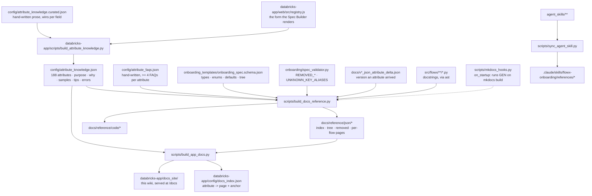

# :material-sync: Docs ↔ code synchronisation

**Every page under `reference/` is derived, never typed. This page is the contract: what derives from what, which check fails when they drift, and the hooks that run those checks before a commit and in CI.** If you change a spec attribute, a control-table column or a docstring, this is the page that tells you which artefacts move with it.

!!! abstract "Quick links"
    - Regenerate everything: `python databricks-app/scripts/build_attribute_knowledge.py && python scripts/build_docs_reference.py && python scripts/build_app_docs.py`
    - Prove nothing is stale: the same three scripts with `--check`, plus `python scripts/sync_agent_skill.py --check`
    - The project's own definition of done, which this page implements for documentation: `AGENTS.md`

## The derivation graph



Three sources of truth sit at the top and nothing below them is edited by hand:

| Source | Owns | Edited when |
|---|---|---|
| `registry.js` | which attributes exist, their type, required flag, Spec Builder section and applicability predicate | a spec attribute is added, renamed or removed |
| `onboarding_spec.schema.json` | structure, enums, defaults, `additionalProperties: false` on every authored container | the same change; the schema and the validator's allowlists are asserted equal |
| `spec_validator.py` | semantics: cross-field rules, removed keys with migration messages, wrong-name aliases | the same change, plus every rule change |

## What is checked, and by what

| Check | Command | Fails when |
|---|---|---|
| Knowledge base is a faithful derivation of the registry | `python databricks-app/scripts/build_attribute_knowledge.py --check` | `registry.js` or the curated prose changed without regenerating `attribute_knowledge.json` |
| Reference pages are current | `python scripts/build_docs_reference.py --check` | any input in the graph above changed without regenerating `docs/reference/**` |
| Schema and validator agree | `pytest tests/unit/test_unknown_key_rejection.py -q` | an attribute exists in one allowlist and not the other |
| Every attribute has its FAQs | `pytest tests/unit/test_attribute_faqs.py -q` | a registry attribute has fewer than four FAQs, a kind is missing, or a FAQ names an attribute the registry does not have |
| Hub navigation and cross-links resolve | `pytest tests/unit/test_docs_hub.py -q` | a nav entry has no file, a generated page lost its banner, the tree misses an attribute, or the generator links to a console heading that does not exist |
| Agent skill copies are byte-identical | `python scripts/sync_agent_skill.py --check` | anything under `agent_skills/` changed without syncing |
| Golden specs still validate | `pytest tests/unit/test_golden_specs.py -q` | a spec an agent copies from now fails the validator |
| Zero warnings on living pages | `python scripts/check_docs_warnings.py` | a broken link or anchor outside `docs/archive/` |

### Pre-commit

`.pre-commit-config.yaml` runs the `--check` variants, filtered by the files a commit touches, so a change to `registry.js` cannot land without `attribute_knowledge.json`, and a change to any generator input cannot land without `docs/reference/**`.

```bash
pip install pre-commit && pre-commit install
pre-commit run --all-files      # once, to baseline
```

Every hook is a check, never an auto-fix: it prints the regeneration command and stops. Auto-rewriting generated files in a hook hides the review of what changed.

### CI

`.github/workflows/docs.yml` runs on any push or pull request touching the graph above: the three `--check` scripts, the sync check, the two hub tests, and a zero-warning `mkdocs build` (with `FLOWX_DOCS_SKIP_REGEN=1`, because step 2 already proved the committed reference current). The built `site/` is uploaded as an artifact for review.

### The MkDocs hook

`scripts/mkdocs_hooks.py` is registered under `hooks:` in `mkdocs.yml`. On `mkdocs build` it runs the generator first, so a local build always reflects the current registry, schema and validator even if you forgot the script. It deliberately does **not** run under `mkdocs serve`: the generator writes inside `docs/`, and a write there during `serve` re-triggers the watcher indefinitely. Under `serve` the committed pages are used; run the generator by hand when you change a source.

## How the spec maps to the runtime

The user-facing question is "where does this key go and what reads it". The answer has three hops.

=== "Spec attribute → control-table column"

    Onboarding (`onboarding/metadata_upsert.py`) folds each flow into one control row; nested blocks are stored as JSON documents. Every attribute entry in the reference prints its **Persisted in** target from these rules.

    | Spec path | Table | Column |
    |---|---|---|
    | root `dataflow_group_id`, `pipeline_parameters`, `spark_config` | `dataflow_group_spec` | `dataflow_group_id`, `pipeline_parameters_json`, `spark_config_json` |
    | root `source_plane` | `dataflow_group_spec` | `source_plane_config_json` |
    | `ingestion_flows[]` scalar fields | `ingestion_flow_spec` | same-named columns (`dataflow_id`, `source_type`, `target_type`, `cdc_load_strategy`, …) |
    | `ingestion_flows[].{source_config, target_config, dq_config, governance_tags}` | `ingestion_flow_spec` | `source_config_json`, `target_config_json`, `dq_config_json`, `governance_tags_json` |
    | `transformation_flows[].{source_inputs, transformation_sql, target_config, dq_config, governance_tags}` | `transformation_flow_spec` | `source_inputs_json`, `transformation_sql`, `target_config_json`, `dq_config_json`, `governance_tags_json` |
    | `reconciliation_flows[].{source_config, target_configs, match_keys, compare_columns, transform_sql, error_handling, logging_config, two_tier_verification, execution_mode, publish_schema, dq_config}` | `reconciliation_flow_spec` | `source_config_json`, `target_configs_json`, `match_keys_json`, `compare_columns_json`, `transform_sql`, `error_handling_json`, `logging_config_json`, `two_tier_verification`, `execution_mode`, `publish_schema`, `dq_config_json` |
    | `observability[].{id, type, mode, enabled, destination_config, auth, retry + timeout_ms}` | `observability_config` | `destination_id`, `destination_type`, `mode`, `enabled`, `destination_config_json`, `auth_config_json`, `retry_config_json` |

    The other three control tables are written by runs, not by onboarding: `onboarding_audit_log` (every onboarding attempt), `reconciliation_run_log` and `reconciliation_mismatch_log` (plus `reconciliation_result`). DDL for all of them: `control_plane/ddl_definitions.py`; columns added after a table first shipped are listed in `ADDITIVE_CONTROL_TABLE_COLUMNS` and applied with `ALTER TABLE … ADD COLUMNS` on setup.

=== "Control row → runtime module"

    | Row / column | Read by | Effect |
    |---|---|---|
    | `dataflow_group_spec.pipeline_parameters_json` | `transformation/parameters.py` via the flow generators and `reconciliation/graph_registration.py` | `${param}` substitution on every update |
    | `dataflow_group_spec.source_plane_config_json` | `engine/source_plane.py` | the Single-Read plan: one base node per external identity per execution mode |
    | `ingestion_flow_spec.source_config_json` | `engine/source_plane.py` → `ingestion/readers.py` | the Auto Loader / Zerobus / ASN.1 read, ZIP and PGP pre-extraction, Bronze transforms |
    | `*_flow_spec.target_config_json` | `engine/flow_generators.py` → `cdc/*`, `storage/table_properties.py`, `crypto/*`, `dq/*`, sink registration | load strategy dispatch, layout, encryption, expectations, sinks |
    | `transformation_flow_spec.source_inputs_json` | `engine/flow_generators.py` → `source_plane.bind()` | `dlt.read` / `dlt.read_stream` bindings, decryption of inputs |
    | `reconciliation_flow_spec.*` | `notebooks/05_reconciliation/05_reconciliation_engine.py` (job) or `reconciliation/graph_registration.py` (pipeline) | comparison, logs, heal lane |
    | `observability_config.*` | `observability/config_loader.py` → `destination_dispatcher.py` / `otel_streaming_sink.py` | triggered or continuous export |
    | `governance_tags_json` | `governance/tags.py` from the post-deployment notebook | `ALTER TABLE … SET TAGS` |

    `agent_skills/reference/module_map.md` is the narrative version of this table, one paragraph per subpackage.

=== "Runtime module → reference page"

    `scripts/build_docs_reference.py::build_code_reference` parses every module under `src/flowx` with `ast` (nothing is imported, so no Spark is needed) and emits one page per package with each public class, method and function signature and the **first sentence of its docstring**. Write that sentence for a reader who will see nothing else: a verb, the effect, the one constraint that matters.

    ```python
    def bind(plan: SourcePlan, consumer_id: str, want_stream: bool) -> DataFrame:
        """Resolve a consumer's read to the plan's base node, streaming or batch, never to the raw path.

        Longer explanation, parameters and raises follow and are not rendered in the reference.
        """
    ```

## Pydantic, honestly

The onboarding spec is **not** a Pydantic model. Its structure is JSON Schema (`onboarding_spec.schema.json`), its semantics are the hand-written `spec_validator.py`, and its in-memory shapes at runtime are frozen dataclasses (`engine/source_plane.py`, `reconciliation/matcher.py`, `observability/*`). The two are kept equal by `tests/unit/test_unknown_key_rejection.py`, which asserts the validator's allowlists match the schema's `properties` container by container. Pydantic appears in one place: the Spec Builder's server settings (`databricks-app/server/settings.py`, `BaseModel` classes for storage roots, actions and docs). The reference pages therefore derive from the schema and the validator, not from model introspection, and that is why they can be built anywhere Python runs.

## Changing a spec attribute: the documentation half of the definition of done

`AGENTS.md` lists nine steps for any framework change. Steps 3 to 7 are the ones this page automates or guards:

1. Change `registry.js`, the JSON schema and `spec_validator.py` together (the equivalence test forces the last two).
2. `python databricks-app/scripts/build_attribute_knowledge.py`; add curated prose to `attribute_knowledge.curated.json` if the derived entry is thin.
3. Write the four FAQs in `attribute_faqs.json` (`tests/unit/test_attribute_faqs.py` is red until you do).
4. Record the attribute in the release's `docs/vX.Y.Z_json_attribute_delta.json` so the reference shows its `vX.Y.Z+` badge and the "Recently added" table lists it.
5. `python scripts/build_docs_reference.py`, then `python scripts/build_app_docs.py` so the app's `/docs` route and its per-attribute **docs** links follow.
6. Update the pillar page and any `docs/*.md` prose that names the attribute; `python scripts/check_docs_warnings.py`.
7. `python scripts/sync_agent_skill.py` if `agent_skills/` changed.

For a **removal**, the validator must reject the key with a migration message, never ignore it; the [Removed & rejected](json/removed.md) page then updates itself from the dictionary you add to.

## Related

- [Master configuration reference](json/index.md) · [Spec tree view](json/tree.md) · [Removed & rejected](json/removed.md)
- [Code reference](code/index.md)
- [Agent skills & tools](../console/agent_skills.md) — the skill copies this page keeps in sync
