# 🧪 Metaflow — Master Testing Plan & Pipeline-Job Architecture

> **Role & Authority**: Databricks Solutions Architect & Lakeflow Framework Specialist  
> **Target Platform**: Databricks Lakeflow Declarative Pipelines (Delta Live Tables), Unity Catalog, Delta Lake, Databricks Asset Bundles (DAB)  
> **Document Location**: `metaflow_testing/TESTING_PLAN.md`  
> **Catalog Scope**: `{{catalog}}` (e.g., `metaflow`, `poc`, `dev`)  

---

## 0. Live Execution Status — `dev_metaflow` workspace (2026-08-29)

> **Read this before treating any row in §3 as verified.** The tables in §3 are the *planned*
> specification. This section records what has actually been executed against the
> `dev_metaflow` workspace (`dbc-2f6b7d4f-8c5b.cloud.databricks.com`, catalog `metaflow`,
> profile `<redacted-profile>`) and what the failures really were.
> Authoritative per-test detail lives in [`TESTING_STATUS.md`](TESTING_STATUS.md) §0.

### Targeted pipeline-failure investigation (latest pass)

Five specifically-named failing pipelines were diagnosed from their own Lakeflow event streams
(not from runner logs) and fixed. **Every one of the five turned out to be a real defect** —
none was the harness artefact the earlier taxonomy assumed — and four of the five were defects
this release introduced or left latent.

**Outcome: 5 of 5 now PASS on `dev_metaflow`.**

| Pipeline / test | Root cause established from live events | Fix | Verified |
|---|---|---|---|
| `metaflow_test_ing_004_asn1_decode` | `[CF_UNKNOWN_OPTION_KEYS_ERROR] cloudFiles.filenamepattern`. `cloudFiles.fileNamePattern` **is not a valid Auto Loader option for any format** — the `cloudFiles.` key whitelist is checked without consulting `cloudFiles.format`. The earlier "make it format-aware" fix only corrected `binaryFile`, leaving every other format on the invalid spelling. | `_apply_common_autoloader_options` now emits the generic, un-prefixed `pathGlobFilter` for **all** formats. | ✅ PASS |
| `metaflow_test_002_zerobus` | `DELTA_SOURCE_TABLE_IGNORE_CHANGES`. The seeder MERGEd into `zerobus_source_bus` with `whenMatchedUpdate()`, rewriting already-present rows on every re-seed. A Delta **streaming source must be append-only**, so the second seed permanently poisoned the stream. | Both zerobus seeders are now **insert-only**; one full refresh cleared the historical MERGE commit. | ✅ PASS (incl. end-to-end 002-003 job) |
| `metaflow_test_cdc_002_truncate` | `Graph is not topologically sorted. There is a cycle between dim_fx_rates_current and dim_fx_rates_current`. v1.3.0's E09 empty-source guard made the target read **itself**. | E09's in-graph guard **withdrawn** — see below. | ✅ PASS |
| `metaflow_test_cdc_006_snapshot_pk` | Three stacked failures, each revealed by fixing the previous: `TABLE_OR_VIEW_NOT_FOUND` → `REFERENCE_DLT_DATASET_OUTSIDE_QUERY_DEFINITION` → `View ... is a streaming view and must be referenced using readStream`. A lambda passed to `apply_changes_from_snapshot` **may not reference any pipeline dataset**. | Snapshot input is now a real `@dlt.table` dataset (delete-value filter + `primary_keys` presence guard inside it), passed to `apply_changes_from_snapshot` **by name**; `is_streaming` threaded down so the upstream is read with the matching API. | ✅ PASS |
| `metaflow_test_cdc_007_snapshot_nopk` | Same as CDC-006, then a `setup_control_tables` race: concurrent jobs hit `[ROUTINE_ALREADY_EXISTS]` on `preflight_check_onboarding_spec`. UC's `CREATE OR REPLACE FUNCTION` is idempotent in intent but **not atomic**. | Same snapshot fix, plus a narrow `is_already_exists_race()` tolerance shared by the provisioner and the setup notebook. | ✅ PASS |

### E09 (`empty_target_if_source_empty`) is WITHDRAWN

The guard preserved a `TRUNCATE_AND_LOAD` target by recomputing it from its own previous
contents — i.e. the dataset reads itself, which Lakeflow rejects outright. Its eager emptiness
test is independently unusable: `_clean_upstream` runs during graph **construction**, when an
upstream produced by the same update legitimately holds no data, so "source is empty" and
"source not yet materialized" cannot be told apart. **Every `TRUNCATE_AND_LOAD` pipeline failed
100% of the time.** The option remains valid in specs but has no runtime effect; enforcing it
needs a post-update check outside the pipeline graph. See `docs/03_transformation_and_cdc.md`.

### Known limitation: snapshot CDC over an append-only landing zone

`apply_changes_from_snapshot` treats its source dataset's *current contents* as the latest full
snapshot. With a streaming Auto Loader upstream those contents **accumulate**, so once a Day-2
extract lands the dataset holds Day-1 ∪ Day-2: keys dropped in Day-2 are never deleted and
modified keys appear twice. Single-snapshot flows are correct; the Day-1/Day-2 diffing described
in §3 for `TC-CDC-006`/`TC-CDC-007` is **not** supported by this wiring and cannot be, because no
named dataset can mean "only the most recently arrived snapshot". The supported Lakeflow pattern
is the lambda form reading a versioned **path** per snapshot (legal, because a path is not a
pipeline dataset). Adopting it needs a new spec contract for locating snapshot versions and
changes how DQ/quarantine applies to snapshot flows — deliberately not attempted here.

### Earlier full-suite pass: failure taxonomy

| Cause | Count | Framework defect? | Detail |
|---|---|---|---|
| `Pipeline update already in progress` | 8 | **No** — test-harness defect | Several `TC-*` cases deliberately **share a Lakeflow pipeline** (e.g. `TC-GOV-002` reuses `TC-GOV-001`'s pipeline). The wave runner ran them concurrently. **Cases that share a pipeline must be serialised.** |
| `ENVIRONMENT_PIP_INSTALL_ERROR` | 3+ | **No** — build/deploy infrastructure | A `bundle deploy` during a running update removed the wheel being installed. Unique per-deploy wheel filenames (`scripts/bump_and_build.py`) prevent overwrite-in-place, but DABs prunes `<artifact_path>/.internal/` — on a UC Volume exactly as in the workspace — so the real rule is **never deploy mid-run** (runner requirement 2 below). As of v1.6.0 artifacts live at `/Volumes/<catalog>/config/wheels`. |
| `[ROUTINE_ALREADY_EXISTS]` in `setup_control_tables` | 1 | **Yes** (now fixed) | Concurrent jobs racing UC function creation — see the table above. |
| **Expected-failure test misclassified** | 1 | **No** — harness defect | See `TC-DQ-003` below. |

### `TC-DQ-003` is a PASS, not a failure

`TC-DQ-003`'s own assertion in §3 Module 4 reads: *"Pipeline update status returns `FAILED`.
Task 1 in workflow job fails with `ExpectationViolationException`."* The live run produced
exactly that. The wave runner classifies purely on job-level terminal state, so it recorded a
FAIL. **For any negative/expected-failure test the job status must be inverted.** Affected rows:
`TC-DQ-003` and `TC-PRM-006`.

### Runner requirements this run established

1. **Serialise pipeline-sharing cases.** Concurrency > 1 across cases sharing a pipeline
   produces `Pipeline update already in progress`.
2. **Never `bundle deploy` while a wave is running** — jobs launched before the deploy still run
   the previous wheel, so results are attributed to the wrong build.
3. **Invert the assertion for expected-failure tests** (`TC-DQ-003`, `TC-PRM-006`).
4. **Keep concurrency ≤3 overall** on a free-tier workspace to avoid `RESOURCE_EXHAUSTED` /
   `QUOTA_EXCEEDED` (~50 schemas per catalog, ~50 volumes per metastore).
5. **A `bundle deploy` can silently skip changed notebooks.** DABs' sync snapshot under
   `.databricks/bundle/<target>/sync-snapshots/` goes stale and reports `Files: 0 uploaded` while
   the workspace keeps running the old notebook. Delete it and redeploy, then verify with
   `databricks workspace export <path>/notebooks/<dir>/<name> --format SOURCE` (**no `.py`
   extension** on the deployed path).

---

## 1. Executive Summary & Testing Framework Architecture

The **NextGen Metadata Framework (Metaflow)** is a configuration-driven ETL/ELT platform on Databricks Lakeflow Declarative Pipelines. 

### Core Testing Mandate
To ensure enterprise-grade reliability, configuration flexibility, and zero feature regression:
1. **Isolated Pipeline Per Test Case**: Every test scenario executes through its own dedicated, isolated Lakeflow Declarative Pipeline.
2. **Standard 2-Task Workflow Job Wrapper**: Each pipeline is wrapped inside a dedicated Databricks Workflow Job containing exactly two chained tasks:
   * **Task 1 (`run_pipeline_task`)**: Executes the specific Lakeflow Declarative Pipeline update.
   * **Task 2 (`run_observability_task`)**: Executes the DLT Observability Engine (`08_dlt_observability_engine.py`), consuming the dynamic pipeline ID `${resources.pipelines.<pipeline_name>.id}` to extract DLT event logs, validate execution telemetry, and emit OpenTelemetry (OTEL) payloads.
3. **End-to-End Parameterization & Dynamic Templating**: Comprehensive evaluation of dynamic parameters (`${param}`) and template variables (`{{catalog}}`, `{{env}}`) across all system components: file paths, ZIP landing/staging volumes, transformation SQL filters, reconciliation filter conditions, self-healing SQL, DQ boundary expressions, sink egress file naming, and observability telemetry tags.
4. **Realistic Production Scenarios**: Tests include edge cases such as selective glob pattern matching (e.g., matching vs non-matching files in the same volume directory), schema evolution rescue routing, malformed data quarantining, encryption key rotation, and cross-dataset drift self-healing.
5. **Explicit Databricks Object Naming**: Full declaration of target Catalogs, Schemas, Tables, Companion Tables (`_quarantine`, `_current`), Volume paths, Secret scopes/keys, Pipeline resources, and Job resources.

---

## 2. Standard 2-Task DAB Workflow Execution Architecture

Every test scenario defined in this plan implements the following Databricks Asset Bundle (DAB) resource architecture:

```mermaid
flowchart LR
    subgraph DAB_WORKFLOW_JOB["Databricks Workflow Job: metaflow_test_<module>_<scenario>_job"]
        direction LR
        subgraph TASK_1["Task 1: run_pipeline_task"]
            T1[Lakeflow Pipeline Task<br><b>pipeline_id</b>: metaflow_test_&lt;scenario&gt;_pipeline]
        end
        
        subgraph TASK_2["Task 2: run_observability_task"]
            T2[Observability Notebook Task<br><b>notebook_path</b>: 08_dlt_observability_engine.py<br><b>4 required task parameters</b>: dataflow_group_id, catalog, env,<br>pipeline_task_run_id = &#123;&#123;tasks.&lt;pipeline_task_key&gt;.run_id&#125;&#125;]
        end

        TASK_1 -->|On Success| TASK_2
    end

    subgraph LAKEFLOW_RUNTIME["Lakeflow Declarative Execution (Task 1)"]
        direction TB
        E1[Source Volume / Delta Bus] --> E2[Bronze / Silver / Gold DAG]
        E2 --> E3[Materialized Tables & Egress Volumes]
        E2 -.->|System Telemetry| DLT_LOGS[(DLT Event Log)]
    end

    subgraph OBSERVABILITY_RUNTIME["Observability Engine Execution (Task 2)"]
        direction TB
        DLT_LOGS --> O1[Extract Events & Lineage]
        O1 --> O2[Build OTEL JSON Schema]
        O2 --> O3[Dispatch to Volume JSONL.gz & OTLP Endpoint]
    end

    TASK_1 -.-> LAKEFLOW_RUNTIME
    TASK_2 -.-> OBSERVABILITY_RUNTIME
```



### Standard DAB Resource Definition Template (YAML Reference)

```yaml
resources:
  pipelines:
    metaflow_test_<module>_<scenario>_pipeline:
      name: "Metaflow Test - <Module> - <Scenario> Pipeline"
      target: ${var.catalog}
      configuration:
        dataflow_group_id: "dfg_test_<module>_<scenario>"
        catalog: ${var.catalog}
        env: ${var.env}
      libraries:
        - notebook:
            path: ../notebooks/03_engine/03_lakeflow_declarative_pipeline.py

  jobs:
    metaflow_test_<module>_<scenario>_job:
      name: "Metaflow Test - <Module> - <Scenario> - 2-Task Workflow"
      tasks:
        - task_key: run_pipeline_task
          pipeline_task:
            pipeline_id: ${resources.pipelines.metaflow_test_<module>_<scenario>_pipeline.id}
          environment_key: framework_env

        - task_key: run_observability_task
          depends_on:
            - task_key: run_pipeline_task
          notebook_task:
            notebook_path: ../notebooks/08_observability/08_dlt_observability_engine.py
            base_parameters:
              pipeline_id: ${resources.pipelines.metaflow_test_<module>_<scenario>_pipeline.id}
              catalog: ${var.catalog}
              dataflow_group_id: "dfg_test_<module>_<scenario>"
          environment_key: framework_env

      environments:
        - framework_env:
          spec:
            environment_version: "4"
            dependencies:
              - ../dist/*.whl
```

---

## 3. Modular Testing Plan & Specification Tables

---

### Module 1: Ingestion Engine & Source Adapters

Tests Auto Loader file discovery, regex/glob filtering, ZIP decompression/retention, Zerobus streaming Delta reads, binary ASN.1 telecom CDR decoding, landing PGP decryption, JSON flattening, column standardization, and technical metadata enrichment.

| Test Case No | Testing Functionality & Objective | Realistic Production Scenario | Databricks Object Names | Proposed Pipeline & Job Architecture | Expected Output & Verification Logic |
| :--- | :--- | :--- | :--- | :--- | :--- |
| **TC-ING-001** | **Selective Glob Pattern ZIP Extraction**<br>Verify Auto Loader only extracts and ingests archives matching pattern, ignoring non-matching files. | Landing volume contains 2 files:<br>1. `customer_data_20260828.zip` (matches pattern `customer_*.zip`, has 100 rows).<br>2. `vendor_feed_20260828.zip` (does not match pattern, has 50 rows).<br>Framework must extract *only* `customer_*.zip` into staging and ingest 100 rows. `vendor_feed` must remain untouched in incoming volume. | • **Catalog**: `{{catalog}}`<br>• **Schema**: `bronze_crm`<br>• **Target Table**: `customer_raw`<br>• **Landing Volume**: `/Volumes/{{catalog}}/crm/landing_zip/incoming/`<br>• **Extract Volume**: `/Volumes/{{catalog}}/crm/landing_zip/extracted/customer/`<br>• **Schema Vol**: `/Volumes/{{catalog}}/crm/_schemas/customer/` | • **Pipeline**: `metaflow_test_ing_001_zip_filter_pipeline`<br>• **Job**: `metaflow_test_ing_001_zip_filter_job`<br>• **Task 1**: `run_pipeline_task`<br>• **Task 2**: `run_observability_task` (`pipeline_id`, `catalog`, `dataflow_group_id`) | **SQL Assertion**:<br>`SELECT count(*) FROM {{catalog}}.bronze_crm.customer_raw;` → exactly 100 rows.<br>`vendor_feed` records appear nowhere in target table.<br>`vendor_feed_20260828.zip` remains intact in incoming Volume. |
| **TC-ING-002** | **ZIP Source Purge Retention Policy**<br>Verify `delete_source_after_extract: true` cleans incoming volume while keeping extracted files. | Incoming volume receives `orders_batch_01.zip`. Pipeline extracts CSV to extracted volume and deletes original `.zip` archive from incoming Volume upon successful unpack. | • **Catalog**: `{{catalog}}`<br>• **Schema**: `bronze_sales`<br>• **Target Table**: `orders_raw`<br>• **Landing Volume**: `/Volumes/{{catalog}}/sales/landing_zip/incoming/`<br>• **Extract Volume**: `/Volumes/{{catalog}}/sales/landing_zip/extracted/orders/` | • **Pipeline**: `metaflow_test_ing_002_zip_retention_pipeline`<br>• **Job**: `metaflow_test_ing_002_zip_retention_job`<br>• **Task 1**: `run_pipeline_task`<br>• **Task 2**: `run_observability_task` | **Volume Verification**:<br>`orders_batch_01.zip` is removed from incoming volume.<br>Extracted CSV exists in extracted volume.<br>`orders_raw` contains expected rows. |
| **TC-ING-003** | **Zerobus Streaming Delta Feed Ingestion**<br>Verify direct streaming ingestion from a source Delta CDC bus table into a Bronze streaming table. | Source Delta table `zerobus_source_bus` has 1,000 baseline records. During pipeline run, 200 new records are appended to `zerobus_source_bus`. Pipeline must stream all 1,200 records into `zerobus_bronze`. | • **Catalog**: `{{catalog}}`<br>• **Source Schema**: `excalibur_usecase`<br>• **Source Table**: `zerobus_source_bus`<br>• **Target Schema**: `bronze_excalibur`<br>• **Target Table**: `zerobus_bronze`<br>• **Checkpoint**: `/Volumes/{{catalog}}/excalibur_usecase/_checkpoints/zerobus/` | • **Pipeline**: `metaflow_test_ing_003_zerobus_stream_pipeline`<br>• **Job**: `metaflow_test_ing_003_zerobus_stream_job`<br>• **Task 1**: `run_pipeline_task`<br>• **Task 2**: `run_observability_task` | **SQL Assertion**:<br>`SELECT count(*) FROM {{catalog}}.bronze_excalibur.zerobus_bronze;` → 1,200.<br>Change Data Feed verifies exactly 200 streaming append events on update. |
| **TC-ING-004** | **ASN.1 Binary Telecom CDR Decoding**<br>Verify schema-based parsing of binary BER/ASN.1 telecom call logs into structured Delta columns. | Landing volume receives binary `.ber` CDR file with multi-level nested fields (Call Duration, IMSI, IMEI, Cell ID, Roaming Flags). ASN.1 decoder parses binary stream without byte corruption. | • **Catalog**: `{{catalog}}`<br>• **Schema**: `bronze_telecom`<br>• **Target Table**: `cdr_stream_raw`<br>• **ASN.1 Schema File**: `/Volumes/{{catalog}}/telecom/schemas/gsm_cdr.asn`<br>• **Landing Volume**: `/Volumes/{{catalog}}/telecom/landing_cdr/incoming/` | • **Pipeline**: `metaflow_test_ing_004_asn1_decode_pipeline`<br>• **Job**: `metaflow_test_ing_004_asn1_decode_job`<br>• **Task 1**: `run_pipeline_task`<br>• **Task 2**: `run_observability_task` | **SQL Assertion**:<br>`SELECT count(*) FROM {{catalog}}.bronze_telecom.cdr_stream_raw WHERE imsi IS NOT NULL AND call_duration_sec > 0;` matches binary record count.<br>Zero decoding exception rows in error log. |
| **TC-ING-005** | **Landing PGP Decryption via UC Secrets**<br>Verify automated decryption of armored `.zip.pgp` landing archives using private key and passphrase from UC Secrets. | Partner drops `financial_txns_202608.zip.pgp` encrypted with team public key into landing volume. Framework decrypts archive in-memory using UC secret key, unpacks CSV, and loads Bronze table. | • **Catalog**: `{{catalog}}`<br>• **Schema**: `bronze_finance`<br>• **Target Table**: `txns_raw`<br>• **Secret Scope**: `metaflow_crypto_scope`<br>• **Secret Key**: `pgp_private_key_finance`<br>• **Landing Volume**: `/Volumes/{{catalog}}/finance/landing_pgp/` | • **Pipeline**: `metaflow_test_ing_005_pgp_decrypt_pipeline`<br>• **Job**: `metaflow_test_ing_005_pgp_decrypt_job`<br>• **Task 1**: `run_pipeline_task`<br>• **Task 2**: `run_observability_task` | **SQL Assertion**:<br>`txns_raw` contains expected rows in plaintext.<br>No intermediate decrypted plaintext files persisted to permanent storage. |
| **TC-ING-006** | **Nested JSON Struct Flattening (`explode_columns`)**<br>Verify automatic flattening of nested JSON arrays and struct payloads into relational columns. | Ingest IoT device event JSON stream containing `{"device_id": "D1", "metrics": [{"sensor": "temp", "val": 22.5}, {"sensor": "pressure", "val": 101.3}]}`. Explode `metrics` array into discrete rows. | • **Catalog**: `{{catalog}}`<br>• **Schema**: `bronze_iot`<br>• **Target Table**: `sensor_telemetry_flat`<br>• **Landing Volume**: `/Volumes/{{catalog}}/iot/landing_json/` | • **Pipeline**: `metaflow_test_ing_006_json_explode_pipeline`<br>• **Job**: `metaflow_test_ing_006_json_explode_job`<br>• **Task 1**: `run_pipeline_task`<br>• **Task 2**: `run_observability_task` | **SQL Assertion**:<br>`SELECT count(*) FROM {{catalog}}.bronze_iot.sensor_telemetry_flat;` → 2 rows per device.<br>Columns `metrics_sensor` and `metrics_val` are properly mapped. |
| **TC-ING-007** | **Inline Data Standardization SQL**<br>Verify `data_standardization_sql` sanitizes string whitespace, casing, and formatted codes. | Ingest CSV with dirty values: `"  us-east  "`, `"Acme Corp LLC"`, `" invalid-email@test.com  "`. Expressions apply `TRIM(UPPER(region))`, `LOWER(TRIM(email))`. | • **Catalog**: `{{catalog}}`<br>• **Schema**: `bronze_master`<br>• **Target Table**: `companies_standardized`<br>• **Landing Volume**: `/Volumes/{{catalog}}/master/landing_companies/` | • **Pipeline**: `metaflow_test_ing_007_standardize_pipeline`<br>• **Job**: `metaflow_test_ing_007_standardize_job`<br>• **Task 1**: `run_pipeline_task`<br>• **Task 2**: `run_observability_task` | **SQL Assertion**:<br>`SELECT count(*) FROM {{catalog}}.bronze_master.companies_standardized WHERE region = 'US-EAST' AND email = 'invalid-email@test.com';` equals total row count. |
| **TC-ING-008** | **Technical Metadata Enrichment & Ordering**<br>Verify injection of all 8 `__framework_*` columns and assert business columns precede framework columns. | Ingest standard CSV feed. Target Delta table must append `_rescued_data`, `__framework_source_file_name`, `__framework_source_file_size`, `__framework_source_file_modification_time`, `__framework_ingestion_timestamp_utc`, `__framework_pipeline_run_id`, `__framework_record_id`. | • **Catalog**: `{{catalog}}`<br>• **Schema**: `bronze_ea`<br>• **Target Table**: `departments_raw`<br>• **Landing Volume**: `/Volumes/{{catalog}}/ea/landing_csv/` | • **Pipeline**: `metaflow_test_ing_008_tech_metadata_pipeline`<br>• **Job**: `metaflow_test_ing_008_tech_metadata_job`<br>• **Task 1**: `run_pipeline_task`<br>• **Task 2**: `run_observability_task` | **Schema Assertion**:<br>Table schema inspection proves `dept_id`, `dept_name` are at column index 0, 1.<br>Technical metadata columns reside at trailing indices and have non-null values. |
| **TC-ING-009** | **Schema Evolution & Malformed Column Rescue**<br>Verify `schema_evolution_mode: rescue` isolates unexpected schema drift into `_rescued_data`. | Day-1 file has `[id, name]`. Day-2 file has unexpected column `[id, name, unannounced_flag]` plus a corrupt non-numeric string in a float column. Target must not fail. | • **Catalog**: `{{catalog}}`<br>• **Schema**: `bronze_ops`<br>• **Target Table**: `feed_rescued_raw`<br>• **Landing Volume**: `/Volumes/{{catalog}}/ops/landing_drift/` | • **Pipeline**: `metaflow_test_ing_009_rescue_schema_pipeline`<br>• **Job**: `metaflow_test_ing_009_rescue_schema_job`<br>• **Task 1**: `run_pipeline_task`<br>• **Task 2**: `run_observability_task` | **SQL Assertion**:<br>`SELECT count(*) FROM {{catalog}}.bronze_ops.feed_rescued_raw WHERE _rescued_data IS NOT NULL;` equals count of schema-drifted rows. |

---

### Module 2: Change Data Capture (CDC) Strategies

Tests the 6 CDC merge and history strategies implemented via `dlt.apply_changes()` and `apply_changes_from_snapshot()`.

| Test Case No | Testing Functionality & Objective | Realistic Production Scenario | Databricks Object Names | Proposed Pipeline & Job Architecture | Expected Output & Verification Logic |
| :--- | :--- | :--- | :--- | :--- | :--- |
| **TC-CDC-001** | **Streaming Append-Only Fact Loading (`APPEND`)**<br>Verify facts/logs stream into target Delta table without key deduplication or history overhead. | Clickstream telemetry events land in micro-batches. Multiple events carry identical `user_id` and `timestamp`. Target table appends every event verbatim. | • **Catalog**: `{{catalog}}`<br>• **Schema**: `bronze_web`<br>• **Target Table**: `page_clicks_stream`<br>• **Landing Volume**: `/Volumes/{{catalog}}/web/landing_clicks/` | • **Pipeline**: `metaflow_test_cdc_001_append_pipeline`<br>• **Job**: `metaflow_test_cdc_001_append_job`<br>• **Task 1**: `run_pipeline_task`<br>• **Task 2**: `run_observability_task` | **SQL Assertion**:<br>`SELECT count(*) FROM {{catalog}}.bronze_web.page_clicks_stream;` equals sum of rows across all micro-batches. |
| **TC-CDC-002** | **Full Materialized View Snapshot (`TRUNCATE_AND_LOAD`)**<br>Verify small reference dimensions full-recompute on each batch without stale rows. | Daily FX currency rates table arrives as a full replacement extract (50 rows). Pipeline recomputes materialized view and discards superseded rates. | • **Catalog**: `{{catalog}}`<br>• **Schema**: `silver_ref`<br>• **Target Table**: `dim_fx_rates_current`<br>• **Source Table**: `{{catalog}}.bronze_ref.fx_rates_raw` | • **Pipeline**: `metaflow_test_cdc_002_truncate_pipeline`<br>• **Job**: `metaflow_test_cdc_002_truncate_job`<br>• **Task 1**: `run_pipeline_task`<br>• **Task 2**: `run_observability_task` | **SQL Assertion**:<br>`SELECT count(*) FROM {{catalog}}.silver_ref.dim_fx_rates_current;` equals exactly 50 rows. No historical accumulation. |
| **TC-CDC-003** | **SCD Type 1 Overwrite with Delete Mapping (`SCD1`)**<br>Verify SCD1 upserts latest customer attributes and physically drops records matching delete operation codes. | Day-1: Customer `C001` created with `tier: SILVER`.<br>Day-2: `C001` updated to `tier: PLATINUM`, `C002` sent with `cdc_op: DELETED`.<br>Target must hold 1 row for `C001` (PLATINUM) and 0 rows for `C002`. | • **Catalog**: `{{catalog}}`<br>• **Schema**: `silver_crm`<br>• **Target Table**: `dim_customer_scd1`<br>• **Landing Volume**: `/Volumes/{{catalog}}/crm/landing_customer/` | • **Pipeline**: `metaflow_test_cdc_003_scd1_pipeline`<br>• **Job**: `metaflow_test_cdc_003_scd1_job`<br>• **Task 1**: `run_pipeline_task`<br>• **Task 2**: `run_observability_task` | **SQL Assertion**:<br>`SELECT tier FROM {{catalog}}.silver_crm.dim_customer_scd1 WHERE customer_id = 'C001';` → `PLATINUM`.<br>`SELECT count(*) FROM {{catalog}}.silver_crm.dim_customer_scd1 WHERE customer_id = 'C002';` → 0. |
| **TC-CDC-004** | **SCD Type 2 Full History & Active View (`SCD2`)**<br>Verify SCD2 creates new version rows with `__START_AT`/`__END_AT` timestamps and updates companion `<target>_current` view. | Day-1: Employee `E101` in Dept `D1`.<br>Day-2: `E101` transferred to Dept `D2`.<br>Target table must contain 2 rows for `E101` (historical `D1` closed with `__END_AT`, active `D2` with `__END_AT IS NULL`). Companion view returns only active row. | • **Catalog**: `{{catalog}}`<br>• **Schema**: `silver_hr`<br>• **Target Table**: `dim_employee_scd2`<br>• **Companion View**: `dim_employee_scd2_current`<br>• **Landing Volume**: `/Volumes/{{catalog}}/hr/landing_emp/` | • **Pipeline**: `metaflow_test_cdc_004_scd2_pipeline`<br>• **Job**: `metaflow_test_cdc_004_scd2_job`<br>• **Task 1**: `run_pipeline_task`<br>• **Task 2**: `run_observability_task` | **SQL Assertion**:<br>`SELECT count(*) FROM {{catalog}}.silver_hr.dim_employee_scd2 WHERE employee_id = 'E101';` → 2.<br>`SELECT dept_id FROM {{catalog}}.silver_hr.dim_employee_scd2_current WHERE employee_id = 'E101';` → `D2`. |
| **TC-CDC-005** | **SCD Type 3 Current & Previous State (`SCD3`)**<br>Verify SCD3 tracks current and previous attribute values in dedicated columns (`current_status`, `previous_status`). | Customer status updates from `TRIAL` to `ACTIVE`, then from `ACTIVE` to `CHURNED`. Target stores `current_status = 'CHURNED'` and `previous_status = 'ACTIVE'`. | • **Catalog**: `{{catalog}}`<br>• **Schema**: `silver_sub`<br>• **Target Table**: `dim_subscription_scd3`<br>• **Landing Volume**: `/Volumes/{{catalog}}/sub/landing_sub/` | • **Pipeline**: `metaflow_test_cdc_005_scd3_pipeline`<br>• **Job**: `metaflow_test_cdc_005_scd3_job`<br>• **Task 1**: `run_pipeline_task`<br>• **Task 2**: `run_observability_task` | **SQL Assertion**:<br>`SELECT current_status, previous_status FROM {{catalog}}.silver_sub.dim_subscription_scd3 WHERE sub_id = 'S100';` → `CHURNED`, `ACTIVE`. |
| **TC-CDC-006** | **Full Snapshot Diffing with Natural PK (`FULL_SNAPSHOT_CDC`)**<br>Verify daily full dumps detect inserts, updates, and deletes via `apply_changes_from_snapshot`. | Day-1 snapshot contains keys `[1, 2, 3]`.<br>Day-2 snapshot contains keys `[2, 3_modified, 4]` (key 1 absent).<br>Target inserts key 4, updates key 3, and applies soft/hard delete to key 1. | • **Catalog**: `{{catalog}}`<br>• **Schema**: `silver_inventory`<br>• **Target Table**: `inventory_snapshot_cdc`<br>• **Landing Volume**: `/Volumes/{{catalog}}/inventory/landing_dumps/` | • **Pipeline**: `metaflow_test_cdc_006_snapshot_pk_pipeline`<br>• **Job**: `metaflow_test_cdc_006_snapshot_pk_job`<br>• **Task 1**: `run_pipeline_task`<br>• **Task 2**: `run_observability_task` | **SQL Assertion**:<br>`SELECT item_id FROM {{catalog}}.silver_inventory.inventory_snapshot_cdc;` contains keys 2, 3, 4 and excludes key 1. |
| **TC-CDC-007** | **Full Snapshot Diffing on a Legacy Extract (`FULL_SNAPSHOT_CDC`)**<br>Verify a daily full dump whose only usable key is a wide string column diffs correctly on `target_config.primary_keys`. | Legacy mainframe full extract keyed on `customer_name` (unique across all 10 rows). Day-2 dump changes one customer's `customer_status` and another's `customer_city`, removes 1 customer and adds 1. Each attribute change must land as an **update in place** — one row per key, never a delete plus a re-insert under a new identity. | • **Catalog**: `{{catalog}}`<br>• **Schema**: `silver_legacy`<br>• **Target Table**: `mainframe_accounts_cdc`<br>• **Landing Volume**: `/Volumes/{{catalog}}/legacy/landing_mainframe/` | • **Pipeline**: `metaflow_test_cdc_007_snapshot_nopk_pipeline`<br>• **Job**: `metaflow_test_cdc_007_snapshot_nopk_job`<br>• **Task 1**: `run_pipeline_task`<br>• **Task 2**: `run_observability_task` | **SQL Assertion**:<br>`SELECT count(*) FROM {{catalog}}.silver_legacy.mainframe_accounts_cdc;` → exactly 10 rows on both days (1 delete, 1 insert).<br>`customer_name` is unique — `GROUP BY customer_name HAVING count(*) > 1` returns 0 rows.<br>`John Smith` → `customer_status = 'INACTIVE'`; `Wei Zhang` absent; `Noah Kim` present. |

---

### Module 3: Medallion Transformations & Complex SQL

Tests multi-input streaming/batch joins, `UNION ALL` consolidation, dynamic parameter substitution, and column decryption inside transformation queries.

| Test Case No | Testing Functionality & Objective | Realistic Production Scenario | Databricks Object Names | Proposed Pipeline & Job Architecture | Expected Output & Verification Logic |
| :--- | :--- | :--- | :--- | :--- | :--- |
| **TC-TRF-001** | **Multi-Source Streaming-to-Batch 4-Way Inner Join**<br>Verify joining 1 streaming driving table against 3 static lookup tables correctly excludes unassigned entities. | Ingest fact table `assignments_raw` (streaming) and 3 dimension tables: `employees_raw`, `departments_raw`, `projects_raw` (batch). Employee `E005` has no assignment. Inner join must output exactly 5 matched rows and exclude `E005`. | • **Catalog**: `{{catalog}}`<br>• **Source Schema**: `bronze_ea`<br>• **Target Schema**: `silver_ea`<br>• **Target Table**: `ea_joined_assignments`<br>• **Source Tables**: `assignments_raw`, `employees_raw`, `departments_raw`, `projects_raw` | • **Pipeline**: `metaflow_test_trf_001_4way_join_pipeline`<br>• **Job**: `metaflow_test_trf_001_4way_join_job`<br>• **Task 1**: `run_pipeline_task`<br>• **Task 2**: `run_observability_task` | **SQL Assertion**:<br>`SELECT count(*) FROM {{catalog}}.silver_ea.ea_joined_assignments;` → exactly 5 rows.<br>`SELECT count(*) FROM {{catalog}}.silver_ea.ea_joined_assignments WHERE employee_id = 'E005';` → 0. |
| **TC-TRF-002** | **Multi-Regional Ingestion `UNION ALL` Consolidation**<br>Verify consolidating heterogeneous regional tables into a single enterprise Silver dataset. | Region A lands `orders_na_raw` (500 rows). Region B lands `orders_eu_raw` (400 rows). Transformation executes `SELECT * FROM orders_na_raw UNION ALL SELECT * FROM orders_eu_raw`. | • **Catalog**: `{{catalog}}`<br>• **Source Schema**: `bronze_sales`<br>• **Target Schema**: `silver_sales`<br>• **Target Table**: `all_global_orders`<br>• **Source Tables**: `orders_na_raw`, `orders_eu_raw` | • **Pipeline**: `metaflow_test_trf_002_union_all_pipeline`<br>• **Job**: `metaflow_test_trf_002_union_all_job`<br>• **Task 1**: `run_pipeline_task`<br>• **Task 2**: `run_observability_task` | **SQL Assertion**:<br>`SELECT count(*) FROM {{catalog}}.silver_sales.all_global_orders;` → exactly 900 rows.<br>Both regional codes represented. |
| **TC-TRF-003** | **In-DAG Column Decryption for Business Computations**<br>Verify encrypted Bronze columns are decrypted in-memory before executing transformation SQL calculations. | Bronze table `patient_visits_raw` stores AES-encrypted `billing_amount`. Transformation specifies `source_inputs[].decrypted_columns: ["billing_amount"]` and calculates running revenue totals. | • **Catalog**: `{{catalog}}`<br>• **Source Schema**: `bronze_health`<br>• **Target Schema**: `silver_health`<br>• **Target Table**: `patient_billing_summary` | • **Pipeline**: `metaflow_test_trf_003_decrypt_transform_pipeline`<br>• **Job**: `metaflow_test_trf_003_decrypt_transform_job`<br>• **Task 1**: `run_pipeline_task`<br>• **Task 2**: `run_observability_task` | **SQL Assertion**:<br>`SELECT sum(billing_amount) FROM {{catalog}}.silver_health.patient_billing_summary;` returns exact numerical sum of decrypted plaintext values. |

---

### Module 4: Data Quality (DQ) Rules & Quarantine System

Tests the 4 DQ expectation actions (`warn`, `drop`, `fail`, `quarantine`), diagnostic metadata injection, and conditional quarantine companion table provisioning.

| Test Case No | Testing Functionality & Objective | Realistic Production Scenario | Databricks Object Names | Proposed Pipeline & Job Architecture | Expected Output & Verification Logic |
| :--- | :--- | :--- | :--- | :--- | :--- |
| **TC-DQ-001** | **DQ Action: `warn` Non-Blocking Validation**<br>Verify invalid rows pass into target table while logging violation counts in event logs. | Feed 100 customer records where 15 have `age < 18` under rule `{"expression": "age >= 18", "action": "warn"}`. Target table must retain all 100 rows. | • **Catalog**: `{{catalog}}`<br>• **Schema**: `bronze_crm`<br>• **Target Table**: `customer_warn_raw`<br>• **Landing Volume**: `/Volumes/{{catalog}}/crm/landing_dq_warn/` | • **Pipeline**: `metaflow_test_dq_001_warn_pipeline`<br>• **Job**: `metaflow_test_dq_001_warn_job`<br>• **Task 1**: `run_pipeline_task`<br>• **Task 2**: `run_observability_task` | **SQL Assertion**:<br>`SELECT count(*) FROM {{catalog}}.bronze_crm.customer_warn_raw;` → 100.<br>Observability task records 15 expectation warning events. |
| **TC-DQ-002** | **DQ Action: `drop` Silent Row Filtering**<br>Verify invalid rows are filtered out of the stream without creating a quarantine table or failing pipeline. | Feed 100 transaction records where 10 have `amount <= 0` under rule `{"expression": "amount > 0", "action": "drop"}`. Target table must store only the 90 valid rows. | • **Catalog**: `{{catalog}}`<br>• **Schema**: `bronze_txns`<br>• **Target Table**: `txns_clean_raw`<br>• **Landing Volume**: `/Volumes/{{catalog}}/txns/landing_dq_drop/` | • **Pipeline**: `metaflow_test_dq_002_drop_pipeline`<br>• **Job**: `metaflow_test_dq_002_drop_job`<br>• **Task 1**: `run_pipeline_task`<br>• **Task 2**: `run_observability_task` | **SQL Assertion**:<br>`SELECT count(*) FROM {{catalog}}.bronze_txns.txns_clean_raw;` → 90.<br>`information_schema.tables` contains NO `txns_clean_raw_quarantine` table. |
| **TC-DQ-003** | **DQ Action: `fail` Pipeline Execution Abort**<br>Verify critical rule failure immediately halts Lakeflow pipeline update and alerts workflow job. | Feed batch containing a null primary key under rule `{"expression": "account_id IS NOT NULL", "action": "fail"}`. Lakeflow pipeline must fail immediately. | • **Catalog**: `{{catalog}}`<br>• **Schema**: `bronze_banking`<br>• **Target Table**: `accounts_strict_raw`<br>• **Landing Volume**: `/Volumes/{{catalog}}/banking/landing_dq_fail/` | • **Pipeline**: `metaflow_test_dq_003_fail_pipeline`<br>• **Job**: `metaflow_test_dq_003_fail_job`<br>• **Task 1**: `run_pipeline_task`<br>• **Task 2**: `run_observability_task` | **Execution Assertion**:<br>Pipeline update status returns `FAILED`.<br>Task 1 in workflow job fails with `ExpectationViolationException`. |
| **TC-DQ-004** | **DQ Action: `quarantine` Routing & Diagnostics**<br>Verify invalid records route to companion `<table>_quarantine` enriched with rule violation diagnostics. | Feed 100 customer records: 85 valid, 10 with null `Country`, 5 with invalid `Email`.<br>Main table `customer_raw` gets 85 rows.<br>`customer_raw_quarantine` gets 15 rows with diagnostic columns populated. | • **Catalog**: `{{catalog}}`<br>• **Schema**: `bronze_test`<br>• **Target Table**: `customer_raw`<br>• **Quarantine Table**: `customer_raw_quarantine`<br>• **Landing Volume**: `/Volumes/{{catalog}}/test/landing_dq_quarantine/` | • **Pipeline**: `metaflow_test_dq_004_quarantine_pipeline`<br>• **Job**: `metaflow_test_dq_004_quarantine_job`<br>• **Task 1**: `run_pipeline_task`<br>• **Task 2**: `run_observability_task` | **SQL Assertion**:<br>`SELECT count(*) FROM {{catalog}}.bronze_test.customer_raw;` → 85.<br>`SELECT count(*) FROM {{catalog}}.bronze_test.customer_raw_quarantine;` → 15.<br>`SELECT __framework_dq_failed_rule_ids, __framework_record_id FROM {{catalog}}.bronze_test.customer_raw_quarantine;` contains exact failed rule IDs. |

---

### Module 5: Cryptography, Key Management & Secrets

Tests AES-GCM column encryption, Unity Catalog secret resolution, SHA-256 hash generation, and secret masking.

| Test Case No | Testing Functionality & Objective | Realistic Production Scenario | Databricks Object Names | Proposed Pipeline & Job Architecture | Expected Output & Verification Logic |
| :--- | :--- | :--- | :--- | :--- | :--- |
| **TC-SEC-001** | **Column-Level AES-GCM Encryption with Random IV**<br>Verify sensitive PII columns are encrypted with AES-GCM before writing to storage. | Ingest customer data with PII columns `ssn` and `credit_card`. Spec defines `target_config.encrypted_columns: ["ssn", "credit_card"]`. Underlying Delta Parquet files must store ciphertext. | • **Catalog**: `{{catalog}}`<br>• **Schema**: `bronze_customers`<br>• **Target Table**: `customer_pii_encrypted`<br>• **Secret Scope**: `metaflow_sec_scope`<br>• **Secret Key**: `aes_gcm_256_key`<br>• **Landing Volume**: `/Volumes/{{catalog}}/customers/landing_pii/` | • **Pipeline**: `metaflow_test_sec_001_aes_encrypt_pipeline`<br>• **Job**: `metaflow_test_sec_001_aes_encrypt_job`<br>• **Task 1**: `run_pipeline_task`<br>• **Task 2**: `run_observability_task` | **SQL Assertion**:<br>`SELECT ssn, credit_card FROM {{catalog}}.bronze_customers.customer_pii_encrypted;` returns non-plaintext binary/base64 strings.<br>Decrypting with secret key recovers original plaintext. |
| **TC-SEC-002** | **SHA-256 Hash Key & Value Determinism**<br>Verify `__framework_hash_key` and `__framework_hash_value` compute deterministically for downstream reconciliation. | Ingest rows with composite primary key `(region, account_id)`. Framework generates SHA-256 hash key across PKs and hash value across comparison columns. | • **Catalog**: `{{catalog}}`<br>• **Schema**: `silver_accounts`<br>• **Target Table**: `accounts_hashed`<br>• **Landing Volume**: `/Volumes/{{catalog}}/accounts/landing_hash/` | • **Pipeline**: `metaflow_test_sec_002_hashing_pipeline`<br>• **Job**: `metaflow_test_sec_002_hashing_job`<br>• **Task 1**: `run_pipeline_task`<br>• **Task 2**: `run_observability_task` | **SQL Assertion**:<br>`SELECT __framework_hash_key, sha2(concat_ws('||', region, account_id), 256) FROM {{catalog}}.silver_accounts.accounts_hashed;` values match exactly for 100% of rows. |
| **TC-SEC-003** | **Secret Masking & Redaction in Telemetry**<br>Verify encryption keys retrieved via `dbutils.secrets.get()` are completely redacted from driver logs and OTEL events. | Pipeline executes AES encryption and PGP sink packaging. Inspect all driver stdout, execution plans, and OTEL log events. Secret strings must never appear in plaintext. | • **Catalog**: `{{catalog}}`<br>• **Schema**: `bronze_sec`<br>• **Target Table**: `secrets_audit_raw` | • **Pipeline**: `metaflow_test_sec_003_redaction_pipeline`<br>• **Job**: `metaflow_test_sec_003_redaction_job`<br>• **Task 1**: `run_pipeline_task`<br>• **Task 2**: `run_observability_task` | **Log Inspection Assertion**:<br>Grep driver and task logs for secret key string → 0 matches.<br>All secret references display as `[REDACTED]`. |

---

### Module 6: Governance & Metadata Tagging

Tests post-deployment automated Unity Catalog table and column tagging via DDL tasks.

| Test Case No | Testing Functionality & Objective | Realistic Production Scenario | Databricks Object Names | Proposed Pipeline & Job Architecture | Expected Output & Verification Logic |
| :--- | :--- | :--- | :--- | :--- | :--- |
| **TC-GOV-001** | **Post-Deployment UC Table & Column Tag Application**<br>Verify automated execution of `ALTER TABLE ... SET TAGS` and `ALTER COLUMN ... SET TAGS`. | Spec defines table tags `{"domain": "finance", "compliance": "sox"}` and column tags `{"CustomerID": {"classification": "restricted", "mask": "PII"}}`. Post-pipeline task applies tags to materialized table. | • **Catalog**: `{{catalog}}`<br>• **Schema**: `bronze_crm`<br>• **Target Table**: `customer_raw`<br>• **Tag Task Notebook**: `notebooks/04_governance/04_apply_governance_and_egress.py` | • **Pipeline**: `metaflow_test_gov_001_tagging_pipeline`<br>• **Job**: `metaflow_test_gov_001_tagging_job`<br>• **Task 1**: `run_pipeline_task`<br>• **Task 2**: `run_observability_task` | **SQL Assertion**:<br>`SELECT tag_name, tag_value FROM system.information_schema.table_tags WHERE table_name = 'customer_raw';` → contains `domain: finance`, `compliance: sox`.<br>`column_tags` contains `classification: restricted`. |
| **TC-GOV-002** | **Governance Tag Application Idempotency**<br>Verify re-running tag application DDL against existing tags does not error or cause metadata lock conflicts. | Re-run `04_apply_governance_and_egress.py` three times in succession against existing table. Tag application must succeed without DDL conflicts. | • **Catalog**: `{{catalog}}`<br>• **Schema**: `bronze_crm`<br>• **Target Table**: `customer_raw` | • **Pipeline**: `metaflow_test_gov_002_idempotent_tag_pipeline`<br>• **Job**: `metaflow_test_gov_002_idempotent_tag_job`<br>• **Task 1**: `run_pipeline_task`<br>• **Task 2**: `run_observability_task` | **Execution Assertion**:<br>All 3 runs return exit code 0.<br>Tags remain active and uncorrupted in Unity Catalog. |

---

### Module 7: Cross-Dataset Reconciliation & Self-Healing

Tests dataset comparison (`source_to_target`, `target_to_source`, `both`), value drift detection, hash optimization, and self-healing backfills to source bus tables.

| Test Case No | Testing Functionality & Objective | Realistic Production Scenario | Databricks Object Names | Proposed Pipeline & Job Architecture | Expected Output & Verification Logic |
| :--- | :--- | :--- | :--- | :--- | :--- |
| **TC-REC-001** | **Missing Target Record Detection & Self-Healing Backfill**<br>Detect records missing from target Delta table and self-heal by appending back into source bus table. | Batch source `autoload_bronze` has 12 records (`C001`–`C012`). Streaming target `zerobus_bronze` only has 10 records (`C001`–`C010`). Recon engine detects missing `C011`/`C012` and appends them into `zerobus_source_bus`. | • **Catalog**: `{{catalog}}`<br>• **Source Table**: `{{catalog}}.bronze_excalibur.autoload_bronze`<br>• **Target Table**: `{{catalog}}.bronze_excalibur.zerobus_bronze`<br>• **Self-Heal Bus Table**: `{{catalog}}.excalibur_usecase.zerobus_source_bus`<br>• **Recon Spec ID**: `recon_autoload_vs_zerobus` | • **Pipeline**: `metaflow_test_rec_001_selfheal_pipeline`<br>• **Job**: `metaflow_test_rec_001_selfheal_job`<br>• **Task 1**: `run_pipeline_task`<br>• **Task 2**: `run_observability_task` | **SQL Assertion**:<br>`SELECT records_missing_in_target FROM {{catalog}}.config.reconciliation_run_log WHERE reconciliation_id = 'recon_autoload_vs_zerobus';` → 2.<br>`SELECT count(*) FROM {{catalog}}.excalibur_usecase.zerobus_source_bus WHERE customer_id IN ('C011', 'C012');` → 2. |
| **TC-REC-002** | **Attribute Value Drift Detection (`VALUE_DRIFT`)**<br>Detect records where primary keys match but comparison column attributes have drifted. | Baseline table and CDC target both contain customer `C001`. In source, `status = 'SUSPENDED'`; in target, `status = 'ACTIVE'`. Recon engine logs per-attribute value drift without mutating target. | • **Catalog**: `{{catalog}}`<br>• **Baseline Table**: `{{catalog}}.silver_crm.customer_baseline`<br>• **Target Table**: `{{catalog}}.silver_crm.customer_cdc`<br>• **Mismatch Table**: `{{catalog}}.config.reconciliation_mismatch_log` | • **Pipeline**: `metaflow_test_rec_002_drift_pipeline`<br>• **Job**: `metaflow_test_rec_002_drift_job`<br>• **Task 1**: `run_pipeline_task`<br>• **Task 2**: `run_observability_task` | **SQL Assertion**:<br>`SELECT diff_type, source_value, target_value FROM {{catalog}}.config.reconciliation_mismatch_log WHERE record_key = 'C001';` → `VALUE_DRIFT`, `SUSPENDED`, `ACTIVE`. |
| **TC-REC-003** | **Pre-Computed Hash Matcher Performance Optimization**<br>Verify `hash_precomputed: true` joins directly on `__framework_hash_key` and checks drift on `__framework_hash_value`. | Large datasets (1M rows) compared. With `hash_precomputed: true`, Spark query plan performs single-column integer/binary join on pre-computed hashes instead of evaluating multi-column hash expressions. | • **Catalog**: `{{catalog}}`<br>• **Source Table**: `{{catalog}}.silver_sales.orders_src`<br>• **Target Table**: `{{catalog}}.silver_sales.orders_tgt` | • **Pipeline**: `metaflow_test_rec_003_precomputed_hash_pipeline`<br>• **Job**: `metaflow_test_rec_003_precomputed_hash_job`<br>• **Task 1**: `run_pipeline_task`<br>• **Task 2**: `run_observability_task` | **Plan Assertion**:<br>Spark `EXPLAIN` shows physical join condition `orders_src.__framework_hash_key = orders_tgt.__framework_hash_key`. Execution completes within SLA. |

---

### Module 8: External Egress & Sinks

Tests target types `sink` (pure egress export) and `external_sink` (materialize queryable Delta table + egress export) across Delta, Kafka, and PGP-ZIP formats.

| Test Case No | Testing Functionality & Objective | Realistic Production Scenario | Databricks Object Names | Proposed Pipeline & Job Architecture | Expected Output & Verification Logic |
| :--- | :--- | :--- | :--- | :--- | :--- |
| **TC-SNK-001** | **External Sink Dual Materialization & Plain ZIP Export**<br>Verify `target_type: "external_sink"` materializes a queryable Delta table AND exports a `.zip` archive to egress Volume. | 4-way join dataset materializes table `silver_ea.ea_joined_assignments` AND packages joined rows as plain `ea_joined_export_<batch_id>.zip` in `/Volumes/{{catalog}}/egress_ea/export_zips/output/`. | • **Catalog**: `{{catalog}}`<br>• **Schema**: `silver_ea`<br>• **Target Table**: `ea_joined_assignments`<br>• **Egress Volume**: `/Volumes/{{catalog}}/egress_ea/export_zips/output/`<br>• **Staging Volume**: `/Volumes/{{catalog}}/egress_ea/export_zips/_staging/` | • **Pipeline**: `metaflow_test_snk_001_external_sink_pipeline`<br>• **Job**: `metaflow_test_snk_001_external_sink_job`<br>• **Task 1**: `run_pipeline_task`<br>• **Task 2**: `run_observability_task` | **Verification**:<br>`SELECT count(*) FROM {{catalog}}.silver_ea.ea_joined_assignments;` → 5.<br>Volume contains valid unencrypted `.zip` file containing exact 5 CSV rows. |
| **TC-SNK-002** | **Pure Sink Export Without Table Materialization (`sink`)**<br>Verify `target_type: "sink"` writes streaming records directly to an egress Volume without registering a UC table. | Real-time sensor feed streamed directly to partner egress Volume. No Delta table created in Unity Catalog to eliminate storage/governance overhead. | • **Catalog**: `{{catalog}}`<br>• **Egress Volume**: `/Volumes/{{catalog}}/egress_iot/partner_drops/` | • **Pipeline**: `metaflow_test_snk_002_pure_sink_pipeline`<br>• **Job**: `metaflow_test_snk_002_pure_sink_job`<br>• **Task 1**: `run_pipeline_task`<br>• **Task 2**: `run_observability_task` | **Verification**:<br>Egress Volume receives exported data files.<br>`information_schema.tables` contains NO table for this sink flow. |
| **TC-SNK-003** | **PGP Encrypted ZIP Sink Export with Secret Key**<br>Verify sink with `pgp_encryption.enabled: true` generates an armored `.zip.pgp` file encrypted with partner public key. | High-security financial extract must be exported as an encrypted `.zip.pgp` archive into egress Volume using public key from Databricks Secrets. | • **Catalog**: `{{catalog}}`<br>• **Schema**: `silver_finance`<br>• **Target Table**: `monthly_settlements`<br>• **Egress Volume**: `/Volumes/{{catalog}}/finance_egress/secure_drops/`<br>• **Secret Scope**: `metaflow_partner_scope`<br>• **Secret Key**: `partner_pgp_pubkey` | • **Pipeline**: `metaflow_test_snk_003_pgp_zip_sink_pipeline`<br>• **Job**: `metaflow_test_snk_003_pgp_zip_sink_job`<br>• **Task 1**: `run_pipeline_task`<br>• **Task 2**: `run_observability_task` | **Verification**:<br>Exported file carries `.zip.pgp` extension in Volume.<br>Decrypting file with matching private key yields valid `.zip` containing settlement records. |

---

### Module 9: Observability & Telemetry Framework

Tests structured JSON logging, DLT event log extraction, OpenTelemetry (OTEL) payload creation, and dispatch to UC Volume (`.jsonl.gz`) and OTLP collectors.

| Test Case No | Testing Functionality & Objective | Realistic Production Scenario | Databricks Object Names | Proposed Pipeline & Job Architecture | Expected Output & Verification Logic |
| :--- | :--- | :--- | :--- | :--- | :--- |
| **TC-OBS-001** | **In-Pipeline Structured JSON Logging Validation**<br>Verify all pipeline steps emit valid JSON structured logs with mandatory execution context. | Pipeline executes ingestion, DQ evaluation, and CDC dispatch. Standard output captures structured JSON logs with `flow_id`, `step`, `duration_ms`, `records_read`, `records_written`. | • **Catalog**: `{{catalog}}`<br>• **Target Table**: `test_structured_log_raw` | • **Pipeline**: `metaflow_test_obs_001_json_log_pipeline`<br>• **Job**: `metaflow_test_obs_001_json_log_job`<br>• **Task 1**: `run_pipeline_task`<br>• **Task 2**: `run_observability_task` | **Log Assertion**:<br>Parse all stdout logs with JSON parser. Assert 100% of framework logs are valid JSON with non-null `timestamp_utc` and `pipeline_run_id`. |
| **TC-OBS-002** | **DLT Event Log Extraction & OpenTelemetry Formatting**<br>Verify Observability Engine reads DLT event log and formats events into standard OpenTelemetry (OTEL) JSON schema. | Task 2 (`run_observability_task`) reads event log from Lakeflow pipeline storage and constructs OTEL `ResourceSpans` and `LogRecord` objects. | • **Catalog**: `{{catalog}}`<br>• **Observability Config Table**: `{{catalog}}.config.observability_config`<br>• **Pipeline ID**: `${resources.pipelines.metaflow_test_obs_002_pipeline.id}` | • **Pipeline**: `metaflow_test_obs_002_otel_build_pipeline`<br>• **Job**: `metaflow_test_obs_002_otel_build_job`<br>• **Task 1**: `run_pipeline_task`<br>• **Task 2**: `run_observability_task` | **Assertion**:<br>Validate generated OTEL JSON payload against official OpenTelemetry Log/Trace schema specification using JSON Schema Validator. |
| **TC-OBS-003** | **Telemetry Export to Unity Catalog Volume (`.jsonl.gz`)**<br>Verify compressed GZIP JSONL telemetry files are written to destination UC Volume path. | Spec configures destination `DATABRICKS_VOLUME` pointing to `/Volumes/{{catalog}}/observability/app_logs/`. Task 2 writes compressed `.jsonl.gz` logs. | • **Catalog**: `{{catalog}}`<br>• **Telemetry Volume**: `/Volumes/{{catalog}}/observability/app_logs/` | • **Pipeline**: `metaflow_test_obs_003_vol_export_pipeline`<br>• **Job**: `metaflow_test_obs_003_vol_export_job`<br>• **Task 1**: `run_pipeline_task`<br>• **Task 2**: `run_observability_task` | **Volume Verification**:<br>Decompress `.jsonl.gz` from volume path. Verify records match Lakeflow pipeline run metrics and expectation failure counts. |

---

### Module 10: Fault Tolerance, Schema Evolution & Recovery

Tests idempotent re-execution, recovery after simulated mid-stream crashes, and continuous Day-1 to Day-2 schema migrations.

| Test Case No | Testing Functionality & Objective | Realistic Production Scenario | Databricks Object Names | Proposed Pipeline & Job Architecture | Expected Output & Verification Logic |
| :--- | :--- | :--- | :--- | :--- | :--- |
| **TC-FLT-001** | **Pipeline Mid-Stream Crash Recovery & Checkpoint Integrity**<br>Verify Lakeflow pipeline resumes seamlessly from checkpoint after simulated node/cluster failure. | Abort pipeline update mid-stream during micro-batch execution. Trigger update again via Workflow Job. Lakeflow engine reads checkpoint and completes with zero duplicate rows. | • **Catalog**: `{{catalog}}`<br>• **Schema**: `bronze_resilience`<br>• **Target Table**: `crash_test_raw`<br>• **Checkpoint**: `/Volumes/{{catalog}}/resilience/_checkpoints/crash_test/` | • **Pipeline**: `metaflow_test_flt_001_recovery_pipeline`<br>• **Job**: `metaflow_test_flt_001_recovery_job`<br>• **Task 1**: `run_pipeline_task`<br>• **Task 2**: `run_observability_task` | **SQL Assertion**:<br>`SELECT count(*) FROM {{catalog}}.bronze_resilience.crash_test_raw;` equals exact source record count. Zero duplicates. |
| **TC-FLT-002** | **Continuous Day-1 to Day-2 Incremental Ingestion Cycle**<br>Verify seamless transition from initial seed load to daily incremental delta loads. | Day-1: Ingest initial seed of 1,000 customers.<br>Day-2: Ingest 150 customer updates and 50 new customer inserts.<br>SCD1 table updates existing rows and inserts new rows seamlessly. | • **Catalog**: `{{catalog}}`<br>• **Schema**: `silver_crm`<br>• **Target Table**: `dim_customer_lifecycle`<br>• **Landing Volume**: `/Volumes/{{catalog}}/crm/landing_lifecycle/` | • **Pipeline**: `metaflow_test_flt_002_lifecycle_pipeline`<br>• **Job**: `metaflow_test_flt_002_lifecycle_job`<br>• **Task 1**: `run_pipeline_task`<br>• **Task 2**: `run_observability_task` | **SQL Assertion**:<br>`SELECT count(*) FROM {{catalog}}.silver_crm.dim_customer_lifecycle;` → exactly 1,050 rows.<br>Updated customers reflect Day-2 attribute values. |

---

### Module 11: Dynamic Parameterization & Templating Engine (All Components)

Tests dynamic runtime parameter substitution (`${param}`) and template resolution (`{{catalog}}`, `{{env}}`) across file paths, ZIP handling, transformation SQL, reconciliation filter conditions, self-healing projection logic, DQ rule expressions, and egress sink file formats.

| Test Case No | Testing Functionality & Objective | Realistic Production Scenario | Databricks Object Names | Proposed Pipeline & Job Architecture | Expected Output & Verification Logic |
| :--- | :--- | :--- | :--- | :--- | :--- |
| **TC-PRM-001** | **Parameterized Dynamic Volume & File Paths**<br>Verify dynamic resolution of `${data_domain}` and `${batch_date}` tokens in Auto Loader and ZIP landing paths. | Spec configures `pipeline_parameters: {"data_domain": "finance_ops", "batch_date": "2026-08-28"}`.<br>Volume paths in spec define:<br>`path: "/Volumes/{{catalog}}/${data_domain}/landing/${batch_date}/"` and `source_zip_path: "/Volumes/{{catalog}}/${data_domain}/zips/${batch_date}/"`.<br>Framework substitutes tokens before Auto Loader discovers files. | • **Catalog**: `{{catalog}}`<br>• **Schema**: `bronze_finance`<br>• **Target Table**: `daily_txns_raw`<br>• **Landing Volume**: `/Volumes/{{catalog}}/finance_ops/landing/2026-08-28/`<br>• **ZIP Volume**: `/Volumes/{{catalog}}/finance_ops/zips/2026-08-28/` | • **Pipeline**: `metaflow_test_prm_001_path_param_pipeline`<br>• **Job**: `metaflow_test_prm_001_path_param_job`<br>• **Task 1**: `run_pipeline_task`<br>• **Task 2**: `run_observability_task` | **SQL Assertion**:<br>`SELECT count(*) FROM {{catalog}}.bronze_finance.daily_txns_raw;` equals file row count.<br>`SELECT DISTINCT __framework_source_file_name FROM {{catalog}}.bronze_finance.daily_txns_raw;` contains `/Volumes/{{catalog}}/finance_ops/landing/2026-08-28/`. |
| **TC-PRM-002** | **Parameterized Transformation SQL Filters & Auto-Quoting**<br>Verify `${param}` substitution in `transformation_sql` correctly auto-quotes strings and leaves numeric/boolean literals unquoted. | Spec defines `pipeline_parameters: {"filter_country": "US", "min_amount": 250.50, "is_vip": true}`.<br>Transformation SQL uses `WHERE country = ${filter_country} AND amount >= ${min_amount} AND vip_flag = ${is_vip}`.<br>Substitution produces `WHERE country = 'US' AND amount >= 250.50 AND vip_flag = True` (no manual quoting needed in spec). | • **Catalog**: `{{catalog}}`<br>• **Source Table**: `{{catalog}}.bronze_sales.orders_raw`<br>• **Target Table**: `{{catalog}}.silver_sales.us_vip_orders` | • **Pipeline**: `metaflow_test_prm_002_sql_param_pipeline`<br>• **Job**: `metaflow_test_prm_002_sql_param_job`<br>• **Task 1**: `run_pipeline_task`<br>• **Task 2**: `run_observability_task` | **SQL Assertion**:<br>`SELECT count(*) FROM {{catalog}}.silver_sales.us_vip_orders WHERE country != 'US' OR amount < 250.50 OR vip_flag != true;` → 0 rows.<br>Query plan verifies exact literal substitution without Spark SQL parse errors. |
| **TC-PRM-003** | **Parameterized Reconciliation `filter_condition` & `transform_sql`**<br>Verify dynamic parameter substitution in reconciliation dataset filtering and self-healing projection logic. | Spec defines `pipeline_parameters: {"recon_partition": "2026-08", "region_code": "EMEA", "audit_user": "RECON_BOT"}`.<br>Reconciliation spec uses:<br>• `source_config.filter_condition`: `partition_month = ${recon_partition} AND region = ${region_code}`<br>• `transform_sql`: `SELECT customer_id, customer_name, status, ${audit_user} AS modified_by FROM _reconciliation_unmatched_records`. | • **Catalog**: `{{catalog}}`<br>• **Source Table**: `{{catalog}}.silver_crm.crm_source`<br>• **Target Table**: `{{catalog}}.silver_crm.crm_target`<br>• **Heal Bus Table**: `{{catalog}}.crm_bus.customer_bus`<br>• **Recon ID**: `recon_prm_crm_sync` | • **Pipeline**: `metaflow_test_prm_003_recon_param_pipeline`<br>• **Job**: `metaflow_test_prm_003_recon_param_job`<br>• **Task 1**: `run_pipeline_task`<br>• **Task 2**: `run_observability_task` | **SQL Assertion**:<br>Reconciliation only scans `EMEA` records for `2026-08`.<br>`SELECT DISTINCT modified_by FROM {{catalog}}.crm_bus.customer_bus WHERE customer_id IN (SELECT record_key FROM {{catalog}}.config.reconciliation_mismatch_log);` → returns `'RECON_BOT'`. |
| **TC-PRM-004** | **Parameterized Data Quality (DQ) Rule Expressions**<br>Verify dynamic parameter substitution inside DQ rule expectation expressions. | Spec defines `pipeline_parameters: {"max_allowed_txn_limit": 50000, "cutoff_date": "2026-01-01"}`.<br>DQ rule defines `{"rule_id": "valid_txn_bounds", "expression": "txn_amount <= ${max_allowed_txn_limit} AND txn_date >= '${cutoff_date}'", "action": "quarantine"}`.<br>Rows exceeding 50,000 are quarantined. | • **Catalog**: `{{catalog}}`<br>• **Schema**: `bronze_txns`<br>• **Target Table**: `txns_validated`<br>• **Quarantine Table**: `txns_validated_quarantine` | • **Pipeline**: `metaflow_test_prm_004_dq_param_pipeline`<br>• **Job**: `metaflow_test_prm_004_dq_param_job`<br>• **Task 1**: `run_pipeline_task`<br>• **Task 2**: `run_observability_task` | **SQL Assertion**:<br>`SELECT max(txn_amount) FROM {{catalog}}.bronze_txns.txns_validated;` <= 50,000.<br>`SELECT min(txn_amount) FROM {{catalog}}.bronze_txns.txns_validated_quarantine WHERE __framework_dq_failed_rule_ids LIKE '%valid_txn_bounds%';` > 50,000. |
| **TC-PRM-005** | **Parameterized Egress Sink Paths & Export File Naming**<br>Verify dynamic substitution in egress output directory and exported archive file naming convention. | Spec defines `pipeline_parameters: {"client_code": "ACME_CORP", "export_tier": "GOLD"}`.<br>Sink config specifies:<br>• `output_zip_path`: `"/Volumes/{{catalog}}/egress/${client_code}/output/"`<br>• `export_file_name_format`: `"${client_code}_${export_tier}_export_{batch_id}"`. | • **Catalog**: `{{catalog}}`<br>• **Schema**: `silver_exports`<br>• **Target Table**: `acme_export_staging`<br>• **Egress Volume**: `/Volumes/{{catalog}}/egress/ACME_CORP/output/` | • **Pipeline**: `metaflow_test_prm_005_sink_param_pipeline`<br>• **Job**: `metaflow_test_prm_005_sink_param_job`<br>• **Task 1**: `run_pipeline_task`<br>• **Task 2**: `run_observability_task` | **Volume Verification**:<br>Output directory `/Volumes/{{catalog}}/egress/ACME_CORP/output/` contains `.zip` archive matching pattern `ACME_CORP_GOLD_export_*.zip`. |
| **TC-PRM-006** | **Negative Validation: Undefined Parameter Reference Error**<br>Verify pipeline validation halts with explicit error when SQL references an undefined `${missing_param}`. | Transformation SQL contains `WHERE department_id = ${dept_code}`, but `pipeline_parameters` omits `dept_code`. Onboarding preflight must reject spec immediately with `FrameworkConfigError`. | • **Catalog**: `{{catalog}}`<br>• **Target Table**: `invalid_param_table`<br>• **Error Class**: `FrameworkConfigError` | • **Pipeline**: `metaflow_test_prm_006_negative_param_pipeline`<br>• **Job**: `metaflow_test_prm_006_negative_param_job`<br>• **Task 1**: `run_pipeline_task`<br>• **Task 2**: `run_observability_task` | **Validation Assertion**:<br>`validate_spec()` raises error: `"Transformation SQL references undefined parameter(s): ['dept_code']"`.<br>Zero records committed to `{catalog}.config.transformation_flow_spec`. |

---

### Module 12: Unified Pipeline-Mode Reconciliation & the Read-Once Source Plane (v1.5.0)

Tests `reconciliation_flows[].execution_mode: "pipeline"` -- reconciliation registered as a third
flow type inside a dataflow group's own Lakeflow pipeline update (L3 prepare / L4 compare / L5
heal) instead of a standalone `05_reconciliation_engine.py` job task -- and the read-once source
plane (`engine/source_plane.py`) that makes it possible: one external physical locator read by
multiple consumers across ingestion, transformation and reconciliation is materialized exactly
once per update and shared, never re-scanned per consumer. See `docs/13` and
`onboarding/spec_validator.py::_validate_reconciliation_pipeline_placement` (V-CYC-1..8).

| Test Case No | Testing Functionality & Objective | Realistic Production Scenario | Databricks Object Names | Proposed Pipeline & Job Architecture | Expected Output & Verification Logic |
| :--- | :--- | :--- | :--- | :--- | :--- |
| **TC-DAG-001** | **Read-Once Source Plane Across Three Flow Kinds**<br>Verify one external physical table read by an ingestion flow, a transformation input AND a reconciliation dataset is scanned exactly once per pipeline update, not three times. | `{{catalog}}.dag_001_usecase.shared_source_bus` is (1) zerobus-ingested into `bronze_dag_001.shared_source_bronze`, (2) read directly as `transformation_flows[0]`'s `shared_source_direct` input, and (3) read again as `reconciliation_flows[0]`'s `target_configs[0]` (`target_to_source` against the freshly-ingested Bronze copy). Fanout 3 on one locator, one stream consumer -- `source_plane.py` must register exactly one materialized streaming-table L0 node and reuse it for all three. | • **Catalog**: `{{catalog}}`<br>• **Group**: `dfg_dag_001_unified_three_flow`<br>• **Shared Source**: `dag_001_usecase.shared_source_bus`<br>• **Spec**: `metaflow_testing/049_dag_001_unified_three_flow.json` | • **Pipeline**: `metaflow_test_dag_001_unified_pipeline`<br>• **Job**: `metaflow_test_dag_001_unified_job`<br>• **Task 1**: `run_pipeline_task`<br>• **Task 2**: `run_observability_task` | **Event Log Assertion** (`tests/integration/test_metaflow_dag_001_unified_three_flow.py`):<br>Exactly ONE flow in `event_log(<pipeline_id>)` carries a `DeltaSource`/read event on `shared_source_bus` for the update; `dataset_definition` shows a single `_src__shared_source_bus__<8hex>__stream` node with `input_datasets` fanning out to the ingestion Bronze target, the transformation view and the reconciliation target-side dataset. Row counts agree across all three consumers. |
| **TC-DAG-002** | **Negative: Reconciliation Append Into Its Own Ingestion Source Rejected (V-CYC-3)**<br>Verify onboarding rejects a reconciliation `append_target_table` that equals this same dataflow group's own zerobus ingestion source. | `reconciliation_flows[0].target_configs[0].append_target_table` is set to `{{catalog}}.dag_002_usecase.tariffs_landing_bus` -- exactly `ingestion_flows[0]`'s own zerobus `source_config` locator, in the SAME group. Appending corrections back into it would race that flow's next update read of an append-only source. | • **Catalog**: `{{catalog}}`<br>• **Group**: `dfg_dag_002_recon_cycle_negative`<br>• **Spec**: `metaflow_testing/050_dag_002_recon_cycle_negative.json`<br>• **Error Class**: `OnboardingValidationError` | Deliberately never deployed -- onboarding-time rejection only, same pattern as `TC-PRM-006`. No pipeline/job resource. | **Validation Assertion**:<br>`validate_spec()` collects exactly one error naming `target_configs[0].append_target_table: is the raw ingestion source ingestion_flow[df_dag_002_tariffs_zerobus_ingest] reads from, in this same dataflow group -- ...`. Zero rows committed to `{catalog}.config.reconciliation_flow_spec`. |
| **TC-R2-001** | **Existing Passing Scenario Regression: Read-Once Under `execution_mode: "pipeline"`**<br>Verify flipping an ALREADY-LIVE, previously job-mode-passing reconciliation flow (Scenario 003, `TC-REC-001`'s own flow) to `execution_mode: "pipeline"` preserves its self-healing outcome while proving R2 (source-plane read-once) on real, previously-verified data rather than only on a new synthetic fixture. | `recon_excalibur_autoload_vs_zerobus` compares `bronze_excalibur.autoload_bronze` (produced by THIS group's own ingestion flow -- V-CYC-1 satisfied) against `bronze_excalibur.zerobus_bronze` (external, produced by the SEPARATE `dfg_metaflow_002_zerobus_bronze` group) and self-heals into `Excalibur_usecase.zerobus_source_bus` -- the exact same cross-group landing -> zerobus -> bronze -> recon -> landing shape as the concrete production geneva case (see `051` below and `docs/13`'s cross-pipeline feedback loop note). Now registered inside `dfg_metaflow_003_autoload_recon`'s own Lakeflow pipeline update instead of the standalone job task. | • **Catalog**: `{{catalog}}`<br>• **Group**: `dfg_metaflow_003_autoload_recon`<br>• **Spec**: `metaflow_testing/003_autoload_recon_append.json` (updated in place) | • **Pipeline**: `metaflow_test_003_autoload_recon_pipeline` (existing, now hosting L3+L4+L5 reconciliation datasets/flow too)<br>• **Job**: `metaflow_test_002_003_job` (updated) | **Before/After Regression**:<br>Same outcome as `TC-REC-001`'s existing assertions (missing `C011`/`C012` self-healed into `zerobus_source_bus`), PLUS `event_log(<pipeline_id>)` now shows `recon_excalibur_autoload_vs_zerobus`'s L3/L4 datasets (`_recon__..._src`, `recon__..._classified`, `recon__..._metrics`) and exactly one physical read of `autoload_bronze` per update. |
| **TC-DAG-003** | **Audit-Only Pipeline Mode: Compare In-DAG, Heal In-Job (`pipeline_audit_only`)**<br>Verify `execution_mode: "pipeline_audit_only"` registers the L3 prepare and L4 compare datasets inside the Lakeflow DAG but registers NO L5 heal lane -- no pulse dataset, no `@dlt.append_flow`, no `foreach_batch_sink` -- while `append_target_table` stays present and legal so the standalone `05_reconciliation_engine.py` job task can still do the healing. | `{{catalog}}.dag_003_usecase.audit_source_bus` is zerobus-ingested into `bronze_dag_003.audit_source_bronze` and ALSO read directly as `transformation_flows[0]`'s `audit_source_direct` batch input (fanout 2 on one locator, one streaming consumer -- the source plane still dedups). `reconciliation_flows[0]` compares that Bronze target `source_to_target` against the external `dag_003_downstream.audit_target_copy`, publishing into an explicit `publish_schema` (`recon_dag_003`) and carrying a `dq_config` rule (`missing_in_target_count = 0`, action `warn`) on the one-row `__metrics` dataset. `append_target_table` (`dag_003_remediation.audit_heal_landing`) is set but must NOT be wired into the pipeline. | • **Catalog**: `{{catalog}}`<br>• **Group**: `dfg_dag_003_recon_audit_only`<br>• **Publish Schema**: `{{catalog}}.recon_dag_003`<br>• **Shared Source**: `dag_003_usecase.audit_source_bus`<br>• **Spec**: `metaflow_testing/052_dag_003_recon_audit_only.json` | • **Pipeline**: `metaflow_test_dag_003_audit_only_pipeline` (**NOT YET BUILT** -- no `resources/*.yml` exists for this fixture)<br>• **Job**: `metaflow_test_dag_003_audit_only_job` (**NOT YET BUILT**)<br>• **Task 1**: `run_pipeline_task`<br>• **Task 2**: `run_observability_task` | **Event Log Assertion**:<br>`dataset_definition` events name `{{catalog}}.recon_dag_003.recon__recon_dag_003_bronze_vs_downstream_audit_only__downstream_audit_copy__{classified,metrics,mismatch}` and the two L3 nodes (`_recon__...__src`, `_recon__...__downstream_audit_copy__tgt`).<br>ZERO `sink_definition` events whose name contains `_recon__recon_dag_003_bronze_vs_downstream_audit_only__heal_sink`; zero `dataset_definition` for `_recon__recon_dag_003_bronze_vs_downstream_audit_only__pulse`.<br>The internal `_recon__..._downstream_audit_copy__missing` dataset **IS** still expected (its registration is gated on `_wants_heal(target_config)` alone, not on `execution_mode`) -- it is computed but nothing in the pipeline consumes it.<br>`{{catalog}}.dag_003_remediation.audit_heal_landing` receives **0** rows from the pipeline update. |
| **TC-DAG-004** | **The Live Geneva Pipeline Moved In-DAG (`pipeline_audit_only`)**<br>Verify the reconciliation flow of the ALREADY-DEPLOYED production pipeline `e41a47ba-5ad0-4dc5-9535-5aa16cc97e65` (`[dev arjun] Metaflow_test_104_reconcilation_batch`) becomes visible in that pipeline's own Lakeflow DAG, which is the original defect this whole v1.5.0 workstream was raised against. | `rec_tariff_element_band` compares `geneva_admin.stg_tariffelementband` -- **this same group's own ingestion target**, written `TRUNCATE_AND_LOAD` -- against the external `bronze_excalibur.bronze_tariffelementband`, healing into `geneva_admin.landing_tariffelementband`. Because a `TRUNCATE_AND_LOAD` target is a full recompute, Delta refuses to stream from it, so `execution_mode: "pipeline"` is **rejected at plan time** by the source plane's G-STREAM guard and `pipeline_audit_only` is the correct mode. The recon source binds `in_graph_sibling` to the ingestion target -- R2 read-once on a real production topology. | • **Catalog**: `{{catalog}}`<br>• **Group**: `dfg_geneva_tariffs_recon`<br>• **Spec**: `metaflow_testing/053_geneva_e41a47ba_recon_in_pipeline.json` (ids mirror the live control-table rows, so onboarding MERGEs in place rather than adding duplicate flows) | • **Pipeline**: existing `e41a47ba-5ad0-4dc5-9535-5aa16cc97e65`, already pointed at the v1.5.0 engine notebook<br>• **Job**: none -- onboard via `02_onboarding_engine.py`, then run the pipeline | **Offline assertions (green today)**: `validate_spec()` returns zero errors for the spec; `plan_source_plane()` REJECTS `execution_mode: "pipeline"` naming `TRUNCATE_AND_LOAD` and `DELTA_SOURCE_TABLE_IGNORE_CHANGES`, and ACCEPTS `pipeline_audit_only` with the source bound `in_graph_sibling` -- all pinned by `tests/unit/test_geneva_e41a47ba_topology.py`.<br>**Live assertion (blocked, see §3.12.5)**: after onboarding, the pipeline's `dataset_definition` events name the `recon__rec_tariff_element_band__bronze_target__{classified,metrics,mismatch}` datasets, and reconciliation appears in the DAG. |


#### §3.12.5 TC-DAG-004 blockers (the live geneva pipeline)

Two things stand between the offline assertions above and an actual in-DAG reconciliation run
on `e41a47ba-5ad0-4dc5-9535-5aa16cc97e65`. Both are environmental, not code defects, and
neither is worked around anywhere in this plan:

1. **The control table is missing the v1.5.0 columns.** `metaflow.config.reconciliation_flow_spec`
   has no `execution_mode`, `publish_schema` or `dq_config_json`, because every statement in
   `get_all_control_table_ddls` is `CREATE TABLE IF NOT EXISTS` and so is a no-op against an
   already-provisioned table. Until the migration runs, onboarding this spec fails with
   `UNRESOLVED_COLUMN`. The fix ships in `schema_provisioner.ensure_control_table_columns`
   (covered by `tests/unit/test_control_table_migration.py`) and is applied by re-running the
   `setup_control_tables` task -- it is NOT applied by `bundle deploy` alone.

2. **Table permissions.** The `metaflow@nrmanalytix.com` identity used by the CLI lacks `SELECT`
   on `metaflow.bronze_excalibur.bronze_tariffelementband`, so the comparison's far side cannot
   be read from a local session. The pipeline's own run identity may differ; confirm before
   concluding the run will fail.

Until both are cleared, TC-DAG-004 is verified only by its offline assertions. Do not record it
as a passing live scenario on the strength of those.
**Supporting fixture (not independently wave-run by this plan)**: `metaflow_testing/051_geneva_tariffs_recon.json` captures the real production case -- pipeline `e41a47ba` (`dfg_geneva_tariffs_recon`), deployed live from another user's bundle with no `resources/*.yml` in this repo -- in version control, with `execution_mode: "pipeline"` and an explicit `publish_schema` (the default would otherwise publish geneva's reconciliation results into `bronze_excalibur`). Its far-side comparison target and its append-back landing table both belong to the SEPARATE `dfg_zerobus_tariffelementband_cdc` group, so this single-document spec deliberately validates clean with neither a V-CYC-3 error nor a V-CYC-4 warning -- the documented, acknowledged limitation that cross-*spec* awareness is out of reach for a single `validate_spec()` call (see `docs/13`). Dedicated pipeline/job resources for `051` now exist (`resources/metaflow_test_104_geneva_tariffs_recon_{pipeline,job}.yml`), but see §3.12.5 -- the `metaflow` CLI identity cannot read the geneva tables, so having the resources does not make `051` runnable.

---

### 3.12 Scenario Runbook -- Reconciliation Inside a Declarative Pipeline

The Module 12 table above is the specification. This section is the **operator-facing runbook**
for the four scenarios that actually establish R1/R2/R3, written so someone who did not write
`engine/source_plane.py` or `reconciliation/graph_registration.py` can decide PASS or FAIL from
the pipeline DAG, the event log and a handful of SQL counts. Where a scenario is not runnable
today, the blocker is named in its own **Blockers** block rather than being folded into the pass
criteria.

| Scenario | Proves | TC row | Fixture | Runnable today? |
|---|---|---|---|---|
| **S1** Full pipeline mode, L3+L4+L5 in one DAG | R1 + R3, and the heal lane | `TC-R2-001` (primary), `TC-DAG-001` (L3/L4 only) | `003_autoload_recon_append.json` | **Yes** -- resources deployed, seed exists |
| **S2** Audit-only: compare in-DAG, heal in-job | The L5 lane is genuinely absent under `pipeline_audit_only` | `TC-DAG-003` | `052_dag_003_recon_audit_only.json` | **No** -- spec-only, see §3.12.2 Blockers |
| **S3** Negative: cycle rejected at onboarding | V-CYC-3 | `TC-DAG-002` | `050_dag_002_recon_cycle_negative.json` | **Yes** -- validator runs offline, no workspace needed |
| **S4** Read-once source plane | R2 | `TC-DAG-001` | `049_dag_001_unified_three_flow.json` | **No** -- see §3.12.4 Blockers |
| **S5** The live geneva pipeline `e41a47ba` moved in-DAG | The original defect: recon invisible in the DAG | `TC-DAG-004` | `053_geneva_e41a47ba_recon_in_pipeline.json` | **Partly** -- offline plan/validator assertions pass; the live onboard+run is blocked, see §3.12.5 |

Throughout this section `{{catalog}}` is `metaflow` and the target is `dev_metaflow`
(`dbc-2f6b7d4f-8c5b.cloud.databricks.com`) unless stated otherwise -- see §0.

---

#### 3.12.1 S1 (POSITIVE) -- Ingestion + transformation + reconciliation in ONE Lakeflow DAG, heal lane included

**Purpose.** Prove R1 and R3 on real, previously-verified data: a reconciliation flow that used
to be a separate `05_reconciliation_engine.py` job task now registers its L3 prepare, L4 compare
**and L5 heal** datasets inside its dataflow group's own Lakeflow pipeline update, and produces
byte-identical healing outcomes to the job-mode run it replaces -- while observability stays
outside the pipeline entirely.

**Spec fixture.** `metaflow_testing/003_autoload_recon_append.json`
(`dfg_metaflow_003_autoload_recon`, reconciliation flow `recon_excalibur_autoload_vs_zerobus`,
`execution_mode: "pipeline"`). Its `target_configs[0]` sets both
`comparison_direction: "source_to_target"` and
`append_target_table: {{catalog}}.Excalibur_usecase.zerobus_source_bus`, so
`graph_registration.py`'s `needs_heal` is `True` and the L5 lane is registered.

> **Why not `049` for S1.** `049_dag_001_unified_three_flow.json` is the better R1/R2 fixture but
> it is deliberately **heal-less**: its single target is `comparison_direction:
> "target_to_source"` with **no** `append_target_table`, so `_wants_heal()` is `False`, `needs_heal`
> is `False`, and no pulse / `append_flow` / `foreach_batch_sink` is registered at all.
> `tests/integration/test_metaflow_dag_001_unified_three_flow.py::test_no_heal_sink_is_registered_for_this_group`
> asserts exactly that absence. `049` therefore cannot prove the L5 lane; `003` is the only
> fixture in the corpus that both heals and is seedable. Do not substitute one for the other.

**Pre-conditions.**

1. `notebooks/01_setup/01_setup_control_tables.py` has run against `metaflow` -- all four
   `metaflow.config` reconciliation tables (`reconciliation_flow_spec`,
   `reconciliation_run_log`, `reconciliation_mismatch_log`, `reconciliation_result`) exist and
   `reconciliation_flow_spec` carries the v1.5.0 `execution_mode` / `publish_schema` /
   `dq_config_json` columns. A control table created by an older `01_setup` run is NOT migrated
   (`CREATE TABLE IF NOT EXISTS` only) -- confirm the columns are physically present with
   `DESCRIBE TABLE metaflow.config.reconciliation_flow_spec` before blaming the framework for a
   row that silently onboards as job-mode.
2. `notebooks/00_seed_sample_data/02_seed_metaflow_testing_data.py` has run. It creates schemas
   `Excalibur_usecase` / `bronze_excalibur`, volumes
   `/Volumes/metaflow/Excalibur_usecase/{landing_autoload,_schemas}`, **insert-only** seeds
   `metaflow.Excalibur_usecase.zerobus_source_bus` from
   `sample_data/metaflow_testing/excalibur_usecase/zerobus_source_bus_batch1.csv` (5 rows,
   `C001`-`C005`), and lands `autoload_batch1.csv` (7 rows, `C001`-`C007`) at
   `/Volumes/metaflow/Excalibur_usecase/landing_autoload/incoming/`.
3. Scenario 002's pipeline (`metaflow_test_002_zerobus_pipeline`) has run at least once in this
   chain, so `metaflow.bronze_excalibur.zerobus_bronze` exists and holds the 5 bus rows. The far
   side of the comparison is produced by a **different** dataflow group
   (`dfg_metaflow_002_zerobus_bronze`) -- that cross-group shape is the point, not an accident.
4. No other update of `metaflow_test_003_autoload_recon_pipeline` is running, and **no
   `bundle deploy` is issued while the job runs** (§0, runner requirement 2).

**Run command.**

```bash
databricks bundle run metaflow_test_002_003_job --target dev_metaflow
```

The job's task chain is `setup_control_tables` -> `seed_metaflow_testing_data` -> `onboard_002`
-> `run_002_pipeline` -> `onboard_003` -> `run_003_pipeline`. **There is deliberately no
`run_003_reconciliation` task any more** -- it was deleted from
`resources/feature_tests/metaflow_test_002_003_job.yml` when `003` flipped to `execution_mode: "pipeline"`.
Its absence is itself part of the pass criteria.

**Observable pass criteria.**

*Job shape (R1's outermost evidence, and R3).*

1. `databricks jobs get-run <run_id>` lists exactly **six** tasks and the terminal one is
   `run_003_pipeline`. A task named `run_003_reconciliation` appearing at all is a FAIL -- it
   would mean the resource file was reverted and reconciliation ran twice.
2. Nothing in `metaflow_test_003_autoload_recon_pipeline`'s graph is an observability dataset.
   R3 holds trivially for this job because it wires no observability task at all; for the
   general R3 check use `metaflow_test_dag_001_unified_job`, whose `run_observability_task` is a
   sibling `notebook_task` depending on `run_pipeline_task`, never a node inside the pipeline.

*Pipeline DAG / event log (R1's real evidence).* Resolve the pipeline id, then:

```sql
SELECT event_type, origin.flow_name, details
FROM   event_log('<metaflow_test_003_autoload_recon_pipeline id>')
WHERE  event_type IN ('dataset_definition', 'flow_definition', 'sink_definition', 'flow_progress')
```

3. `dataset_definition` events exist for **all** of the following, published (no
   `publish_schema` is set on this flow, so the default applies) into the pipeline's own schema
   `metaflow.bronze_excalibur`:
   * `_recon__recon_excalibur_autoload_vs_zerobus__src` (L3, streaming table -- streaming
     because `needs_heal` is `True`)
   * `_recon__recon_excalibur_autoload_vs_zerobus__zerobus_bronze_target__tgt` (L3, batch)
   * `recon__recon_excalibur_autoload_vs_zerobus__zerobus_bronze_target__classified` (L4)
   * `recon__recon_excalibur_autoload_vs_zerobus__zerobus_bronze_target__metrics` (L4, one row)
   * `recon__recon_excalibur_autoload_vs_zerobus__zerobus_bronze_target__mismatch` (L4)
   * `_recon__recon_excalibur_autoload_vs_zerobus__zerobus_bronze_target__missing` (L4 internal)
   * `_recon__recon_excalibur_autoload_vs_zerobus__pulse` (**L5**)
4. A `sink_definition` event names `_recon__recon_excalibur_autoload_vs_zerobus__heal_sink`.
   **This single event is what separates S1 from S2.** Its absence with `execution_mode:
   "pipeline"` is a FAIL.
5. Every name in (3) also appears in a **`flow_progress`** event with a terminal
   `details:flow_progress.status = 'COMPLETED'`. Declared is not executed -- a graph node that
   was defined but never ran proves nothing.
6. The L3 source node's `flow_definition` lists `metaflow.bronze_excalibur.autoload_bronze` in
   its `input_datasets`. That is the producer -> consumer edge **inside one update** between
   this group's own ingestion flow and its reconciliation flow -- the thing a separate job task
   structurally cannot express, and therefore the sharpest single proof of R1.

*Row counts and control-table rows (correctness must be unchanged).*

7. `SELECT count(*) FROM metaflow.bronze_excalibur.autoload_bronze` -> **7**
   (`C001`-`C007`); `SELECT count(*) FROM metaflow.bronze_excalibur.zerobus_bronze` -> **5**
   (`C001`-`C005`) before the heal lands.
8. `SELECT count(*) FROM metaflow.bronze_excalibur.recon__recon_excalibur_autoload_vs_zerobus__zerobus_bronze_target__classified`
   -> **7**, of which 5 rows carry mismatch type `MATCHED` and 2 carry `MISSING_IN_TARGET`.
9. The `__metrics` table holds exactly **one** row:
   `matched_count = 5`, `missing_in_target_count = 2`, `value_drift_count = 0`,
   `missing_in_source_count = 0`, `source_record_count = 7`, `target_record_count = 5`.
   (One row is guaranteed by construction -- it is a `.agg(...)` with no `groupBy`, crossJoined
   with two single-row counts -- so "zero rows" here means the dataset did not run, not "nothing
   to report".)
10. The `__mismatch` table holds **2** rows, keyed `C006` and `C007`
    (`comparison_direction` is `source_to_target`, so `MISSING_IN_SOURCE` rows are excluded by
    design).
11. **Heal actually happened:**
    `SELECT count(*) FROM metaflow.Excalibur_usecase.zerobus_source_bus` -> **7**, and
    `SELECT customer_id FROM metaflow.Excalibur_usecase.zerobus_source_bus WHERE customer_id IN ('C006','C007')`
    -> 2 rows. The appended rows are reshaped by this flow's `transform_sql`, so they carry
    `customer_id, customer_name, status, updated_at` -- an `updated_at` that is NULL, or absent,
    means `apply_transform_sql` was skipped.
12. `SELECT reconciliation_id, task_run_id, records_missing_in_target FROM metaflow.config.reconciliation_run_log
    WHERE reconciliation_id = 'recon_excalibur_autoload_vs_zerobus' ORDER BY <timestamp> DESC LIMIT 1`
    -> `records_missing_in_target = 2`, and **`task_run_id` is the Lakeflow pipeline update id,
    not a job task run id**. That substitution is the control-table-level tell that the heal ran
    from inside the pipeline rather than from `05_reconciliation_engine.py`.
13. `SELECT count(*) FROM metaflow.config.reconciliation_mismatch_log
    WHERE reconciliation_id = 'recon_excalibur_autoload_vs_zerobus'` -> **2** for this run.

*Idempotency.* Re-running the job with no new seed data must leave `zerobus_source_bus` at 7 rows
(the restartability ledger / `is_target_batch_already_processed` early-out), and the second
update's `__metrics` row must read `matched_count = 7, missing_in_target_count = 0`.

**Documentation defect to correct while asserting.** `TC-REC-001` and the `TC-R2-001` row above
both say the missing keys are `C011`/`C012`. The **actual** seeded fixtures
(`zerobus_source_bus_batch1.csv` = `C001`-`C005`, `autoload_batch1.csv` = `C001`-`C007`) make the
missing keys `C006`/`C007`. Assert against `C006`/`C007`; the `C011`/`C012` figures in those two
rows are aspirational text that predates the fixtures and has never matched them.

**Blockers.** None for `003`. Note only the operational gotcha already recorded in
`TESTING_STATUS.md` §1: repeatedly re-running the `002`/`003` chain against a long-lived
workspace can poison scenario 002's streaming read
(`DELTA_SOURCE_TABLE_IGNORE_CHANGES`) because the L5 heal appends into `zerobus_source_bus`,
which is 002's own streaming source in a different group. Clear it with
`databricks pipelines start-update --full-refresh` on `metaflow_test_002_zerobus_pipeline`. This
is the cross-pipeline feedback loop `docs/13` describes -- expected, not a defect, but it makes
S1 non-repeatable without a refresh.

---

#### 3.12.2 S2 (POSITIVE) -- Audit-only: comparison in the DAG, healing left in job mode

**Purpose.** Prove that `execution_mode: "pipeline_audit_only"` registers the L3 prepare and L4
compare datasets inside the pipeline -- so the comparison, its metrics and its `dq_config`
expectations become queryable, lineage-tracked Unity Catalog objects -- while registering **no**
L5 heal lane at all, leaving the append to a standalone `05_reconciliation_engine.py` job task.
This is the documented fallback for a source that cannot be read as an append-only stream, or a
runtime without `dlt.foreach_batch_sink`.

**Spec fixture.** `metaflow_testing/052_dag_003_recon_audit_only.json` -- `TC-DAG-003`,
`dfg_dag_003_recon_audit_only`, reconciliation flow
`recon_dag_003_bronze_vs_downstream_audit_only`, `publish_schema: "recon_dag_003"`.

**Coverage statement -- read this before assuming S2 is tested.** Two fixtures set
`pipeline_audit_only`: `052` (synthetic, purpose-built for this scenario) and `053` (the live
geneva pipeline `e41a47ba`, which is forced into audit-only mode because its reconciliation
source is a `TRUNCATE_AND_LOAD` target that Delta refuses to stream from -- see TC-DAG-004).
`049` and `003` set plain `"pipeline"`; `051` sets `"pipeline"` but is a synthetic mirror
superseded by `053` for the geneva case; `050` is the negative case. Before `052` was added there
was **zero** fixture coverage of the audit-only branch of `graph_registration.py` -- the branch
was unit-tested only (`tests/unit/test_flow_generators.py`,
`tests/unit/test_read_once_wiring.py`). Both audit-only fixtures are **spec-only** as of this
writing: `052` has no pipeline/job resource, and `053`'s live onboarding is blocked (§3.12.5). So
S2 is a **planned scenario with no live coverage**, not a passing one.

**Mechanism under test (what makes this different from S1).**
`graph_registration.py` computes `needs_heal = execution_mode == "pipeline" and bool(heal_targets)`.
Under `pipeline_audit_only` that is `False` regardless of `append_target_table`, so the function
returns at its `if not needs_heal:` guard **after** registering L3 and L4 and **before**
registering the pulse, the `@dlt.append_flow` and the `foreach_batch_sink`. `append_target_table`
is still required by `spec_validator.py::_validate_reconciliation_target_configs` for a
`source_to_target`/`both` direction -- there is no audit-only exemption -- and it is still read by
`_wants_heal()`, which is why the internal `__missing` dataset **is** still registered. It is
computed and then consumed by nothing inside the pipeline.

**Pre-conditions (none of which are satisfied today -- see Blockers).**

1. `metaflow.dag_003_usecase.audit_source_bus` exists and is seeded (append-only; it is the
   zerobus source and is also read directly by the transformation flow).
2. `metaflow.dag_003_downstream.audit_target_copy` exists and is seeded with a **strict subset**
   of the bus rows, so `missing_in_target_count > 0` and the `dq_config` rule
   `missing_in_target_count = 0` (action `warn`) actually fires as a warning rather than passing
   vacuously.
3. `metaflow.dag_003_remediation.audit_heal_landing` exists and is **empty**, so "0 rows appended"
   is a meaningful measurement rather than an unobservable no-op.
4. Schemas `bronze_dag_003`, `silver_dag_003`, `recon_dag_003`, `dag_003_downstream`,
   `dag_003_remediation` exist -- five new schemas against the metastore's 50-schema ceiling
   (§0, runner requirement 4).
5. `resources/metaflow_test_dag_003_audit_only_{pipeline,job}.yml` exist and are deployed. The
   pipeline's `schema:` must be set deliberately: the flow sets `publish_schema: "recon_dag_003"`,
   which overrides the default for the L3/L4 datasets only.

**Run command (once the above are built).**

```bash
databricks bundle run metaflow_test_dag_003_audit_only_job --target dev_metaflow
```

**Observable pass criteria.**

*The positive half -- L3 and L4 are present.*

1. `dataset_definition` events name, in `metaflow.recon_dag_003`:
   `_recon__recon_dag_003_bronze_vs_downstream_audit_only__src`,
   `_recon__recon_dag_003_bronze_vs_downstream_audit_only__downstream_audit_copy__tgt`, and the
   three published L4 tables `recon__recon_dag_003_bronze_vs_downstream_audit_only__downstream_audit_copy__{classified,metrics,mismatch}`.
   All five must also appear in `flow_progress` with status `COMPLETED`.
2. The L3 source node is a **materialized view, not a streaming table** -- the mirror image of
   S1's criterion 3. `needs_heal` drives both the `bind(..., want_stream)` argument and the
   inferred dataset kind, so audit-only must not produce a streaming L3 source. Check the
   `dataset_definition` event's dataset type, or `DESCRIBE EXTENDED
   metaflow.recon_dag_003._recon__recon_dag_003_bronze_vs_downstream_audit_only__src`.
3. The `__metrics` row carries the `dq_config` expectation `no_missing_in_target`. With action
   `warn` and a deliberately incomplete target, the event log must contain a
   `flow_progress` expectation record for `no_missing_in_target` with a non-zero
   `failed_records` count **and the update must still succeed**. An update that FAILS here means
   the action was applied as `fail`, not `warn`.

*The negative half -- the heal lane is genuinely absent. This is the actual test.*

4. **Zero** `sink_definition` events anywhere in this pipeline's event log whose name contains
   `_recon__recon_dag_003_bronze_vs_downstream_audit_only__heal_sink`. Query it explicitly rather
   than eyeballing the DAG:
   ```sql
   SELECT count(*) FROM event_log('<pipeline id>')
   WHERE  event_type = 'sink_definition'
     AND  details:sink_definition.name LIKE '%heal_sink%'
   ```
   -> must be **0**.
5. **Zero** `dataset_definition` events for
   `_recon__recon_dag_003_bronze_vs_downstream_audit_only__pulse`.
6. `SELECT count(*) FROM metaflow.dag_003_remediation.audit_heal_landing` -> **0**, and still 0
   after a second consecutive update. Nothing in the pipeline may write to it.
7. `SELECT count(*) FROM metaflow.config.reconciliation_run_log WHERE reconciliation_id =
   'recon_dag_003_bronze_vs_downstream_audit_only'` -> **0** rows attributable to the pipeline
   update. The run log is written by the L5 handler, which never ran.
8. Contrast with the internal `__missing` dataset, which **must** still exist and be populated
   with the miss set -- present, correct, and consumed by nothing. Asserting its absence would be
   wrong.

*Healing still works, just elsewhere.*

9. Invoke `notebooks/05_reconciliation/05_reconciliation_engine.py` as a standalone task for
   `reconciliation_id = recon_dag_003_bronze_vs_downstream_audit_only`. It filters on
   `reconciliation_id ... AND is_active` only -- it does **not** consult `execution_mode` -- so it
   runs the full compare-and-heal against the same row, and `audit_heal_landing` then receives the
   miss set. That is the intended division of labour for audit-only mode. It also means nothing
   structurally prevents pointing the job engine at a plain `"pipeline"`-mode row and healing
   twice; the operator, not the framework, owns wiring exactly one heal path.

**Blockers (S2 is NOT runnable today).**

* `052_dag_003_recon_audit_only.json` is untracked/new and has **no** `resources/*.yml` pipeline
  or job. The names `metaflow_test_dag_003_audit_only_{pipeline,job}` used above are proposed, not
  built.
* No seed notebook populates `metaflow.dag_003_usecase.audit_source_bus`,
  `metaflow.dag_003_downstream.audit_target_copy` or
  `metaflow.dag_003_remediation.audit_heal_landing`. There is no
  `notebooks/00_seed_sample_data/03_seed_dag_003_*.py`.
* `052` declares no `observability` destinations array, so a job built to the standard 5-task
  shape will fail its `run_observability_task` with *"No enabled observability_config destinations
  resolved"* -- the same known gap already documented for `049` and `051`.

Until all three are closed, S2's status is **Not Started**, and no claim of audit-only coverage
should be made on the strength of the fixture existing.

---

#### 3.12.3 S3 (NEGATIVE) -- A reconciliation cycle is rejected at onboarding, not at runtime

**Purpose.** Prove V-CYC-3: a reconciliation flow whose `append_target_table` is the raw
ingestion source **its own dataflow group** reads from is rejected during onboarding validation,
with a message that names the offending ingestion flow, before a single control-table row is
written. The hazard is real and silent if it gets through -- appending corrections into an
append-only source races that source's own next streaming read.

**Spec fixture.** `metaflow_testing/050_dag_002_recon_cycle_negative.json` -- `TC-DAG-002`,
`dfg_dag_002_recon_cycle_negative`. Every other cross-check in the document is deliberately
clean, so the V-CYC-3 error must be the **only** error produced.

**Pre-conditions.** None involving a workspace. `validate_spec()` runs offline with
`spark=None`; the transformation-flow `EXPLAIN` artifact that afflicts other fixtures does not
apply here because `050` declares `"transformation_flows": []`. This scenario is fully verifiable
on a laptop.

**Run command.**

```bash
python -c "
import sys, json
sys.path.insert(0, 'src/NextGen_Metadata_Framework')
from lakeflow_framework.onboarding.spec_validator import validate_spec
raw = open('metaflow_testing/050_dag_002_recon_cycle_negative.json', encoding='utf-8').read()
spec = json.loads(raw.replace('{{catalog}}', 'metaflow'))
print(validate_spec(None, spec)[-1])
"
```

`validate_spec()` returns a 5-tuple `(ingestion_rows, transformation_rows, reconciliation_rows,
<reserved>, errors)`; the **last** element is the error list. Reading element `[0]` and seeing a
populated row list is not "it validated" -- rows are collected before errors are raised.

Equivalently, live: `databricks bundle run framework_config_onboarding_job` with
`spec_file_path` pointed at `050`, which must terminate in FAILURE. Per §0 runner requirement 3,
the wave runner's job-level verdict must be **inverted** for this case, exactly as for
`TC-PRM-006`.

**Observable pass criteria.**

1. The error list has length **exactly 1**. A second error means some other cross-check in the
   fixture drifted and the test is no longer isolating V-CYC-3.
2. That one error is verbatim:

   ```text
   reconciliation_flow[recon_dag_002_cycle_negative].target_configs[0].append_target_table: is the raw ingestion source ingestion_flow[df_dag_002_tariffs_zerobus_ingest] reads from, in this same dataflow group -- appending corrections back into it races the next update's own read of it, corrupting an append-only source's contract rather than healing a target.
   ```

   (Captured by running the command above against the fixture on 2026-08-31. Assert on the whole
   string, or at minimum on the two identifiers `recon_dag_002_cycle_negative` and
   `df_dag_002_tariffs_zerobus_ingest` plus the phrase `is the raw ingestion source` -- a message
   that fires but names the wrong flow is a real defect and a substring check on
   `append_target_table` alone would miss it.)
3. `SELECT count(*) FROM metaflow.config.reconciliation_flow_spec WHERE reconciliation_id =
   'recon_dag_002_cycle_negative'` -> **0**. Likewise `count(*) = 0` in
   `ingestion_flow_spec` for `df_dag_002_tariffs_zerobus_ingest`. Rejection must be
   all-or-nothing; a partially-onboarded group is a FAIL even though the error text was correct.
4. No pipeline named `*dag_002*` is ever created. This fixture is deliberately never deployed.
5. The same rejection fires a second time at plan time. V-CYC-1..8 are enforced **twice** --
   at onboarding and inside `plan_source_plane()` -- specifically because a control-table row can
   be hand-edited past the validator. To check the second gate, insert the row directly into
   `reconciliation_flow_spec` on a scratch catalog and start the pipeline: it must abort during
   graph construction with a `FrameworkGraphCycleError`-family failure rather than running.
   (This step is optional and requires write access to a scratch catalog; skip it on a read-only
   pass and say so rather than reporting it as passed.)

**Blockers.** None. S3 is the one Module 12 scenario that is fully executable right now.

---

#### 3.12.4 S4 (R2) -- One physical source, read exactly once per update

**Purpose.** Prove R2 concretely: when the *same physical locator* is consumed by several flows
of different kinds in one dataflow group, `engine/source_plane.py` materializes exactly one L0
node and every consumer binds to it. The abstract claim ("we dedup reads") is not testable; the
concrete claim -- *exactly one flow in this update carries a read of this locator, and it is the
plane node's own flow* -- is.

**Spec fixture.** `metaflow_testing/049_dag_001_unified_three_flow.json` -- `TC-DAG-001`,
`dfg_dag_001_unified_three_flow`. One locator, `metaflow.dag_001_usecase.shared_source_bus`, has
**fanout 3**:

| # | Consumer | Consumer id inside the plane | Streaming? |
|---|---|---|---|
| 1 | `ingestion_flows[0]` zerobus `source_config` | ingestion flow's own id | **Yes** |
| 2 | `transformation_flows[0].source_inputs[0]` (`shared_source_direct`) | transformation input id | No (batch) |
| 3 | `reconciliation_flows[0].target_configs[0]` | `recon_dag_001_bronze_vs_raw_bus:target:raw_source_bus_target` | No (batch) |

Fanout 3 clears the `materialize: "auto"` threshold of 2, and at least one consumer streams, so
the plane must register a **streaming table** (never a view -- a view is inlined into each
consumer and re-opens the read once per consumer, which is precisely the failure this test
detects) named, deterministically:

```text
_src__metaflow_dag_001_usecase_shared_source_bus__d7cda736__stream
```

That name is `stable_node_name("_src", "<casefolded locator>", "stream")`: sanitized locator,
then the first 8 hex of `sha256(locator)`, then the mode suffix. Recompute it rather than
trusting this transcription if the catalog is not `metaflow`.

**Pre-conditions.**

1. `metaflow.dag_001_usecase.shared_source_bus` exists and is populated, append-only, with rows
   carrying at least `record_id` and `value` (the fixture's `match_keys` / `compare_columns`).
2. Schemas `dag_001_usecase`, `bronze_dag_001`, `silver_dag_001` exist.
3. `resources/metaflow_test_dag_001_unified_{pipeline,job}.yml` deployed.

**Run command.**

```bash
databricks bundle run metaflow_test_dag_001_unified_job --target dev_metaflow
pytest tests/integration/test_metaflow_dag_001_unified_three_flow.py -v
```

The pytest module already encodes every assertion below and skips (rather than fails) when the
pipeline is not deployed or has never run -- so a green run against a never-deployed bundle is
**not** evidence. Check for `SKIPPED` in the output before reading the result as a pass.

**Observable pass criteria -- how to actually see "read once".**

The proof is a count over the event log, not an inspection of the DAG picture. Read the log once:

```sql
SELECT event_type, origin.flow_name, details
FROM   event_log('<metaflow_test_dag_001_unified_pipeline id>')
WHERE  event_type IN ('dataset_definition', 'flow_definition', 'sink_definition', 'flow_progress')
```

1. **Exactly one** flow in the entire update has `metaflow.dag_001_usecase.shared_source_bus`
   among its `flow_definition` inputs / read sources. Not "at least one" -- **one**. Two or three
   means the plane fell back to per-consumer inlining and R2 is broken. This is
   `test_exactly_one_flow_reads_the_shared_physical_locator`.
2. That one reader **is** the plane node
   `_src__metaflow_dag_001_usecase_shared_source_bus__d7cda736__stream`, not an ingestion or
   transformation flow that happens to have won a race. This is
   `test_the_single_locator_reader_is_the_source_plane_node`. Criterion 1 without criterion 2 is
   satisfiable by a broken plan in which one consumer reads the raw table and the others read
   nothing.
3. The plane node has a `dataset_definition` event **and** a `flow_progress` event with terminal
   status `COMPLETED`, and its `dataset_definition` shows it as a **streaming table**. A
   materialized view here means the "any consumer streams -> stream" rule regressed, and the
   zerobus consumer would silently get a batch snapshot.
4. The plane node's downstream `input_datasets` fan out to all three consumers: the ingestion
   Bronze target `bronze_dag_001.shared_source_bronze`, the transformation dataset
   `silver_dag_001.shared_source_snapshot`, and the reconciliation L3 far side
   `_recon__recon_dag_001_bronze_vs_raw_bus__raw_source_bus_target__tgt`.
5. Row counts agree across the three consumers: `count(*)` of
   `bronze_dag_001.shared_source_bronze`, of `silver_dag_001.shared_source_snapshot`, and
   `target_record_count` in the `__metrics` row all equal the seeded row count of
   `shared_source_bus`. Divergence means the consumers saw different snapshots -- which is
   exactly what reading three times would produce.
6. The L3 **source** node (`_recon__recon_dag_001_bronze_vs_raw_bus__src`) lists
   `metaflow.bronze_dag_001.shared_source_bronze` in its `input_datasets` -- it binds as an
   `in_graph_sibling` (V-CYC-1) rather than as a second physical read of an already-materialized
   table. This is the second, independent read-once claim in the same fixture: R2 covers external
   locators, and in-graph sibling binding covers tables this update itself produced.
7. **Cheap corroborating signal, not a substitute for 1-2:** the update's own metrics. A
   `flow_progress` event's `metrics.num_output_rows` for the plane node should equal the source
   row count once; if three separate flows each report the same `num_output_rows` against the
   same underlying table, that is a strong smell of triple-reading even before checking the
   flow-definition inputs.

**A weaker but currently-runnable substitute.** `003` (S1) has fanout **1** on its Auto Loader
landing path, so it cannot prove the multi-consumer dedup at all. What it *can* prove is
criterion 6's in-graph sibling binding: the reconciliation L3 source reads
`bronze_excalibur.autoload_bronze` as a graph sibling produced by the same update, and no second
Auto Loader read of `/Volumes/metaflow/Excalibur_usecase/landing_autoload/incoming/` appears
anywhere in the log. Report that as *partial* R2 evidence and say which half is missing; do not
present it as S4.

**Blockers (S4 is NOT runnable today).**

* **No seed notebook populates `metaflow.dag_001_usecase.shared_source_bus`.** There is no
  `notebooks/00_seed_sample_data/03_seed_dag_001_*.py`, and
  `02_seed_metaflow_testing_data.py` -- which `metaflow_test_dag_001_unified_job` wires as its
  seed task -- creates only the `EA_usecase`/`Excalibur_usecase` families. The job will onboard
  and start the pipeline against an empty or non-existent source. Both the pipeline and job
  resource files already carry this as a KNOWN LIMITATION header comment; it is restated here
  because it is the single thing standing between `049` and a live R2 result.
* `049` declares no `observability` destinations array, so the job's `run_observability_task`
  fails with *"No enabled observability_config destinations resolved for
  dataflow_group_id='dfg_dag_001_unified_three_flow'"*. That failure is downstream of
  `run_pipeline_task` and does not invalidate criteria 1-7, but it does mean the job's terminal
  state is FAILURE even on a good pipeline update -- judge this scenario on the pipeline update
  and the pytest module, never on the job's rollup status.

---

#### 3.12.5 `051` / `053` (geneva) -- named here so the blocker is not mistaken for a result

`051_geneva_tariffs_recon.json` and the newer `053_geneva_e41a47ba_recon_in_pipeline.json` bring
the real production case (`dfg_geneva_tariffs_recon`, live pipeline `e41a47ba`) into version
control, and `resources/metaflow_test_104_geneva_tariffs_recon_{pipeline,job}.yml` now exist. They
still **cannot be run by this plan**:

* **The `metaflow` CLI identity lacks the required grants.** It has neither `USE SCHEMA` on
  `metaflow.geneva_admin` nor `SELECT` on `metaflow.bronze_excalibur.bronze_tariffelementband`
  (the comparison's far side), while the live pipeline `e41a47ba` runs as a different principal.
  Pipeline mode makes this sharper, not softer: folding reconciliation into the pipeline means
  **one** identity must simultaneously hold `SELECT` on every external far-side table, `MODIFY`
  on every `append_target_table`, and `MODIFY` on the four `metaflow.config` reconciliation
  tables. Without a precheck this surfaces as an opaque mid-update abort, not a permission error
  at onboarding.
* No seed lands files at `/Volumes/metaflow/geneva_admin/landing_tariffelementband_near/incoming/`.
* The far side is produced by `dfg_zerobus_tariffelementband_cdc`, a group outside this repo,
  whose live control-table row still carries the v1.4.0-removed `normalize_column_names: true`
  and will therefore **fail re-onboarding** until migrated to
  `column_normalization: {"enabled": true}`. Do not mis-triage that as a v1.5.0 regression.

Treat both fixtures as *structurally validated, live-unverified*. `051` validates with **zero**
errors offline -- deliberately, because its cross-group append loop is invisible to a
single-document `validate_spec()`; that clean result is a documented blind spot, not coverage.

---

#### 3.12.6 Regression / no-impact -- job-mode reconciliation must be unchanged

`execution_mode` is `NULL`/absent for every reconciliation row that predates v1.5.0, and
`control_plane/repository.py::load_active_group_metadata` resolves that with
`getattr(r, "execution_mode", None) or "job"` -- in **Python**, not in a Spark `.filter()`,
precisely so a control table created before the column existed still reads as job-mode instead of
raising. `graph_registration.py::register_reconciliation_flow` independently no-ops on a job-mode
row. The net contract: **an untouched flow keeps its exact previous behaviour, and nothing
job-mode is registered into any pipeline graph.**

These existing reconciliation test cases must still pass **unchanged**, with the same assertions
already written for them in this document -- no new criteria, no relaxed ones:

| TC | What it is | Where it lives | Why it must be re-run |
|---|---|---|---|
| `TC-REC-001` | Missing-record self-healing backfill | Covered by scenario `003`'s own flow | This is the flow S1 flipped. Its *outcome* assertions are the S1 regression baseline. |
| `TC-REC-002` | Value drift detection (`VALUE_DRIFT`) | `metaflow_test_rec_002_drift_job` / `_pipeline`, spec `037_rec_002_drift.json` | Job-mode, `execution_mode` absent. Must still write `VALUE_DRIFT` rows to `reconciliation_mismatch_log` with the same `source_value`/`target_value`. |
| `TC-REC-003` | Pre-computed hash matcher (`hash_precomputed: true`) | `metaflow_test_rec_003_precomputed_hash_job` / `_pipeline`, spec `038_rec_003_precomputed_hash.json` | `hash_precomputed` is threaded into both the job path and the new L3 nodes; a change to `matcher.prepare_dataset_for_matching` would break both. `EXPLAIN` must still show the single-column `__framework_hash_key` join. |
| `SCN-004` (`004_recon_features_test.json`) | Reconciliation logging on/off + streaming read mode | `metaflow_test_004_recon_features_job`, three flows: `recon_004_logging_on`, `recon_004_logging_off`, `recon_004_streaming` | The only coverage of `logging_config` precedence and of a `read_mode: "streaming"` side under `trigger(availableNow=True)`. All three are job-mode and must stay so. `recon_004_streaming` was already owed a re-run before v1.5.0 (see `TESTING_STATUS.md` §1); that debt is not v1.5.0's, but it must not be closed by assuming. |
| `TC-PRM-003` | Parameterized recon `filter_condition` / `transform_sql` | Not Started (no dedicated build) | Listed for completeness: `${param}` substitution is now applied on **both** paths (`substitute_path_parameters` is called inside `register_reconciliation_flow` too). It remains untested on either. |

Additional no-impact checks worth making explicitly once, since they are cheap:

* **A job-mode row registers nothing.** For any group whose reconciliation rows are all job-mode,
  the pipeline's event log must contain **zero** `dataset_definition` events matching
  `_recon__%` or `recon__%`. If pipeline-mode datasets appear for a job-mode row, the repository
  filter regressed.
* **`"execution_mode": "job"` stated explicitly behaves identically to omitting it.** Both take
  the `_JOB_EXECUTION_MODE` early return.
* **`publish_schema` / `dq_config` are rejected on presence under `execution_mode: "job"`** -- the
  established removal/mode-incompatibility pattern (`reject_mode_incompatible_keys()`). Trigger is
  presence, not truthiness: `"dq_config": {"rules": []}` on a job-mode flow must still be
  rejected. **Currently unverified anywhere**: `tests/unit/test_spec_validator.py` contains no
  assertion mentioning `publish_schema`, and no `metaflow_testing/` fixture exercises the
  combination. Worth one negative unit assertion per key.
* **R3 stands across every scenario above.** No `08_dlt_observability_engine.py` step is ever a
  node inside a Lakeflow pipeline; it is a `notebook_task` depending on `run_pipeline_task`. Any
  Module 12 pipeline whose event log contains an observability dataset is a FAIL of R3 regardless
  of how the reconciliation assertions came out.

---

## 4. Master Test Suite Execution Runbook

### Step 1: Build & Deploy Databricks Asset Bundle (DAB)
Deploy all pipelines, workflow jobs, notebooks, and wheel artifacts to the target workspace:
```bash
# Authenticate with Databricks CLI
databricks auth login --host https://<databricks-instance>

# Deploy Asset Bundle to dev target
databricks bundle deploy --target dev
```

### Step 2: Trigger Dedicated 2-Task Workflow Jobs
Run individual test scenario workflow jobs (each executing `run_pipeline_task` followed by `run_observability_task`):

```bash
# Ingestion Test 001: Selective ZIP Glob Pattern Extraction
databricks bundle run metaflow_test_ing_001_zip_filter_job --target dev

# CDC Test 003: SCD1 Overwrite with Delete Mapping
databricks bundle run metaflow_test_cdc_003_scd1_job --target dev

# Parameterization Test 001: Parameterized Dynamic Paths
databricks bundle run metaflow_test_prm_001_path_param_job --target dev

# Parameterization Test 002: Parameterized Transformation SQL
databricks bundle run metaflow_test_prm_002_sql_param_job --target dev

# Parameterization Test 003: Parameterized Reconciliation & Self-Healing
databricks bundle run metaflow_test_prm_003_recon_param_job --target dev

# Data Quality Test 004: Quarantine Routing & Diagnostic Enrichment
databricks bundle run metaflow_test_dq_004_quarantine_job --target dev

# Reconciliation Test 001: Cross-Dataset Self-Healing Backfill
databricks bundle run metaflow_test_rec_001_selfheal_job --target dev

# Sink Test 001: External Sink Dual Materialization & ZIP Export
databricks bundle run metaflow_test_snk_001_external_sink_job --target dev
```

### Step 3: Run Automated Pytest Assertion Suite
Execute automated Python assertion suites against the materialized Unity Catalog objects:
```bash
# Run unit assertions
pytest tests/unit/ -v

# Run post-deployment integration assertions
pytest tests/integration/test_metaflow_001_zip_join_export.py -v
pytest tests/integration/test_metaflow_002_zerobus_data_load.py -v
pytest tests/integration/test_metaflow_003_autoload_recon_append.py -v
```

---

*Document maintained for the NextGen Metadata Framework (Metaflow). For technical architecture details, refer to [`docv2/04_technical_architecture.md`](../docv2/04_technical_architecture.md).*
